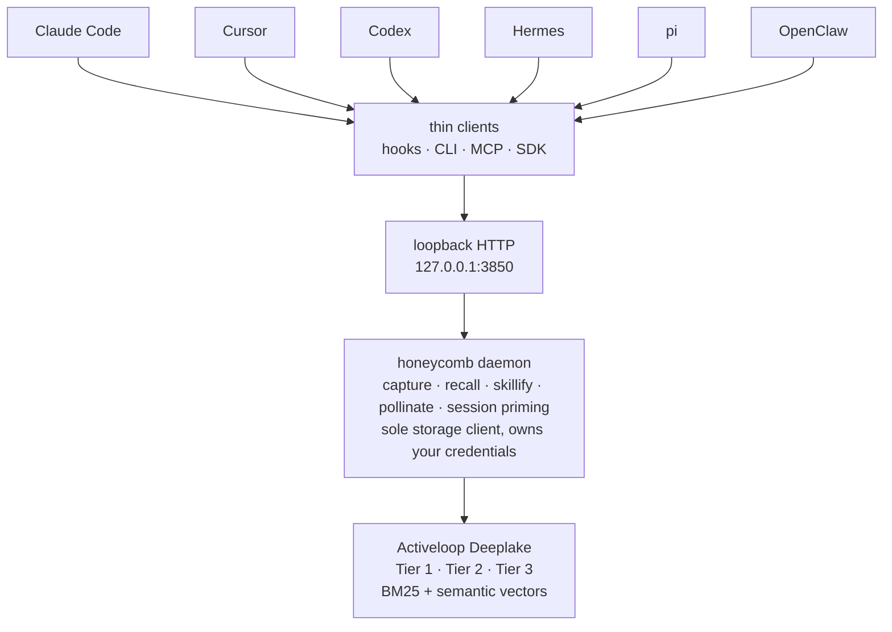

<!-- ───────────────────────────────  HERO  ─────────────────────────────── -->

<p align="center">
  <picture>
    <source media="(prefers-color-scheme: dark)" srcset="assets/brand/honeycomb-wordmark-on-dark.svg">
    
  </picture>
</p>

<h1 align="center">Honeycomb</h1>

<p align="center">
  <strong>Shared, persistent memory for your AI coding agents.</strong><br>
  What one harness learns, every other one recalls, across sessions, tools, devices, and teammates.
</p>

<p align="center">
  <a href="https://www.npmjs.com/package/@legioncodeinc/honeycomb"></a>
  
  
</p>

<p align="center">
  <a href="https://linktr.ee/marioaldayuz"></a>
  <a href="https://www.legioncodeinc.com"></a>
  <a href="https://deeplake.ai"></a>
</p>

<p align="center">
  <a href="https://github.com/legioncodeinc/honeycomb"></a>
  <a href="https://discord.gg/GX95YTQypQ"></a>
</p>

<!-- ──────────────────────────────  PARTNERS  ────────────────────────────── -->

<p align="center">
  <a href="https://github.com/legioncodeinc">
    <picture>
      <source media="(prefers-color-scheme: dark)" srcset="assets/brand/legion-logo-dark.svg">
      
    </picture>
  </a>
  &nbsp;&nbsp;&nbsp;&nbsp;&nbsp;&nbsp;
  <a href="https://github.com/activeloopai">
    <picture>
      <source media="(prefers-color-scheme: dark)" srcset="assets/brand/activeloop-full-mark-logo-on-dark.svg">
      
    </picture>
  </a>
</p>

<p align="center"><em>A <a href="https://github.com/legioncodeinc">Legion Code Inc.</a> × <a href="https://github.com/activeloopai">Activeloop</a> collaboration.</em></p>


AI coding agents forget. They forget across sessions, and they forget across tools. A decision you reached in Claude Code at midnight is invisible to Cursor the next morning. **Honeycomb fixes that.** A local daemon captures what happens on every turn, distills it, and serves it back to any harness that asks. Learn something once; recall it everywhere, on any machine, in any tool, for anyone on your team.

It answers the questions you keep paying for twice: *What did we decide about this? Why is it built this way? What fixed it the last time it broke? Who on the team already solved this?*


> **New here?** One command and you're on a dashboard. [Jump to Install](#-install-one-command). · **Want the docs?** Everything lives at **[theapiary.sh](https://theapiary.sh)**.


<table>
<tr>
<td width="50%" valign="top">

#### 🛹 For AI Augmented Devs
Stop re-explaining your project to a fresh agent every morning. Honeycomb remembers your decisions, your conventions, and the fixes that worked, then primes your next session with them automatically. One install command, a friendly dashboard, no SQL, no config gauntlet.

</td>
<td width="50%" valign="top">

#### 🏢 For Enterprise Teams
One shared brain across every developer, device, and coding tool. A skill discovered by one engineer propagates to the whole team on their next session. Tenancy is enforced at the storage layer; credentials live behind a single loopback boundary; everything is versioned and auditable.

</td>
</tr>
</table>


## ✨ What makes Honeycomb different

A vector database can store text and hand it back by similarity. Honeycomb does that, and then keeps going. On top of [Activeloop Deeplake](https://deeplake.ai), **[Legion Code](https://github.com/legioncodeinc)** builds the memory system that turns raw recall into a brain your agents actually trust.


- **🧠 Three-tier memory.** Every memory exists at three resolutions at once (one-line **key** → **summary** → full **raw** session). Agents skim the keys, then zoom into detail only when they need it. *(Legion Code)*
- **🎯 Session priming.** At session start a tiny, bounded index (~300-800 tokens) of your most relevant keys is pushed once; the agent pulls deeper on demand. No per-turn injection, no "lost in the middle." *(Legion Code)*
- **🍯 Skillify & propagation.** The daemon mines reusable skills out of real sessions, gates them for quality, and auto-pulls the team's latest skills into every agent at session start. Author a skill once; everyone gets it. *(Legion Code)*
- **🌼 The pollinating loop.** A periodic maintenance pass reasons over accumulated memory and the entity graph to merge duplicates, prune junk, and supersede stale facts, so memory gets *sharper* over time, not noisier. *(Legion Code)*
- **🕸️ Knowledge graph.** An entity-centric, versioned, provenance-tracked index over your memories. Newer facts supersede stale ones; every claim traces back to the session that produced it. *(Legion Code)*
- **🔀 Hybrid recall.** Lexical (BM25) and semantic (768-dim vectors) search fused by Reciprocal Rank Fusion, with a measured **recall@5 ≈ 0.72-0.78**. *(built on Deeplake)*
- **🗺️ Codebase graph.** A multi-language AST graph (TypeScript, JS, Python, Go, Rust, Java, Ruby, C/C++) of files, functions, and their call/import/extends edges, queryable for impact and neighborhood. *(Legion Code)*


## 🚀 Install (one command)

No Node? No npm? No problem. The installer detects and sets up everything, then **opens a dashboard in your browser**. The terminal is just a progress log; the product is the first thing you touch.

```bash
# macOS / Linux
curl -fsSL https://get.theapiary.sh | sh
```

```powershell
# Windows (PowerShell)
irm https://get.theapiary.sh/install.ps1 | iex
```

That single line installs a current Node/npm if missing, installs **`@legioncodeinc/honeycomb`** globally, brings up the daemon on `127.0.0.1:3850`, opens the dashboard (Hive portal at `127.0.0.1:3853`), and sets up **[Doctor](https://github.com/legioncodeinc/doctor#readme)**, a tiny watchdog that keeps it all healthy (opt out with `--no-doctor`). Then:

1. The dashboard loads in a **pre-auth setup state**. No token ever touches your shell.
2. Click **"First time setup."** Honeycomb runs the Deeplake device-flow login *for* you, shows the code right on the page, and opens the verification tab.
3. Done. The same running daemon lights up its Deeplake-backed surfaces, and capture and recall go live.

> Already running **Hivemind**? The dashboard detects it, explains that running both is unsupported, and **"Proceed with Honeycomb"** migrates you cleanly. Prefer to inspect before you pipe? The script and a published `SHA256SUMS` are served from [get.theapiary.sh](https://get.theapiary.sh).

<details>
<summary><strong>Prefer to build from source?</strong></summary>

```bash
git clone https://github.com/legioncodeinc/honeycomb.git
cd honeycomb
npm install
npm run build          # tsc + esbuild → bundle/cli.js, daemon, harness, MCP, embed bundles

node bundle/cli.js setup     # detect your assistants, wire hooks, start the daemon
node bundle/cli.js status    # check the daemon and your environment
```

`setup` wires every coding assistant it detects and starts the loopback daemon; any storage command auto-starts the daemon if it is down. You'll need Activeloop Deeplake credentials; the device flow above writes them to the shared `~/.deeplake/credentials.json`.

> **Self-hosting the storage backend?** You can run Honeycomb against Activeloop's open-source [`pg_deeplake`](https://quay.io/activeloopai/pg-deeplake) Postgres extension instead of hosted Deeplake, and point Honeycomb at it with `honeycomb login --endpoint postgres://...` (direct) or `--endpoint https://...` (HTTP gateway), no Activeloop account required. See the [self-hosting guide](library/knowledge/public/guides/self-hosting.md) for the setup and the backend contract.

</details>


## 🖥️ Using the dashboard

The dashboard is **Hive portal at `http://127.0.0.1:3853`**, the one UI for the whole Apiary stack and the first thing the installer opens. Honeycomb's old in-daemon dashboard is retired; the daemon on `:3850` serves data, the portal serves the picture. Everything Honeycomb knows shows up there: KPIs up top (memories, turns, estimated savings, team skills), memory recall you can query by hand, the codebase graph, every captured turn, skill-sync status, and settings, hydrated server-side from the daemon's API. It doubles as the guided-setup surface for first-time login.

<!-- screenshot pending: drop honeycomb dashboard capture into assets/screenshots/dashboard.png -->


## ⌨️ Using the CLI

One unified `honeycomb` binary drives everything. Run `honeycomb --help` for the full list; these are the core verbs:

```bash
honeycomb install                    # one-shot install on a fresh machine
honeycomb setup                      # detect your coding assistants and wire hooks
honeycomb status                     # daemon + environment health at a glance
honeycomb login                      # sign in via the Deeplake device flow, any time
honeycomb start                      # start the installed OS service and verify health
honeycomb stop                       # stop the installed OS service
honeycomb restart                   # restart through the OS service and verify health
honeycomb service-install           # install/reconcile only the OS service
honeycomb service-uninstall         # remove only the OS service; preserve state/registration
honeycomb register                  # idempotently upsert Honeycomb in Doctor's registry
honeycomb logs                      # last 100 service-log lines, then follow
honeycomb telemetry                 # read-only telemetry state and delivery summary
honeycomb update --check            # compare installed and approved release versions
honeycomb daemon start|stop|status   # legacy process-level compatibility commands
honeycomb uninstall --yes            # confirmed full removal of Honeycomb-owned state
honeycomb remember "<fact>"          # write a memory from anywhere
honeycomb recall "<query>"           # search the shared memory
honeycomb sessions                   # browse captured sessions
honeycomb skill                      # list, inspect, and sync mined skills
honeycomb goal                       # track goals across sessions
honeycomb sources                    # manage capture sources
honeycomb graph                      # query the codebase and knowledge graphs
honeycomb dashboard                  # open the dashboard (Hive portal, :3853)
```

A few lifecycle notes:

- **The suite-wide command contract is shared.** The normative matrix and semantics live in [`@legioncodeinc/cli-kit`](https://github.com/legioncodeinc/cli-kit/blob/main/library/notes/prd-003-command-matrix.md); this section documents Honeycomb-specific behavior and compatibility commands only.
- **Automation is structured.** Every baseline operational verb accepts `--json`; malformed usage exits `2`, runtime failures exit `1`, and successful/idempotent requests exit `0`. Use `--no-color` or `NO_COLOR=1` for plain human output.
- **Logs are isolated.** `honeycomb logs` can read only Honeycomb's configured service log. It supports `--lines <n>`, `--no-follow`, and `--since <duration-or-timestamp>` and redacts recognized credentials on output.

- **Sign-in knows who owns it.** When [Hive](https://github.com/legioncodeinc/hive#readme) is installed alongside, `honeycomb install` never opens its own sign-in; Hive's onboarding is the one login surface, and the daemon sits degraded on `/health` until that login writes the shared `~/.deeplake/credentials.json`, then recovers on its own, no restart needed. Solo (no Hive), a fresh install with no credentials opens the device-flow sign-in automatically, and headless sessions get the URL and code printed instead of a browser. `honeycomb login` works the same way in both modes whenever you want it.
- **`uninstall` is surgical.** It removes only Honeycomb's things: assistant hooks, the OS service unit (current and legacy labels), Honeycomb's entry in Doctor's registry, and `~/.apiary/honeycomb`. Shared credentials and every other product survive. Running it when nothing is installed is a friendly no-op. For a full-machine wipe, use `doctor purge` or the one-command uninstall at [get.theapiary.sh](https://get.theapiary.sh).


## 🐝 First memory, shared across tools

```bash
# Capture a decision once…
honeycomb remember "we deploy from the prd-022 branch, never from main"

# …recall it anywhere: same daemon, same Deeplake, any harness
honeycomb recall "how do we deploy"
```

Write it from Claude Code; recall it from Cursor tomorrow on a different laptop. That's the whole point.


## 🏗️ How it works

Honeycomb is a long-lived local **daemon** plus thin clients. The daemon is the *only* process that talks to storage. Every harness, the CLI, the MCP server, and the SDK reach it over loopback HTTP. One shared memory behind one boundary; your Deeplake credentials in exactly one place.



- **Capture on every turn.** Per-harness hooks stream each turn to the daemon, which distills and persists it: always-on, cheap, and soft-failing so a capture error never breaks your agent's turn.
- **Recall through the daemon.** Any harness asks for relevant memories; the daemon runs the query and returns results already scoped to your org and workspace. The client never sees a storage handle or a line of SQL.
- **Shared by construction.** Every client reaches the same daemon and the same dataset, so a memory written from one harness is recallable from all of them.


## 🧠 The three-tier memory system

This is the heart of what **Legion Code** adds on top of Deeplake. The same memory lives at three levels of detail at once, and the agent chooses how far to zoom:

| Tier | What it is | When it's used |
|---|---|---|
| **Tier 1 · Key** | One keyword-dense sentence per session or fact. The index. | Skimmed at session start during priming. |
| **Tier 2 · Summary** | A distilled recap: goals, decisions, blockers, outcomes. Carries the semantic embedding. | Pulled when a key looks relevant. |
| **Tier 3 · Raw** | The full session dialogue: exact turns and tool calls, never rewritten. | Resolved when the agent needs ground truth. |

Resolution is a **deterministic SQL join, not a fuzzy search**. `key → summary → raw` is a pointer walk down three Deeplake tables. Mining ("find the thing I didn't know to name") is where the hybrid vector + lexical search kicks in. Cheap when you're skimming, precise when you're zooming.


## 💎 Why Deeplake makes the difference

Most agent-memory tools bolt onto a vector-only store, which forces *every* access pattern through a similarity engine. Honeycomb's zoom model needs both exact joins **and** semantic search, and [**Deeplake**](https://deeplake.ai), the database for AI, gives it both natively:

- **SQL + vector in one engine.** The cheap skim and the deterministic zoom run as SQL; semantic mining runs as vector search; a single store serves both. No second database, no sync problem.
- **Versioned & append-only.** Writes bump a version instead of mutating in place, so memory's full history stays on disk. Supersession marks old facts stale without losing them, which is what makes the pollinating loop safe and auditable.
- **Hybrid lexical + semantic search.** BM25 and 768-dim `nomic-embed-text-v1.5` cosine arms, fused by Reciprocal Rank Fusion. Turn embeddings off and recall silently falls back to lexical, never an error, no quality cliff.
- **Built to scale & BYOC.** The same substrate that serves one developer's laptop serves an organization's entire history, in your own cloud bucket if you want it.

> Honeycomb stands on two shoulders: **[Deeplake](https://deeplake.ai)** gives the memories somewhere durable and queryable to live, and **[Hivemind](https://github.com/activeloopai/hivemind)**, Activeloop's open-source agent-memory project, is the foundation Legion Code extended into Honeycomb's multi-tier system.


## 🔌 Supported harnesses

Honeycomb supports 3 harnesses in production (Claude Code, Codex, Cursor). Hermes, pi, and OpenClaw are in progress.

| Supported today | In progress |
|---|---|
| **Claude Code**, **Cursor**, **Codex** | **Hermes**, **pi**, **OpenClaw** |

`honeycomb setup` detects the ones you have installed and wires each idempotently; `honeycomb uninstall` reverses only Honeycomb's changes. A skill mined while you were in Cursor is auto-pulled and ready in Claude Code on your next session.


## 🎛️ Other interfaces

Beyond the CLI, three more ways to reach the same daemon and the same shared memory:

- **Dashboard.** Hive portal at `http://127.0.0.1:3853`, covered [above](#%EF%B8%8F-using-the-dashboard). One front door for the whole stack; Honeycomb's data hydrates through it.
- **MCP server.** A [Model Context Protocol](https://modelcontextprotocol.io) server (bundled to `mcp/bundle`) exposing Honeycomb's read/resolve and search/mine tools to any MCP-capable host.
- **TypeScript SDK.** The `@legioncodeinc/honeycomb` client with framework subpath entries (`/react`, `/vercel`, `/openai`). The core entry is fetch-only and browser-safe; `react` and `ai` are optional peers.


<h2 align="center"><a href="https://ideas.theapiary.sh">📍 Status & Roadmap</a></h2>

Honeycomb is **production ready (v0.4.x)** and fully tested in live scenarios. We document what's real and flag what's opt-in.

**Production today**
- Capture-to-recall, proven end-to-end and live-tested against Deeplake (`npm run smoke:golden-path` with credentials).
- One-command install → guided dashboard setup, the loopback daemon, the unified CLI, per-harness hooks, the MCP server, and the SDK.
- Three-tier memory, session priming, skillify + propagation, the pollinating loop, the knowledge graph, and the codebase graph.
- Self-hosted backends: point the CLI at your own Postgres-backed Deeplake endpoint with `honeycomb login --endpoint`, with idle connection hibernation for scale-to-zero.

**Opt-in / by design**
- **Embeddings are opt-in.** Recall runs the lexical BM25 path by default; turning on the local embedding runtime (≈600 MB, model fetched on first warmup) adds 768-dim semantic recall. The fallback is silent and intentional; recall never errors when embeddings are unavailable.
- **The distillation pipeline is off by default** to avoid surprise model spend; enable it when you want background summarization and graph extraction.
- The daemon binds **loopback only** (single machine). Cross-device and cross-user sharing happen through Deeplake's org/workspace scope, not a remote daemon bind.

Full documentation and guides live at **[theapiary.sh](https://theapiary.sh)**; vote on what ships next at **[ideas.theapiary.sh](https://ideas.theapiary.sh)**.


## 🛠️ Development

```bash
npm install          # dependencies
npm run build        # tsc + esbuild → bundle/cli.js, the daemon, harness, MCP, and embed bundles
npm run ci           # the gate: typecheck + duplication (jscpd) + tests (vitest) + SQL-safety audit
```

`npm run ci` is the quality gate every change must pass.


## 🙏 Credits

Honeycomb exists because two halves fit together:

- **[Activeloop](https://activeloop.ai/)** brings **[Deeplake](https://deeplake.ai/)** (the versioned, multi-modal database for AI with native vector + columnar indexing and hybrid search) and **[Hivemind](https://github.com/activeloopai/hivemind)**, the open-source agent-memory project Honeycomb is built upon.
- **[Legion Code Inc](https://github.com/legioncodeinc)** brings the multi-tier memory system (Tier 1 / 2 / 3 keys, summaries, raw), code base atlas memory architecture, auto healing service, session priming, automatic skill development & propagation, the pollinating loop, the knowledge graph, cross device cross repository cross team skill sharing, and the daemon architecture that turns Deeplake into a shared brain your coding agents read and write on every turn.


## License

Honeycomb is licensed under the **GNU Affero General Public License v3.0 or later** ([AGPL-3.0-or-later](LICENSE)).

Use it commercially or privately, free of charge. In return: keep the copyright and license notices intact, and if you modify it, your changes ship under the same AGPL license with source available. The "Affero" part is the point: run a modified version as a network service and you owe its source to the users who interact with it. No locking a fork behind a SaaS wall.

© 2026 Legion Code Inc.


<p align="center">
  <sub><strong>Built by <a href="https://github.com/legioncodeinc">Legion Code Inc</a></strong> · <strong>Powered by <a href="https://deeplake.ai/">Activeloop Deeplake</a></strong> · <a href="https://theapiary.sh/">theapiary.sh</a></sub>
</p>

<p align="center"><strong>I am Legion. We are Legion.</strong></p>

<p align="center">#vibewithlegion</p>
