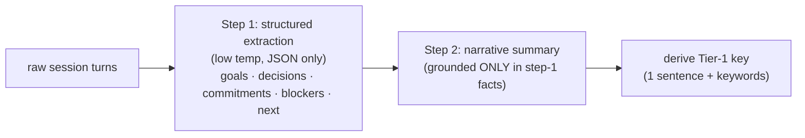

# Distillation and the Tier-1 Key (the make-or-break)

> Category: Ai | Version: 1.1 | Date: June 2026 | Status: Strategy — CORE BUILT (PRD-046, merged #77); extensions proposed

The quality of the 3-tier zoom memory is gated almost entirely by one thing: how good the distilled
keys and summaries are. This doc defines the Tier-1 *key* (the new artifact), the grounded
distillation discipline that keeps it honest, what a good vs bad key looks like, and the real status
of PRD-017 (built + shipped, pending live wiring) that the strategy depends on. **Proposed design.**

**Related:**
- [`three-tier-memory-strategy.md`](three-tier-memory-strategy.md) — where the key sits in the hierarchy
- [`session-priming-architecture.md`](session-priming-architecture.md) — how keys get pushed
- [`wiki-summary-workers.md`](wiki-summary-workers.md) — the summary worker that produces Tier-2
- [`skillify-pipeline.md`](skillify-pipeline.md) — the existing gate/distillation precedent
- [`prior-art-owls-roost-crosswalk.md`](prior-art-owls-roost-crosswalk.md) — the two-step grounded summary this borrows
- [`../../../requirements/completed/prd-017-wiki-summaries/prd-017-wiki-summaries-index.md`](../../../requirements/completed/prd-017-wiki-summaries/prd-017-wiki-summaries-index.md) — PRD-017 (Completed; the Tier-2 substrate)

---

## 1. Why this exists (the single biggest risk)

Everything else in this strategy is plumbing that mostly already exists. The one thing that decides
whether the system is *valuable* or *ignored* is the quality of the distilled text the agent sees at
session start. A sharp key earns a pull; a bland key wastes the prime and trains the agent to ignore
Honeycomb entirely — which is worse than no prime, because it costs tokens for nothing.

So this is the make-or-break, and it deserves the most design attention. The plumbing is safe; the
distillation is the bet.

---

## 2. The Tier-1 key: definition

A **key** is a ≤1-sentence, keyword-dense headline that lets the agent decide whether to zoom in. It
is the new artifact this strategy adds (Tiers 2 and 3 already exist as the `memory` and `sessions`
tables). Properties:

- **One sentence, keyword-forward.** It is an index entry, not a summary. It should front-load the
  searchable nouns (subsystem, error, decision) so the agent — and a lexical SQL filter — can match it.
- **Self-contained.** It must make sense cold, months later, with no surrounding context (the same
  "no implied context" rule good runbooks follow).
- **Carries an id.** The key resolves to its Tier-2 summary and Tier-3 raw turns by `id`/`path`.
- **Outcome-bearing where possible.** "X broke and we fixed it with Y" beats "discussed X."

It is generated by a *lightweight distillation pass* — conceptually the same machinery as the summary
worker or the skillify gate, with a different prompt ("emit one keyworded sentence + the id"). It can
be stored as a column on `memory` / `memories` so the prime query is a pure SQL skim with no
generation at read time.

---

## 3. Good keys vs bad keys (the bar, with real examples)

The examples below are drawn from facts actually established in this project, so the contrast is
concrete rather than abstract.

| Bad key (ignored) | Good key (earns a pull) |
|---|---|
| "Worked on the build" | "CI pack-step timeout — fixed via a retry-on-429 wrapper" |
| "Looked at recall" | "Switched recall fusion to RRF; native `deeplake_hybrid_record` returns all-zero scores" |
| "DeepLake stuff" | "DeepLake reads are eventually consistent — always poll to convergence, never a single read" |
| "Did some SQL work" | "All SQL values must route through `sqlStr`/`sqlLike`/`sqlIdent`; raw interpolation fails `audit:sql`" |
| "Dashboard changes" | "Dashboard nav-shell shipped: left nav + hash router + route registry" |

The pattern in the good column: **subsystem + what happened + the operative detail/outcome**, in one
line, keyword-dense. A future agent skimming ten of those knows instantly which one to expand.

---

## 4. Grounded distillation: don't let the key lie

A distilled memory that *invents* a fact poisons every future session that reads it — false history
compounds. The prior-art system solved this with a **two-step grounded summary**, and this strategy
should port that discipline to both the Tier-2 summary and the Tier-1 key:

- **Step 1 — structured extraction at low temperature.** Pull the facts (decisions, fixes, blockers,
  outcomes) into a strict JSON shape *before* writing any prose. Facts first prevents the narrative
  step from confabulating.
- **Step 2 — narrative grounded in step 1.** The summary may only use what step 1 extracted. This is
  the Tier-2 `memory.summary`.
- **Derive the key from the grounded summary**, never from the raw turns directly — so the key
  inherits the grounding.

Honeycomb's current summary worker (PRD-017) shells out to the *host agent's CLI* with a gate prompt
(no API key of its own; secrets scrubbed first). That is a fine execution model; the change this
strategy asks for is the *prompt discipline* (structured-extraction-first) layered on top, plus the
extra key-derivation step.

---

## 5. The real dependency: PRD-017 is BUILT, but not yet wired live

This is the most important grounding fact for a future agent, and an earlier draft of these docs got
it wrong — so it is stated precisely, verified against the QA report + the source on 2026-06:

> **Tier-2 distillation is fully implemented and shipped — PRD-017 is `Completed`.** Both the
> per-session summary worker (017a) and the `/MEMORY.md` synthesis (017b) are full, QA-passed
> implementations (15/15 ACs; unit + live itests; all CI gates green; security passed first). 017a
> generates a per-session summary via the host-CLI gate and writes a `memory` row at
> `/summaries/<userName>/<sessionId>.md` with `summary` + a short `description` + a (non-fatal)
> embedding; 017b synthesizes a top-level `/MEMORY.md` linking those summaries. It is **not a stub** —
> the `notImplemented` reference lingering in `summaries/index.ts`'s *header comment* is stale; the
> file body exports the real `synthesizeMemoryIndex` / `synthesizeThreadHeads`.

The genuine gaps are smaller and different from "not built":

- **Not wired into the live daemon (deferred assembly).** `runSummaryWorker` / `synthesizeMemoryIndex`
  are invoked *nowhere* in `src` outside their own module; `server.ts` / `assemble.ts` mount no summary
  job. So although the code is complete and tested, **no running daemon triggers it yet** — summaries
  are not actually produced until the assembly step mounts the `memory_jobs` job + the final/periodic
  hook trigger. This is the same honest "deferred assembly" posture as PRD-008–016, not a missing
  feature.
- **`/MEMORY.md` write-once refresh limitation (017b).** Re-synthesis after new summaries land is a
  no-op (SELECT-before-INSERT, no version-bump refresh), so the index does not auto-refresh.
  Documented product follow-up, not blocking.

Consequences for sequencing — *better* than the earlier draft implied:

- Tier-2 quality is **not** gated on building summaries; it is gated on **wiring the worker into the
  live daemon** (mount + trigger) plus the refresh follow-up. That is an assembly task, not a
  from-scratch build.
- **017b's `/MEMORY.md` is itself strong prior art for the prime.** It is already "a top-level index
  that links per-session summaries with short `description`s" — most of what the Tier-1 key index
  needs. The prime may be able to *reuse* synthesis output (the `description` field is close to a
  Tier-1 key) rather than generate keys from scratch.
- A reasonable build order: (a) wire/trigger the summary worker so `memory` summaries actually land
  live, (b) reuse/extend 017b synthesis (or its `description`) as the Tier-1 key index + add refresh,
  (c) the prime hook + resolve-depth on the existing read tools.

---

## 6. Reuse, don't reinvent, the distillation machinery

Honeycomb already runs two distillation loops that the key generator should mirror rather than
duplicate:

- **The summary worker** (`memory` summaries, PRD-017, built + `Completed`) — the natural home for
  Tier-2 + key derivation once the worker is wired live. See [`wiki-summary-workers.md`](wiki-summary-workers.md).
- **The skillify gate** (sessions → `SKILL.md`, a Haiku KEEP/MERGE/SKIP verdict) — proof that
  Honeycomb already distills sessions into compact, judged artifacts with provenance. The Tier-1 key
  is a lighter sibling of a skill: "one sentence that indexes a memory" vs "a reusable lesson." See
  [`skillify-pipeline.md`](skillify-pipeline.md).

The point: a keyworded one-liner generator is a *small new prompt on an existing loop*, not a new
subsystem.

---

## 7. Measuring distillation quality

Because this is the make-or-break, it needs a measurable bar, not taste:

- **Pull-through rate:** of the keys shown in a prime, how often does the agent resolve one? A key
  nobody expands is a bad key.
- **Groundedness:** spot-check that step-2 summaries contain no fact absent from step-1 extraction
  (the anti-hallucination guarantee).
- **Self-containment:** can the key be understood with zero surrounding context months later?

These tie into the PRD-047f eval discipline — prove the keys earn their place rather than assuming it.

---

## Changelog

| Date | Version | Change |
|------|---------|--------|
| 2026-06 | 1.1 | **Correction:** PRD-017 is `Completed` (017a worker + 017b synthesis fully built, QA-passed), NOT a stub. The real gap is deferred live wiring + the MEMORY.md refresh follow-up. Earlier draft was wrong. |
| 2026-06 | 1.0 | Initial capture of the Tier-1 key definition, grounded-distillation discipline, and the PRD-017 dependency. |
