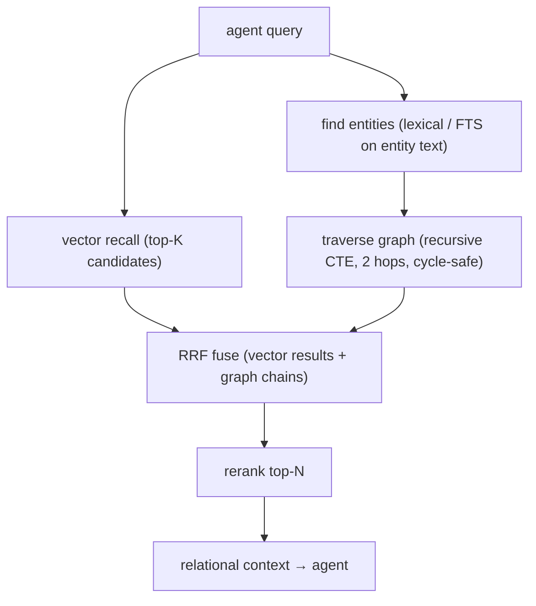

# GraphRAG — Approved Follow-On

> Category: Ai | Version: 1.0 | Date: June 2026 | Status: Strategy — APPROVED follow-on (later PRD)

Relational, multi-hop memory (GraphRAG) as a *follow-on* to the 3-tier zoom memory. The project owner
has explicitly approved building this as a later PRD ("given we are utilizing AI to build this it's
fine to include GraphRAG as a follow-on PRD later, then we will just build it"). This doc records the
design intent, the Honeycomb substrate it would reuse, and the one sequencing condition — so when the
PRD is written, the reasoning is already captured. **Approved but not yet specced or built.**

**Related:**
- [`three-tier-memory-strategy.md`](three-tier-memory-strategy.md) — the base the graph augments
- [`prior-art-owls-roost-crosswalk.md`](prior-art-owls-roost-crosswalk.md) — the GraphRAG prior art
- [`knowledge-graph-ontology.md`](knowledge-graph-ontology.md) — Honeycomb's existing graph substrate
- [`hybrid-sql-vector-rationale.md`](hybrid-sql-vector-rationale.md) — RRF fusion, reused for graph+vector

---

## 1. Why this exists (and what GraphRAG adds over the zoom memory)

The 3-tier zoom memory answers "what do I know that's *similar* to, or *recent* about, this?" It does
not answer relational, multi-hop questions like "we hit this same class of bug before — what fixed it
last time, and did that fix hold?" Those require following a *chain of relationships across sessions*,
not similarity within one memory.

The prior-art framing (Owl's Roost) captures it well: a vector search retrieves *where a topic
appeared*; a graph retrieves *the chain* (problem → technique tried → outcome → recurrence). For a
coding agent the analogue is real — "this refactor builds on that decision which contradicted an
earlier convention" is a relationship chain, not a cosine neighbor.

GraphRAG is the mechanism for that minority of queries. It is a *follow-on*, not a tier-0 need.

---

## 2. The design (transferable from the prior art)

Owl's Roost's GraphRAG is a clean, Postgres-native template that maps directly onto Honeycomb's
SQL+vector store:

- **Entities** are typed nodes distilled from summaries (not raw turns): e.g. PROBLEM, TECHNIQUE,
  DECISION, OUTCOME, GOTCHA, CONVENTION (the coding analogues of the prior art's PROBLEM / TECHNIQUE /
  INSIGHT / OUTCOME / GOAL).
- **Relationships** are typed, weighted edges: RESOLVES, LEADS_TO, BUILDS_ON, CONTRADICTS,
  SIMILAR_TO, TRIGGERED_BY (again, the prior art's set, fit to code work).
- **Traversal** is a recursive CTE (2–3 hops) with cycle detection — Postgres handles a sparse graph
  (hundreds of nodes per repo) without a dedicated graph DB.
- **Fusion** reuses the *same RRF* the recall engine already uses (vector list + graph-chain list,
  `k = 60`), so graph results compose with the existing retrieval rather than replacing it.

This is deliberately the prior art's architecture — it is proven and it fits.

---

## 3. The Honeycomb substrate it reuses (already partly there)

Honeycomb does not start from zero on graph, which is a large part of why the follow-on is reasonable:

- **A knowledge-graph table substrate already exists.** Honeycomb has graph entity/relationship
  tables (`USING deeplake`) with typed nodes, weighted edges, and even `content_embedding` columns —
  see [`knowledge-graph-ontology.md`](knowledge-graph-ontology.md). GraphRAG would *populate and
  traverse* this, not invent it.
- **A codebase graph already exists.** The tree-sitter codebase extractor builds a file/symbol/import
  graph into a `codebase` table (content-addressed cache). That is a second, code-structural graph the
  relational memory can lean on (e.g. "this decision touched these symbols").
- **RRF fusion already exists** in `recall.ts` — graph + vector fusion is the same mechanism, not new.

So the follow-on PRD is largely: an entity/relationship *extraction* pass over distilled summaries
(reuse the distillation loop), a traversal query, and wiring graph chains into the recall fusion.

---

## 4. The one sequencing condition (not a blocker — a trigger)

Approved does not mean first. The prior art's hard-won rule applies: **build it when a measured
relational gap exists, not because it is interesting.** The honest trigger conditions, ported from the
prior art and fit to Honeycomb:

- The 3-tier zoom memory + RRF recall is shipped and *measured*, and evaluation shows the remaining
  misses are *relational* (the right memory exists but is only reachable by following a chain, not by
  similarity or recency).
- Or: the agent repeatedly re-solves a problem it already solved in a *different* session because the
  link between "this bug" and "that fix" is not similarity-visible.

The prior art's data point is worth keeping: in their domain, vector recall alone handled ~80–90% of
needs, and GraphRAG earned its latency only for long-horizon relational reasoning. Honeycomb should
expect a similar split — which is exactly why this is a *follow-on*, sequenced after the zoom memory
proves itself, and built behind the same eval discipline that governs everything else here.

---

## 5. Author's note (no strong disagreement)

For the record, the design discussion did not surface a strong objection to building GraphRAG as a
follow-on — the substrate exists, the architecture is proven, and AI-assisted build cost is low. The
only caution carried forward is the sequencing-and-measurement one above: ship and measure the 3-tier
prime first, then build the graph against a demonstrated relational gap. When that PRD is written,
this doc is its design brief.

---

## Changelog

| Date | Version | Change |
|------|---------|--------|
| 2026-06 | 1.0 | Initial capture of GraphRAG as an approved follow-on, with the Honeycomb substrate and sequencing trigger. |
