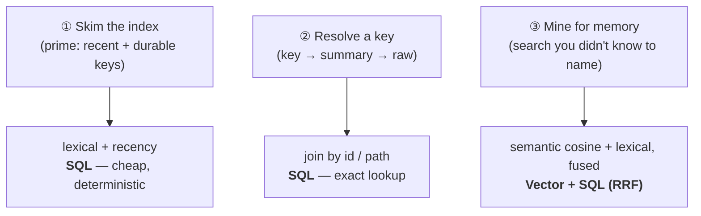

# Why Hybrid (SQL + Vector) Makes the Zoom Memory Doable

> Category: Ai | Version: 1.0 | Date: June 2026 | Status: Strategy — PROPOSED, not built

Why Honeycomb's Deep Lake substrate (SQL *and* vector in one store) is a genuinely better fit for the
3-tier zoom memory than a vector-only store — and what each half of the hybrid is responsible for.
Grounded in the recall behavior measured this cycle. **Design rationale, not a build spec.**

**Related:**
- [`three-tier-memory-strategy.md`](three-tier-memory-strategy.md) — the resolve chain this enables
- [`session-priming-architecture.md`](session-priming-architecture.md) — where the cheap prime query lives
- [`prior-art-owls-roost-crosswalk.md`](prior-art-owls-roost-crosswalk.md) — the vector-only system this contrasts with
- [`retrieval.md`](retrieval.md) — the live recall engine
- [`deeplake-hybrid-record-operator-report.md`](deeplake-hybrid-record-operator-report.md) — the native-operator finding
- [`../../../requirements/in-work/prd-045-retrieval-quality-upgrades/prd-045-retrieval-quality-upgrades-index.md`](../../../requirements/in-work/prd-045-retrieval-quality-upgrades/prd-045-retrieval-quality-upgrades-index.md)

---

## 1. Why this exists

The 3-tier zoom memory has three distinct access patterns, and they want *different* engines. The
claim of this doc — argued during the design discussion and worth recording — is that Deep Lake's
hybrid SQL+vector model serves all three cleanly, whereas a vector-only store (the shape the prior-art
Owl's Roost system used, on Qdrant) serves only one of them naturally. This is the concrete reason the
project owner's instinct — *"because this is hybrid (SQL + vector) that'd actually be more doable,
right?"* — is correct.

---

## 2. The three access patterns, and which engine each wants

1. **Skim the index (the prime).** Building the session-start digest is "give me the most recent N
   distilled headlines for this repo, plus the top M durable facts." That is an `ORDER BY` on a
   timestamp plus a keyword/lexical filter — a cheap SQL query with **no embedding cost**. You do not
   pay vector search to render a table of contents.
2. **Resolve a key (the zoom).** `key → summary → raw` is "fetch the row this id points to, then the
   `sessions` rows for that session." That is a **deterministic join by id/path**. It is the single
   most important property in this whole strategy, and it is exactly what SQL is for.
3. **Mine (the search).** When the agent looks for memory it did not see in the index, semantic
   similarity matters — this is the `<#>` cosine vector path, fused with the lexical arm via RRF. This
   is the one pattern a vector store is built for.

A vector-only store does (3) well, fakes (1) with payload filters, and does (2) badly — resolving an
exact id chain in a vector DB means storing pointers in payloads and round-tripping, instead of a
join. Honeycomb gets (1) and (2) for free from the SQL side it already has.

---

## 3. "Resolve = join" is the load-bearing property

The zoom hierarchy lives or dies on cheap, exact resolution. Consider the difference:

- **Vector-only (e.g. Qdrant):** the engine is "find points near this vector." To resolve a key into
  its summary and then its raw turns, you store relationship ids in each point's *payload* and issue
  follow-up filtered lookups. It works, but you are using a similarity engine to do a key-value join,
  and every step is a separate filtered scan.
- **Deep Lake (SQL+vector):** resolution is a `SELECT … WHERE path = '<id>'` (and the raw turns are
  `SELECT … FROM sessions WHERE path = '<session>'`). The id *is* the join key. The same store that
  holds the embeddings answers the join.

Because the tiers already live in three SQL tables (`memories`, `memory`, `sessions`) keyed by
`id`/`path`, the resolve chain is *already expressible* — it's the existing read path
(`hivemind_read`) with depth semantics. No new index, no payload-pointer scheme.

---

## 4. Division of labor (what each half owns)

| Concern | Engine | Why |
|---|---|---|
| Prime digest (Tier-1 index) | **SQL** (lexical `ILIKE` + recency `ORDER BY`) | Cheap, deterministic, no embedding cost; runs every session |
| Resolve key → summary → raw | **SQL** (join by `id`/`path`) | Exact lookup; the zoom is a pointer walk, not a search |
| Mine (agent-initiated search) | **Vector + SQL, fused (RRF)** | Semantic recall for the unnamed; lexical arm catches exact tokens |
| Scope / tenancy filter | **SQL** (org / workspace / agent) | Already enforced on every query in `recall.ts` |

The vector side is *reserved for the one job it is uniquely good at*. Everything structural — the
index, the resolution, the scoping — is SQL. That is the efficiency argument for the whole design.

---

## 5. The fusion that the mining path actually uses (and the one it doesn't)

A grounded caveat for any future agent, because it was settled with live measurement this cycle:

- **The mining path uses post-query Reciprocal-Rank Fusion (RRF), and it works.** `recall.ts` runs a
  `<#>` semantic arm and a BM25/`ILIKE` lexical arm per table and fuses their ranked lists with RRF
  (`RRF_K = 60`, arm-class weights distilled `memory` 1.0 / raw `session` 0.4). Measured live:
  recall@5 ≈ 0.72–0.78.
- **Deep Lake's *native* `deeplake_hybrid_record` operator does NOT work for us and must not be used.**
  Benchmarked live, it returns a constant `0` score for every row (degenerate ordering → near-random
  recall@5 ≈ 0.14–0.17), independent of weight or vector-literal format. PRD-045a closed with "keep
  RRF." Full report: [`deeplake-hybrid-record-operator-report.md`](deeplake-hybrid-record-operator-report.md).

So "hybrid" here means **SQL for structure + vector for similarity, fused in our own RRF** — *not* the
DB's native hybrid operator. A future agent that reads "hybrid" must not reach for
`deeplake_hybrid_record`; it is filed as a vendor bug, not a tool.

---

## 6. Net rationale

The zoom memory needs three things from its store: a cheap index, an exact resolve, and a good search.
Deep Lake gives the first two from SQL essentially for free (the tables already exist and are keyed),
and the third from the vector arm via RRF (already measured working). A vector-only store would force
the structural patterns through a similarity engine. That asymmetry is why building this on Honeycomb
is *more* doable than the prior system it is modeled on — the owner's intuition is correct and grounded.

---

## Changelog

| Date | Version | Change |
|------|---------|--------|
| 2026-06 | 1.0 | Initial rationale for the SQL+vector division of labor; grounded in the PRD-045a operator finding. |
