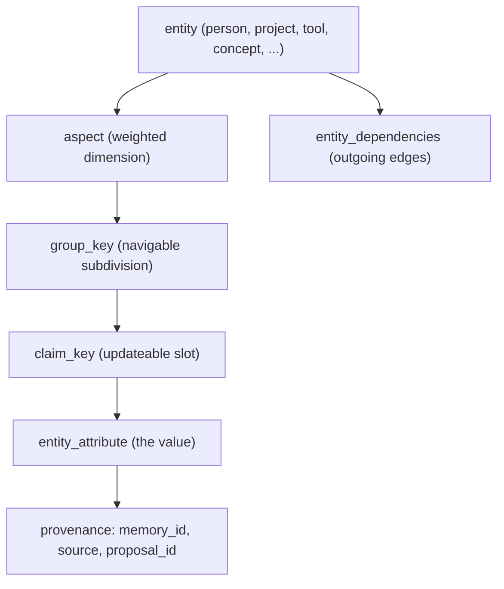

# Knowledge Graph and Ontology

> Category: Ai | Version: 1.0 | Date: June 2026 | Status: Active

The structured layer over memories: entities, aspects, claim slots, dependencies, epistemic assertions, and the control plane that governs how the graph changes.

**Related:**
- [`memory-pipeline.md`](memory-pipeline.md)
- [`retrieval.md`](retrieval.md)
- [`dreaming-loop.md`](dreaming-loop.md)
- [`../data/schema.md`](../data/schema.md)
- [`../security/scoping-and-visibility.md`](../security/scoping-and-visibility.md)

---

## Why a graph at all

Flat memories answer "what did I say about X." A graph answers "what is true about X right now, what does X depend on, and who claimed it." Honeycomb's ontology is the navigation layer that makes entity-centric recall and currentness possible. It is derived from memories and carries provenance back to them, so it is never authoritative on its own. It is a fast index over evidence, and it can be rebuilt. The whole graph lives in DeepLake tables that the daemon owns; nothing else writes to it.

## The shape

The ontology nests from entity down to a single updateable claim.



An **entity** has a canonical name and a type, and can be pinned or mounted from an external source. **Aspects** are weighted dimensions of an entity; their weight rises when retrieval keeps confirming them and decays when they go stale. Inside an aspect, a `group_key` is a navigable subdivision and a `claim_key` is the specific slot a value lives in. An **entity_attribute** is the value in that slot, with a `kind` of `attribute` or `constraint`, a `status` of `active`, `superseded`, or `deleted`, a confidence and importance, a version lineage, and provenance back to the memory and proposal that produced it.

Entity types include person, project, system, tool, concept, skill, task, source, artifact, agent, policy, action, workflow, event, object_type, interface, observation, claim_slot, claim_value, and unknown.

## Dependencies, not relations

Edges between entities live in `entity_dependencies`. Each edge has a type, a strength, a confidence, and (for loose `related_to` edges) a required reason so there is always an audit trail for soft links. Traversal only follows edges whose strength times confidence clears a threshold. The older `relations` table is legacy; new audited links use `entity_dependencies`.

## Supersession and currentness

When a new attribute lands in the same entity, aspect, group, and claim slot as an existing one, the conflicting sibling is marked superseded rather than deleted. Conflict detection uses lexical overlap plus negation and antonym signals, with an optional LLM semantic fallback. Constraints are not auto-superseded. This is what lets retrieval prefer the current value of a claim while keeping the full version history inspectable, which is the currentness shaping described in [`retrieval.md`](retrieval.md).

Supersession is also where DeepLake's storage shape matters. The query endpoint coalesces concurrent UPDATEs in a way that can drop edits, so claim attributes are never mutated in place. A supersession is an append: the new attribute is written with a fresh version, and the prior sibling's `status` and `superseded_by` are advanced through the same append-only, version-bumped path the daemon uses for every concurrent-edit table. The full history is therefore intact on disk, not reconstructed. Because the endpoint has no parameterized queries, every name, key, and content value interpolated into a statement is escaped through the `sqlStr`/`sqlLike`/`sqlIdent` helpers.

## Epistemic assertions

Some statements are not facts about the world, they are facts about who said what. The `epistemic_assertions` layer preserves attribution: a predicate (`claims`, `believes`, `observed`, `decided`, `prefers`, `denies`, `questions`), the content, the speaker, a confidence, evidence, and a status. Assertions can link to a claim attribute but stay a separate evidence and attribution layer. They do not auto-promote into ontology truth, because who believes something is different from whether it is true.

## How the graph gets written

There are three write paths into the graph, and they are deliberately different in trust.

The **inline entity linker** runs synchronously at write time. It scans new memory content for proper nouns and links to entities that already exist for the agent. It creates nothing, calls no model, and does no network I/O, so it is safe to run right after the memory commit and gives entity pages an immediate mention.

The **pipeline graph writer** runs in the background after extraction, gated by `graph.extractionWritesEnabled`. It upserts entities by canonical name and edges by triple, honoring org, workspace, and agent scope. This is the bulk path and it is non-fatal: a graph failure never reverts the facts that were already written.

The **ontology control plane** is the audited path for deliberate structural change.

## The ontology control plane

Structured changes go through `ontology_proposals`. A proposal has an operation, a status (`pending`, `applied`, `rejected`, `failed`), a `jsonb` payload, a confidence, a rationale, evidence, a risk note, and source provenance. The operation set covers entities (create, rename, merge, archive), aspects (create, rename, archive), claim values (add, set, supersede, archive, restore version), links (create, update, archive), plus `extract` and `consolidate`.

The mutation model has two modes. Clear, bounded, explicit operations apply directly and write an applied proposal row alongside the change, with the applied evidence copied onto the resulting attribute and dependency rows for lineage. Broad refactors, risky or destructive changes, and generated batches go into a pending review queue instead. Raw source artifacts and transcripts are never rewritten when graph or memory rows change.

The control plane is driven from the CLI:

```bash
honeycomb ontology pipeline explain --json
honeycomb ontology proposals --status pending --json
honeycomb ontology assertions --limit 50 --json
honeycomb ontology entity merge-plan "Target" "Source" --json
honeycomb ontology stream apply ops.jsonl --dry-run --json
```

## Traversal

Recall resolves focal entities in priority order: pinned entities, checkpoint entity IDs from session state, project-path matches, query-token matches against the entity FTS index, then a session-key fallback. From the focal set, traversal walks within a budget: a cap on aspects per entity, attributes per aspect, branching per focal entity, and total memory IDs, plus edge strength and confidence gates and a hard timeout. Active constraints surface regardless of aspect limits. The walk returns memory IDs with scores and paths, the constraints it found, an entity count, and whether it timed out. Those IDs flow into the candidate pool described in [`retrieval.md`](retrieval.md).

## Feedback and communities

Aspect weights are not static. When recall and a session keep confirming memories under an aspect, that aspect's weight goes up; aspects that go stale beyond a window decay toward a floor. Community detection clusters related entities. Both keep the graph's shape tracking how the memory is actually used rather than how it was first extracted. The heavier, model-driven reshaping of the graph happens in the [`dreaming-loop.md`](dreaming-loop.md). The tables behind all of this are documented in [`../data/schema.md`](../data/schema.md).
