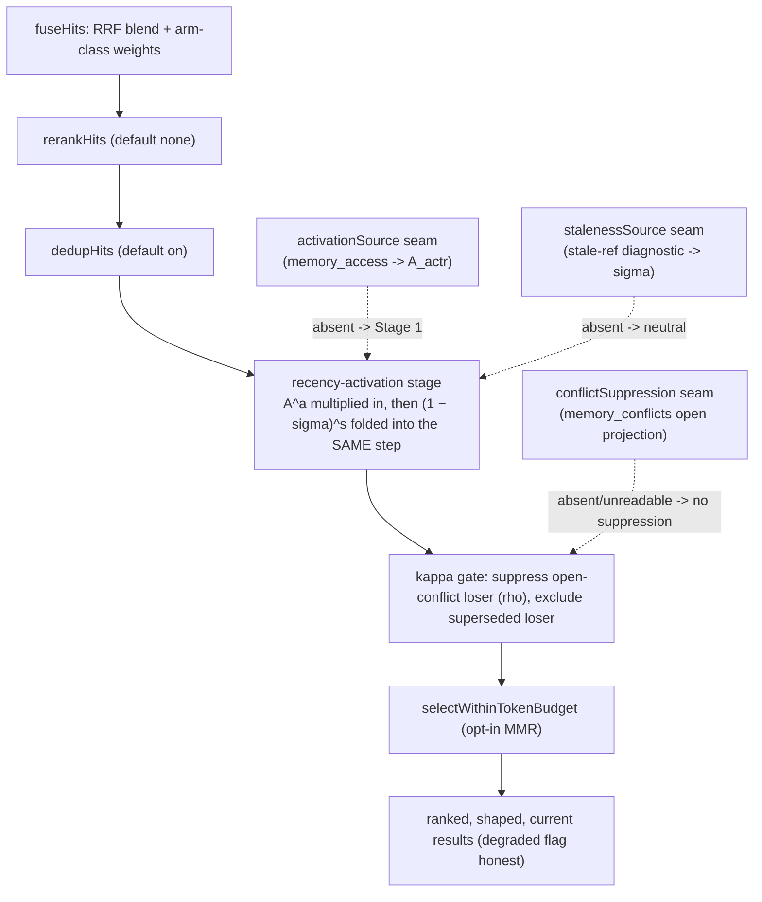

# Memory Lifecycle As-Built

> Category: Ai | Version: 1.1 | Date: June 2026 | Status: Active (merged to main 2026-06-26 via PR #125; PRD-058 stays in-work until the credential-gated live run promotes it to completed)
> **Ship state (June 2026).** PRD-058 **landed on `main` on 2026-06-26** (PR #125, feature commit `6fc192d`, now an ancestor of `main`). Every source file, Deep Lake table, column, config key, and route named in this doc exists in the shipped tree, and the live recall path is the 058 version. The final close-out (PR #133, QA report `2026-06-26-qa-report-final.md`) recorded the audit at the merged state: security CLEAN (no Critical/High), quality PASS (61/64 ACs verified, 0 real implementation gaps), and the C-1 conflict live-wiring resolved and re-verified (see "Staleness and conflict" below). The only work outstanding is three credential-gated acceptance criteria (IDX-1 numeric `eval:recall` half-life verdict, IDX-7 `useful-context@k` uplift, IDX-8 live dogfood); their code and eval slices are delivered and unit-tested, but the numeric run needs `HONEYCOMB_DEEPLAKE_TOKEN` + the embed daemon and has not yet run. That credential boundary, not any missing code, is why PRD-058 remains in `library/requirements/in-work/` rather than `completed/`.

How the running daemon implements the four lifecycle terms: where each term is computed in the live recall path, which terms ship active vs dormant and why, the Deep Lake tables and columns PRD-058 added, the reinforcement and conflict and staleness wiring, the `memory.lifecycle.*` config surface, the dashboard and CLI surfaces, and the fail-soft guarantee that keeps degraded recall answering.

**Related:**
- [`memory-lifecycle-scoring.md`](memory-lifecycle-scoring.md) - the master equation and every term's math. Read that for "what"; read this for "how it runs."
- [`retrieval.md`](retrieval.md) - the recall pipeline (`recallMemories`) these terms hook into, and the shaping-stages order.
- [`memory-pipeline.md`](memory-pipeline.md) - the decision stage, the maintenance worker, and the lazy schema-heal these reuse.
- [`../data/schema.md`](../data/schema.md) - the Deep Lake catalog the new tables and columns join.

---

## Why this doc exists

The scoring doc is a derivation: it proves that recency, reinforcement, calibration, staleness, and conflict are five terms of one retrieval-priority product, and it never once names a file. That is the right altitude for the math, and exactly the wrong altitude for an operator at 2am wondering why a memory ranked where it did, or for the next engineer asked to flip a dormant term on. This doc closes that gap. It walks the same five terms through the *shipped* code: the real module names, the real Deep Lake `ColumnDef` rows, the real config keys, and the precise seams that decide whether a term bites or sits inert.

One framing matters before anything else. PRD-058 was built to compose with the substrate that already existed, never to replace it. The append-only model, `MAX(version)`, PRD-008 supersession, the PRD-047 shaping stages (rerank, dedup, recency, MMR), and the PRD-014 codebase graph were all load-bearing before 058 and stay load-bearing after. Every lifecycle term is enrichment or demotion layered on top: it can push a memory down, gate it out, or strengthen it, but it never adds a write path that can cost the user a memory. That single rule is why almost everything below is an *injectable seam* with a fail-soft default, not a hard dependency in the hot path.

## Where the four terms live in the code

The math lives in dedicated modules; the recall engine (`src/daemon/runtime/memories/recall.ts`) consumes them through typed seams and folds them into one demotion step.

| Term | Math module(s) | Live recall integration | Ships |
|---|---|---|---|
| `A(m,t)` activation | `recall.ts` `recencyActivation` (Stage 1), `activation.ts` `actrActivation` (Stage 2) | the recency-activation stage, last among score adjustments | Stage 1 ACTIVE, Stage 2 DORMANT (seam) |
| `C(m)` calibrated confidence | `calibration.ts` (isotonic fit, ECE/Brier), `calibration-store.ts` | emitted as `calibratedConfidence`, exponent `c` | DORMANT (`c = 0`) |
| `σ(m,t)` staleness | `maintenance/stale-ref-diagnostic.ts`, `maintenance/reference-extract.ts` | folded into the recency stage as `(1 − σ)^s` | ACTIVE detection, DORMANT demotion (`observe`) |
| `κ(m,t)` conflict gate | `conflict-detect.ts`, `conflict-resolve.ts` | recall-time suppression of the open-conflict loser | ACTIVE (detect + suppress wired) |
| `H(m,t)` health scalar | `lifecycle-health.ts` `assembleHealth` | read-side projection for the dashboard/CLI | ACTIVE |

The recency-activation stage is the spine. PRD-047 shipped `applyRecencyDampening` as the last shaping stage, dormant behind a 100-year half-life. PRD-058a promoted it: the live stage now chooses a half-life by the memory's provenance class and raises the result to the activation exponent `a`. Crucially, staleness does not get its own stage. The `(1 − σ)^s` factor is multiplied *into* this same single recency-activation step, so recency and staleness compose into one demotion rather than fighting across two parallel score paths. The conflict gate `κ` runs separately as a recall-time suppression filter, because a `κ = 0` loser must be *excluded*, not merely demoted, and exclusion is a different operation from a bounded multiply.

## Active vs dormant: what actually bites on a fresh install

The install default demotes nothing. This is the deliberate "measure before it bites" posture from the scoring doc, encoded as the resolved defaults in `lifecycle-config.ts` and asserted in the config spec.

- **Activation `A^a` - LIVE but neutral-shaped.** Stage 1 recency is on with class-aware half-lives (180 / 45 / 10 days) and `a = 1.0`. It will reorder equally-relevant hits by age. It is no longer the 100-year no-op; recency genuinely bites once memories span weeks. Stage 2 (ACT-R `A_actr`) is built and unit-tested but ships behind the `activationSource` seam: when no source is injected, recall runs the byte-for-byte Stage-1 path and emits only `freshnessScore`. The reinforcement loop is present in code, dormant in the live recall deps.
- **Confidence `C^c` - DORMANT.** `c = 0` by default, so `C^c = 1`. The calibration curve fits to the identity (`C = f`) until enough resolved outcomes accumulate and ECE clears its gate. The doc's "unproven calibration never perturbs ranking" rule is enforced by this exponent, not by skipping the computation.
- **Staleness `(1 − σ)^s` - detection ACTIVE, demotion DORMANT.** The maintenance diagnostic computes `σ` and writes `ref_status` / `verified_at` / `stale_refs`, and the dashboard renders them. But the posture defaults to `observe`, which forces `s = 0`, so `(1 − σ)^0 = 1` and ranking is unchanged. Flipping the posture to `execute` is the deliberate operator action that makes staleness demote. `effectiveStalenessExponent` in `lifecycle-config.ts` is the gate: it returns `0` under `observe` and the configured `s` (defaulting to `1`) under `execute`.
- **Conflict gate `κ` - ACTIVE.** Detection is wired into the decision stage and onto the live controlled-write path via the `conflict-hook.ts` post-commit bridge (the C-1 fix, see "Staleness and conflict"); recall-time suppression of the open-conflict loser reads the now-non-empty projection. But the open verdict defaults to `review` (never `supersede`), and `conflictAutoResolve` defaults off, so a conflict is *detected and queued* for a human rather than auto-resolved. The reversible `ρ = 0` suppression of only the lower-weighted side is the safety net for the one term that can zero a memory's priority.

Why this asymmetry? `κ` is the only term that can drive priority to exactly zero, so a false positive there is total exclusion of a possibly-correct memory. Recency only reorders. So recency ships live, and conflict ships live for *detection and visibility* but human-in-the-loop for the destructive `supersede`. The dangerous capability is the one held behind an explicit flag.

## The Deep Lake schema PRD-058 added

All schema changes are additive and lazy-healed. There is no migration and no backfill: the heal pass creates a new table on first write, and a new column heals in via `ALTER TABLE ADD COLUMN` with a clean default. A pre-058 partition simply reads the new columns as their neutral default until a lifecycle action stamps them. The catalog modules are the source of truth.

**Two columns added to `memories`** (`src/daemon/storage/catalog/memories.ts`), for reinforcement and staleness:

| Column | DDL | Term | Role |
|---|---|---|---|
| `last_reinforced_at` | `TIMESTAMPTZ` (nullable) | 058a/058e | makes `t_ref = max(created_at, last_reinforced_at)` reinforcement-aware |
| `access_count` | `BIGINT DEFAULT 0` | 058e | denormalized cache of useful accesses (the compaction target) |
| `ref_status` | `TEXT` (nullable) | 058c | `fresh` / `stale` / `unknown`; NULL reads as `unknown` (neutral) |
| `verified_at` | `TIMESTAMPTZ` (nullable) | 058c | drives the verification-freshness factor `v(m,t)` and spaced re-verification |
| `stale_refs` | `TEXT` (nullable) | 058c | the specific unresolved references behind a `stale` verdict, capped with an overflow marker |

**Three new tables.** Each is an `agent`-scoped engine table: it carries `agent_id` + `visibility`, and org/workspace isolation is the storage *partition* boundary, not a column. This is the codebase's engine-table convention, and it is a real divergence from the PRD sketches (see "Where the build diverged").

- **`memory_conflicts`** (`catalog/memory-conflicts.ts`), the `κ` gate's current-state projection. One row per normalized (lexicographically sorted) memory pair, carrying `signal` (`lexical`/`embedding`/`model`), `contra_score`, `margin`, `verdict` (`supersede`/`keep-both`/`review`, default `review`), `winner_id`, `kappa_loser`, and `status` (`open`/`resolved`/`reversed`, default `open`). It is `version-bumped`: a status change appends a new version and the live row is `MAX(version)`, so a wrong resolution is reversible by another bump, never an in-place UPDATE that Deep Lake could coalesce. The append-only *event* log is the existing `memory_history` table; `memory_conflicts` is the queryable projection over it.
- **`memory_access`** (`catalog/memory-lifecycle.ts`), the append-only access-event log. One row per `create` / `recall` / `reinforce` / `downweight` event, carrying `at` (the event time `t_k`) and `usefulness` (`u_k ∈ [0,1]`, default `1.0`). This is the access series the ACT-R activation `B(m,t)` sums over. The retention worker compacts old raw events into `memories.access_count` + `last_reinforced_at` so the log does not grow without bound.
- **`memory_calibration`** (`catalog/memory-lifecycle.ts`), append-only curve snapshots. One row per isotonic refit, carrying the serialized `model_blob`, the held-out `ece` / `brier`, and `n_samples`, versioned by `fit_at`. The live curve is `ORDER BY fit_at DESC LIMIT 1`; the cold-start blob is the identity so `C = f`.

The enum-shaped columns (`signal`, `verdict`, `status`, `kind`, `ref_status`) are stored as `TEXT` and constrained in code by frozen token sets, because Deep Lake has no `ENUM` DDL. A writer stamps a member; a reader narrows against the set. Every `NOT NULL` column carries a `DEFAULT` so the heal `ALTER ADD COLUMN` backfills cleanly.

## Reinforcement: what fires it and where the access series lives

Reinforcement is the bridge from "a memory was recalled" to "a memory got harder to forget." The access series is the `memory_access` table; the math that reads it is `activation.ts`.

The wiring is deliberately off the capture hot path. `recordAccess(memoryId, usefulness, kind)` (`access-log.ts`) is a daemon-internal call with no public write endpoint, so reinforcement cannot be spoofed by a client. It is invoked from two places: the recall path logs a `recall` event when a memory is injected into context, and the session-end summary worker grades the turn's outcome and logs a `reinforce` (useful, `u ≈ 1`) or `downweight` (ignored or contradicted, `u → 0`) event. The grader (`usefulness-grader.ts`) reuses the conflict detector to spot a contradiction in the same session, so "the memory was injected and then contradicted" produces a low `u_k` that does not inflate activation.

`activation.ts` computes the base-level activation `B(m,t)` in log space (a log-sum-exp over `ln(u_k) − d·ln(age_k)`) so a long, heavily-weighted history cannot overflow, and a zero-usefulness access contributes `ln(0) = −∞`, i.e. nothing. The age term is floored at a small minimum so an access logged at the same instant as the recall never divides by zero. The result is clamped to `[A_min, 1]` so a cold memory keeps a sliver of salience and a hot one is bounded (the rich-get-richer ceiling).

This whole loop is built, unit-tested, and CI-green, but it ships **dormant in the live recall deps**: `recallMemories` runs the Stage-1 recency path until an `activationSource` is injected. The seam exists, the math exists, the table exists; the daemon does not yet inject the source into the production recall handler.

## Staleness and conflict in the maintenance and decision paths

**Staleness** runs as a maintenance-worker diagnostic (`stale-ref-diagnostic.ts`), never on a write. For each memory carrying extractable code references, `reference-extract.ts` pulls path-like tokens, `file#symbol`, qualified symbols, and flag identifiers, and the diagnostic resolves each against the latest PRD-014 codebase-graph snapshot. A reference that matches exactly resolves to `1`, a close fuzzy-rename candidate to its similarity, an indexed-but-absent token to `0`, and an out-of-graph token is excluded (it becomes `unknown`, never `stale`). The diagnostic computes `σ`, applies the verification-freshness decay `v(m,t)` off `verified_at` with a 14-day half-life, and writes `ref_status` / `verified_at` / `stale_refs`, appending the action to `memory_history`. The write behavior is identical under `observe` and `execute`; the posture governs only whether recall's `s` exponent is non-zero. Snapshot reads poll to convergence so a lagging Deep Lake segment does not wrongly flag a live symbol, and a missing graph marks nothing `stale` (everything stays `unknown`).

**Conflict** detection (`conflict-detect.ts`) runs over the decision-stage candidate set the pipeline already fetched, so it costs no extra table scan, and it runs off the write path. The layered signal is cheap-first: the lexical opposition heuristic and the claim-slot cosine `sim` run for free, and the NLI-style `P_contradiction` model verdict is invoked only for high-`sim`, lexically-inconclusive pairs and skipped entirely when the provider is `none`. A flagged pair (`Contra > θ_detect`) is projected into `memory_conflicts`. Resolution (`conflict-resolve.ts`) computes the per-outcome weighted vote, the margin, and the verdict, and a `supersede` reuses the PRD-008 append-only version bump rather than an in-place edit. Recall-time suppression reads the open-conflict projection (`buildOpenConflictProjectionSql`) and drops the `κ = ρ` loser as the last currentness filter; `κ = 0` superseded losers are already excluded upstream by `MAX(version)`.

**The C-1 live-wiring (`conflict-hook.ts`).** PRD-058b first shipped the detector (`detectAndProject`) and the recall-time κ gate (`createConflictSuppressionSource`) fully built and unit-tested, but *nothing invoked the detector on a production write*: `memory_conflicts` stayed empty, the κ gate always read empty, and two contradictory memories both surfaced. The final QA pass (PR #133) flagged this as Critical C-1 ("completed != live") and Wave 6 closed it with a dedicated bridge module, `src/daemon/runtime/memories/conflict-hook.ts`. The live chain is: the decision stage hydrates each candidate's content and forwards `{ id, content }` on the `memory_controlled_write` job (`pipeline/fan-out.ts`, excluding the just-updated row's own prior version to avoid a bogus self-conflict); the controlled-write handler lands the fact (append-only version bump) and *then* calls `runConflictHook` post-commit on both the create path (`controlled-writes.ts:503`) and the update-with-new-content path (`:610`); the hook builds the voter set from the committed memory plus the forwarded candidates, runs `detectAndProject` over them (no new scan), and projects any flagged pair into `memory_conflicts` + `memory_history`. The hook is injected at the composition root as `onConflict` (`assemble.ts:1544` builds `createControlledWriteConflictHook`, `:1551` wires it), built on the `memories` side and injected into the pipeline to avoid the `memories → pipeline` import cycle, the same inversion the `onOutcome` fan-out already uses. It is fail-soft at two layers: `detectAndProject` degrades a down embed/model to the lexical signal, and the controlled-write handler additionally guards the call so a slow or failing judge, or a missing `memory_conflicts` table, never throws into (or replays) the committed write. A live-path round-trip test (`tests/daemon/runtime/memories/conflict-live-path.spec.ts`) drives the real `applyControlledWrite` with the hook wired exactly as `assemble.ts` does and asserts that storing a contradiction projects an `open` row and that recall then returns the winner and not the loser, proving IDX-2 end to end on the wired path.

## Config: the `memory.lifecycle.*` surface

Every lifecycle knob lives in one typed module, `lifecycle-config.ts`, mirroring the `memory.pipelineV2` / `HONEYCOMB_PIPELINE_*` precedent exactly: a provider seam yields a raw record, one zod `safeParse` is the boundary, every knob is coerce-and-clamp (a fat-fingered env value falls back to its default or clamps to a floor, never a daemon crash), and precedence is `HONEYCOMB_LIFECYCLE_*` env over `agent.yaml` `memory.lifecycle.*` over the documented default. The flag reference itself is single-sourced in `src/shared/lifecycle-flags.ts` (browser-safe, no daemon import) so the dashboard settings page and the daemon read the same table and cannot drift.

| Symbol | Config path (`memory.lifecycle.*`) | Env override (`HONEYCOMB_LIFECYCLE_*`) | Default |
|---|---|---|---|
| `a` | `activationExponent` | `ACTIVATION_EXPONENT` | `1.0` |
| `c` | `confidenceExponent` | `CONFIDENCE_EXPONENT` | `0` (dormant) |
| `s` | `stalenessExponent` | `STALENESS_EXPONENT` | `0` under `observe` |
| `h(memories)` | `halfLifeDaysByClass.memories` | `HALFLIFE_MEMORIES_DAYS` | `180` |
| `h(memory)` | `halfLifeDaysByClass.memory` | `HALFLIFE_MEMORY_DAYS` | `45` |
| `h(sessions)` | `halfLifeDaysByClass.sessions` | `HALFLIFE_SESSIONS_DAYS` | `10` |
| `d` | `actrDecay` | `ACTR_DECAY` | `0.5` |
| `A_min` | `activationFloor` | `ACTIVATION_FLOOR` | `0.05` |
| `h_verify` | `verificationHalfLifeDays` | `VERIFICATION_HALFLIFE_DAYS` | `14` |
| `θ_detect` | `contradictionThreshold` | `CONTRADICTION_THRESHOLD` | `0.6` |
| `γ` | `corroborationWeight` | `CORROBORATION_WEIGHT` | `0.5` |
| `τ_supersede` | `supersedeMargin` | `SUPERSEDE_MARGIN` | `0.5` |
| `τ_review` | `reviewMargin` | `REVIEW_MARGIN` | `0.15` |
| `ρ` | `openConflictSuppression` | `OPEN_CONFLICT_SUPPRESSION` | `0` |
| auto-resolve | `conflictAutoResolve` | `CONFLICT_AUTORESOLVE` | `false` |
| posture | `staleRefPosture` | `STALEREF_POSTURE` | `observe` |

Two projection helpers keep this single-sourced without copying clamp logic. `lifecycleRecency(config)` projects the `a` exponent and the per-class half-lives into the recall `RecencyConfig` shape, routed through `RecencyConfigSchema` so the recall boundary owns the final clamp. `effectiveStalenessExponent(config)` resolves the posture-gated `s`. The recency knobs deliberately exist in two places: the lifecycle module is the operator-facing source, and the recall config (`recall/config.ts`, with `HONEYCOMB_RECALL_*` keys) is where the recall stage consumes them through its own clamp.

## Dashboard and CLI surfaces

The operator surfaces (058d) own no detection or resolution math; they configure the knobs and render the terms' outputs. The query-independent health scalar `H(m,t) = A · C · (1 − σ) · κ` is a pure read-side projection in `lifecycle-health.ts` `assembleHealth`: each absent term takes its identity factor (`A = 1`, `C = 1`, `σ = 0`, `κ = 1`), so an install with every engine dormant renders `H = 1`, not an error and not a phantom demotion. The four surfaces (recall response, memory-detail API, CLI, dashboard) all call this one function so they can never compute `H` differently.

The dashboard mounts a lifecycle panel on the memories page (`src/dashboard/web/pages/lifecycle-panel.tsx`) with the per-memory health badge, a freshness indicator, an open-conflict count with a per-conflict resolve action, a stale-reference list, and a calibration view (ECE plus reliability diagram). The settings page renders the flag reference. The CLI (`src/commands/memory.ts`) gives terminal parity through thin clients that hit the same endpoints:

- `honeycomb memory conflicts [--status open]` lists scoped conflicts.
- `honeycomb memory conflicts resolve <id> --verdict <v> [--winner <id>] [--reason <r>]` resolves through the same `POST /api/memories/conflicts/<id>/resolve` endpoint the dashboard uses, with no parallel resolve logic.
- `honeycomb memory stale-refs` lists memories with a `stale` ref status and their unresolved references.
- `honeycomb memory inspect <id> --lifecycle` prints `freshnessScore`, `calibratedConfidence`, ref status, open-conflict status, and the computed `H`.

## The fail-soft guarantee

The one rule that cannot bend: no lifecycle stage may turn the degraded-but-answering recall path into a throw or a hang. Recall already answered with the BM25/ILIKE arms when embeddings were off (PRD-047); 058 keeps that contract through every new term.

- The recency stage is pure and synchronous: a missing or unparseable timestamp yields `decay = 1` (no penalty), a future timestamp clamps to age 0, and the half-life is floored so the exponent never divides by zero.
- Staleness is sourced through the `stalenessSource` seam; a source throw degrades the whole staleness stage to neutral (`σ` treated as `0`, `unknown`), and a missing codebase graph marks nothing stale.
- Activation is sourced through the `activationSource` seam; a thrown source or a hit absent from the map degrades that hit to the Stage-1 recency path.
- Conflict suppression is sourced through the `conflictSuppression` seam; if `memory_conflicts` is missing or unreadable, recall degrades to returning both sides rather than 500-ing. The detection and resolution model calls run off the write path, so a slow or failing judge never costs the user a memory.
- Every freshly-written lifecycle row (a projected conflict, a calibration snapshot, an access event) is read back by polling to convergence, never a single immediate read, because Deep Lake reads flap stale segments.

The pattern throughout: a lifecycle term is an injectable seam with a neutral default. Absent or failing, it falls back to the identity and recall still answers. That is what lets the dangerous terms ship dormant and the live terms degrade gracefully under the same architecture.

## Ship status and the live-verification gap

PRD-058 is code-complete, unit-tested, CI-green, and **merged to main** (PR #125, feature commit `6fc192d`, an ancestor of `main` as of 2026-06-26): the implementation source, tables, and routes described here are present in the shipped tree, and the final close-out (PR #133) re-verified the merged state with security CLEAN and quality PASS. The assemble-onto-main gate the earlier draft of this doc named is closed. Three acceptance criteria still remain blocked on live credentials: the numeric `npm run eval:recall` gate that picks the shipped half-life (IDX-1), the end-to-end `useful-context@k` improvement (IDX-7), and the live dogfood against a real daemon plus a real Deep Lake store (IDX-8). The eval harness code and the per-term slices (freshness, conflict CRA, staleness F1, ECE, useful-context@k, ECE-over-time) are delivered and unit-tested; they have not been run against the golden set with real embeddings. Treat the shipped per-class half-lives, exponents, and thresholds as the documented starting points the eval is expected to confirm, not as values already measured on the golden set. The dogfood is the gate this repo's history says catches the integration bugs (route collisions, missing-table fatality, scope gaps, consistency flaps) that isolated unit mounts structurally miss; with the conflict path now live-wired (C-1), the dogfood will actually exercise it. Running that credential-gated verification on a machine with the live token + embed daemon is the single step that promotes IDX-1/7/8 and moves PRD-058 from `in-work` to `completed`.
