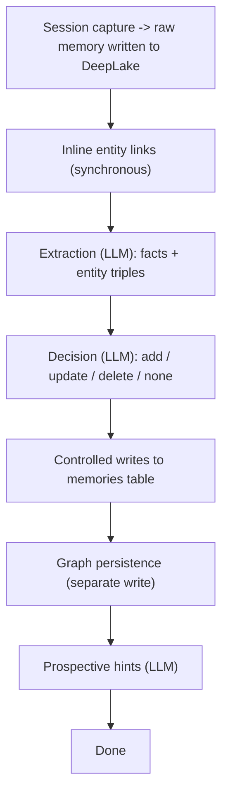

# Memory Pipeline

> Category: Ai | Version: 1.1 | Date: July 2026 | Status: Active

How a raw memory becomes structured, deduplicated, graph-linked recall. The extraction, decision, write, and graph stages, the modes that gate them, and the safety rules that keep writes durable.

**Related:**
- [`session-capture.md`](session-capture.md)
- [`retrieval.md`](retrieval.md)
- [`knowledge-graph-ontology.md`](knowledge-graph-ontology.md)
- [`pollinating-loop.md`](pollinating-loop.md)
- [`model-provider-router.md`](model-provider-router.md)
- [`../data/schema.md`](../data/schema.md)
- [`../architecture/adr/0009-local-queue-as-default-deeplake-is-not-a-queue.md`](../architecture/adr/0009-local-queue-as-default-deeplake-is-not-a-queue.md)
- [`../operations/observability-and-degradation.md`](../operations/observability-and-degradation.md)

---

## Why the pipeline exists

A memory comes in as raw text. On its own that is searchable but dumb. The pipeline turns it into something the retrieval layer can reason over: discrete facts with confidence scores, entities and relationships, and prospective hints about what questions the memory could answer later. The pipeline does all of this asynchronously, off the write path, because the one rule that cannot bend is that a slow or failing model must never cost the user a memory. The raw content is committed first. Everything else is enrichment.

Where the raw content comes from is the job of [`session-capture.md`](session-capture.md): the harness hooks and shims that observe a session and hand structured events to the daemon. Session capture feeds this pipeline. This doc starts where capture ends, the moment a raw memory has been written to a DeepLake table and the daemon needs to make it smart.

The work runs as durable jobs with a lease/complete/fail/dead lifecycle, exponential backoff, and a stale-lease reaper. Jobs survive daemon restarts. The default queue backend is the in-process local (SQLite) queue, not the Deep Lake `memory_jobs` table: Deep Lake is a versioned append-only store and is not a queue, so leasing against it means scanning append-only history for the live row per job. That is the decision recorded in [`../architecture/adr/0009-local-queue-as-default-deeplake-is-not-a-queue.md`](../architecture/adr/0009-local-queue-as-default-deeplake-is-not-a-queue.md), and the hybrid queue can still merge the Deep Lake queue when a durable cross-process view is wanted (PR #248). Only the daemon touches Deep Lake; harness shims and hooks are thin clients that post events over HTTP and never see the store.

For "jobs survive daemon restarts" to hold, the local queue's SQLite DB must be reopened at the *same path* on every boot. As of PR #285 (v0.10.1) it is anchored on the fleet state root: `<fleetRoot>/honeycomb/.daemon/local-queue.db` via `resolveLocalQueueBaseDir()` = `honeycombStateDir()`, never on `process.cwd()`. Before that fix the queue was opened at the cwd-scattering workspace base dir, so a restart (or a service-manager launch) from a different directory opened a *different, empty* queue and orphaned every pending job, so those memories never formed. The placement contract and the write-side-twin relationship to the vault-scatter fix are in [`../data/workspace-layout.md`](../data/workspace-layout.md).

## The stages

### Extraction

The extraction worker leases a job and calls the model the router selects for the `memory_extraction` workload (see [`model-provider-router.md`](model-provider-router.md)). The model decomposes the memory into `facts` (each with content, type, and a confidence between 0 and 1) and `entities` (triples of source, relationship, target). Chain-of-thought blocks are stripped before the JSON is parsed. Input is capped (around 12,000 characters), and output is bounded to roughly 20 facts and 50 entities with per-fact length limits. Invalid fields are logged as warnings and dropped rather than failing the whole job. Extraction runs only when the pipeline is `enabled` and the extraction provider is not `none`.

### Decision

For each extracted fact, the decision stage runs a hybrid search for the top few existing candidates and asks the model what to do: `add`, `update`, `delete`, or `none`, with a target memory ID, a confidence, and a reason. If there are no candidates, it proposes an immediate `add` without a model call. Every proposal, applied or not, is recorded to the `memory_history` table. That history is what makes shadow mode and audits possible.

### Controlled writes

This is the only stage that mutates memories. Embeddings are prefetched before the write so no network call happens while the daemon is committing. For each ADD proposal the worker checks that fact confidence clears `minFactConfidenceForWrite` (default 0.7), that the normalized content is non-empty, and that the content hash is not already present (SHA-256 dedup returns the existing memory ID instead of inserting a duplicate).

Because DeepLake's query endpoint coalesces UPDATEs in a way that can silently drop concurrent edits, the daemon does not lean on naive UPDATE for hot tables. The dedup check here is a SELECT-before-INSERT against the content hash, and any value interpolated into the query is escaped through the `sqlStr`/`sqlLike`/`sqlIdent` helpers, since the endpoint has no parameterized queries. UPDATE and DELETE proposals run a contradiction check (negation and antonym tokens plus lexical overlap) and are flagged for review; they only apply when `autonomous.allowUpdateDelete` is set, and they land as append-only version-bumped writes rather than in-place mutations.

The dedup SELECT can itself fail, and how that failure is classified is load-bearing. A probe against a partition whose `memories` table or `content_hash` column does not exist yet is not a duplicate. `classifyFailure` (the same engine the heal path uses) routes a `missing-table` or `missing-column` result to fall through to the INSERT, which heals the table. Any other failure, whether a permission or syntax fault, a dropped connection, a timeout, or a DeepLake degraded-window flap (5xx, 429, 402-balance, or eventual-consistency), is surfaced so the job fails and the queue retries, rather than risking an unguarded duplicate insert. BUG-04 (PR #293, v0.12.2) found the live symptom of that safety throw: 101 `memory_controlled_write` jobs (times 5 attempts, so 505 drops) were lost here against an opaque `query_error`, because the thrown error discarded the real DeepLake error text and HTTP status and left production blind to whether a memory dropped on a backend flap, a balance exhaustion, or a permission fault. The confirmed defect was diagnostic opacity, not the classification itself: same-scope jobs produced both 236 successes and 101 failures, so the failure was an intermittent degraded window that was correctly routed to a safety throw. The fix (`describeProbeFailure`) now emits a secret-free `controlled_write.dedup_probe_failed { classification, kind, status, transient, reason }` event and folds the kind, HTTP status, and a redacted message into the thrown error, which lands in the queue's `last_error_class`. Because a statement-rejection body can echo the probe SQL verbatim, and that SQL interpolates the SHA-256 `content_hash` (a one-way fingerprint of memory content), `redactProbedHash` strips the exact hash and collapses any residual long hex run before the message reaches the event or the at-rest log, so a content-derived fingerprint never persists.

BUG-04 is diagnostic-only (BUG-04a). It makes the next degraded window diagnosable and preserves correctness, but it does not by itself make a memory survive a window that outlasts its 5 job attempts. Controlled-writes still has no durability equivalent to the capture path's `capture_outbox` (see [`session-capture.md`](session-capture.md) and [`../storage/deeplake-recall-and-capture-findings-2026-07-10.md`](../storage/deeplake-recall-and-capture-findings-2026-07-10.md) §3.3). A durable retry-later outbox for controlled-writes is the tracked follow-up (BUG-04b), and the 101 already-dropped jobs are terminal in the queue and need a one-time re-drive once it lands.

### Graph persistence

After the memory write commits, graph structure is written separately. Entities upsert by canonical name, relationships upsert by the (source, target, type) triple, and mention links insert-or-ignore so reprocessing is idempotent. Graph persistence is gated by `graph.enabled` and `graph.extractionWritesEnabled`. A failure here logs a warning and does not revert the facts already written, because the facts matter more than the graph edges. The ontology this writes into is documented in [`knowledge-graph-ontology.md`](knowledge-graph-ontology.md).

### Prospective hints

If hints are enabled, a final pass generates hypothetical future queries for the memory, the questions this memory would answer, and indexes them in the hints table. Retrieval can then match a user query against the hint instead of only the literal memory text. This is the write-time half of the prospective indexing idea.

## Default posture and how to enable

The pipeline worker is constructed and started by the daemon on every boot (`src/daemon/runtime/assemble.ts`, `buildPipelineWorker`), but the stage handlers default **off** by design: no model spend occurs without an explicit opt-in. Enable stages individually via `HONEYCOMB_PIPELINE_*` environment variables or the equivalent `memory.pipelineV2` flags in `agent.yaml`. This was a deliberate product decision (PRD-045a) to avoid surprise model charges on first install.

## Two silent failures behind "captures sessions but forms zero memories"

For a stretch the pipeline captured sessions and queued jobs but formed no memories, and `/health` looked fine the whole time. PR #248 found two independent silent failures, both of which let the daemon look healthy while the pipeline did nothing.

The first was an O(N) lease wedge in the Deep Lake job queue. `discoverIds` did one point-read per job to find each job's live (highest-version) row, so under a 400+ job backlog a single `lease()` call took minutes. No `memory_extraction` job was ever leased inside its window, so extraction never ran even though jobs were piling up. PR #248 rewrote discovery as a paginated bulk scan that unions the max-version-per-id across pages, making leasing O(pages) rather than O(N). The same rewrite was applied to `stats()`, which dropped from about two minutes to under a second. These live in `src/daemon/runtime/services/{lease-coordinator,job-queue,hybrid-job-queue,local-queue-diagnostics}.ts`.

The second was a trailing-space `BoolFlag` bug. `HONEYCOMB_PIPELINE_ENABLED` arrived as `"true "` with a trailing space, an artifact of the Windows scheduled-task `set "VAR=true" && ...` quoting. The old flag parser compared the raw string against `"true"` without trimming, so `"true "` read as **false** and silently disabled the whole pipeline while `/health` stayed green. PR #248 moved the parser to a single source of truth, `src/shared/bool-flag.ts`, whose `BoolFlag` trims before comparing and only enables on `true` / `1`. The same trailing-space gating class was hardened across seven sibling configs (capture, pollinating, lifecycle, recall, poll-backoff, lease-coordinator, and the pipeline config itself) plus the inverse `OnByDefaultFlag` used by amplification, which trims before checking its off-tokens. `bool-flag.ts` deliberately stays out of the `@honeycomb/shared` barrel so its `zod` dependency never crosses into the browser dashboard bundle.

The rule the two fixes encode: a config value that silently reads false, or a lease that never completes in time, must not be able to disable the pipeline without a visible signal. The observability seam below (PR #244 and PR #246) is the visible signal.

## Is the loop actually pumping? Worker and coordinator logging

The stage worker and the lease coordinator both had structured-logging seams and already emitted `stage.completed` / `stage.failed`, but assembly constructed both of them with **no logger**, so every event was a silent no-op. PR #246 wired `daemon.logger` into the stage worker (through `buildPipelineWorker`) and into the lease coordinator, and added the load-bearing lifecycle events that tell an operator whether a loop is running at all:

- `stage.worker.started` and `lease.coordinator.started` fire when each driver comes up. The coordinator's `started` event carries its `leaseKinds` / `unionKinds` and its participant count. This matters because in the production default, consolidate-poll mode (`HONEYCOMB_POLL_CONSOLIDATE`), it is the lease coordinator, not the stage worker's own poll loop, that drives the pipeline. So `lease.coordinator.started` is the "did the driver start, and does its union include the backlogged kind" signal. Absence of a `started` event means no loop is pumping the queue, which is precisely the state the #248 wedge produced.
- `lease.coordinator.dispatched` fires per leased job, so a running-but-empty coordinator is distinguishable from one that is actually handing work to stage handlers.

These events are the pipeline's outward-facing debug surface. They are documented from the operator's side in [`../operations/observability-and-degradation.md`](../operations/observability-and-degradation.md), alongside the `GET /api/diagnostics/jobs` queue snapshot (PR #244) that shows the backlog those events are draining.

## Modes

The pipeline's behavior is governed by a small set of flags, all under `memory.pipelineV2` in `agent.yaml`. The corresponding environment variable for each flag uses the `HONEYCOMB_PIPELINE_` prefix (e.g. `HONEYCOMB_PIPELINE_ENABLED`, `HONEYCOMB_PIPELINE_GRAPH_ENABLED`).

| Flag | Effect |
|---|---|
| `enabled` | Master switch. Off means no extraction jobs are processed. |
| `shadowMode` | Run extraction and decision, write nothing. Proposals are logged to history under the `pipeline-shadow` actor. |
| `mutationsFrozen` | Emergency read-only brake. Supersedes shadow mode. |
| `graph.enabled` | Enable graph reads, traversal, and recall boosting. |
| `graph.extractionWritesEnabled` | Let background extraction persist entity triples. Default on. |
| `autonomous.enabled` | Allow scheduled maintenance and retention. |
| `autonomous.frozen` | Hard stop on maintenance even when autonomous is enabled. |
| `hints.enabled` | Run prospective hint generation at write time. |

## The other workers

Beyond the write-path stages, the daemon runs background workers on their own schedules. The document worker ingests URLs and files (fetch, chunk, embed, link) and is covered in [`../sources/source-lifecycle.md`](../sources/source-lifecycle.md). The retention worker runs a batch-limited purge: graph links, embeddings, tombstones, history, completed jobs, then dead jobs. The maintenance worker runs diagnostics and either logs recommendations (`observe`) or executes repairs (`execute`). The summary worker writes the canonical transcript and summary artifacts at session end. The synthesis worker regenerates `MEMORY.md` from durable memories, thread heads, and the session ledger. `MEMORY.md` is a rebuildable projection, not canonical history.

## What the stages produce

| Stage | Produces | Stored in | Idempotent on |
|---|---|---|---|
| Extraction | Facts and entity triples | job payload (jsonb), `memory_history` | partial results on bad JSON |
| Decision | Proposals (add/update/delete/none) | `memory_history` | per proposal per memory |
| Controlled writes | Memory rows, embeddings | `memories`, `embeddings`, vector tensor table | content hash |
| Graph persistence | Entity, relation, mention rows | `entities`, `entity_dependencies`, `memory_entity_mentions` | canonical name, triple, insert-or-ignore |

Structured job and proposal payloads are stored as `jsonb`. Embeddings are 768-dim `nomic-embed-text-v1.5` vectors written as DeepLake tensors. DeepLake tables are created lazily on first write with lazy schema-healing, so a new column or table does not require a migration step ahead of the worker. The storage mechanics live in [`../data/deeplake-storage.md`](../data/deeplake-storage.md) and the table definitions in [`../data/schema.md`](../data/schema.md).

Every stage threads `org`, `workspace`, and `agent_id` so a memory and the entities it touches stay inside the right tenancy and scope. The org/workspace boundary is enforced at the storage layer (see [`../multi-tenant/org-workspace-model.md`](../multi-tenant/org-workspace-model.md)); within a workspace, agent scoping and visibility are the subject of [`../security/scoping-and-visibility.md`](../security/scoping-and-visibility.md).
