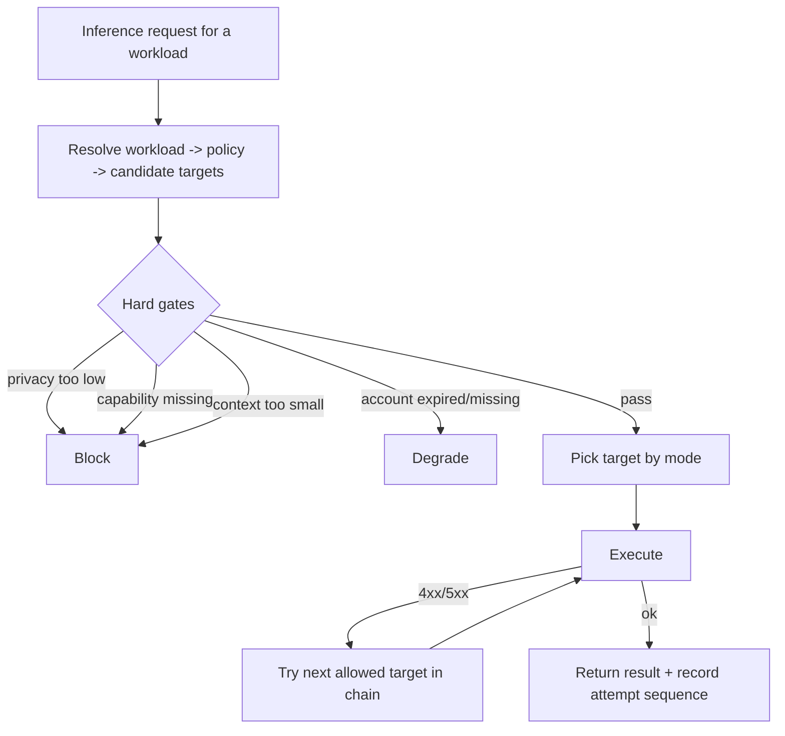

# Model and Provider Router

> Category: Ai | Version: 1.0 | Date: June 2026 | Status: Active

The unified inference control plane: how the daemon decides which model runs each workload, how it falls back, and the API and CLI surfaces that expose it.

**Related:**
- [`memory-pipeline.md`](memory-pipeline.md)
- [`pollinating-loop.md`](pollinating-loop.md)
- [`../integrations/mcp-and-sdk.md`](../integrations/mcp-and-sdk.md)
- [`../security/secrets.md`](../security/secrets.md)

---

## Why a router

Before the router, inference was scattered. Extraction picked its own model, synthesis picked another, interactive calls went straight to a harness, and there was no shared policy, no fallback, and no observability. The router pulls all of that into one place: the daemon owns inference routing, and every workload, extraction, synthesis, and interactive, flows through one policy engine. Harnesses reach it either through an OpenAI-compatible gateway or a native API, always as thin clients over HTTP; the daemon is the only thing that holds credentials and the only thing that talks to DeepLake.

## The config contract

Inference is configured in a top-level `inference:` block in `agent.yaml`. Accounts hold provider credentials (with secret references, never raw keys). Targets name a model on an account with a privacy tier and capabilities. Policies define how to choose among targets. Task classes describe kinds of work, and workloads bind a task class to a policy.

```yaml
inference:
  accounts:
    - id: anthropic-api
      provider: anthropic
      apiKey: ${ANTHROPIC_API_KEY}
  targets:
    - name: haiku
      account: anthropic-api
      model: claude-3-5-haiku
      privacy: private
      capabilities: [completion, caching]
  policies:
    - name: memory_extraction
      mode: strict
      chain: [local-ollama, haiku]
  workloads:
    memory_extraction:
      policy: memory_extraction
      taskClass: memory_extraction
    session_synthesis:
      policy: synthesis_policy
    interactive:
      policy: interactive_policy
```

## How a route is decided



Hard gates block a target outright: insufficient privacy tier, a missing required capability, or a context window too small for the request. A missing or expired account degrades rather than hard-blocks. Within the surviving candidates, the policy mode decides: `strict` follows an explicit ordered chain, `automatic` scores eligible candidates, and `hybrid` scores within an allowlist. When a target fails with a 4xx or 5xx, the router tries the next allowed target and records the attempt sequence.

## Workloads

Three workloads route through the same engine. `memory_extraction` selects the model that drives the extraction stage of the [`memory-pipeline.md`](memory-pipeline.md), `session_synthesis` selects the summary model, and `interactive` covers user-facing chat and agent calls. The pollinating pass routes through its own stronger policy as described in [`pollinating-loop.md`](pollinating-loop.md). There are no separate extractors anymore; they all resolve through one policy engine.

## API and CLI

The native inference API and the OpenAI-compatible gateway are implemented in `src/daemon/runtime/inference/gateway.ts` (`mountInferenceGateway`) but are **not yet mounted in the daemon's composition root** (`assemble.ts`) as of PRD-045. The pollinating path reaches the router internally through the `ModelClient` seam (`src/daemon/runtime/inference/model-client-factory.ts`); external HTTP access to `/api/inference/*` and `/v1/*` is deferred to a later phase.

When the gateway is wired, it will expose:

```text
GET    /api/inference/status
GET    /api/inference/history
POST   /api/inference/explain
POST   /api/inference/execute
POST   /api/inference/stream
DELETE /api/inference/requests/:id
GET    /v1/models
POST   /v1/chat/completions  (streaming)
```

The CLI tools (`honeycomb route list / status / doctor / explain / test / pin / unpin`) are implemented and registered.

The CLI mirrors the API for operators:

```bash
honeycomb route list
honeycomb route status
honeycomb route doctor
honeycomb route explain
honeycomb route test
honeycomb route pin    # and unpin
```

## Telemetry and safety

Routing history is daemon-local and redacted: it records the route and fallback sequence without secrets or request bodies, stored as `jsonb` event rows in DeepLake. The router validates any target override, clamps request bodies and headers, redacts errors, applies rate-limit buckets, and bounds concurrency. Secret references in accounts resolve through the secrets subsystem, never appearing in config dumps or logs; see [`../security/secrets.md`](../security/secrets.md).

## Current state

The shared router core (config parsing, strict/automatic/hybrid resolution, privacy/capability/context gates), the daemon router service (routed execution with fallback, workload shims), and the CLI tools are in place, along with daemon-local routing telemetry. The router is reachable from within the daemon via the `ModelClient` seam used by the memory pipeline and pollinating loop. The **HTTP gateway** (`/api/inference/*` and `/v1/*`) is implemented but not yet mounted in the daemon's composition root, external HTTP access is deferred (PRD-045 scope boundary). Runtime degradation (treating 401/403 as expired and 429 as rate-limited) is in-memory and not yet persisted across restarts. A canonical top-level `models:` map, first-class session and subscription account lifecycle, circuit breaking with cooldown recovery, and full cost telemetry are deferred to a later phase.
