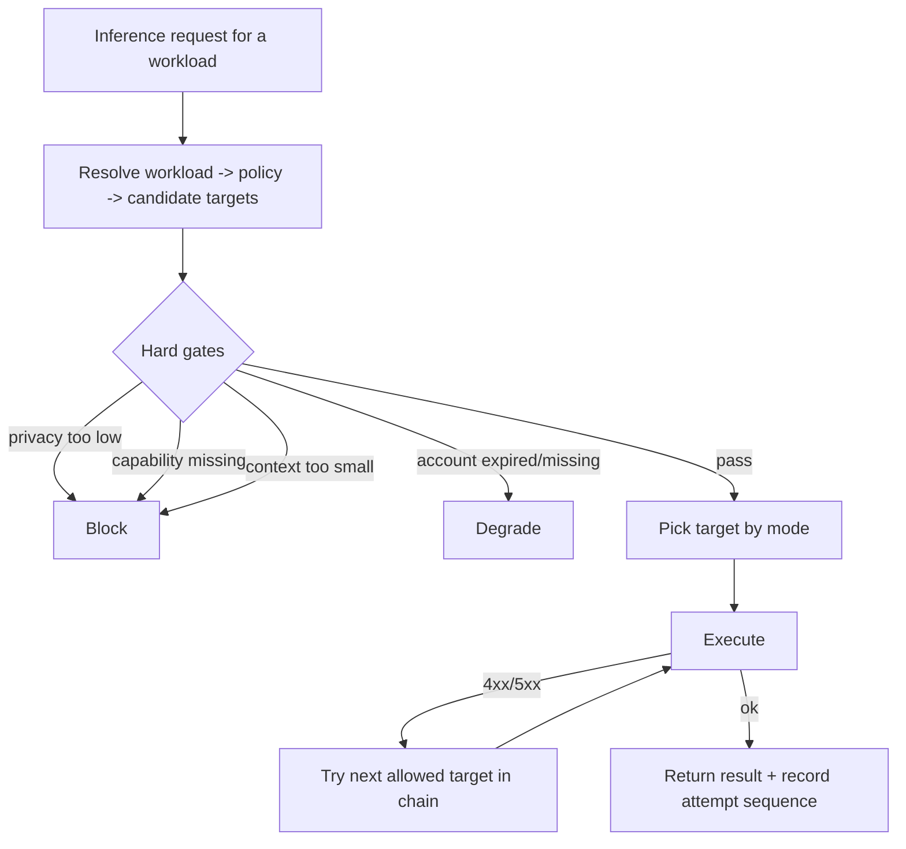

# Model and Provider Router

> Category: Ai | Version: 1.0 | Date: June 2026 | Status: Active

The unified inference control plane: how the daemon decides which model runs each workload, how it falls back, and the API and CLI surfaces that expose it.

**Related:**
- [`portkey-gateway.md`](portkey-gateway.md)
- [`memory-pipeline.md`](memory-pipeline.md)
- [`pollinating-loop.md`](pollinating-loop.md)
- [`../integrations/mcp-and-sdk.md`](../integrations/mcp-and-sdk.md)
- [`../security/secrets.md`](../security/secrets.md)

---

## Why a router

Before the router, inference was scattered. Extraction picked its own model, and there was no shared policy, no fallback, and no observability. The router is the daemon's inference control plane for the live workload tokens. Harnesses are meant to reach a gateway over HTTP; that gateway is implemented and not mounted. The daemon is the only thing that holds credentials and the only thing that talks to DeepLake.

## The config contract

Inference is configured in a top-level `inference:` block in `agent.yaml`. Accounts hold provider credentials (with secret references, never raw keys). Targets and policies are keyed by `id`. Capabilities are the closed set `chat | streaming | vision | tools`. Workloads are an array of `{ name, policy }`, plus optional gate floors. There is no `taskClass` field. The committed block in `agent.yaml` declares one workload, `memory_pollinating`. A shape the parser accepts:

```yaml
inference:
  accounts:
    - id: anthropic
      provider: anthropic
      apiKey: ${ANTHROPIC_API_KEY}
  targets:
    - id: claude-sonnet
      account: anthropic
      model: claude-sonnet-4-6
      privacy: private
      capabilities: [chat]
      contextWindow: 200000
  policies:
    - id: pollinating-policy
      mode: strict
      chain: [claude-sonnet]
  workloads:
    - name: memory_pollinating
      policy: pollinating-policy
      minPrivacyTier: private
      requiredCapabilities: [chat]
```

## How a route is decided


```mermaid
flowchart TD
    req["Inference request for a workload"] --> resolve["Resolve workload -> policy -> candidate targets"]
    resolve --> gates{"Hard gates"}
    gates -->|privacy too low| block["Block"]
    gates -->|capability missing| block
    gates -->|context too small| block
    gates -->|account expired/missing| degrade["Degrade"]
    gates -->|pass| pick["Pick target by mode"]
    pick --> exec["Execute"]
    exec -->|4xx/5xx| fallback["Try next allowed target in chain"]
    fallback --> exec
    exec -->|ok| done["Return result + record attempt sequence"]
```

Hard gates block a target outright: insufficient privacy tier, a missing required capability, or a context window too small for the request. A missing or expired account degrades rather than hard-blocks. Within the surviving candidates, the policy mode decides: `strict` follows an explicit ordered chain, `automatic` scores eligible candidates, and `hybrid` scores within an allowlist. When a target fails with a 4xx or 5xx, the router tries the next allowed target and records the attempt sequence.

## Workloads

The live workload tokens are `memory_extraction`, `memory_decision`, and `memory_pollinating` (`MODEL_WORKLOADS` in `src/daemon/runtime/pipeline/model-client.ts`). `memory_extraction` selects the model for the extraction stage of the [`memory-pipeline.md`](memory-pipeline.md). `memory_decision` is the decision-stage token. `memory_pollinating` is the pollinating pass described in [`pollinating-loop.md`](pollinating-loop.md). `session_synthesis`, `interactive`, and `taskClass` are not tokens under `src/`. Committed `agent.yaml` declares only `memory_pollinating`.

## API and CLI

The native inference API and the OpenAI-compatible gateway are implemented in `src/daemon/runtime/inference/gateway.ts` (`mountInferenceGateway`) but are **not yet mounted in the daemon's composition root** (`assemble.ts`) as of PRD-045. The pollinating path reaches the router internally through the `ModelClient` seam (`src/daemon/runtime/inference/model-client-factory.ts`); external HTTP access to `/api/inference/*` and `/v1/*` is deferred to a later phase.

When the gateway is wired, it will expose:

```text
GET    /api/inference/status
GET    /api/inference/history
POST   /api/inference/explain
POST   /api/inference/execute
POST   /api/inference/stream
DELETE /api/inference/requests/:id
GET    /v1/models
POST   /v1/chat/completions  (streaming)
```

`src/cli/route.ts` implements `route list`, `status`, `doctor`, `explain`, `test`, `pin`, and `unpin` (`routeMain`). Production `src/` does not import that module. Callers are `tests/cli/route.test.ts`. The registered `route` verb is the storage mapper in `src/commands/storage-handlers.ts`, which dispatches to `/api/inference/routes`. `mountInferenceGateway` exposes `/status`, `/history`, `/explain`, `/execute`, and `/stream` on the inference group, and it is not called from `assemble.ts`, so those gateway routes are not the live surface either.

## The Portkey alternate transport

The router is not the only inference path. An operator can turn on an optional Portkey gateway (PRD-063), and when they do it SUPERSEDES this per-provider router for inference: the model-client factory builds a Portkey-backed client against a synthetic single-target config instead of resolving a per-provider key. The router is not deleted or replaced. Portkey is an alternate transport selected at the factory seam, and the per-provider path remains both the default and (opt-in) the fallback. The full supersession, precedence, fallback, health, and metering story is in [`portkey-gateway.md`](portkey-gateway.md); the privacy-tier trade-off it implies is in [`../security/portkey-privacy-tier.md`](../security/portkey-privacy-tier.md).

## Telemetry and safety

Routing history is daemon-local and redacted: it records the route and fallback sequence without secrets or request bodies, stored as `jsonb` event rows in DeepLake. Body clamp and error redaction live on the unmounted gateway (`src/daemon/runtime/inference/gateway.ts`). There is no rate-limit bucket and no concurrency cap under `src/daemon/runtime/inference`. A 401 marks an account expired in memory for the process lifetime (`src/daemon/runtime/inference/router.ts`); that set is not persisted across restarts. Secret references in accounts resolve through the secrets subsystem, never appearing in config dumps or logs; see [`../security/secrets.md`](../security/secrets.md).

## Current state

The shared router core (config parsing, strict/automatic/hybrid resolution, privacy/capability/context gates) and the daemon router service (routed execution with fallback, workload shims) are in place, along with daemon-local routing telemetry. The router is reachable from within the daemon via the `ModelClient` seam used by the memory pipeline and pollinating loop. The `src/cli/route.ts` verbs are implemented and unregistered; the live `honeycomb route` verb posts to `/api/inference/routes`. The **HTTP gateway** (`/api/inference/*` and `/v1/*`) is implemented but not yet mounted in the daemon's composition root, external HTTP access is deferred (PRD-045 scope boundary). Runtime degradation (treating 401/403 as expired and 429 as rate-limited) is in-memory and not yet persisted across restarts. A canonical top-level `models:` map, first-class session and subscription account lifecycle, circuit breaking with cooldown recovery, and full cost telemetry are deferred to a later phase.
