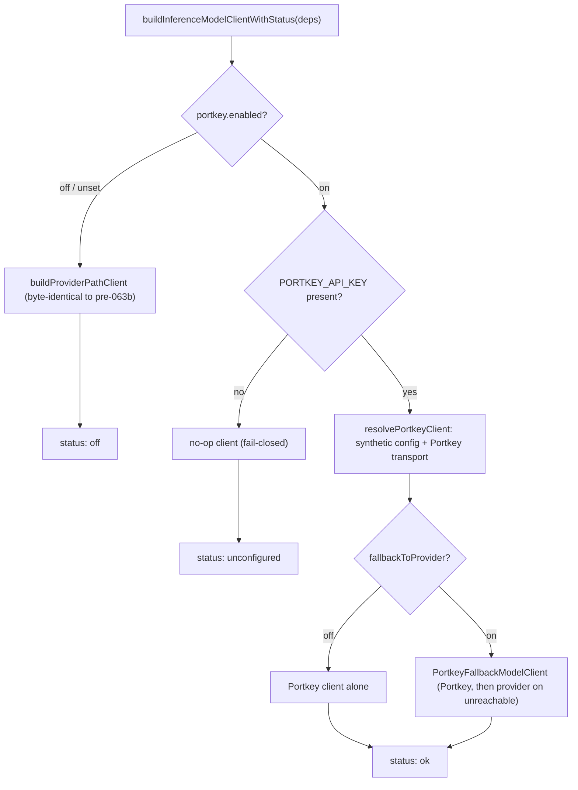

# Portkey Gateway (optional one-stop inference)

> Category: Ai | Version: 1.0 | Date: June 2026 | Status: Active

The optional AI-gateway path that, when an operator turns it on, supersedes the per-provider inference keys and routes every workload through a single [Portkey](https://portkey.ai) endpoint. Read this to understand what changes when `portkey.enabled` is on, how the supersession is wired at the model-client factory, and how precedence, fallback, health, and metering stay honest. Ships PRD-063a (settings surface) and PRD-063b (inference routing); PRD-063c (reranking) is parked.

**Related:**
- [`model-provider-router.md`](model-provider-router.md)
- [`memory-pipeline.md`](memory-pipeline.md)
- [`pollinating-loop.md`](pollinating-loop.md)
- [`../security/portkey-privacy-tier.md`](../security/portkey-privacy-tier.md)
- [`../security/secrets.md`](../security/secrets.md)

---

## Why a gateway

Honeycomb normally resolves inference one provider at a time. The operator stores a provider key (`ANTHROPIC_API_KEY`, `OPENAI_API_KEY`, `OPENROUTER_API_KEY`) write-only in the encrypted vault, the `setting` class records the active provider and model, and the model-client factory resolves the `${SECRET_REF}` to that one provider's key at call time (see [`model-provider-router.md`](model-provider-router.md)). That works, but it asks the operator to paste and manage a separate key per provider, and it pushes provider routing, model selection, guardrails, and fallback logic into Honeycomb.

A gateway moves all of that out of Honeycomb. With the Portkey toggle on, the operator configures the fleet once in their own Portkey dashboard (which downstream provider, which model, guardrails, regional routing, fallbacks) and points Honeycomb at it with a single `PORTKEY_API_KEY` plus a Portkey config or virtual-key id. Honeycomb stops being the place that holds N provider keys and becomes a thin client of one OpenAI-compatible endpoint.

The toggle is OFF by default and changes nothing until an operator turns it on and supplies a key. The per-provider path stays the default and, optionally, the fallback. Portkey does not replace the model-provider router; it is an alternate transport chosen at the factory seam.

## What turns it on

Three additive vault `setting`-class keys plus one secret drive the whole feature. No new tables, columns, crypto, or persistence were added.

| Key | Class | Meaning |
|---|---|---|
| `portkey.enabled` | setting (boolean) | The master toggle. Off (default) means the per-provider path runs unchanged. |
| `portkey.config` | setting (string) | The Portkey config or virtual-key id, copied from the Portkey dashboard. Free-form, rejected if it contains control characters (it rides the `x-portkey-config` header). |
| `portkey.fallbackToProvider` | setting (boolean, default false) | Opt-in fallback to the per-provider path when the gateway is unreachable. |
| `PORTKEY_API_KEY` | secret | The Portkey key, write-only and presence-only. No endpoint ever returns its value. |

The Settings page (PRD-063a) renders a "Use Portkey gateway" toggle, the config field, a write-only `PORTKEY_API_KEY` row showing only presence ("set" / "not set"), and the opt-in fallback toggle. When Portkey is on, the per-provider key rows are de-emphasized because `activeProvider` is no longer authoritative for routing (D-2). The catalog entry lives in `src/daemon/runtime/vault/catalog.ts` (`portkey`, `openEnded`); the setting keys are validated in `vault/api.ts`; the dashboard surface is in `src/dashboard/web/panels.tsx` (`PortkeyGatewaySection`) and `pages/settings.tsx`.

## The supersession

When the toggle is on, the model-client factory builds a Portkey-backed client instead of resolving a per-provider key. The seam is `buildInferenceModelClientWithStatus` in `src/daemon/runtime/inference/model-client-factory.ts`.



The supersession does NOT route through `applyProviderModelOverride` (the PRD-032d vault selection graft that preserves a per-provider `apiKeyRef`). Instead `buildPortkeyConfig(model)` constructs a SYNTHETIC single-entry `InferenceConfig`: one account whose provider is `portkey` and whose `apiKeyRef` is `${PORTKEY_API_KEY}`, one target advertising the `chat` capability at the `public` privacy tier with a large context window, one `strict` policy that reaches it, and one workload per memory token (`memory_extraction`, `memory_decision`, `memory_pollinating`). Because the account's `apiKeyRef` is a `${SECRET_REF}`, the key still resolves through the SAME secret resolver the per-provider path uses: it is decrypted in-process at call time and is never inlined, logged, or returned (see [`../security/secrets.md`](../security/secrets.md)).

Honeycomb sends the vault `activeModel` as the requested model (D-2). Portkey's server-side config may override it per its own routing rules.

## The transport

`src/daemon/runtime/inference/transport-portkey.ts` is the second real `ProviderTransport` in the product (after the Anthropic one). Per D-1 (lean deps) it is a hand-rolled `fetch`, not the `portkey-ai` SDK, matching the repo posture and keeping the bundle and `audit:openclaw` surface small.

It POSTs to the Portkey OpenAI-compatible endpoint with two auth headers, all three values exported as named constants so a future doc change is a one-line edit and a test can assert the exact wire values:

```ts
export const PORTKEY_CHAT_COMPLETIONS_URL = "https://api.portkey.ai/v1/chat/completions";
export const PORTKEY_API_KEY_HEADER = "x-portkey-api-key";   // the resolved PORTKEY_API_KEY
export const PORTKEY_CONFIG_HEADER = "x-portkey-config";     // the portkey.config id
```

Because Portkey is OpenAI-compatible, the internal request messages pass through verbatim with no Anthropic-style system hoisting. The response boundary is validated with zod (`PortkeyChatResponseSchema`): a valid completion is never dropped over a malformed side-channel `usage` block, and an absent or malformed `usage` surfaces zero counts rather than throwing. `stream()` is a thin wrapper over `execute()` (mirrors the Anthropic transport), because the pollinating path consumes a whole completion; a real SSE body can replace it later without touching the router.

Error mapping matches the Anthropic transport so the router's fallback behaves identically: a non-2xx response throws a `ProviderError` carrying the HTTP status, and a network or transport failure maps to 503. The thrown message is a short status string, NEVER the response body (which could echo a credential) and never the key.

## Precedence and fallback (D-3)

Precedence is: when Portkey is on, it supersedes the per-provider keys. The failure posture depends on `portkey.fallbackToProvider`.

- **Missing key is always a hard error.** If `portkey.enabled` is on but `PORTKEY_API_KEY` is absent, `resolvePortkeyClient` throws `PortkeyUnconfiguredError` BEFORE building anything. The factory catches it and returns the no-op client with status `unconfigured`. This is fail-closed regardless of the fallback setting: a missing key is never silently papered over with a provider key. The presence check probes the scope's secret NAMES only and never decrypts a value.
- **Default, fallback off.** The Portkey client stands alone. An unreachable gateway surfaces the transport error; the stage wrapper treats a rejection as "no usable output" and the daemon keeps booting.
- **Opt-in, fallback on.** `resolvePortkeyClient` also builds the per-provider path client and wraps both in `PortkeyFallbackModelClient`. It tries Portkey first and, on an unreachable or transport gateway error, routes the SAME request through the per-provider path (resolving the provider's `${SECRET_REF}` as today). A non-transport error (for example the provider path also exhausting) propagates.

Fallback covers reachability, not the privacy floor. Routing through the gateway intentionally bypasses Honeycomb's per-provider privacy-tier gate (the synthetic target is admitted at the `public` tier). That trade-off is a conscious operator decision and is documented separately in [`../security/portkey-privacy-tier.md`](../security/portkey-privacy-tier.md).

## Health and metering stay honest

`/health` gains a `reasons.portkey` signal (PRD-063b on top of PRD-029), a closed enum carrying no secret:

- `off` means the toggle is off and the per-provider path is in force.
- `ok` means Portkey is on, the key is present, and the Portkey path is built.
- `unconfigured` means Portkey is on but the key is absent (fail-closed).
- `unreachable` means an ACTUAL observed runtime failure: a real Portkey call could not connect or was auth-rejected.

The first three are derived from config AT ASSEMBLY (the factory's `PortkeyStatus`), with no synchronous network probe. The `unreachable` state is derived ONLY from a cached last-failure signal: the transport's `onTransportError` callback fires with the HTTP status immediately before a `ProviderError` is thrown, assembly caches it, and the health builder reads it verbatim. A malformed-response 502 is NOT reported as unreachable (the gateway was reachable, the body was just bad). Like the other reasons, `reasons.portkey` is mode-gated: it appears on local `/health` and the protected diagnostics surface, and is stripped from the public team/hybrid `/health` so no subsystem topology leaks to an unauthenticated remote.

Usage and cost metering keep working under the gateway. Portkey returns OpenAI-shaped `usage`, and the transport surfaces those counts through the SAME `UsageSink` seam the Anthropic transport uses: `prompt_tokens` maps to input tokens, `completion_tokens` to output tokens, and `prompt_tokens_details.cached_tokens` to cache-read tokens. Portkey's OpenAI shape has no cache-write count, so that field stays zero rather than being fabricated. PRD-060 ROI capture therefore does not silently zero out when inference routes through Portkey.

## Current state and the parked reranking phase

063a (settings surface) and 063b (inference routing) shipped in PR #147. 063c (Cohere reranking through the same gateway) is parked BLOCKED: there is no provider-rerank seam to plug into today (reranking is embedding-cosine or `none`, `DEFAULT_RERANKER="none"`), so lighting up a Portkey-routed reranker depends on a recall-side deliverable (PRD-027 / PRD-047). The recall path is zero-diff while 063c is dark. See OQ-4 in the PRD index for the ownership split with `retrieval-worker-bee`.
