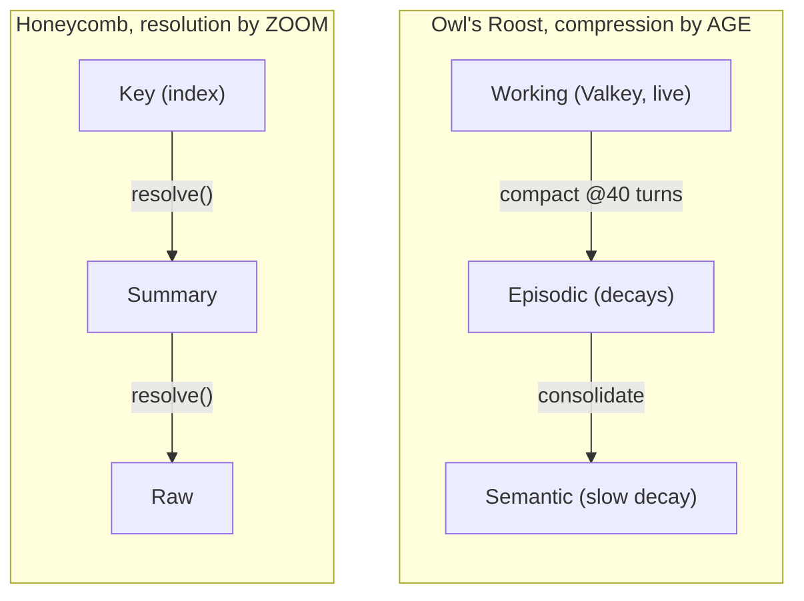

# Prior Art: Owl's Roost Memory, Crosswalk

> Category: Ai | Version: 1.0 | Date: June 2026 | Status: Strategy, reference / external prior art

A crosswalk between the 3-tier zoom strategy and the memory system the project owner previously built
in the **Owl's Roost** coaching app (a separate repo). It records what transfers to Honeycomb, what
deliberately does *not*, and why, so a future agent inherits the lessons without re-deriving them.
The Owl's Roost docs are external prior art; file paths below are *theirs*, not this repo's.

**Related:**
- [`three-tier-memory-strategy.md`](three-tier-memory-strategy.md), the Honeycomb design this informs
- [`distillation-and-tier1-keys.md`](distillation-and-tier1-keys.md), borrows the two-step grounded summary
- [`hybrid-sql-vector-rationale.md`](hybrid-sql-vector-rationale.md), why Honeycomb diverges on the store
- [`graphrag-followon.md`](graphrag-followon.md), Owl's Roost's GraphRAG, as an approved later add

---

## 1. Why this exists

The owner built a three-tier memory once already, for a *coaching* product, on a different stack. It
works and is documented. Rather than start the Honeycomb design from zero, this doc maps the prior
art across and marks each idea TRANSFER / ADAPT / DROP, with the reason. The headline: the *concepts*
transfer strongly; several *implementation choices* are wrong for Honeycomb because the domain
(longitudinal personal coaching) and the substrate (Qdrant vector-only) differ from Honeycomb's
(per-repo coding memory on Deep Lake SQL+vector, behind a harness that owns working memory).

---

## 2. What Owl's Roost built (summary of the prior art)

- **Three-tier hierarchy (compression by age):** Tier 1 Working memory in Valkey (Redis-compatible,
  2-hour TTL, full `SessionTurn[]`); Tier 2 Episodic in Qdrant (`content_type: session_summary`, decay
  0.8×@7d / 0.6×@30d); Tier 3 Semantic in Qdrant (`content_type: semantic_fact`, decays slowly 0.9×).
- **Compaction at 40 turns:** at the threshold, turns 1-30 are summarized and indexed to Qdrant,
  31-40 retained; fire-and-forget with a Valkey lock, retry ×3, a status machine
  ACTIVE→COMPACTING→SUMMARIZED→RESUMED.
- **Two-step grounded summary:** structured JSON extraction (temp 0.1: goals/decisions/commitments/
  blockers/next) *then* a narrative grounded only in those facts (temp 0.4), to prevent hallucinated
  history.
- **Temporal decay scoring:** an age-based score multiplier applied at retrieval; semantic facts age
  slowly; sorted by `score × multiplier`.
- **Reconstruct on resume:** when working memory expires, rebuild from last-10 raw + top-5 decayed
  episodic summaries, injected as a synthetic `[CONTEXT SUMMARY]` turn.
- **Two-stage vector retrieval:** Qdrant ANN (top-20) → Cohere rerank-v3.5 (top-5); per-tenant
  collections with `user_id` payload filters; cold-start graceful degradation to knowledge-base only.
- **GraphRAG (feature-flag gated):** a Postgres knowledge graph (entities + relationships, recursive
  CTE traversal, RRF fusion) for relational multi-hop, off by default. See the follow-on doc.

---

## 3. The crosswalk

| Owl's Roost idea | Honeycomb disposition | Why |
|---|---|---|
| Two-step grounded summary (JSON facts → narrative) | **TRANSFER** | The anti-hallucination guarantee is domain-independent. Port it to PRD-017 + the Tier-1 key derivation. See distillation doc. |
| Temporal decay (age multiplier; semantic ages slowly) | **TRANSFER (already in flight)** | This is exactly PRD-047d recency dampening. The "recent timestream" prime is age-weighted; durable facts age slowly. |
| Cold-start graceful degradation | **TRANSFER** | A fresh repo / new agent has no memory; the prime must degrade to "nothing yet" cleanly, never error, matches Honeycomb's existing `degraded` recall posture. |
| Three *zoom* levels of detail | **TRANSFER (re-framed)** | Honeycomb's tiers are zoom levels (key→summary→raw), not age buckets, see below. |
| Tier-1 = Valkey working memory | **DROP** | The harness (Claude Code / Cursor) already owns live working memory + compaction. Honeycomb must not rebuild it. Honeycomb's "Tier 1" is an *index*, not working memory. |
| Compaction at 40 turns / status machine | **DROP (mostly)** | That is the harness's job for a coding agent. Honeycomb captures turns and distills at session boundaries, not via a 40-turn in-memory compactor it owns. |
| Qdrant vector-only + payload-pointer resolution | **DROP** | Deep Lake's SQL side does key resolution as a join; no payload-pointer scheme. See hybrid-rationale doc. |
| Cohere rerank-v3.5 as the reranker | **ADAPT** | Reranking is right (PRD-047b), but Honeycomb reranks via its own configured reranker (embedding-cosine default / LLM), not a Cohere dependency. |
| GraphRAG behind a flag | **ADAPT → approved follow-on** | Relational multi-hop is valuable later; Honeycomb has its own graph substrate. See graphrag-followon doc. |

---

## 4. The one re-framing that matters most

Owl's Roost's three tiers are an **age-compression lifecycle** (data flows down as it ages). The
Honeycomb strategy's three tiers are a **resolution/zoom hierarchy** (same memory, three detail
levels, agent picks). They look similar on a slide and are different in practice:

The zoom framing is better for a *tool-using coding agent* because it pairs with progressive
disclosure: the agent gets a cheap index and drills. The age framing is better for a *continuous
conversation* where the system, not the agent, decides what to keep warm. Different jobs.

---

## 5. The transferable wisdom worth keeping verbatim

Two lines from the prior art are worth carrying as design rules, because they were learned the hard
way and apply directly:

1. **"Do not enable [the fancy thing] because it sounds architecturally interesting."** Owl's Roost
   says this about GraphRAG; it generalizes. Every tier, rerank, decay, and the graph follow-on must
   be justified by measured value, not novelty. This is the same discipline that killed the native
   hybrid operator on Honeycomb.
2. **Summary hallucination is a first-class loss vector.** The prior art lists "LLM invents facts
   during compression" as one of the seven ways context is lost, mitigated by structured-extraction-
   before-narrative. For Honeycomb's prime this is existential: a hallucinated key is false history
   injected into every future session.

---

## Changelog

| Date | Version | Change |
|------|---------|--------|
| 2026-06 | 1.0 | Initial crosswalk from the Owl's Roost memory docs to the Honeycomb 3-tier strategy. |
