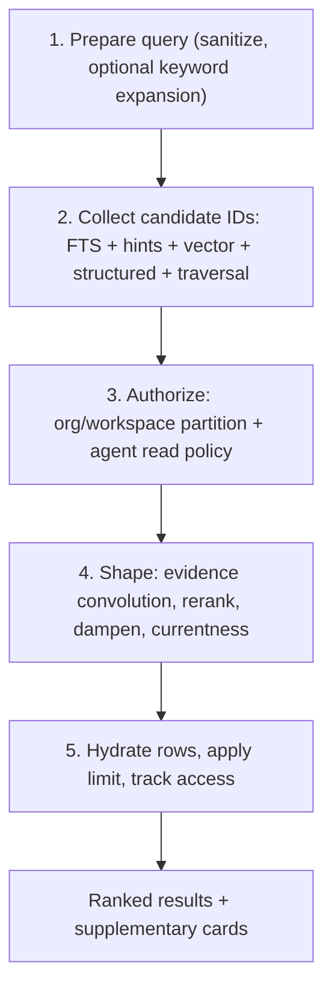

# Retrieval

> Category: Ai | Version: 1.0 | Date: June 2026 | Status: Active

How recall works: hybrid candidate collection over DeepLake, the authorization boundary, GPU-backed vector search, the shaping and dampening that decide what an agent sees, and the virtual-filesystem browse surface.

**Related:**
- [`memory-pipeline.md`](memory-pipeline.md)
- [`session-capture.md`](session-capture.md)
- [`knowledge-graph-ontology.md`](knowledge-graph-ontology.md)
- [`../data/deeplake-storage.md`](../data/deeplake-storage.md)
- [`../data/memory-virtual-filesystem.md`](../data/memory-virtual-filesystem.md)
- [`../security/scoping-and-visibility.md`](../security/scoping-and-visibility.md)

---

## What recall has to balance

Recall has to be cheap, scoped, and current. Cheap means it cannot run a model on every query by default. Scoped means it must never return a memory the requesting agent is not allowed to see, across the org/workspace boundary and the within-workspace agent policy. Current means a superseded fact must not outrank the fact that replaced it. The engine, inherited from Otherhive, handles all three with a five-phase flow, and Honeycomb runs it over DeepLake with GPU-accelerated vector search.

## Phase 1: prepare the query

The raw query is normalized into a safe full-text expression, escaped through the DeepLake SQL helpers because the query endpoint takes no bound parameters (see [`../data/deeplake-storage.md`](../data/deeplake-storage.md)). An optional keyword expansion widens class-to-instance gaps, while the original natural-language string is preserved for the vector and model paths.

## Phase 2: collect candidate IDs

Several channels run and produce memory IDs only, no content yet. Full-text search runs against the indexed content with BM25-style scoring normalized to a 0-to-1 range. The hint channel matches the prospective hints generated at write time, capped so a memory cannot ride in on hints alone. The vector channel embeds the query and runs a GPU-backed similarity search over the 768-dimension `nomic-embed-text-v1.5` columns, over-fetching for scoped recalls. Structured paths resolve entity, aspect, group, and claim routes when the graph is enabled, and graph traversal walks the dependency graph within a budget to collect linked memory IDs. The channels merge by memory ID, strongest calibrated score winning unless blended.

### Embeddings

Embeddings come from a nomic embed daemon (768-dim `nomic-embed-text-v1.5`), optional and non-blocking: when it is off or fails, recall degrades to lexical search. Vectors are stored as DeepLake tensor columns and searched on the GPU-backed engine, so semantic recall and the structured filters that scope it run in one query rather than a database plus a separate vector index. An embedding tracker heals missing or stale vectors in the background, outside any write path.

## Phase 3: authorize candidates

This is the boundary that makes recall safe. Up to here only IDs have moved. Now the engine re-queries the memory tables with the full scope: the org and workspace partition (enforced at the storage layer) and the within-workspace `agent_id` read-policy clause, plus any type, tag, project, pinned, importance, or date filters the caller passed. Only candidates that survive continue, and every content-bearing stage that follows runs strictly on authorized rows. The scope enforcement is documented in [`../security/scoping-and-visibility.md`](../security/scoping-and-visibility.md).

## Phase 4: shape the authorized set

This is where ranking quality is earned. Structured evidence convolution compares each result's lexical, semantic, hint, traversal, and structured signals so a graph-only hit cannot dominate direct textual evidence. Facet coverage prefers results covering more of the query. An optional rehearsal boost rewards memories accessed often and recently.

Reranking is optional and timeout-safe: an embedding reranker blends the original score with cosine similarity, or an LLM reranker can be used, and on timeout the original order is kept rather than failing the recall. Dampening then corrects three pathologies: gravity penalizes semantic hits sharing no query terms, hub penalizes results hung off very high-degree entities, and resolution boosts decision and constraint memories and temporal anchors.

Currentness shaping downweights superseded attributes. Because DeepLake supersedes a claim by appending a new version and marking the old one superseded rather than updating in place, the current value of a claim slot (scoped by `group_key` plus `claim_key`) outranks the value it replaced. This is what stops a stale policy from beating the corrected one, and it ties directly to the ontology in [`knowledge-graph-ontology.md`](knowledge-graph-ontology.md).

## Phase 5: hydrate and return

The survivors are hydrated into full rows with the same scope filter, the caller's limit is applied, and access tracking updates only the primary results. Supplementary material can ride along: source chunks, summaries, graph context cards, and expanded transcripts, each marked so the caller can tell a synthetic card from an ordinary row.

## The recall confidence gate

Recall also decides whether to inject context automatically. The reranker-calibrated scores are preserved rather than synthesized from rank, and the `user-prompt-submit` hook injects only when the top score clears a minimum. An empty injection is a real answer: it means no confident match was found, not that recall failed.

## The browse surface

Beyond scored recall, agents can browse memory as a virtual filesystem: ordinary shell commands against the memory mount, intercepted and routed to scoped queries over the `sessions` and `memory` tables. This is the read surface carried from Hivemind, and it gives explicit, agent-driven recall that bypasses the inject-on-confidence rule. The dispatch and path conventions are documented in [`../data/memory-virtual-filesystem.md`](../data/memory-virtual-filesystem.md). Either way, scored recall or browse, the same authorization boundary applies before any content is returned.
