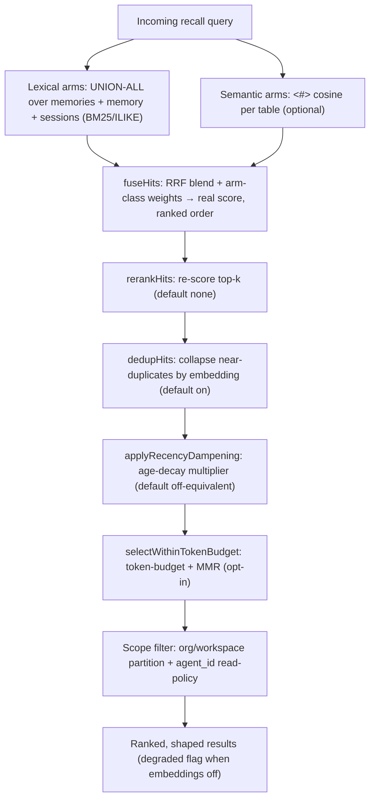

# Retrieval

> Category: Ai | Version: 2.0 | Date: June 2026 | Status: Active

How recall works: hybrid lexical + semantic candidate collection over DeepLake, RRF fusion, the reranker/dedup/recency/MMR shaping stages, the authorization boundary, GPU-backed vector search, the virtual-filesystem browse surface, and the nDCG eval harness that gates every ranking change.

**Related:**
- [`memory-pipeline.md`](memory-pipeline.md)
- [`session-capture.md`](session-capture.md)
- [`session-priming-architecture.md`](session-priming-architecture.md)
- [`knowledge-graph-ontology.md`](knowledge-graph-ontology.md)
- [`hybrid-sql-vector-rationale.md`](hybrid-sql-vector-rationale.md)
- [`deeplake-hybrid-record-operator-report.md`](deeplake-hybrid-record-operator-report.md)
- [`../data/deeplake-storage.md`](../data/deeplake-storage.md)
- [`../data/memory-virtual-filesystem.md`](../data/memory-virtual-filesystem.md)
- [`../security/scoping-and-visibility.md`](../security/scoping-and-visibility.md)

---

## What recall has to balance

Recall has to be cheap, scoped, current, and *shaped*. Cheap means it cannot run a model on every query by default. Scoped means it must never return a memory the requesting agent is not allowed to see, across the org/workspace boundary and the within-workspace agent policy. Current means a superseded fact must not outrank the fact that replaced it. Shaped means the few results that reach the agent's context are the *distinct, fresh, relevant* ones, not five paraphrases of one fact, not a six-month-old claim above last week's. Honeycomb handles all four in `recallMemories` (`src/daemon/runtime/memories/recall.ts`), served by `POST /api/memories/recall` (`src/daemon/runtime/memories/api.ts:405` is the sole production caller).

> **Note (PRD-045b):** An engineered five-phase `RecallEngine` (collect → traverse → authorize → shape → gate) was designed but de-scoped before production deployment. It had zero production callers, and its currentness downweighting was redundant with the append-only highest-version model already enforced by `is_deleted`, version columns, and PRD-008 supersession. The pipeline described below is what `recallMemories` actually does; see `src/daemon/runtime/recall/CONVENTIONS.md` for the de-scope rationale.

## Semantic recall is the default, not the dark path (PRD-025)

A fresh `honeycomb login` user gets hybrid lexical + 768-dim semantic recall out of the box. This was not always true: the daemon once shipped a `noopEmbedClient` default seam, so every stored row landed with a NULL `content_embedding` and every recall printed `(lexical fallback)`. PRD-025 inverted that posture:

- **Embeddings are on by default.** `HONEYCOMB_EMBEDDINGS` is opt-*out*: unset/`true`/`1` is on, only an explicit `false`/`0` turns it off. `honeycomb login` provisions and owns the embed daemon (~600 MB `nomic-embed-text-v1.5`, 768-dim, downloaded once and warmed in the background), so the `<#>` cosine path is the default a real user hits.
- **The store path populates the vector.** The default `embed` seam is the real `createEmbedAttachment`, so a deliberately-stored memory and a captured turn both land with a real 768-dim `FLOAT4[]` embedding. The dim invariant (`EMBEDDING_DIMS = 768` in `src/daemon/storage/vector.ts` ↔ the schema `FLOAT4[]` columns ↔ the model output) is locked end-to-end; a non-768 vector is rejected to NULL, never silently written.
- **The `degraded` flag is honest.** Recall returns `degraded: false` when the semantic arm actually ran, and `degraded: true` only on genuine fallback, embeddings explicitly off, model still warming, embed daemon unreachable/crashed, a per-call timeout, or a malformed response. In every degraded case recall still answers with the BM25/ILIKE arms. **Recall never throws and never hangs on the embed path**, a degraded answer beats a 500 for an agent's turn (PRD-047 D-7 preserves this; no stage may turn the fallback into a throw).

## Lexical arms

`recallMemories` runs a `UNION ALL` over three tables, `memories` (durable distilled facts), `memory` (per-session summaries), and `sessions` (raw dialogue rows), using BM25-style full-text search when the DeepLake index is present and falling back to `ILIKE` when it is not. Each arm is a separately-guarded query (`buildMemoriesArmSql` / `buildMemoryArmSql` / `buildSessionsArmSql`) precisely so a missing sibling table degrades *that arm* to empty rather than 500-ing the whole recall. Every value interpolated into the query passes through the `sqlStr`/`sqlLike`/`sqlIdent` helpers because the DeepLake query endpoint has no parameterized queries.

## Semantic arms and embeddings

When embeddings are enabled, the query is embedded with the nomic embed daemon and a `<#>` cosine arm runs per table, scored as a normalized cosine `((1 + (emb <#> vec)) / 2)` in `[0,1]`. Vectors are stored as DeepLake tensor columns and searched on the GPU-backed engine, so the semantic filter and the scope filter run in one query rather than against a separate vector index. An embedding tracker heals missing or stale vectors in the background, outside any write path.

## RRF fusion and provenance-forward ranking (PRD-027)

Recall hits carry a **real, comparable score**, and results are ordered by relevance, not by arm order, and never by a client-side fabrication (the old dashboard `1 - i*0.06` fake is gone). `fuseHits` blends the per-arm ranked lists with **Reciprocal Rank Fusion** (`RRF_K = 60`), scale-free so it needs no BM25↔cosine calibration. Two shaping rules ride the fusion:

- **Arm-class weights** fold provenance into the rank: distilled `memory` summaries weight 1.0, raw `session` rows weight 0.4, so a raw tool-call blob needs a materially stronger signal to outrank a clean distilled fact. Distilled facts above raw dumps is the product-correct order.
- **Identity dedup** collapses the same `source+id` across arms, and every hit keeps its `source` + scope provenance.

This ranking was not adopted on faith. PRD-027 shipped the golden-set eval harness (`npm run eval:recall`) that *measures* the lift, and PRD-025's semantic-on claim is defended against it, not asserted.

## Why not the native hybrid operator (PRD-047a)

DeepLake ships a native `deeplake_hybrid_record` operator that fuses vector + BM25 in one statement. Honeycomb does **not** use it, and a future agent reading "hybrid" must not reach for it. A live A/B (2026-06-22) found it returned a degenerate constant-zero score for every row, near-random ordering, recall@5 ≈ 0.14-0.17 versus RRF's 0.72-0.78, weight-insensitive. A 2026-06-24 re-run found the vendor had fixed the operator, but it only *ties* RRF (recall@5 0.611 each) without beating it, so the adoption gate (tie-or-beat on recall@5 AND MRR) is still not cleared. RRF stays the default; `src/daemon/runtime/memories/hybrid-recall.ts` is kept as an unwired live reference. Full detail in [`deeplake-hybrid-record-operator-report.md`](deeplake-hybrid-record-operator-report.md) and ADR-0001. "Hybrid" here means **SQL for structure + vector for similarity, fused in our own RRF**, not the DB's native operator.

## The shaping stages: rerank, dedup, recency, MMR (PRD-047)

Above the RRF floor, `recallMemories` runs four shaping stages in a fixed order, **fuse → rerank → dedup → recency → optional budget+MMR**, each wired into the live pipeline behind an *honest default* tuned (or measured neutral) on the golden set. The defaults are deliberately conservative: the engine ships the behavior that measurably helps and leaves the rest opt-in.

| Stage | Function | Default | What it does |
|---|---|---|---|
| **Reranker** | `rerankHits` | `none` (RRF order unchanged) | Re-scores the top-k by raw cosine of the query against candidate embeddings, recovering the score magnitude RRF discards. Timeout-budgeted; on timeout it keeps the prior order. Default `none` after a measured ~0 lift, the stage is real and wired, just dormant by default. |
| **Semantic dedup** | `dedupHits` | **on** | Collapses near-duplicate hits whose embeddings exceed a similarity threshold, keeping the highest-provenance copy (memory > summary > session). The same fact stored as a kept memory, a summary, and several raw turns surfaces *once*. Fail-soft to the un-deduped list. |
| **Recency dampening** | `applyRecencyDampening` | off-equivalent (half-life ≈ 100 years) | A multiplicative age-decay on the fused score, demotes stale rows, never a hard cutoff, never drops a row by age. Applied *last* among score adjustments so it can't disturb dedup's provenance keep-decision. Shipped with a near-infinite default half-life so it is neutral until a caller tunes it. |
| **Token-budget + MMR** | `selectWithinTokenBudget` | opt-in (engages only on a positive `tokenBudget`) | Fills a token budget with a Maximal-Marginal-Relevance selection, trading a little pure relevance for diversity so a result set of near-paraphrases gets diversified. With no budget the unchanged fixed top-k path runs, back-compat by construction. |

The reranker, dedup, and recency knobs were once orphaned scaffolding inherited from the deleted PRD-007 engine; PRD-047 wired them into `recall.ts` as real stages and re-homed the config. Every wave landed behind the eval (a change that drops recall@5/MRR below `baseline − ε` fails), so the defaults reflect *measured* behavior, not guesses.

## Authorization

The org and workspace partition is enforced at the storage layer via the `QueryScope` passed to every `recallMemories` call. Within a workspace, the `agent_id` read-policy clause (built by `buildScopeClause` in `src/daemon/runtime/recall/scope-clause.ts`) enforces the three read policies: `isolated`, `shared`, and `group`. No content-bearing column is returned before these filters are applied. The scope enforcement is documented in [`../security/scoping-and-visibility.md`](../security/scoping-and-visibility.md).

## Currentness

Superseded attributes are kept off the recall result set by the append-only model itself: the `is_deleted` flag on memory rows and the `status = 'superseded'` column on entity attributes exclude stale versions at query time. A higher-version attribute in the same claim slot outranks the one it replaced because readers always resolve by `MAX(version)`. Recency dampening (above) is a *soft* freshness signal layered on top of this *hard* version invariant, the two are complementary, not redundant. This ties directly to the ontology in [`knowledge-graph-ontology.md`](knowledge-graph-ontology.md).

## Measuring recall: the nDCG eval harness (PRD-027 + PRD-047f)

Every ranking change is provable on a committed golden set, not vibed. The harness (`src/eval/golden.ts` `runEval`, scriptable as `npm run eval:recall` and as a gated live itest against a real embed daemon) scores a hand-curated set of `(query → expected memory)` pairs, deliberately including *lexical-miss* pairs with no surface-token overlap, so the set actually exercises the semantic lift. Metrics live in `src/eval/metrics.ts`:

- **recall@k** (k = 1, 5, 10), the headline product question: did we surface the right memory at all?
- **MRR**, how high did the first relevant hit rank?
- **nDCG@10** (`ndcgAtK`), a position-discounted, graded-relevance metric so the rank-order improvements from rerank/recency/MMR are *visible*, not just pass/fail. PRD-047f upgraded the harness to graded relevance and made nDCG@10 a gating-eligible metric.

nDCG here is **dedup-invariant**: a relevance-CLASS map (`RelevanceClasses`) credits duplicate copies of the same fact once, so the metric scores the same whether or not the engine collapses near-duplicates, which is exactly what lets the dedup stage be measured honestly. A committed baseline (`recall@5` / `MRR`) is enforced: a change that regresses it fails the eval.

## The browse surface

Beyond scored recall, agents can browse memory as a virtual filesystem: ordinary shell commands against the memory mount, intercepted and routed to scoped queries over the `sessions` and `memory` tables. This is the read surface carried from Hivemind, and it gives explicit, agent-driven recall that bypasses the inject-on-confidence rule. It is also the *mine* half of the session-priming pull path (see [`session-priming-architecture.md`](session-priming-architecture.md)): `hivemind_search` routes here. The dispatch and path conventions are documented in [`../data/memory-virtual-filesystem.md`](../data/memory-virtual-filesystem.md). Either way, scored recall or browse, the same authorization boundary applies before any content is returned.
