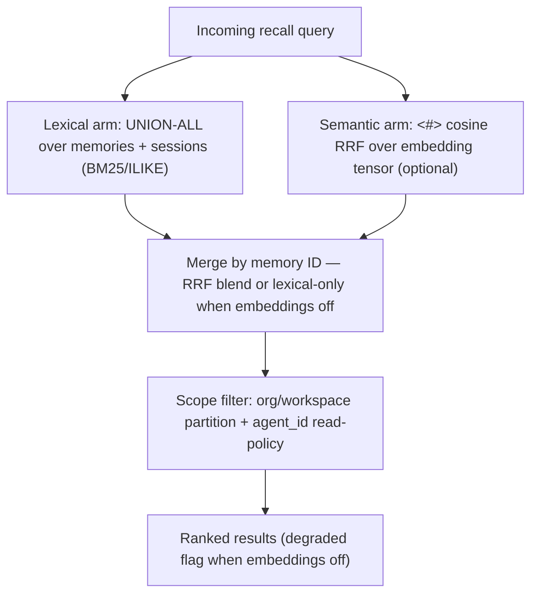

# Retrieval

> Category: Ai | Version: 1.0 | Date: June 2026 | Status: Active

How recall works: hybrid lexical + semantic candidate collection over DeepLake, the authorization boundary, GPU-backed vector search, and the virtual-filesystem browse surface.

**Related:**
- [`memory-pipeline.md`](memory-pipeline.md)
- [`session-capture.md`](session-capture.md)
- [`knowledge-graph-ontology.md`](knowledge-graph-ontology.md)
- [`../data/deeplake-storage.md`](../data/deeplake-storage.md)
- [`../data/memory-virtual-filesystem.md`](../data/memory-virtual-filesystem.md)
- [`../security/scoping-and-visibility.md`](../security/scoping-and-visibility.md)

---

## What recall has to balance

Recall has to be cheap, scoped, and current. Cheap means it cannot run a model on every query by default. Scoped means it must never return a memory the requesting agent is not allowed to see, across the org/workspace boundary and the within-workspace agent policy. Current means a superseded fact must not outrank the fact that replaced it. Honeycomb handles all three in `recallMemories` (`src/daemon/runtime/memories/recall.ts`), served by `POST /api/memories/recall`.

> **Note (PRD-045b):** An engineered five-phase `RecallEngine` (collect → traverse → authorize → shape → gate) was designed but de-scoped before production deployment. It had zero production callers, and its currentness downweighting was redundant with the append-only highest-version model already enforced by `is_deleted`, version columns, and PRD-008 supersession. The phases described below are what `recallMemories` actually does; see `src/daemon/runtime/recall/CONVENTIONS.md` for the de-scope rationale.

## Lexical arm

`recallMemories` runs a `UNION ALL` over the `memories` table (distilled facts) and the `sessions` table (raw dialogue rows), using BM25-style full-text search when the DeepLake index is present or falling back to `ILIKE` when it is not. Every value interpolated into the query passes through the `sqlStr`/`sqlLike`/`sqlIdent` helpers because the DeepLake query endpoint has no parameterized queries.

## Semantic arm and embeddings

When embeddings are enabled, the query is embedded with the nomic embed daemon (768-dim `nomic-embed-text-v1.5`) and the result is merged with the lexical arm via Reciprocal Rank Fusion (`<#>` cosine operator). When embeddings are off or fail, `recallMemories` returns a `degraded: true` flag and falls back to lexical-only results — recall still works, it is just not semantic. Vectors are stored as DeepLake tensor columns and searched on the GPU-backed engine, so the semantic filter and the scope filter run in one query rather than a separate vector index. An embedding tracker heals missing or stale vectors in the background, outside any write path.

## Authorization

The org and workspace partition is enforced at the storage layer via the `QueryScope` passed to every `recallMemories` call. Within a workspace, the `agent_id` read-policy clause (built by `buildScopeClause` in `src/daemon/runtime/recall/scope-clause.ts`) enforces the three read policies: `isolated`, `shared`, and `group`. No content-bearing column is returned before these filters are applied. The scope enforcement is documented in [`../security/scoping-and-visibility.md`](../security/scoping-and-visibility.md).

## Currentness

Superseded attributes are kept off the recall result set by the append-only model itself: the `is_deleted` flag on memory rows and the `status = 'superseded'` column on entity attributes exclude stale versions at query time. A higher-version attribute in the same claim slot outranks the one it replaced because readers always resolve by `MAX(version)`. This ties directly to the ontology in [`knowledge-graph-ontology.md`](knowledge-graph-ontology.md).

## The browse surface

Beyond scored recall, agents can browse memory as a virtual filesystem: ordinary shell commands against the memory mount, intercepted and routed to scoped queries over the `sessions` and `memory` tables. This is the read surface carried from Hivemind, and it gives explicit, agent-driven recall that bypasses the inject-on-confidence rule. The dispatch and path conventions are documented in [`../data/memory-virtual-filesystem.md`](../data/memory-virtual-filesystem.md). Either way, scored recall or browse, the same authorization boundary applies before any content is returned.
