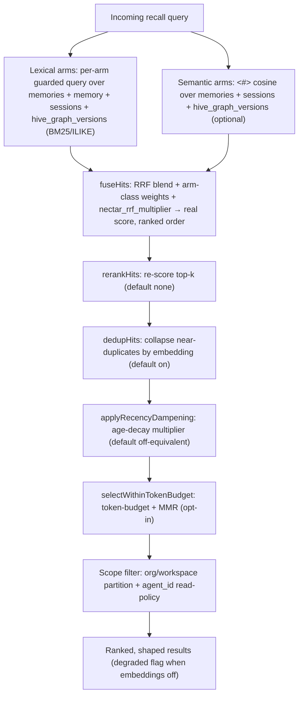

# Retrieval

> Category: Ai | Version: 2.4 | Date: July 2026 | Status: Active

How recall works: hybrid lexical + semantic candidate collection over DeepLake, RRF fusion, the reranker/dedup/recency/MMR shaping stages (including the `cohere` provider reranker via the Portkey gateway), the per-turn fast path with its read/write client split and in-daemon local ANN index, the authorization boundary, the virtual-filesystem browse surface, and the nDCG eval harness that gates every ranking change.

**Related:**
- [`memory-pipeline.md`](memory-pipeline.md)
- [`session-capture.md`](session-capture.md)
- [`session-priming-architecture.md`](session-priming-architecture.md)
- [`knowledge-graph-ontology.md`](knowledge-graph-ontology.md)
- [`hybrid-sql-vector-rationale.md`](hybrid-sql-vector-rationale.md)
- [`deeplake-hybrid-record-operator-report.md`](deeplake-hybrid-record-operator-report.md)
- [`portkey-gateway.md`](portkey-gateway.md)
- [`../security/portkey-privacy-tier.md`](../security/portkey-privacy-tier.md)
- [`../data/deeplake-storage.md`](../data/deeplake-storage.md)
- [`../data/memory-virtual-filesystem.md`](../data/memory-virtual-filesystem.md)
- [`../security/scoping-and-visibility.md`](../security/scoping-and-visibility.md)
- [`../storage/deeplake-recall-and-capture-findings-2026-07-10.md`](../storage/deeplake-recall-and-capture-findings-2026-07-10.md)

---

## What recall has to balance

Recall has to be cheap, scoped, current, and *shaped*. Cheap means it cannot run a model on every query by default. Scoped means it must never return a memory the requesting agent is not allowed to see, across the org/workspace boundary and the within-workspace agent policy. Current means a superseded fact must not outrank the fact that replaced it. Shaped means the few results that reach the agent's context are the *distinct, fresh, relevant* ones, not five paraphrases of one fact, not a six-month-old claim above last week's. Honeycomb handles all four in `recallMemories` (`src/daemon/runtime/memories/recall.ts`), served by `POST /api/memories/recall` (`src/daemon/runtime/memories/api.ts:405` is the sole production caller).

> **Note (PRD-045b):** An engineered five-phase `RecallEngine` (collect → traverse → authorize → shape → gate) was designed but de-scoped before production deployment. It had zero production callers, and its currentness downweighting was redundant with the append-only highest-version model already enforced by `is_deleted`, version columns, and PRD-008 supersession. The pipeline described below is what `recallMemories` actually does; see `src/daemon/runtime/recall/CONVENTIONS.md` for the de-scope rationale.

## Semantic recall is the default, not the dark path (PRD-025)

A fresh `honeycomb login` user gets hybrid lexical + 768-dim semantic recall out of the box. This was not always true: the daemon once shipped a `noopEmbedClient` default seam, so every stored row landed with a NULL `content_embedding` and every recall printed `(lexical fallback)`. PRD-025 inverted that posture:

- **Embeddings are on by default.** `HONEYCOMB_EMBEDDINGS` is opt-*out*: unset/`true`/`1` is on, only an explicit `false`/`0` turns it off. `honeycomb login` provisions and owns the embed daemon (~600 MB `nomic-embed-text-v1.5`, 768-dim, downloaded once and warmed in the background), so the `<#>` cosine path is the default a real user hits.
- **The store path populates the vector.** The default `embed` seam is the real `createEmbedAttachment`, so a deliberately-stored memory and a captured turn both land with a real 768-dim `FLOAT4[]` embedding. The dim invariant (`EMBEDDING_DIMS = 768` in `src/daemon/storage/vector.ts` ↔ the schema `FLOAT4[]` columns ↔ the model output) is locked end-to-end; a non-768 vector is rejected to NULL, never silently written.
- **The `degraded` flag is honest.** Recall returns `degraded: false` when the semantic arm actually ran, and `degraded: true` only on genuine fallback, embeddings explicitly off, model still warming, embed daemon unreachable/crashed, a per-call timeout, or a malformed response. In every degraded case recall still answers with the BM25/ILIKE arms. **Recall never throws and never hangs on the embed path**, a degraded answer beats a 500 for an agent's turn (PRD-047 D-7 preserves this; no stage may turn the fallback into a throw).

## Lexical arms

`recallMemories` runs **four** lexical arms, one per table a memory can live in, using BM25-style full-text search when the DeepLake index is present and falling back to `ILIKE` when it is not:

- `memories` (durable distilled facts), via `buildMemoriesArmSql`.
- `memory` (per-session summaries), via `buildMemoryArmSql`.
- `sessions` (raw dialogue rows), via `buildSessionsArmSql`.
- `hive_graph_versions` (Nectar's LLM-minted file descriptions, PRD-013a), via `buildHiveGraphVersionsArmSql`.

The `sessions` arm reads a clean **prose** column, not the raw JSONB envelope (PRD-074, PR #249). Before this, three of the four arms already returned clean TEXT (`memories`, `memory`, `hive_graph_versions`) while `sessions` was the lone holdout: it cast the JSONB `message` envelope to `::text` and shipped an escaped JSON blob into the harness context, so a `Read` tool call that carried ~80 chars of signal surfaced as ~400 chars of quoted JSON. PRD-074 adds a `prose TEXT NOT NULL DEFAULT ''` column to the `sessions` table (heal-safe, mirroring the additive PRD-060a pattern), populated at capture time by `buildRow` via `proseForEvent`: a `user_message` / `assistant_message` row stores `event.text` verbatim, a `tool_call` row stores a file-path-aware line 1 plus a bounded response slice. The lexical (`ILIKE`) `sessions` arm now matches and returns `prose` with a `COALESCE` fallback so a legacy row written before the column existed still recalls from whatever text it has. The capture side is documented in [`session-capture.md`](session-capture.md); the column itself is in [`../data/schema.md`](../data/schema.md).

Each arm is its **own** separately-guarded `storage.query` rather than one `UNION ALL`, precisely so a missing sibling table degrades *that arm* to empty rather than 500-ing the whole recall. On a fresh workspace the store's heal-on-insert creates `memories`, but `memory`, `sessions`, and `hive_graph_versions` may not exist yet; a single `UNION ALL` would fail as a whole and silently wipe the real `memories` hit (the live dogfood bug), so per-arm isolation is load-bearing. Recall still fails-soft overall: every arm failing yields an empty result, never a 500. Every value interpolated into a query passes through the `sqlStr`/`sqlLike`/`sqlIdent` helpers because the DeepLake query endpoint has no parameterized queries.

The `hive_graph_versions` arm (`buildHiveGraphVersionsArmSql`) mirrors `buildMemoriesArmSql` but carries three load-bearing predicates that fit the corpus's append-only version-chain shape. First, a **latest-per-nectar** `INNER JOIN` on a `MAX(seq)` subquery grouped by `nectar` collapses a file's version chain to its one current row, so a file edited fifty times does not flood recall with fifty near-duplicates. Second, a `describe_status = 'described'` filter excludes `pending`, `failed`, and `skipped` rows, so a file never described does not surface. Third, the shared `buildProjectScopeConjunct` project-scope segment is ANDed into both the subquery and the outer row so a cross-project file is filtered server-side and never enters the fusion. The arm keys on `nectar` (the stable file identity), matches over `title`, `description`, and `concepts`, and projects `described_at` as the uniform `created_at` the recency dampener reads.

## Semantic arms and embeddings

When embeddings are enabled, the query is embedded with the nomic embed daemon and a `<#>` cosine arm runs over the tables in the `SEMANTIC_ARMS` set, scored as a normalized cosine `((1 + (emb <#> vec)) / 2)` in `[0,1]`. Three tables carry a 768-dim `embedding`-class vector column and therefore a semantic arm: `memories` (`content_embedding`), `sessions` (`message_embedding`), and `hive_graph_versions` (`embedding`, PRD-013b). The `memory` summaries table has no embedding column, so it is a lexical-only arm. Each semantic arm runs through the same 768-dim dim guard as the store path, pairs with its lexical counterpart on a shared id space (`hive_graph_versions` fuses lexical and semantic hits on `source+nectar`), and stays **per-arm fail-soft**: a missing or empty table yields `[]` for that arm rather than a 500. Vectors are stored as DeepLake tensor columns, and the semantic filter and the scope filter run in one SQL statement. That statement is not an indexed lookup, though. A live investigation on 2026-07-09/10 established that DeepLake exposes no ANN/vector-index primitive (`CREATE INDEX ... USING vector` and `USING hnsw` are hard-rejected; `deeplake_index` is BM25/text-only), so `<#>` is an unavoidable brute-force full-column scan, measured at ~2.6s server exec for ~2,004 rows and linear in corpus size. This is the structural reason the per-turn path serves its `memories` semantic arm from an in-daemon index instead of this SQL scan (see the local ANN index below). An embedding tracker heals missing or stale vectors in the background, outside any write path.

## RRF fusion and provenance-forward ranking (PRD-027)

Recall hits carry a **real, comparable score**, and results are ordered by relevance, not by arm order, and never by a client-side fabrication (the old dashboard `1 - i*0.06` fake is gone). `fuseHits` blends the per-arm ranked lists with **Reciprocal Rank Fusion** (`RRF_K = 60`), scale-free so it needs no BM25↔cosine calibration. Two shaping rules ride the fusion:

- **Arm-class weights** fold provenance into the rank: distilled `memory` summaries weight 1.0, raw `session` rows weight 0.4, so a raw tool-call blob needs a materially stronger signal to outrank a clean distilled fact. Distilled facts above raw dumps is the product-correct order.
- **Identity dedup** collapses the same `source+id` across arms, and every hit keeps its `source` + scope provenance.

This ranking was not adopted on faith. PRD-027 shipped the golden-set eval harness (`npm run eval:recall`) that *measures* the lift, and PRD-025's semantic-on claim is defended against it, not asserted.

### The `nectar_rrf_multiplier` tuning knob (PRD-013a, decision #17)

The arm-class weight is a per-`RecallKind` constant with no per-`RecallSource` seam, so it cannot on its own dial `hive_graph_versions` file-description hits down relative to session and memory hits. The operator-tunable `nectar_rrf_multiplier` fills that gap: it is a single scalar folded into `fuseHits` that multiplies **only** the `hive_graph_versions` arm's RRF contribution (`ARM_CLASS_WEIGHT[kind] * multiplier / (RRF_K + rank)`); every other source keeps a fixed `1`, so a mount that leaves it at the default is byte-identical to the pre-013a fusion for the other arms. An operator who finds Nectar descriptions crowding out session memory can dial them down, or up, without retuning the shared class weight.

It is threaded through `assemble` like the reranker seam, and read **once at boot** (never per request) from `~/.honeycomb/nectar.json` (key `recall.nectar_rrf_multiplier`). The read is fail-soft: a missing file, malformed JSON, an absent key, or a non-numeric value all resolve to the `1.0` default and never throw on the recall hot path. A finite value is clamped to `[0, 10]`, so a negative or absurd value clamps rather than inverting or exploding the fusion, and the resolved value is logged once at boot when it differs from `1.0` so a surprising recall mix is diagnosable from the boot log alone. A change takes effect on the next daemon restart, mirroring the registry hot-add posture: no file watch. The engine re-clamps defensively at fusion time.

## Why not the native hybrid operator (PRD-047a)

DeepLake ships a native `deeplake_hybrid_record` operator that fuses vector + BM25 in one statement. Honeycomb does **not** use it, and a future agent reading "hybrid" must not reach for it. A live A/B (2026-06-22) found it returned a degenerate constant-zero score for every row, near-random ordering, recall@5 ≈ 0.14-0.17 versus RRF's 0.72-0.78, weight-insensitive. A 2026-06-24 re-run found the vendor had fixed the operator, but it only *ties* RRF (recall@5 0.611 each) without beating it, so the adoption gate (tie-or-beat on recall@5 AND MRR) is still not cleared. RRF stays the default; `src/daemon/runtime/memories/hybrid-recall.ts` is kept as an unwired live reference. Full detail in [`deeplake-hybrid-record-operator-report.md`](deeplake-hybrid-record-operator-report.md) and ADR-0001. "Hybrid" here means **SQL for structure + vector for similarity, fused in our own RRF**, not the DB's native operator.

## The shaping stages: rerank, dedup, recency, MMR (PRD-047)

Above the RRF floor, `recallMemories` runs four shaping stages in a fixed order, **fuse → rerank → dedup → recency → optional budget+MMR**, each wired into the live pipeline behind an *honest default* tuned (or measured neutral) on the golden set. The defaults are deliberately conservative: the engine ships the behavior that measurably helps and leaves the rest opt-in.

| Stage | Function | Default | What it does |
|---|---|---|---|
| **Reranker** | `rerankHits` | `none` (RRF order unchanged) | Re-scores the top-k. Strategies (`RERANKER_STRATEGIES`): `embedding-cosine` (local in-process cosine of the query against candidate embeddings, recovering the magnitude RRF discards, 300ms budget), `cohere` (Cohere via the Portkey gateway, PRD-063c, see below), and `none`. Timeout-budgeted; on timeout it keeps the prior order. Default `none` after a measured ~0 lift, the stage is real and wired, just dormant by default. |
| **Semantic dedup** | `dedupHits` | **on** | Collapses near-duplicate hits whose embeddings exceed a similarity threshold, keeping the highest-provenance copy (memory > summary > session). The same fact stored as a kept memory, a summary, and several raw turns surfaces *once*. Fail-soft to the un-deduped list. |
| **Recency dampening** | `applyRecencyDampening` | off-equivalent (half-life ≈ 100 years) | A multiplicative age-decay on the fused score, demotes stale rows, never a hard cutoff, never drops a row by age. Applied *last* among score adjustments so it can't disturb dedup's provenance keep-decision. Shipped with a near-infinite default half-life so it is neutral until a caller tunes it. |
| **Token-budget + MMR** | `selectWithinTokenBudget` | opt-in (engages only on a positive `tokenBudget`) | Fills a token budget with a Maximal-Marginal-Relevance selection, trading a little pure relevance for diversity so a result set of near-paraphrases gets diversified. With no budget the unchanged fixed top-k path runs, back-compat by construction. |

The reranker, dedup, and recency knobs were once orphaned scaffolding inherited from the deleted PRD-007 engine; PRD-047 wired them into `recall.ts` as real stages and re-homed the config. Every wave landed behind the eval (a change that drops recall@5/MRR below `baseline − ε` fails), so the defaults reflect *measured* behavior, not guesses.

### The `cohere` provider reranker (PRD-063c)

The first NON-local reranker strategy. When the operator selects `cohere` (`HONEYCOMB_RECALL_RERANKER=cohere`) **and** the optional Portkey gateway is on, `rerankWithCohere` sends the query plus the fused top-N candidate texts to Cohere through Portkey's `POST /v1/rerank` and re-orders by the returned `relevance_score`. The transport (`src/daemon/runtime/recall/rerank-portkey.ts`) reuses the inference gateway's host, headers, and `${SECRET_REF}` resolver, so recall never sees the key. The rerank model defaults to `rerank-v3.5` (`DEFAULT_RERANKER_COHERE_MODEL`), env-overridable, and ultimately governed by the operator's Portkey config.

Two invariants keep it safe to ship dormant. First, the **double gate**: the `cohere` branch fires ONLY when the strategy is `cohere` AND assembly injected the `cohereRerank` seam (which it does only when the gateway is on). A `cohere` strategy with the gateway off has no seam and degrades to the RRF order; every other strategy is byte-identical to the pre-063c path. Second, **fail-soft**: the call is a bounded `Promise.race` against a distinct PROVIDER timeout (`DEFAULT_RERANKER_PROVIDER_TIMEOUT_MS = 1000`, vs the 300ms local-cosine budget), and any timeout, HTTP error, unreachable gateway, malformed response, or missing key silently keeps the local RRF order. A rerank failure also flips the shared `reasons.portkey` health signal via `recordPortkeyUnreachable`. Crucially, `cohere` egresses recall *content* to a third party, so it carries a privacy trade-off the local strategies do not, see [`../security/portkey-privacy-tier.md`](../security/portkey-privacy-tier.md) and [`portkey-gateway.md`](portkey-gateway.md). Default-ON is gated behind a live recall-quality eval.

## The per-turn fast path (PRD-077)

`recallMemories` is the heavy, dashboard-facing ranking path: roughly 10 to 15 DeepLake round-trips (IDs-then-hydrate semantic arms, dedup embedding fetch, optional rerank, lifecycle) behind a shared concurrency cap. That is acceptable for a dashboard poll a human waits on, and fatal for the always-on per-turn injector, which has a roughly 3s budget before the harness renderer aborts. Shipped in PRD-076a, the per-turn injector was in fact inert in every session (BUG-17): `injectedRefs` was empty everywhere and `/api/memories/recall` ran p50 near 40s with a tail past 25 minutes, so the renderer timed out before recall ever answered. PRD-077 splits the hot lane from the dashboard lane.

`recallFast` (`src/daemon/runtime/memories/recall.ts`) runs the same arms as the heavy path (`memories`, `memory`, `sessions`, `hive_graph_versions`; semantic plus lexical) but content-inline and in parallel, so it costs one wall-clock round-trip, then fuses with the same `fuseHits` RRF plus recency. It drops only the hydrate hop, the dedup embedding fetch, the off-in-prod rerank, and the dormant lifecycle stages; RRF, recency, and the full cross-table breadth are preserved. A `fast: true` selector on `RecallBodySchema` routes the per-turn renderer to it, and the heavy `recallMemories` ranking is untouched.

Two isolation guarantees keep the hot lane from starving:

- **Read/write client split (PRD-077 B2).** The single shared `StorageClient` behind one process-wide `Semaphore(5)` was the real bottleneck: capture appends, dashboard polls, heal, and recall arms all competed for five slots, and capture writes starved the recall arms. The daemon now builds two in-process clients, a read client (`Semaphore(5)`: recall, dashboard, heal, prime) and a dedicated write client (`Semaphore(3)`: capture appends only, tunable via `writeMaxConcurrency`). A saturated write client can no longer consume read slots.
- **Server-side deadlines and load-shedding (PRD-077 B).** An additive `QueryOptions.signal` threads an `AbortController` from client to transport to fetch, so a lane can bound the entire query, including the wait for a pool slot, not just execution. The fast lane cuts at roughly 3s and returns whatever settled (partial, degraded, slot freed) rather than hanging; the heavy lane cuts at roughly 15s. A dedicated `fastRecallPool` plus queue-depth load-shedding (the `recall.shed` event carries subsystem state only, never query text) sheds the fast lane under a dashboard burst. Live-verified, `recall.timing armsMs` dropped from 73,273 to 3,012, and `DEFAULT_RECALL_TIMEOUT_MS` moved from 2500 to 4000.

## The in-daemon local ANN index (PRD-078)

Bounding the fast lane made recall *bounded* but it still returned zero hits, because the semantic query itself overran the budget. The 2026-07-09/10 investigation established the structural cause on the production `apiary` workspace: DeepLake has no ANN/vector-index primitive, so the `<#>` cosine over the 768-dim `content_embedding` is a brute-force full-column scan at roughly 2.6s for ~2,004 rows and linear in corpus size (100k rows is roughly 2 minutes). No client-side or server-side tuning fixes that; vector search has to move off DeepLake. The same probes confirmed `<#>` is true, scale-invariant cosine, correcting a false "negative inner product" code comment that a naive fix would have inverted. The full record, with measurements, standing theories, and the disproven diagnostic dead-ends, lives in [`../storage/deeplake-recall-and-capture-findings-2026-07-10.md`](../storage/deeplake-recall-and-capture-findings-2026-07-10.md).

PRD-078 moves vector search into the daemon. `InMemoryLocalVectorIndex` (`src/daemon/runtime/memories/local-vector-index.ts`) holds `id → { Float32Array(768), content, createdAt, projectId, isDeleted }` with content stored inline, so the fast path needs zero DeepLake round-trips. It is cold-built on boot by paging the embedded `memories` through the read client, fire-and-forget off the hot path; until the index is `ready`, `recallFast`'s `memories` semantic arm falls back to the `<#>` SQL. Once ready, that arm scores a flat in-RAM cosine (sub-100ms) through the shared `deeplakeCosineScore` scorer, so the `((1 + cos) / 2)` normalization, the PRD-049b project scope, and the `ScoredId` and row shape stay byte-identical to the SQL path, and RRF plus recency are unchanged. A kill-switch flag `HONEYCOMB_LOCAL_ANN_INDEX` (default on) reverts to the pure `<#>` fallback.

Two hardening notes matter for a future reader. First, on a deadline cut the fast path fuses the instant local-index rows with any DeepLake arms that settled, rather than discarding the local hits (the `078a-fix`; `annHits` is added to `recall.timing`). Second, a `recall.index.built {loaded, skipped, pages, ms}` event makes population visible, which is how "index empty" is told apart from "project scope narrowed to `__unsorted__`", the actual cause of an early one-hit scare.

The live result was the first real per-turn injection of the session: the local index returned the identical top-5 ranking to DeepLake's `<#>`, scored identically, sub-100ms, and independent of cloud latency. What it can return is still bounded by what is actually stored, and captures dropped during a DeepLake degraded window (appends that time out past the 10s statement bound, no retry yet) remain the open backend-health gap tracked in the findings doc. Freshness beyond the boot cold-build (write-through on new `memories`, an `updated_at` watermark pull for fleet writes, eviction, and HNSW past roughly 100k vectors) is drafted as PRD-078b/c and not yet built.

## Authorization

The org and workspace partition is enforced at the storage layer via the `QueryScope` passed to every `recallMemories` call. Within a workspace, the `agent_id` read-policy clause (built by `buildScopeClause` in `src/daemon/runtime/recall/scope-clause.ts`) enforces the three read policies: `isolated`, `shared`, and `group`. No content-bearing column is returned before these filters are applied. The scope enforcement is documented in [`../security/scoping-and-visibility.md`](../security/scoping-and-visibility.md).

## Currentness

Superseded attributes are kept off the recall result set by the append-only model itself: the `is_deleted` flag on memory rows and the `status = 'superseded'` column on entity attributes exclude stale versions at query time. A higher-version attribute in the same claim slot outranks the one it replaced because readers always resolve by `MAX(version)`. Recency dampening (above) is a *soft* freshness signal layered on top of this *hard* version invariant, the two are complementary, not redundant. This ties directly to the ontology in [`knowledge-graph-ontology.md`](knowledge-graph-ontology.md).

## Measuring recall: the nDCG eval harness (PRD-027 + PRD-047f)

Every ranking change is provable on a committed golden set, not vibed. The harness (`src/eval/golden.ts` `runEval`, scriptable as `npm run eval:recall` and as a gated live itest against a real embed daemon) scores a hand-curated set of `(query → expected memory)` pairs, deliberately including *lexical-miss* pairs with no surface-token overlap, so the set actually exercises the semantic lift. Metrics live in `src/eval/metrics.ts`:

- **recall@k** (k = 1, 5, 10), the headline product question: did we surface the right memory at all?
- **MRR**, how high did the first relevant hit rank?
- **nDCG@10** (`ndcgAtK`), a position-discounted, graded-relevance metric so the rank-order improvements from rerank/recency/MMR are *visible*, not just pass/fail. PRD-047f upgraded the harness to graded relevance and made nDCG@10 a gating-eligible metric.

nDCG here is **dedup-invariant**: a relevance-CLASS map (`RelevanceClasses`) credits duplicate copies of the same fact once, so the metric scores the same whether or not the engine collapses near-duplicates, which is exactly what lets the dedup stage be measured honestly. A committed baseline (`recall@5` / `MRR`) is enforced: a change that regresses it fails the eval.

## Planned: read-time chunking and on-demand recall (not yet shipped)

Two forward-looking arcs are recorded but **not yet implemented**; a future agent should treat them as design, not behavior.

- **Sessions recall chunking (ADR-0009, PR #251).** The prose column (PRD-074, above) surfaced the next gap: a matched term past ~character 500 of a long prose row is invisible to the recall snippet. ADR-0009 records the decision to close it by building the chunker **in-tree** rather than pulling a chunker dependency, reusing what already exists (`chunkText` in `document-worker.ts`, `chunksFor` in `obsidian.ts`, the `document_chunk` table shape, the `codebase/extractors` tree-sitter tree, and the `@huggingface/transformers` tokenizer). The planned work splits into PRD-075 (read-time windowing plus a `matchRange`) and PRD-076 (capture-time chunking for `sessions` and nectar descriptions). The ADR is committed; the code is not.
- **On-demand PreToolUse recall (PRD-075 command surface, PR #260, Backlog).** Today recall is bound to `SessionStart` (a blind, stale, keyed-on-nothing dump) while `UserPromptSubmit` is `async: true` (capture-only, its stdout never injected). The highest-signal surface, the synchronous `PreToolUse` VFS intercept, already exists but is stubbed at three points: `runtime.ts:252` passes no `vfs` so `createFakeVfsIntercept()` is used, `pre-tool-use.ts:96` ignores its deps, the intercept decision is discarded, and the Claude Code shim has no pre-tool decision renderer. The Backlog PRD-075 spec would light this up for prompt-conditioned recall with zero added latency on turns the agent does not ask, and add a `honeycomb recall "<query>"` sentinel plus a SessionStart awareness notice. **Docs-only so far: no code has shipped.**

## The browse surface

Beyond scored recall, agents can browse memory as a virtual filesystem: ordinary shell commands against the memory mount, intercepted and routed to scoped queries over the `sessions` and `memory` tables. This is the read surface carried from Hivemind, and it gives explicit, agent-driven recall that bypasses the inject-on-confidence rule. It is also the *mine* half of the session-priming pull path (see [`session-priming-architecture.md`](session-priming-architecture.md)): `hivemind_search` routes here. The dispatch and path conventions are documented in [`../data/memory-virtual-filesystem.md`](../data/memory-virtual-filesystem.md). Either way, scored recall or browse, the same authorization boundary applies before any content is returned.
