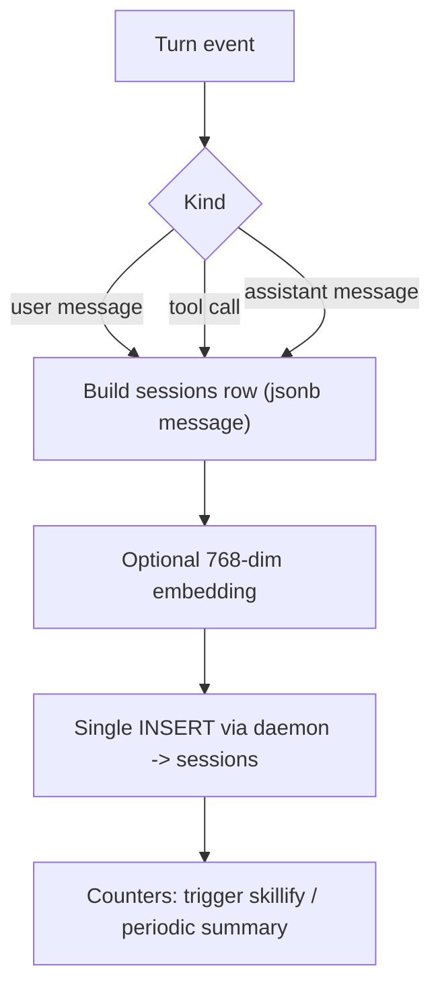

# Session Capture

> Category: Ai | Version: 1.0 | Date: June 2026 | Status: Active

The input layer: how every prompt, tool call, and response becomes a durable raw event that feeds the distillation pipeline, and the guards that keep capture cheap and safe.

**Related:**
- [`memory-pipeline.md`](memory-pipeline.md)
- [`wiki-summary-workers.md`](wiki-summary-workers.md)
- [`retrieval.md`](retrieval.md)
- [`../architecture/request-lifecycle.md`](../architecture/request-lifecycle.md)
- [`../integrations/hook-lifecycle.md`](../integrations/hook-lifecycle.md)
- [`../data/schema.md`](../data/schema.md)

---

## Why capture is its own layer

Honeycomb's engine distills memory, but distillation needs raw material, and that material has to be captured the instant it happens, before any model runs. Capture is the cheap, always-on front of the system: it records what the agent did as structured events, commits them durably, and gets out of the way. Everything smart, extraction, the knowledge graph, summaries, skill mining, happens afterward in daemon workers off the turn path. This is the input half of the request lifecycle in [`../architecture/request-lifecycle.md`](../architecture/request-lifecycle.md).

Capture is the part of Honeycomb that came directly from Hivemind, where it was already proven across many harnesses, and it now feeds Otherhive's pipeline instead of only powering wiki summaries.

## One INSERT per event

Each turn produces events of three kinds: a user message, a tool call, and an assistant message. Capture writes exactly one row per event into the `sessions` table and never concatenates into an existing row. The single-INSERT rule is deliberate: concatenation was the source of a write race the summary worker once hit, and appending discrete rows sidesteps it entirely. A conversation is the set of `sessions` rows that share a `path`, read back ordered by `creation_date`.

The `message` column is `JSONB` because each event is a structured payload (prompt text, tool input, tool response), and storing it as structured JSON keeps the original shape intact for later extraction. The capture call goes to the daemon, which owns the write to DeepLake; the shim never touches storage directly. The table shape is documented in [`../data/schema.md`](../data/schema.md).

## Optional embeddings

If embeddings are enabled, capture attaches a 768-dimension `nomic-embed-text-v1.5` vector to the row's `message_embedding` column. Embedding is optional and non-blocking: when it is disabled or fails, the column is left null and the event is still captured and still lexically searchable. The embedding daemon and the GPU-backed vector search that consumes these vectors are documented in [`retrieval.md`](retrieval.md).

## Guards

Capture runs on every turn, so it has to be defensible. Several guards gate it. A capture switch (`HONEYCOMB_CAPTURE=false`) disables it outright. A plugin-enabled check skips capture when the integration is turned off. An entrypoint check ensures only the intended hook process captures. A recursion guard keeps the summary and skillify workers, which themselves run the harness CLI, from capturing their own activity as new turns. Hooks must also fail soft: if capture errors, the hook exits cleanly rather than breaking the agent's turn. These guards live in the shim layer documented in [`../integrations/hook-lifecycle.md`](../integrations/hook-lifecycle.md).

## What capture triggers

Capture is also where the background workers get their cues. Per-turn counters trigger the skillify miner every N turns and the summary worker on a message or time threshold, both queued to run in the daemon. Capture does not run them inline; it records the event, bumps the counter, and lets the daemon schedule the work. The summary worker is documented in [`wiki-summary-workers.md`](wiki-summary-workers.md) and the miner in [`skillify-pipeline.md`](skillify-pipeline.md).

## Feeding the pipeline

The raw `sessions` rows are the pipeline's input. The extraction stage reads recent in-scope session events, decomposes them into facts and entity triples, and the decision stage decides what to keep, producing the distilled `memories` rows that recall ranks over. Capture and distillation are intentionally decoupled: capture is synchronous and durable, distillation is asynchronous and resumable, so a slow extractor never costs a captured event. The pipeline is documented in [`memory-pipeline.md`](memory-pipeline.md).
