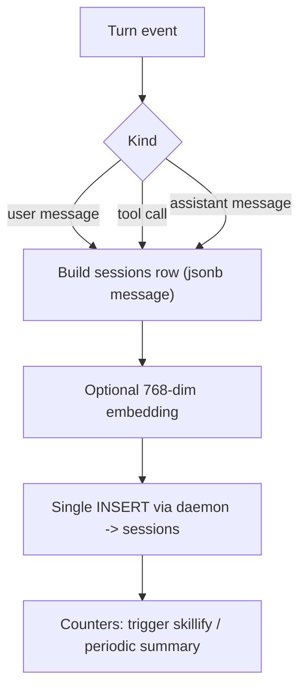

# Session Capture

> Category: Ai | Version: 1.4 | Date: July 2026 | Status: Active

The input layer: how every prompt, tool call, and response becomes a durable raw event that feeds the distillation pipeline, and the guards that keep capture cheap and safe.

**Related:**
- [`memory-pipeline.md`](memory-pipeline.md)
- [`wiki-summary-workers.md`](wiki-summary-workers.md)
- [`retrieval.md`](retrieval.md)
- [`../architecture/request-lifecycle.md`](../architecture/request-lifecycle.md)
- [`../integrations/hook-lifecycle.md`](../integrations/hook-lifecycle.md)
- [`../data/schema.md`](../data/schema.md)

---

## Why capture is its own layer

Honeycomb's engine distills memory, but distillation needs raw material, and that material has to be captured the instant it happens, before any model runs. Capture is the cheap, always-on front of the system: it records what the agent did as structured events, commits them durably, and gets out of the way. Everything smart, extraction, the knowledge graph, summaries, skill mining, happens afterward in daemon workers off the turn path. This is the input half of the request lifecycle in [`../architecture/request-lifecycle.md`](../architecture/request-lifecycle.md).

Capture is the part of Honeycomb that came directly from Hivemind, where it was already proven across many harnesses, and it now feeds our memory engine's pipeline instead of only powering wiki summaries.

## Dormant by default, gated on a bound project

Capture no longer runs for an unbound session. As of PR #232, capture, skillify, and every write pipeline are gated on the session cwd resolving to a **BOUND project**, mirroring nectar's activation contract: if the working directory does not map to a bound project, capture does not fire. This is the opposite of the old always-on default, and it is deliberate: an unbound session has no tenant to attribute memory to, so recording it would either drop the rows or scatter them into the wrong scope.

The old catch-all `__unsorted__` inbox is now **opt-in**. It is enabled only when `HONEYCOMB_INBOX_CAPTURE` is set (default **off**), so unbound work is silently not captured unless an operator explicitly asks for the inbox. Tenancy must also be confirmed for capture to fire; the explicit org/workspace selection that unblocks capture is described in [`../multi-tenant/org-workspace-model.md`](../multi-tenant/org-workspace-model.md) and [`../auth/device-and-fleet-enrollment-state-machine.md`](../auth/device-and-fleet-enrollment-state-machine.md).

Dormancy is surfaced honestly rather than hidden. `/health` reports the dormant state so an operator can see at a glance that the daemon is up but capture is intentionally idle, and the hook exits report dormancy too, so a "nothing is being captured" situation reads as a deliberate gate, not a silent failure. The gating and config live in `capture/{attach,capture-config,capture-handler,gated-captures}.ts` and the shim entry in `hooks/shared/{capture,session-start}.ts`.

### The no_bound_project drop and boot-snapshot staleness

A related failure mode is worth naming because PR #236 fixed it. The daemon (and nectar) used to snapshot `~/.deeplake/credentials.json` and `projects.json` once at boot and never reload. A `project bind` or login performed **after** the daemon booted therefore never took effect: hooks still fired, but every capture was dropped as `no_bound_project`, and only `memory_jobs` materialized in Deep Lake, which looked exactly like a fleet-wide connectivity failure. PR #236 made the daemon's storage and assemble paths mtime-gated live-reloads, so a bind or login is honored on the next request without a restart. With that fix, a session that binds a project mid-run starts capturing instead of silently dropping. The daemon-side reload is documented in [`../multi-tenant/org-workspace-model.md`](../multi-tenant/org-workspace-model.md).

## One INSERT per event

Each turn produces events of three kinds: a user message, a tool call, and an assistant message. Capture writes exactly one row per event into the `sessions` table and never concatenates into an existing row. The single-INSERT rule is deliberate: concatenation was the source of a write race the summary worker once hit, and appending discrete rows sidesteps it entirely. A conversation is the set of `sessions` rows that share a `path`, read back ordered by `creation_date`.

The `message` column is `JSONB` because each event is a structured payload (prompt text, tool input, tool response), and storing it as structured JSON keeps the original shape intact for later extraction. The capture call goes to the daemon, which owns the write to DeepLake; the shim never touches storage directly. The table shape is documented in [`../data/schema.md`](../data/schema.md).

## Durable across degraded windows: the capture outbox

The daemon-side append to DeepLake is not always available. The hosted backend hibernates and flaps, and when a degraded window pushes an append past the 10s statement timeout the write fails. Before PRD-079a (PR #287, v0.11.0) that failed batch was counted, logged (`capture.batch_insert.failed {timeout}`), and then **dropped**, so a captured event the harness believed had landed was silently lost, and any memory that would have distilled from it never formed. Live measurement showed these clusters in warm windows (roughly 103 to 251s post-boot), not just on cold boot, so the loss was real in steady operation.

PRD-079a closes that gap with a durable retry-later outbox. When the DeepLake append fails, the capture path enqueues the `{row, scope}` into a dedicated `capture_outbox` table instead of dropping it, and a background drainer re-appends it once the backend recovers:

- The outbox lives inside the home-anchored `local-queue.db` (`~/.apiary/honeycomb/.daemon/`, the fleet-anchored SQLite store from PR #285), in its own table kept out of the pipeline job queue's payload guard. Because it is home-anchored it survives a daemon restart, so a window that outlasts the process still drains later. Its placement is covered in [`../data/workspace-layout.md`](../data/workspace-layout.md).
- Enqueue is keyed by the deterministic `makeRowId` id with `INSERT OR IGNORE`, so replaying a row that actually did land is idempotent (read-time dedup on the same id closes the rest). Enqueue never throws into the hot path, and the happy path is byte-unchanged.
- The drainer is an unref'd loop that re-appends on the dedicated **write** client (`Semaphore(3)`), so draining a backlog cannot starve recall. It uses bounded exponential backoff (5s base, 5min cap) and skips not-yet-due rows so it never hot-loops: a successful re-append deletes the row, a failure bumps `attempts` and pushes `next_attempt_at`.
- The whole subsystem is fail-soft: any outbox open, enqueue, or drain fault degrades to a no-op (`NULL_CAPTURE_OUTBOX`), so a broken outbox can never break capture itself, and it is behind the `HONEYCOMB_CAPTURE_OUTBOX` kill-switch (default on).

Its backlog is visible on `/health` as `captureOutbox { pending, retrying, deadLettered }` and through the secret-free `capture.outbox.*` events, described from the operator side in [`../operations/observability-and-degradation.md`](../operations/observability-and-degradation.md). The mechanics live in `src/daemon/runtime/capture/capture-outbox.ts`. This is the write-side twin of the read-side isolation work in [`retrieval.md`](retrieval.md): recall was made independent of DeepLake latency, and capture is now durable across DeepLake availability gaps.

PRD-079b/c (PR #289, v0.12.0) completed PRD-079 by hardening that outbox for terminal failure, recovery, and scale, without changing the happy path or the DeepLake schema:

- **Dead-letter for a row that can never land.** A row that reaches `maxAttempts` failed re-appends (default 10) or exceeds `maxAgeMs` in the outbox (default 24h) is moved to a terminal `dead` status: retained for a forensic read but never re-leased, so a permanently-rejected row stops consuming write slots and stops growing the active backlog. The bounds are env-overridable (`HONEYCOMB_CAPTURE_OUTBOX_MAX_ATTEMPTS` / `_MAX_AGE_MS`), and the health backlog now partitions `{ pending, retrying, deadLettered }` with dead rows excluded from the active counts.
- **Recovery-triggered drain.** A successful capture append is the "backend recovered" signal, so the capture handler kicks an immediate, single-flighted drain on every landed append rather than waiting for the 30s interval. The drainer also joined the DeepLake hibernation set, so it goes quiet during hibernation (it no longer keeps the Activeloop pod warm while idle) and re-arms plus kicks on the `deeplake.woke` wake.
- **Caps and coalescing at scale.** An active-backlog row cap (`maxRows`, default 10k) sheds the oldest pending rows oldest-first when an enqueue would exceed it, always counted via `capture.outbox.shed` rather than silently truncated. On drain, due rows are coalesced by scope and column shape into one multi-row append per group (a failed group backs off or dead-letters each member independently, so no row is lost or double-counted), and a single authoritative per-pass cap (`maxDrainPerInterval`, default 200) bounds how fast a huge backlog drains.
- **Operator force-drain.** `honeycomb capture drain` POSTs to `POST /api/diagnostics/capture-drain` (on the protected diagnostics group, open in local mode) to force one drain pass and print the `{ drained, retried, deadLettered }` counts, so an operator can flush a degraded-window backlog on demand. The re-append runs under each row's own stored scope, so a force-drain stays cross-tenant safe. The recovery mechanics are detailed in [`../storage/deeplake-recall-and-capture-findings-2026-07-10.md`](../storage/deeplake-recall-and-capture-findings-2026-07-10.md) §3.4.

## Bounded read-back

The two hot read paths that reconstruct a conversation, the VFS `cat sessions/...` concat (`buildSessionsConcatSql` in `src/daemon-client/vfs/read.ts`) and the `GET /api/hooks/conversation` read-back (`readAppendOrdered` in `src/daemon/storage/writes.ts`, called from `capture-handler.ts`), both bound the result to the most-recent `MAX_SESSION_TURNS` rows, currently `2000`. They do this with a flat `ORDER BY creation_date DESC LIMIT N` and then reverse the rows in application code back to chronological order, so the turn stream still reads oldest to newest. The bound exists because `path` is the conversation grouping key: concurrent sub-agents that share one transcript all append under the same `path`, so a fan-out swarm can drive a single session to tens of thousands of rows, each carrying a large `JSONB` `message`. Before the cap, one such session materialized hundreds of MB per read and stalled for tens of seconds. Every ordinary single-agent session is far under the cap and is returned in full, unchanged; only a pathological fan-out session is truncated to its most-recent 2000 turns.

The bound is opt-in on the read side. `readAppendOrdered` keeps its unbounded ascending path when no limit is passed, so the other append-only tables that stream every row (`memory_history`, `dependencies`, and the like) are unaffected: only the sessions read-back passes the cap.

## Optional embeddings

If embeddings are enabled, capture attaches a 768-dimension `nomic-embed-text-v1.5` vector to the row's `message_embedding` column. Embedding is optional and non-blocking: when it is disabled or fails, the column is left null and the event is still captured and still lexically searchable. The embedding daemon and the GPU-backed vector search that consumes these vectors are documented in [`retrieval.md`](retrieval.md).

## Guards

Capture runs on every turn of a bound, tenancy-confirmed session, so it has to be defensible. Several guards gate it. The bound-project gate is the first and most important: an unbound session is dormant and captures nothing (with the `__unsorted__` inbox opt-in via `HONEYCOMB_INBOX_CAPTURE`, default off, as above). A capture switch (`HONEYCOMB_CAPTURE=false`) disables it outright. A plugin-enabled check skips capture when the integration is turned off. An entrypoint check ensures only the intended hook process captures. A recursion guard keeps the summary and skillify workers, which themselves run the harness CLI, from capturing their own activity as new turns. Hooks must also fail soft: if capture errors, the hook exits cleanly rather than breaking the agent's turn, and a dormant gate exits the same clean way. These guards live in the shim layer documented in [`../integrations/hook-lifecycle.md`](../integrations/hook-lifecycle.md).

## What capture triggers

Capture is also where the background workers get their cues. Per-turn counters trigger the skillify miner every N turns and the summary worker on a message or time threshold, both queued to run in the daemon. Capture does not run them inline; it records the event, bumps the counter, and lets the daemon schedule the work. The summary worker is documented in [`wiki-summary-workers.md`](wiki-summary-workers.md) and the miner in [`skillify-pipeline.md`](skillify-pipeline.md).

## Feeding the pipeline

The raw `sessions` rows are the pipeline's input. The extraction stage reads recent in-scope session events, decomposes them into facts and entity triples, and the decision stage decides what to keep, producing the distilled `memories` rows that recall ranks over. Capture and distillation are intentionally decoupled: capture is synchronous and durable, distillation is asynchronous and resumable, so a slow extractor never costs a captured event. The pipeline is documented in [`memory-pipeline.md`](memory-pipeline.md).
