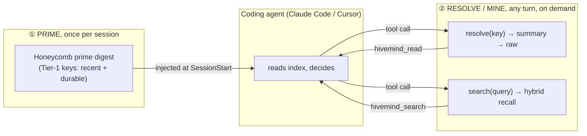
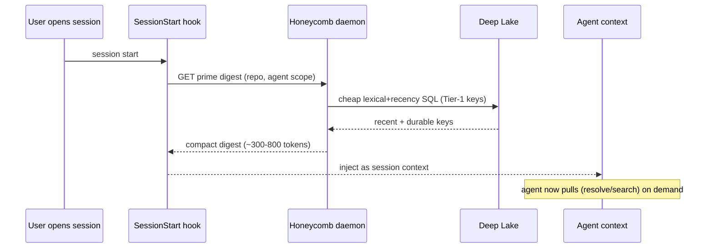

# Session Priming Architecture (push the index, pull the detail)

> Category: Ai | Version: 2.1 | Date: July 2026 | Status: Active

How a coding agent gets *primed* with Honeycomb memory: a tiny index pushed once at session start,
and a pull-on-demand resolve/search path the agent drives itself. Covers the cadence (session, not
turn), the Claude Code + Cursor wiring, the prime-digest shape, and the precedent that made this a
small addition rather than new machinery. **This is shipped behavior (PRD-046, merged #77).**

**Related:**
- [`three-tier-memory-strategy.md`](three-tier-memory-strategy.md), the zoom hierarchy this primes
- [`distillation-and-tier1-keys.md`](distillation-and-tier1-keys.md), what the pushed keys are made of
- [`hybrid-sql-vector-rationale.md`](hybrid-sql-vector-rationale.md), why the prime query is cheap
- [`skillify-pipeline.md`](skillify-pipeline.md), the session-start propagation precedent
- [`session-capture.md`](session-capture.md), the capture/recall hook lifecycle
- [`retrieval.md`](retrieval.md), the recall engine the pull path uses

---

## 1. Why this exists

Honeycomb's long-term memory is useless to the agent unless it reaches the agent's context at the
right moment, at the right size. Two failure modes bracket the design:

- **Too little:** memory sits in Deep Lake and the agent never thinks to look, so every session
  starts cold and re-derives what was already learned.
- **Too much:** memory is force-fed into every turn, adding latency and burying the live task under
  stale recall ("lost in the middle").

The resolution is a **push/pull split with a session cadence**: push a small *index* once per
session (cheap, bounded), and let the agent *pull* the detail it wants on any turn. This doc is the
mechanism; the three-tier doc is the data model it moves. The mechanism is live: the prime endpoint
(`GET /api/memories/prime`, `src/daemon/runtime/memories/prime.ts`), the Tier-1 key columns, the
resolve/mine tools, and the Claude Code + Cursor SessionStart hooks all ship today.

---

## 2. Push vs pull, and why pull wins for a coding agent



A coding agent is a *tool user*. The right way to give a tool user memory is to hand it a table of
contents and good tools, not to pre-empt its judgement by stuffing the window. The project owner's
own framing, "a compacted memory summary before the LLM gets the prompt so it can decide if it wants
to invoke Honeycomb", is exactly the pull model, and it is the better of the two options that were
on the table ("always query" being the other).

**Rule of thumb:** *push the index per session; pull the detail per turn.* Nothing is auto-injected
after the prime.

---

## 3. Cadence: session, not turn

Priming fires **once per session**, not per turn. This is deliberate:

- The prime is a *starting orientation*, like reading the last meeting's notes before a call. It
  doesn't need to refresh every turn.
- The agent pulls fresh memory on any turn it needs to, so staleness within a long session is handled
  by the pull path, not by re-priming.
- New distilled memory from the *current* session lands at session end (capture → distill), so the
  next session's prime is automatically richer. The timestream grows without per-turn cost.

A long session may eventually want a mid-session "re-prime" (e.g., after the harness auto-compacts),
but that is an optimization, not the core. The core is: one prime at the top, pull thereafter.

---

## 4. The prime digest: what gets pushed

The prime is a compact, bounded block (target ~300-800 tokens) assembled by a single cheap query. It
is a list of **Tier-1 keys** in two flavors, scoped to the current repo/project and agent:

1. **Recent timestream**, the last N distilled sessions, newest first: "what were we just doing."
   This is the "appropriate timestream" the owner wants the agent primed with.
2. **Durable facts**, the top M long-lived facts for this project (conventions, decisions, known
   gotchas) regardless of age: "what is always true here."

Each line is a key + an opaque id the resolve tool consumes. Illustrative shape (content is
generated; see the distillation doc for quality bars):

```
[Honeycomb memory, primed at session start]
Recent (this repo):
  • CI pack-step timeout, fixed via retry-on-429 wrapper          (#mem_a1)
  • Switched recall fusion to RRF; native hybrid op returns zeros  (#mem_b7)
  • Dashboard nav-shell shipped: left nav + hash router            (#mem_c2)
Durable:
  • DeepLake reads are eventually consistent, always poll to converge  (#mem_d9)
  • SQL values must route through sqlStr/sqlLike/sqlIdent (no raw interp) (#mem_e4)
To expand any item, call hivemind_read(<id>); to search memory, hivemind_search(<query>).
```

The digest is assembled by `GET /api/memories/prime` (`src/daemon/runtime/memories/prime.ts`),
attached onto the daemon's already-mounted `/api/memories` session group so it inherits the same
auth/RBAC + session gate. **Route ordering is load-bearing here (PR #255).** `/prime` is a literal
path on the same `/api/memories` group that also carries the parametric `GET /:id` memory-read route.
Hono's `RegExpRouter` matches the parametric route greedily, so if `/prime` is registered *after*
`GET /:id`, a request to `/api/memories/prime` is captured by `/:id` with `c.req.param("id") ===
"prime"`, runs `getMemory("prime")`, and returns `404 {error: "not_found"}`. The prime renderer's
fail-soft posture then swallowed that 404 and injected `{}`, so SessionStart silently received an
empty prime while every other layer looked healthy. The fix registers `/prime` **inside**
`mountMemoriesApi` **before** `/:id` (`src/daemon/runtime/memories/api.ts`), so the literal route wins;
`mountMemoriesPrimeApi` (`src/daemon/runtime/memories/prime.ts`) is retained as a standalone shim for
unit tests, and `assemble.ts` reflects the new mount order. It skims the Tier-1 `key` columns directly,
a pure SQL read with no generation at request time (see `src/daemon/runtime/summaries/prime-digest.ts`,
`prime-keys.ts`). The block is token-bounded, scoped to the repo/agent, recency-weighted, and
**deduped** so the same fact never appears twice, the prime composes with the same PRD-047c semantic
dedup and PRD-047d recency dampening the recall pipeline uses: the recent list is age-weighted, the
durable list deliberately ages slowly (the "semantic facts age slowly" idea from the prior art).

---

## 5. The pull path: resolve and mine

Two tools on the Honeycomb MCP surface:

- **`hivemind_read(id, depth?)`, resolve / zoom.** Walks a key down the tiers: key → `memory.summary`
  (or `memories.content`) → the `sessions` rows for that session. This is a SQL lookup by id, not a
  search (see hybrid-rationale doc). The *depth* semantics (summary vs raw chain) make the zoom a
  deterministic join, never a fresh recall.
- **`hivemind_search(query)`, mine.** When the agent wants memory it did not see in the index, it
  searches. This routes to the recall engine (`src/daemon/runtime/memories/recall.ts`): hybrid
  lexical + `<#>` semantic, fused with RRF and shaped by the rerank/dedup/recency/MMR stages, with a
  graceful lexical fallback when embeddings are off.

The agent decides which to call and when. The prime exists precisely so it *can* decide well, it
sees the index first, so a search is informed, not a shot in the dark.

---

## 6. Wiring Claude Code and Cursor (start here; other harnesses later)

The prime is delivered by a **session-start hook** that calls the Honeycomb daemon for the digest and
injects it as session context. Both target harnesses have the needed lifecycle event, and Honeycomb
already wires hooks into both, so this rides an existing integration, not new plumbing. The shared
session-start hook (`src/hooks/shared/session-start.ts`) fetches the prime once on the session-start
branch (never on per-turn capture), renders it verbatim via the prime seam
(`src/hooks/shared/prime-renderer.ts`), and joins it with the rules/goals context block so neither is
lost. When no prime is available yet (a cold repo) the hook injects nothing, never an error.

**The hook must return the recall within the harness timeout budget (PR #257).** Fixing the route
(PR #255) made the daemon *serve* the prime, but the SessionStart hook was still being killed before its
output reached the model: a warm-daemon profile showed the context render at 62ms and `prime.render()`
(the recall itself) ready at T+1.1s (1043ms), yet `runSessionStart` then `await`ed `autoPullSkills`
(~5005ms) and `autoPullAssets` (~2870ms) before returning, pushing the total to ~9s warm and past the
10s deadline on a cold start. Claude Code cancelled the hook (`hook_cancelled`, `durationMs 10649`,
`timeoutMs 10000`) and the recall, though computed, never landed in `additionalContext`. Two fixes ship
together:

1. **Raise the SessionStart timeout 10s → 30s.** The budget is bumped in
   `harnesses/claude-code/hooks/hooks.json` and mirrored in `src/connectors/claude-code.ts` so the
   installed hook and the connector-generated config agree.
2. **Detach the hygiene pulls so recall returns first.** `autoPullSkills`, `autoPullAssets`, and
   `spawnGraphPull` are side-effecting session hygiene (skills + assets pulls, next-session graph
   context); they never touch `additionalContext`. They are moved off the critical path into a
   fire-and-forget `backgroundPull()` (detached, wrapped in a swallow guard that tolerates both async
   rejections and synchronous throws), so `runSessionStart` returns the rendered context (rules/goals +
   prime) as soon as the recall is ready and lets the pulls finish in the background.

A third fix removes a latent race in the renderer itself: the prime renderer's fetch timeout was racing
the ~2s skim, so a slow-but-valid prime could be abandoned mid-flight; the timeout in
`src/hooks/shared/prime-renderer.ts` is widened so the recall is not cut off before it resolves.



- **Claude Code:** the `SessionStart` hook runs a command and contributes additional session
  context. Honeycomb installs capture/recall hooks here, and the prime is one more hook entry that
  emits the digest. The pull tools are the registered Honeycomb MCP server
  (`hivemind_search` / `hivemind_read` / `hivemind_index`).
- **Cursor:** Cursor 1.7+ exposes a `~/.cursor/hooks.json` lifecycle surface (multiple events) wired
  by Honeycomb's `src/cli/install-cursor.ts`, and the Honeycomb MCP server is registered for the pull
  tools. The session-start equivalent emits the same digest.

The digest endpoint and the pull tools are harness-agnostic; only the injection mechanism differs, so
additional harnesses (Codex, Hermes, pi, OpenClaw) follow the same shape, the same prime endpoint,
the same MCP tools, a per-host SessionStart entry.

---

## 7. Precedent: Honeycomb already primes at session start

This is not a new architectural pattern for Honeycomb. The **skillify propagation** path already
fires a session-start step: teammate-mined skills are `pull`/`auto-pull`-ed into a fresh session so
the agent starts with the team's learned skills. A session-start *memory* prime is structurally the
same move, a bounded, session-scoped fetch that seeds the agent before the first turn. See
[`skillify-pipeline.md`](skillify-pipeline.md). Re-using that pattern (and possibly that hook point)
keeps the prime consistent with how Honeycomb already behaves.

---

## 8. Proving it works (don't trust "feels smarter")

Priming is measured, not asserted. The same discipline that killed the native hybrid operator applies
here: a prime eval (`src/eval/prime.ts`) asks *does priming change what the agent retrieves and does,
versus a cold start?* Signals, fewer redundant searches, faster convergence on the right
file/decision, the agent referencing a primed key without being told, run against a committed
scenario set built on the PRD-047f graded-nDCG harness, and a regression below the bar fails. A prime
that the agent ignores is worse than no prime (it costs tokens for nothing), so the kill criterion is
real.

---

## Changelog

| Date | Version | Change |
|------|---------|--------|
| 2026-07-06 | 2.1 | Folded in the three-layer recall-delivery fix. PR #255: register `/prime` before `/:id` inside `mountMemoriesApi` so Hono's `RegExpRouter` stops shadowing the prime route with the parametric memory-read (the 404 that had SessionStart receiving `{}`). PR #257: raise the SessionStart timeout 10s → 30s (`hooks.json` + `src/connectors/claude-code.ts`), detach `autoPullSkills` / `autoPullAssets` / `spawnGraphPull` into a fire-and-forget `backgroundPull()` so recall returns first, and widen the prime-renderer fetch timeout so the ~2s skim is not cut off. |
| 2026-06 | 2.0 | Status → Active: PRD-046 shipped (merged #77). Prime endpoint, Tier-1 key columns, resolve/mine tools, CC + Cursor SessionStart hooks, and the prime eval are all live; rewrote in present tense and grounded the endpoint/hook/eval paths in `src/`. |
| 2026-06 | 1.0 | Initial capture of the push-prime / pull-resolve architecture and CC/Cursor wiring. |
