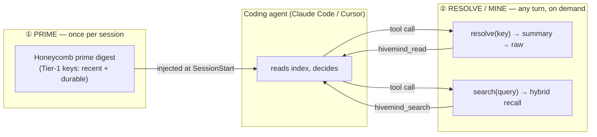
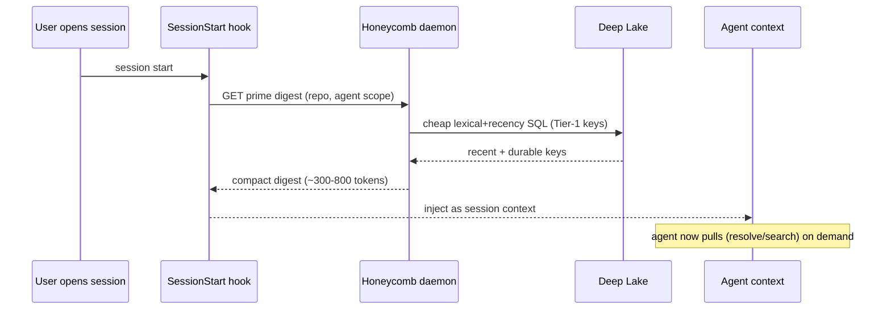

# Session Priming Architecture (push the index, pull the detail)

> Category: Ai | Version: 1.1 | Date: June 2026 | Status: Strategy — CORE BUILT (PRD-046, merged #77); extensions proposed

How a coding agent gets *primed* with Honeycomb memory: a tiny index pushed once at session start,
and a pull-on-demand resolve/search path the agent drives itself. Covers the cadence (session, not
turn), the Claude Code + Cursor wiring, the prime-digest shape, and the existing precedent that makes
this a small addition rather than new machinery. **Proposed design, not shipped behavior.**

**Related:**
- [`three-tier-memory-strategy.md`](three-tier-memory-strategy.md) — the zoom hierarchy this primes
- [`distillation-and-tier1-keys.md`](distillation-and-tier1-keys.md) — what the pushed keys are made of
- [`hybrid-sql-vector-rationale.md`](hybrid-sql-vector-rationale.md) — why the prime query is cheap
- [`skillify-pipeline.md`](skillify-pipeline.md) — the session-start propagation precedent
- [`session-capture.md`](session-capture.md) — the capture/recall hook lifecycle
- [`retrieval.md`](retrieval.md) — the recall engine the pull path uses

---

## 1. Why this exists

Honeycomb's long-term memory is useless to the agent unless it reaches the agent's context at the
right moment, at the right size. Two failure modes bracket the design:

- **Too little:** memory sits in Deep Lake and the agent never thinks to look, so every session
  starts cold and re-derives what was already learned.
- **Too much:** memory is force-fed into every turn, adding latency and burying the live task under
  stale recall ("lost in the middle").

The resolution is a **push/pull split with a session cadence**: push a small *index* once per
session (cheap, bounded), and let the agent *pull* the detail it wants on any turn. This doc is the
mechanism; the three-tier doc is the data model it moves.

---

## 2. Push vs pull — and why pull wins for a coding agent



A coding agent is a *tool user*. The right way to give a tool user memory is to hand it a table of
contents and good tools, not to pre-empt its judgement by stuffing the window. The project owner's
own framing — "a compacted memory summary before the LLM gets the prompt so it can decide if it wants
to invoke Honeycomb" — is exactly the pull model, and it is the better of the two options that were
on the table ("always query" being the other).

**Rule of thumb:** *push the index per session; pull the detail per turn.* Nothing is auto-injected
after the prime.

---

## 3. Cadence: session, not turn

Priming fires **once per session**, not per turn. This is deliberate:

- The prime is a *starting orientation*, like reading the last meeting's notes before a call. It
  doesn't need to refresh every turn.
- The agent pulls fresh memory on any turn it needs to, so staleness within a long session is handled
  by the pull path, not by re-priming.
- New distilled memory from the *current* session lands at session end (capture → distill), so the
  next session's prime is automatically richer. The timestream grows without per-turn cost.

A long session may eventually want a mid-session "re-prime" (e.g., after the harness auto-compacts),
but that is an optimization, not the core. The core is: one prime at the top, pull thereafter.

---

## 4. The prime digest: what gets pushed

The prime is a compact, bounded block (target ~300–800 tokens) assembled by a single cheap query. It
is a list of **Tier-1 keys** in two flavors, scoped to the current repo/project and agent:

1. **Recent timestream** — the last N distilled sessions, newest first: "what were we just doing."
   This is the "appropriate timestream" the owner wants the agent primed with.
2. **Durable facts** — the top M long-lived facts for this project (conventions, decisions, known
   gotchas) regardless of age: "what is always true here."

Each line is a key + an opaque id the resolve tool consumes. Illustrative shape (content is
generated; see the distillation doc for quality bars):

```
[Honeycomb memory — primed at session start]
Recent (this repo):
  • CI pack-step timeout — fixed via retry-on-429 wrapper          (#mem_a1)
  • Switched recall fusion to RRF; native hybrid op returns zeros  (#mem_b7)
  • Dashboard nav-shell shipped: left nav + hash router            (#mem_c2)
Durable:
  • DeepLake reads are eventually consistent — always poll to converge  (#mem_d9)
  • SQL values must route through sqlStr/sqlLike/sqlIdent (no raw interp) (#mem_e4)
To expand any item, call hivemind_read(<id>); to search memory, hivemind_search(<query>).
```

Recency vs durability is exactly where **PRD-045d recency dampening** plugs in: the recent list is
age-weighted, the durable list deliberately ages slowly (the "semantic facts age slowly" idea from
the prior art). The prime should be deduped (PRD-045c) so the same fact never appears twice.

---

## 5. The pull path: resolve and mine

Two tools, both largely existing today as the MCP surface:

- **`hivemind_read(id, depth?)` — resolve / zoom.** Walks a key down the tiers: key → `memory.summary`
  (or `memories.content`) → the `sessions` rows for that session. This is a SQL lookup by id, not a
  search (see hybrid-rationale doc). Today's `hivemind_read` already reads a row by id; the addition
  is the *depth* semantics (summary vs raw chain).
- **`hivemind_search(query)` — mine.** When the agent wants memory it did not see in the index, it
  searches. This routes to the recall engine (`src/daemon/runtime/memories/recall.ts`): hybrid
  lexical + `<#>` semantic, fused with RRF, graceful lexical fallback when embeddings are off.

The agent decides which to call and when. The prime exists precisely so it *can* decide well — it
sees the index first, so a search is informed, not a shot in the dark.

---

## 6. Wiring Claude Code and Cursor (start here; other harnesses later)

The prime is delivered by a **session-start hook** that calls the Honeycomb daemon for the digest and
injects it as session context. Both target harnesses have the needed lifecycle event, and Honeycomb
already wires hooks into both, so this is an addition to an existing integration, not new plumbing.



- **Claude Code:** the `SessionStart` hook runs a command and can contribute additional session
  context. Honeycomb already installs capture/recall hooks here; the prime is one more hook entry that
  emits the digest. The pull tools are the already-registered Honeycomb MCP server
  (`hivemind_search` / `hivemind_read` / `hivemind_index`).
- **Cursor:** Cursor 1.7+ exposes a `~/.cursor/hooks.json` lifecycle surface (multiple events) wired
  by Honeycomb's `src/cli/install-cursor.ts`, and the Honeycomb MCP server is registered for the pull
  tools. The session-start equivalent emits the same digest.

Other harnesses (Codex, Hermes, pi, OpenClaw) follow the same shape later — the digest endpoint and
the pull tools are harness-agnostic; only the injection mechanism differs.

---

## 7. Precedent: Honeycomb already primes at session start

This is not a new architectural pattern for Honeycomb. The **skillify propagation** path already
fires a session-start step: teammate-mined skills are `pull`/`auto-pull`-ed into a fresh session so
the agent starts with the team's learned skills. A session-start *memory* prime is structurally the
same move — a bounded, session-scoped fetch that seeds the agent before the first turn. See
[`skillify-pipeline.md`](skillify-pipeline.md). Re-using that pattern (and possibly that hook point)
keeps the prime consistent with how Honeycomb already behaves.

---

## 8. Proving it works (don't trust "feels smarter")

Priming must be measured, not asserted. The same discipline that killed the native hybrid operator
applies here: build a small eval that asks *does priming change what the agent retrieves and does,
versus a cold start?* Candidate signals — fewer redundant searches, faster convergence on the right
file/decision, the agent referencing a primed key without being told. The PRD-045f graded-nDCG eval
harness is the natural instrument to extend. A prime that the agent ignores is worse than no prime
(it costs tokens for nothing), so the kill criterion must be real.

---

## Changelog

| Date | Version | Change |
|------|---------|--------|
| 2026-06 | 1.0 | Initial capture of the push-prime / pull-resolve architecture and CC/Cursor wiring. |
