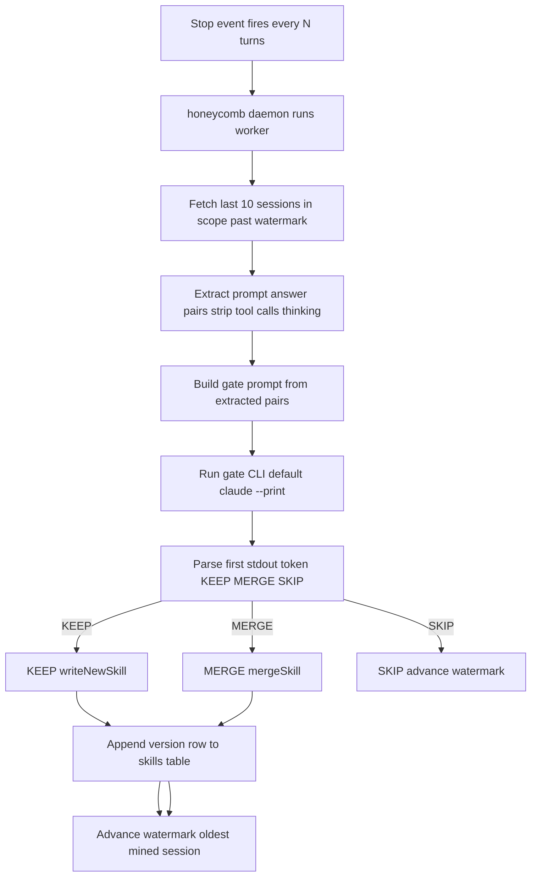

# Skillify Pipeline

> Category: Ai | Version: 1.0 | Date: June 2026 | Status: Active

How Honeycomb mines recent agent sessions to crystallize reusable `SKILL.md` files, propagate them to teammates, and keep the team's shared knowledge growing automatically.

**Related:**
- [`session-capture.md`](session-capture.md)
- [`wiki-summary-workers.md`](wiki-summary-workers.md)
- [`../collaboration/team-skills-sharing.md`](../collaboration/team-skills-sharing.md)
- [`../architecture/request-lifecycle.md`](../architecture/request-lifecycle.md)
- [`../architecture/daemon-surface.md`](../architecture/daemon-surface.md)
- [`../data/schema.md`](../data/schema.md)

---

## The core idea

Recurring patterns in agent sessions are worth codifying. When multiple sessions show the same approach to a problem (a particular migration idiom, a common debugging sequence, a non-obvious tool invocation pattern), that knowledge should not be locked inside those session transcripts. Skillify extracts the pattern, writes it as a `SKILL.md`, and propagates the file to every agent on the team.

The pipeline has two halves. The first is local: a stop-counter on turn-terminating captures signals the honeycomb daemon, which runs the skillify worker as a background job. The second is collaborative and happens at session start: every agent auto-pulls the latest skills from the DeepLake `skills` table (through the daemon) into its own skill directory.

---

## Trigger: when the worker fires

The skillify worker is owned by the honeycomb daemon (port 3850) and is constructed and started by the daemon on boot (`src/daemon/runtime/assemble.ts`, `buildSkillifyWorker`). Hooks never run the worker or talk to DeepLake directly; they signal the daemon, which owns both the worker and the only connection to the store. The live cue is the **stop-counter trigger** in `src/daemon/runtime/capture/capture-handler.ts`. After a turn-terminating capture, `tryStopCounterTrigger` asks `TurnCounters` whether the turn count has crossed its threshold. The check is a modulo on the running count. The handler builds those counters as `new TurnCounters(deps.counterConfig)`, and `attachHooks` does not pass `counterConfig`, so the live threshold stays the constant 10 (`DEFAULT_SKILLIFY_EVERY_TURNS` in `src/daemon/runtime/capture/turn-counters.ts`). `skillifyEveryNTurns` in `src/daemon/runtime/skillify/miner.ts` reads `HONEYCOMB_SKILLIFY_EVERY_N_TURNS`, and that reader is not what the capture handler uses.

`src/hooks/shared/session-end.ts` still posts to `/api/hooks/session-end` with a `"skillify"` intent. The live handler in `src/daemon/runtime/capture/attach.ts` ignores intents and enqueues a `summary` job only (`triggerKind: "final"`). `evaluateTrigger` in `src/daemon/runtime/skillify/miner.ts` still has an unconditional session-end branch, and nothing on the production path calls it. Session end does not run the miner.

The stop counter is an in-memory per-session map on the daemon and resets on restart (`src/daemon/runtime/capture/turn-counters.ts`). The on-disk file under `~/.apiary/honeycomb/state/skillify/` (legacy read fallback `~/.honeycomb/state/skillify/`) is the watermark, `<projectKey>/watermark.json` (`src/daemon/runtime/skillify/watermark.ts`). The worker sets `projectKey` from the session path, or the session id when the path is empty (`src/daemon/runtime/skillify/worker.ts`).

A worker-lock mechanism prevents two concurrent skillify runs for the same project from running simultaneously. The lock is held in a file and released in the worker's `finally` block.

---

## The skillify worker

The skillify worker runs inside the honeycomb daemon as a background job, with its configuration serialized per run. All DeepLake reads and writes below happen through the daemon.

### Step 1: fetch candidate sessions

The worker queries the `sessions` table for the last 10 sessions in scope, ordered by the most recent message timestamp. "In scope" means:

- The fetcher adds `author IN (...)` only when `teamAuthors` is non-empty (`createSessionFetcher` in `src/daemon/runtime/skillify/miner.ts`).
- The live worker calls `mine({ projectKey, triggerSessionId })` with no team list (`src/daemon/runtime/skillify/worker.ts`), so that author filter is omitted.

Filter values that are present are escaped with `sqlStr` (DeepLake has no parameterized queries). The read runs under the storage scope (org and workspace). The SQL has no `agent_id` predicate. The watermark (`state.lastDate`) prevents re-mining sessions already processed. Candidate sessions are filtered to exclude the session that triggered the worker (the in-flight session is not yet fully captured).

### Step 2: extract prompt/answer pairs

Each session's rows are fetched and passed through `extractPairs()` (exported from `src/daemon/runtime/skillify/miner.ts`), which pairs user prompts with the agent's next assistant message, drops tool calls and thinking blocks, and returns `Pair[]` objects. Each pair carries its session ID and agent label. The pairs are then rendered into a text block, capped at 2,000 characters per pair and 40,000 characters total for the gate prompt.

### Step 3: build and run the gate prompt

The worker builds a gate prompt from the extracted pairs. `buildGatePrompt` in `src/daemon/runtime/skillify/miner.ts` renders the exchanges only. There is no existing-skills block and no 30,000-character skills cap on this path. The prompt instructs the gate model to return one of three verdicts:

| Verdict | Meaning |
|---|---|
| `KEEP <name> <body>` | Write a new skill file |
| `MERGE <existing-name> <merged-body>` | Update an existing skill, bump version |
| `SKIP <reason>` | Pattern is one-off, generic, or already covered |

KEEP fires only when the pattern recurs across at least three exchanges, is non-obvious, and is not already covered. The precision-over-recall stance is explicit in the prompt: a missed skill is invisible, but a false skill erodes trust.

The gate call shells out to a host CLI so no separate API key is needed. The daemon worker's default spec is `{ command: "claude", args: ["--print"] }` (`defaultGateSpec` in `src/daemon/runtime/skillify/worker.ts`). There is no per-agent command matrix in the skillify worker.

The gate call runs synchronously with a 120-second timeout. The prompt is fed on stdin (`systemGateSpawner` in `src/daemon/runtime/skillify/miner.ts`). `parseVerdictStdout` reads the first stdout token for `KEEP`, `MERGE`, or `SKIP`. There is no `verdict.json`.

### Step 4: write the skill file

On a `KEEP` verdict, `writeNewSkill()` creates a new `SKILL.md`. `createFsInstallTarget` in `src/daemon/runtime/skillify/install-target.ts` still supports both modes:

- `install=project`: `<cwd>/.claude/skills/<name>/SKILL.md`
- `install=global`: `~/.claude/skills/<name>/SKILL.md`

The live job worker always passes `"global"` (`src/daemon/runtime/skillify/worker.ts`), so a daemon-mined skill lands under `~/.claude/skills/`.

On a `MERGE` verdict, `mergeSkill()` opens the existing file, updates the body and bumps the version in the frontmatter. If the MERGE target does not exist locally (the gate hallucinated a name from the user's global skills), the worker falls back to `writeNewSkill()` so the body is not lost.

The `SKILL.md` includes YAML frontmatter with provenance metadata: `source_sessions`, `version`, `created_by_agent`, and timestamps.

### Step 5: record to the DeepLake skills table

After a successful local write, the daemon inserts a row into the `skills` table for org-wide provenance. This is the mechanism by which teammates discover each other's mined skills. Because DeepLake coalesces UPDATEs against freshly written rows, the daemon never UPDATEs in place: it uses the append-only, version-bumped write pattern, inserting a new version row rather than mutating the prior one.

Cross-author merges auto-promote the scope from `me` to `team` in the recorded row, so future `pull` commands know the skill is co-owned.

---

## Watermark semantics

The watermark is set to the date of the **oldest** mined session, not the newest (`src/daemon/runtime/skillify/watermark.ts` keeps the earlier of the current mark and that oldest date, and never moves the mark later). The fetch predicate is `creation_date > watermark` (`createSessionFetcher` in `src/daemon/runtime/skillify/miner.ts`). Sessions newer than that date can be seen again. Sessions older than it are excluded, so a batch the LIMIT cut off further in the past is not recovered on the next run.

---

## Pull and auto-pull

Once a skill row exists in the `skills` table, any teammate can pull it with `honeycomb skillify pull`. The pull writes to `~/.claude/skills/<name>--<author>/SKILL.md` (the `--<author>` suffix keeps cross-author skills with the same name disjoint) and fans out symlinks into the skill roots of every other detected agent (`~/.agents/skills/`, `~/.hermes/skills/`, `~/.pi/agent/skills/`) so all agents find the file without a separate copy.

Auto-pull runs at every session start, served by the daemon. The pull is idempotent: it skips a file when the local version is at or newer than the remote. The call is bounded by a 5-second timeout and swallows all errors, so a slow or unavailable DeepLake never blocks a session from starting.

---

## Configuration

| Env var | Default | Effect |
|---|---|---|
| `HONEYCOMB_SKILLIFY_EVERY_N_TURNS` | `10` | Read by `skillifyEveryNTurns` in `src/daemon/runtime/skillify/miner.ts`. The live capture counter does not receive it and stays at `DEFAULT_SKILLIFY_EVERY_TURNS` (10). |
| `HONEYCOMB_AUTOPULL_DISABLED` | unset | Set to `1` to disable auto-pull at session start |

The skills table name is the constant `SKILLS_TABLE` (`skills`) in `src/daemon/runtime/skillify/skills-write.ts`. There is no `HONEYCOMB_SKILLS_TABLE`, `HONEYCOMB_SKILLIFY_WORKER`, `HONEYCOMB_CURSOR_MODEL`, `HONEYCOMB_HERMES_PROVIDER`, or `HONEYCOMB_HERMES_MODEL` under `src/`. The worker does not write `~/.claude/hooks/skillify.log`. It emits structured daemon events such as `skillify.worker.completed` (`src/daemon/runtime/skillify/worker.ts`).
