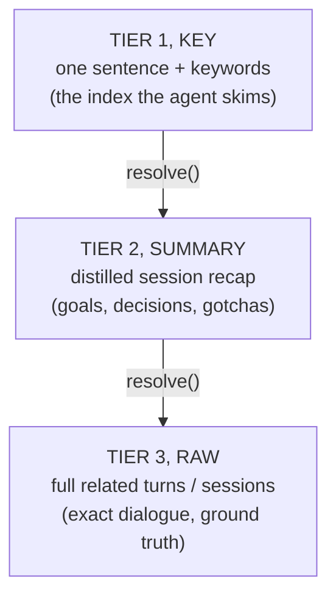

# Three-Tier Memory Strategy (prime once, zoom on demand)

> Category: Ai | Version: 2.0 | Date: June 2026 | Status: Active

A **3-tier "zoom" memory** layered on top of Honeycomb's Deep Lake store so a coding agent (Claude
Code, Cursor) is *primed once per session* with a tiny index of distilled memory and then *resolves
deeper on demand*. This is the conceptual anchor for a set of sibling docs. The strategy is shipped:
as of PRD-046 ([#77](https://github.com/legioncodeinc/honeycomb/pull/77), merged 2026-06-22) the
Tier-1 `key` columns, the prime endpoint, resolve/mine, and the CC/Cursor SessionStart hooks are all
live (see the §3 table), and the dedup/recency shaping from PRD-047c/d composes into both the prime
and the recall path. GraphRAG ([`graphrag-followon.md`](graphrag-followon.md)) is the approved later
add on top of this foundation.

**Related:**
- [`session-priming-architecture.md`](session-priming-architecture.md), the push/pull mechanism + harness wiring
- [`hybrid-sql-vector-rationale.md`](hybrid-sql-vector-rationale.md), why Deep Lake (SQL+vector) fits this
- [`distillation-and-tier1-keys.md`](distillation-and-tier1-keys.md), the make-or-break: key quality
- [`prior-art-owls-roost-crosswalk.md`](prior-art-owls-roost-crosswalk.md), external prior art and what transfers
- [`graphrag-followon.md`](graphrag-followon.md), the approved later add
- [`retrieval.md`](retrieval.md), how recall works today (the substrate this builds on)
- [`memory-pipeline.md`](memory-pipeline.md) · [`session-capture.md`](session-capture.md) · [`wiki-summary-workers.md`](wiki-summary-workers.md)
- [`../data/schema.md`](../data/schema.md), the `key`/`summary`/`message` columns that back the three tiers
- [`../../../requirements/completed/prd-047-retrieval-quality-upgrades/prd-047-retrieval-quality-upgrades-index.md`](../../../requirements/completed/prd-047-retrieval-quality-upgrades/prd-047-retrieval-quality-upgrades-index.md)

---

## 1. Why this exists

A coding agent starts every session cold. Claude Code and Cursor each carry their own *working*
memory within a session (live turns + auto-compaction), but they remember nothing across sessions,
machines, or repos on their own. Honeycomb's whole reason to exist is to be that cross-session,
cross-machine memory. The open question this strategy answers is: **how does Honeycomb's long-term
store actually reach the agent at the start of a fresh session, cheaply and without polluting the
context window?**

The naive answer, "inject relevant memories into every turn", is a trap (see §5). The better
answer is a **resolution hierarchy**: give the agent a small, cheap *index* of what Honeycomb knows
at session start, and let the agent *zoom in* on the few items it cares about by calling tools. This
is progressive disclosure applied to memory. It is roughly how human recall works, a gist or
keyword surfaces first ("oh, the CI thing"), which you can then expand into a summary, which you can
expand into the full episode, which is why the project owner describes it as "like the human brain."

---

## 2. The core idea: a zoom hierarchy, not an age hierarchy

There are two different things people call a "three-tier memory." Keeping them distinct is the most
important conceptual move in this whole strategy.

- **Compression-by-age hierarchy** (the classic): working memory → episodic summaries → semantic
  facts, where data *moves down* tiers as it ages and gets compressed. This is a *storage lifecycle*.
  The Owl's Roost prior art (see crosswalk doc) is built this way (Valkey → Qdrant episodic → Qdrant
  semantic, with decay multipliers).
- **Resolution-by-zoom hierarchy** (this strategy): the *same* memory exists at three levels of
  detail simultaneously, and the agent chooses how far to zoom. This is a *retrieval/presentation*
  model.

This strategy is the second kind. The three tiers are zoom levels on one underlying memory:

Tier 1 is an *index entry*, not a working-memory tier. A future agent must not confuse this with the
Owl's Roost "Tier 1 = Valkey working memory." Here, Tier 1 is the cheapest, most compressed *pointer*
into memory; the harness already owns live working memory and Honeycomb should not rebuild it (§5).

---

## 3. The mapping to Honeycomb's existing tables

The reason this was *doable* rather than a from-scratch build: Honeycomb's Deep Lake store already had
three tables that correspond almost exactly to the three zoom levels. The work was mostly a retrieval
+ priming layer over storage that already existed, plus one genuinely new artifact (the Tier-1 key),
all of which now ships. The `key`/`summary`/`message` columns are documented in
[`../data/schema.md`](../data/schema.md).

| Tier | Honeycomb table | Key column(s) | What it holds | State |
|---|---|---|---|---|
| **Tier 3, RAW** | `sessions` | `path`, `message` (JSONB), `message_embedding FLOAT4[]` | One row per captured turn (prompt / tool-call / response), append-only | **Live.** The capture hook writes it every turn. |
| **Tier 2, SUMMARY** | `memory` | `path`, `summary`, `description`, `summary_embedding` | One distilled session summary per session | **Live (PRD-046a).** The PRD-017 summary worker is mounted in the daemon and fires on session-end + periodic triggers; 046b added the version-bumped `/MEMORY.md` refresh. |
| **Tier 1, KEY** | `memory.key` / `memories.key` | `key` | A ≤1-sentence keyworded headline per session/fact, used as the index | **Live (PRD-046b).** A `key` column on both tables, generated inside the summary gate (episodic) and skimmed directly by the prime query. Durable-fact keys fall back to `content` where the dedicated durable-key sharpener has not yet run. |

A fourth table, `memories`, holds distilled *facts* (user/pipeline-curated, column `content`,
`content_embedding`), durable truths rather than per-session episodes. In this model `memories` is a
*second source of Tier-1 keys and Tier-2 detail* alongside `memory` (durable facts vs episodic
summaries). The crosswalk doc (§ "what is a tier") expands on this.

So the build reduced to: **(1) generate Tier-1 keys** (a lightweight distillation pass), **(2)
present the three tiers as a resolve chain**, and **(3) prime the agent with the keys at session
start**, all three of which now ship. Storage was not the hard part.

---

## 4. What "resolve" means concretely

`resolve(key, depth)` is a deterministic walk down the zoom levels, and, critically, it is a SQL
*join by id*, not a fresh search:

- **depth 0 (KEY):** already in the agent's primed context; no call needed.
- **depth 1 (SUMMARY):** fetch the `memory.summary` (or `memories.content`) row the key points to.
- **depth 2 (RAW):** fetch the `sessions` rows linked to that summary (same `path` / session id).

The whole chain is a `SELECT … WHERE path = '<id>'` walk, no similarity search, no payload-pointer
round-tripping. It maps directly onto Honeycomb's MCP read surface (`hivemind_read`): the key carries
the row id, and each `depth` step is a lookup. The mining path (when the agent searches for memory it
did *not* know to name) uses the hybrid recall (`hivemind_search` → `recall.ts`). See the
hybrid-rationale doc for why "resolve = join" is the property that makes Deep Lake a better fit than a
vector-only store.

---

## 5. Two hard boundaries (so a future agent doesn't over-build)

1. **Do not rebuild working memory.** Claude Code and Cursor already maintain live in-session turns
   and auto-compact them. Honeycomb owns the *persistent, cross-session* tiers (Summary, Raw) and the
   *index over them* (Key). It must not try to own a Valkey-style live working-memory tier for a
   coding agent, that tier already exists in the harness, and duplicating it invites drift.
2. **Prime per session, pull per turn, never auto-inject per turn.** "Always query Honeycomb and
   inject the results on every turn" adds latency to every turn and crowds the window with memory the
   agent did not ask for (the "lost in the middle" failure the prior-art docs flag). The correct
   shape is: push a tiny *index* once at session start; let the agent *pull* (resolve / search) only
   what it wants, on whatever turn it wants. This is detailed in the priming-architecture doc.

---

## 6. How this relates to the retrieval shaping work (PRD-047)

This strategy sits *on top of* the recall engine, not instead of it. PRD-047 hardened the recall path
the resolve/mine calls depend on, and all of it now ships:

- **047a (closed):** the native `deeplake_hybrid_record` operator was benchmarked and rejected (it
  returned degenerate constant-zero scores, and even after the vendor fix only ties RRF); the engine
  keeps post-query RRF. The 3-tier mining path rides RRF, which measured recall@5 ≈ 0.72-0.78 live.
  See [`deeplake-hybrid-record-operator-report.md`](deeplake-hybrid-record-operator-report.md).
- **047b reranker / 047c semantic dedup / 047d recency dampening / 047e MMR / 047f graded-nDCG eval**
  are wired into both the mining path and the prime: dedup keeps the index from showing the same fact
  five times; recency dampening makes the "recent timestream" prime fresh-biased without forgetting
  durable facts; the graded-nDCG eval is how priming gets *proven* rather than vibed.

The 3-tier prime is best thought of as **PRD-047's consumer**: it turns a good recall engine into a
session-level capability the agent actually feels.

---

## 7. Verdict (why it paid off)

Grounded assessment, now confirmed in code: **high leverage, and more doable on Honeycomb than the
system it is modeled on,** because the storage substrate (three tables + hybrid recall + session-start
hooks + the MCP read/search tools) already existed. The build was ~70% retrieval/presentation + a
session-start hook, ~30% genuinely new (Tier-1 key generation + the resolve tool). The remaining risk
is not plumbing, the plumbing ships; it is **distillation quality**, since a bland Tier-1 key is one
the agent ignores, which wastes the prime. That risk is the subject of the distillation doc and is
the single thing most worth getting right, which is why the prime eval (§6) gates it.

---

## Changelog

| Date | Version | Change |
|------|---------|--------|
| 2026-06 | 2.0 | Status → Active: PRD-046 shipped. Tier-1 `key` columns, the prime endpoint, the resolve chain, and the SessionStart hooks are live; rewrote §3 state column, §4 resolve, §6 PRD-047 relationship, and §7 verdict in present tense. Added a `../data/schema.md` Related link for the backing columns. |
| 2026-06 | 1.1 | **Correction:** Tier-2 (PRD-017 summaries + synthesis) is `Completed`/built, not a Wave-2 stub. The real gap is deferred live wiring of the worker. See the distillation doc §5. |
| 2026-06 | 1.0 | Initial strategy capture from the 3-tier memory design discussion. |
