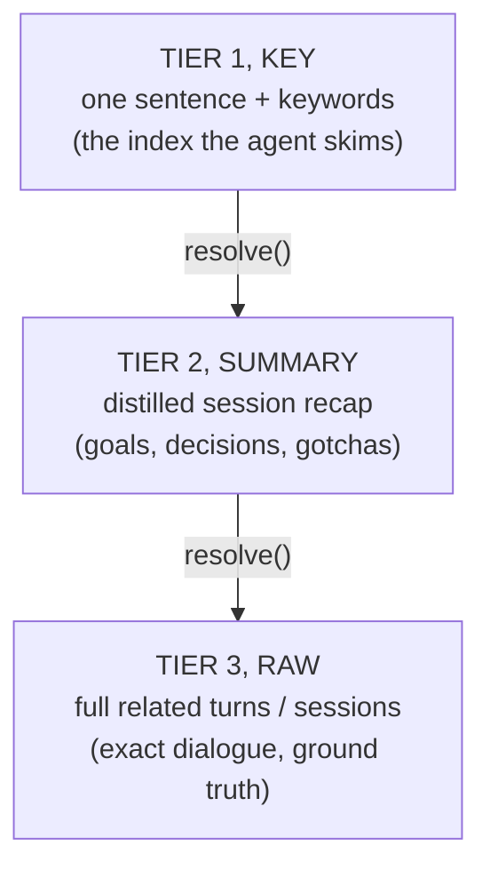

# Three-Tier Memory Strategy (prime once, zoom on demand)

> Category: Ai | Version: 2.1 | Date: October 2026 | Status: Active

A **3-tier "zoom" memory** layered on top of Honeycomb's Deep Lake store so a coding agent (Claude
Code, Cursor) is *primed once per session* with a tiny index of distilled memory, given a *bounded
fast recall on each turn*, and then *resolves deeper on demand*. This is the conceptual anchor for a
set of sibling docs. The strategy is shipped: as of PRD-046
([#77](https://github.com/legioncodeinc/honeycomb/pull/77), merged 2026-06-22) the Tier-1 `key`
columns, the prime endpoint, resolve/mine, and the CC/Cursor SessionStart hooks are all live (see
the §3 table). Recall mining runs dedup and class-aware activation. The prime is a newest-first
skim. GraphRAG ([`graphrag-followon.md`](graphrag-followon.md)) is the approved later add on top of
this foundation.

**Related:**
- [`session-priming-architecture.md`](session-priming-architecture.md), the push/pull mechanism + harness wiring
- [`hybrid-sql-vector-rationale.md`](hybrid-sql-vector-rationale.md), why Deep Lake (SQL+vector) fits this
- [`distillation-and-tier1-keys.md`](distillation-and-tier1-keys.md), the make-or-break: key quality
- [`prior-art-owls-roost-crosswalk.md`](prior-art-owls-roost-crosswalk.md), external prior art and what transfers
- [`graphrag-followon.md`](graphrag-followon.md), the approved later add
- [`retrieval.md`](retrieval.md), how recall works today (the substrate this builds on)
- [`memory-pipeline.md`](memory-pipeline.md) · [`session-capture.md`](session-capture.md) · [`wiki-summary-workers.md`](wiki-summary-workers.md)
- [`../data/schema.md`](../data/schema.md), the `key`/`summary`/`message` columns that back the three tiers
- [`../../../requirements/completed/prd-047-retrieval-quality-upgrades/prd-047-retrieval-quality-upgrades-index.md`](../../../requirements/completed/prd-047-retrieval-quality-upgrades/prd-047-retrieval-quality-upgrades-index.md)

---

## 1. Why this exists

A coding agent starts every session cold. Claude Code and Cursor each carry their own *working*
memory within a session (live turns + auto-compaction), but they remember nothing across sessions,
machines, or repos on their own. Honeycomb's whole reason to exist is to be that cross-session,
cross-machine memory. The open question this strategy answers is: **how does Honeycomb's long-term
store actually reach the agent at the start of a fresh session, cheaply and without polluting the
context window?**

An unbounded inject of full recall on every turn is the failure §5 bounds. The shipped boundary is
a session-start prime, a bounded per-turn fast inject, and on-demand zoom. The better answer is a
**resolution hierarchy**: give the agent a small, cheap *index* of what Honeycomb knows at session
start, and let the agent *zoom in* on the few items it cares about by calling tools. This is
progressive disclosure applied to memory. It is roughly how human recall works, a gist or keyword
surfaces first ("oh, the CI thing"), which you can then expand into a summary, which you can expand
into the full episode, which is why the project owner describes it as "like the human brain."

---

## 2. The core idea: a zoom hierarchy, not an age hierarchy

There are two different things people call a "three-tier memory." Keeping them distinct is the most
important conceptual move in this whole strategy.

- **Compression-by-age hierarchy** (the classic): working memory → episodic summaries → semantic
  facts, where data *moves down* tiers as it ages and gets compressed. This is a *storage lifecycle*.
  The Owl's Roost prior art (see crosswalk doc) is built this way (Valkey → Qdrant episodic → Qdrant
  semantic, with decay multipliers).
- **Resolution-by-zoom hierarchy** (this strategy): the *same* memory exists at three levels of
  detail simultaneously, and the agent chooses how far to zoom. This is a *retrieval/presentation*
  model.

This strategy is the second kind. The three tiers are zoom levels on one underlying memory:

```mermaid
flowchart TD
    K["TIER 1, KEY<br/>one sentence + keywords<br/>(the index the agent skims)"]
    S["TIER 2, SUMMARY<br/>distilled session recap<br/>(goals, decisions, gotchas)"]
    R["TIER 3, RAW<br/>full related turns / sessions<br/>(exact dialogue, ground truth)"]
    K -->|"resolve()"| S
    S -->|"resolve()"| R
```

Tier 1 is an *index entry*, not a working-memory tier. A future agent must not confuse this with the
Owl's Roost "Tier 1 = Valkey working memory." Here, Tier 1 is the cheapest, most compressed *pointer*
into memory; the harness already owns live working memory and Honeycomb should not rebuild it (§5).

---

## 3. The mapping to Honeycomb's existing tables

The reason this was *doable* rather than a from-scratch build: Honeycomb's Deep Lake store already had
three tables that correspond almost exactly to the three zoom levels. The work was mostly a retrieval
+ priming layer over storage that already existed, plus one genuinely new artifact (the Tier-1 key),
all of which now ships. The `key`/`summary`/`message` columns are documented in
[`../data/schema.md`](../data/schema.md).

| Tier | Honeycomb table | Key column(s) | What it holds | State |
|---|---|---|---|---|
| **Tier 3, RAW** | `sessions` | `path`, `message` (JSONB), `message_embedding FLOAT4[]` | One row per captured turn (prompt / tool-call / response), append-only | **Live.** The capture hook writes it every turn. |
| **Tier 2, SUMMARY** | `memory` | `path`, `summary`, `description`, `summary_embedding` | One distilled session summary per session | **Live (PRD-046a).** The PRD-017 summary worker is mounted in the daemon and fires on session-end + periodic triggers; 046b added the version-bumped `/MEMORY.md` refresh. |
| **Tier 1, KEY** | `memory.key` / `memories.key` | `key` | A ≤1-sentence keyworded headline per session/fact, used as the index | **Live (PRD-046b).** A `key` column on both tables, generated inside the summary gate (episodic) and skimmed directly by the prime query. Durable-fact keys fall back to `content` where the dedicated durable-key sharpener has not yet run. |

A fourth table, `memories`, holds distilled *facts* (user/pipeline-curated, column `content`,
`content_embedding`), durable truths rather than per-session episodes. In this model `memories` is a
*second source of Tier-1 keys and Tier-2 detail* alongside `memory` (durable facts vs episodic
summaries). The crosswalk doc (§ "what is a tier") expands on this.

So the build reduced to: **(1) generate Tier-1 keys** (a lightweight distillation pass), **(2)
present the three tiers as a resolve chain**, and **(3) prime the agent with the keys at session
start**, all three of which now ship. Storage was not the hard part.

---

## 4. What "resolve" means concretely

`resolve(key, depth)` is a deterministic walk down the zoom levels, and, critically, it is a SQL
*join by id*, not a fresh search:

- **depth 0 (KEY):** already in the agent's primed context; no call needed.
- **depth 1 (SUMMARY):** fetch the `memory.summary` (or `memories.content`) row the key points to.
- **depth 2 (RAW):** fetch the `sessions` rows for that session. Capture stores the transcript path
  on `sessions.path` and the session identity on `sessions.id`, so the join is
  `id LIKE 'sess-<sessionId>-%'` plus a post-filter (`src/daemon/runtime/memories/resolve.ts`).
  `resolve.ts` rejects a join that matches `sessions` by the summary path.

The chain is a deterministic SQL lookup, no similarity search, no payload-pointer round-tripping.
Depth 1 selects `memory.summary` or `memories.content` by path or id. Depth 2 uses the session-id
prefix above. It maps directly onto Honeycomb's MCP read surface (`hivemind_read` →
`GET /api/memories/resolve`): the key carries the row id, and each `depth` step is a lookup. The
mining path (when the agent searches for memory it did *not* know to name) uses the hybrid recall
(`hivemind_search` → `POST /api/memories/recall`). See the hybrid-rationale doc for why "resolve =
lookup" is the property that makes Deep Lake a better fit than a vector-only store.

---

## 5. Two hard boundaries (so a future agent doesn't over-build)

1. **Do not rebuild working memory.** Claude Code and Cursor already maintain live in-session turns
   and auto-compact them. Honeycomb owns the *persistent, cross-session* tiers (Summary, Raw) and the
   *index over them* (Key). It must not try to own a Valkey-style live working-memory tier for a
   coding agent, that tier already exists in the harness, and duplicating it invites drift.
2. **Prime once, plus a bounded per-turn fast inject, plus on-demand pull.** Session start still
   pushes a tiny index (`prime`). Each turn, `HookRuntime` dispatches `user_prompt_recall` to
   `runUserPromptRecall` (`src/hooks/runtime.ts`), and the renderer posts `fast: true` to
   `/api/memories/recall`. The agent can still pull (resolve / search) on demand. An unbounded
   full-recall inject on every turn is the shape this boundary replaced. The hook detail lives in
   the priming-architecture doc.

---

## 6. How this relates to the retrieval shaping work (PRD-047)

This strategy sits *on top of* the recall engine. PRD-047 hardened the mining path the mine call
depends on:

- **047a (closed):** the native `deeplake_hybrid_record` operator was benchmarked and left unwired
  (the 2026-06-22 run returned degenerate constant-zero scores; the 2026-06-24 vendor fix only ties
  RRF). The engine keeps post-query RRF. The 2026-06-22 band was recall@5 ≈ 0.72-0.78. The tie run
  is recall@5 0.611 for both paths. See
  [`deeplake-hybrid-record-operator-report.md`](deeplake-hybrid-record-operator-report.md).
- **Mining and the prime do not share the PRD-047 stack.** Recall mining runs semantic dedup and
  class-aware activation (`applyActrActivation` when the activation source is injected, otherwise
  `applyRecencyActivation`). The reranker default is `none`. MMR engages only with a positive
  `tokenBudget`. Graded nDCG gates ranking changes on the recall eval. The prime does not run that
  stack. `prime.ts` issues `skimPrimeKeys` only. The prime assembler keeps the skim's newest-first
  `ORDER BY`. The PRD-047d dampener is not built on the prime, and semantic dedup there is a later
  seam. The default prime deduper is normalized text.

Mining is the path that consumes those stages. The prime stays the newest-first skim.

---

## 7. Verdict (why it paid off)

Grounded assessment, now confirmed in code: **high leverage, and more doable on Honeycomb than the
system it is modeled on,** because the storage substrate (three tables + hybrid recall + session-start
hooks + the MCP read/search tools) already existed. The build was ~70% retrieval/presentation + a
session-start hook, ~30% genuinely new (Tier-1 key generation + the resolve tool). The remaining risk
is not plumbing, the plumbing ships; it is **distillation quality**, since a bland Tier-1 key is one
the agent ignores, which wastes the prime. That risk is the subject of the distillation doc and is
the single thing most worth getting right.

---

## Changelog

| Date | Version | Change |
|------|---------|--------|
| 2026-10 | 2.1 | Prime boundary is prime once, a bounded per-turn fast inject, and on-demand pull. Prime shaping is the skim order. Mining recall@5 dated to the 2026-06-24 tie. Depth 2 joins sessions by id prefix. |
| 2026-06 | 2.0 | Status → Active: PRD-046 shipped. Tier-1 `key` columns, the prime endpoint, the resolve chain, and the SessionStart hooks are live; rewrote §3 state column, §4 resolve, §6 PRD-047 relationship, and §7 verdict in present tense. Added a `../data/schema.md` Related link for the backing columns. |
| 2026-06 | 1.1 | **Correction:** Tier-2 (PRD-017 summaries + synthesis) is `Completed`/built, not a Wave-2 stub. The real gap is deferred live wiring of the worker. See the distillation doc §5. |
| 2026-06 | 1.0 | Initial strategy capture from the 3-tier memory design discussion. |
