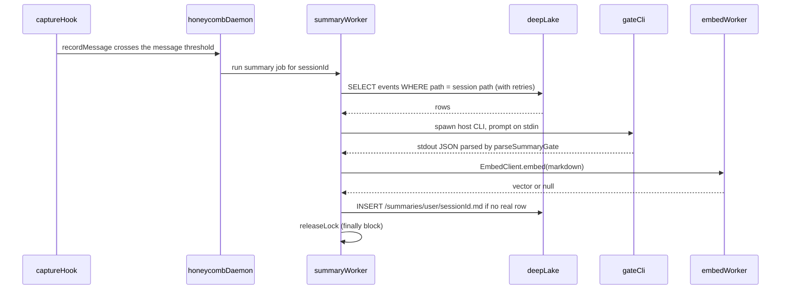

# Wiki Summary Workers

> Category: Ai | Version: 1.0 | Date: June 2026 | Status: Active

How Honeycomb generates, stores, and incrementally updates AI-written wiki summaries for each session, and how those summaries power the VFS recall surface.

**Related:**
- [`session-capture.md`](session-capture.md)
- [`retrieval.md`](retrieval.md)
- [`skillify-pipeline.md`](skillify-pipeline.md)
- [`../architecture/request-lifecycle.md`](../architecture/request-lifecycle.md)
- [`../architecture/daemon-surface.md`](../architecture/daemon-surface.md)
- [`../data/schema.md`](../data/schema.md)

---

## What summaries are for

Raw session rows in the `sessions` table are precise but verbose. Searching across them for "what did we decide about the database schema last week" would require ranking thousands of individual messages. Summaries solve this by collapsing each session into a structured markdown document that names entities, decisions, files modified, and open questions. That document is what shows up when you `Grep` across `~/.apiary/honeycomb/memory/` or follow links from `~/.apiary/honeycomb/memory/index.md`. Generated overviews use that mount (`MEMORY_MOUNT_DISPLAY_PATH` in `src/daemon-client/vfs/index-gen.ts`). The legacy `~/.honeycomb/memory/` shape is still recognized, and the virtual index filename is still `index.md`. The canonical synthesized wiki index inside the `memory` table is `/MEMORY.md`.

Summaries also store a `summary_embedding` vector (768-dim `nomic-embed-text-v1.5`) on the `memory` row. Semantic recall does not query that column. Its arms are `memories.content_embedding`, `sessions.message_embedding`, and `hive_graph_versions.embedding` (`src/daemon/runtime/memories/recall.ts`). `embeddingColumnFor` returns null for source `memory`. Lexical recall does search `memory.summary`.

---

## Trigger conditions

The summary worker is owned by the honeycomb daemon (port 3850). Hooks do not spawn the work themselves; they signal the daemon, which decides whether to run the worker and owns the only connection to DeepLake. A summary run fires on two triggers:

| Trigger | When |
|---|---|
| **Final** | At session end: `Stop`, `SessionEnd`, or `session_shutdown`, once per session |
| **Periodic** | Mid-session, when the in-memory message counter crosses its threshold (default 20, `DEFAULT_SUMMARY_EVERY_MESSAGES` in `src/daemon/runtime/capture/turn-counters.ts`). No hours threshold is evaluated. |

The periodic bump is `TurnCounters.recordMessage` in `src/daemon/runtime/capture/turn-counters.ts`, called from `src/daemon/runtime/capture/capture-handler.ts`. There is no `src/hooks/capture.ts` and no `maybeTriggerPeriodicSummary`. The counters are an in-memory per-session map and reset on daemon restart. There is no sidecar JSON of `{ lastSummaryAt, lastSummaryCount, totalCount }`.

A lock file at `~/.claude/hooks/summary-state/<sessionId>.lock` prevents two summary runs from being triggered concurrently for the same session. If the lock is already held (an earlier trigger's run is still in flight on the daemon), the new trigger is suppressed. The lock is always released in the worker's `finally` block. The summary-state directory is that lock root (`<sessionId>.lock` in `src/daemon/runtime/summaries/worker.ts`).

---

## The summary worker

The summary worker runs inside the honeycomb daemon as a background job. Hooks and the CLI trigger it through the daemon rather than running it themselves, and the daemon serializes a `WorkerConfig` for each run. The worker sets `HONEYCOMB_WIKI_WORKER=1` and `HONEYCOMB_CAPTURE=false` in any subprocess environment it spawns to prevent the gate CLI call inside from triggering its own capture loop.

### Step 1: fetch session events

The worker queries the `sessions` table for all rows belonging to the session, ordered by `creation_date` ascending:

```sql
SELECT * FROM "sessions"
WHERE path = <session path, escaped with sLiteral>
ORDER BY creation_date ASC
```

`createSessionEventFetcher` in `src/daemon/runtime/summaries/worker.ts` matches `path` with `sLiteral`, because DeepLake does not support bind parameters. Because capture events are recorded asynchronously, DeepLake's eventual-consistency model means rows can lag behind the `SessionEnd` event. The worker retries with linear backoff up to `HONEYCOMB_WIKI_EVENT_RETRIES` (default 5) times at `HONEYCOMB_WIKI_EVENT_BACKOFF_MS` (default 1500 ms) intervals before giving up.

If no events appear after all retries, the worker removes the "in progress" placeholder from the `memory` table (a row written when the session started to reserve the slot) rather than leaving it stranded forever.

### Step 2: no resume offset

The worker does not read a prior summary to learn how many events were already covered. There is no `JSONL offset` marker under `src/`. `runSummaryWorker` summarizes the events the fetcher returned. When a real summary row already exists, `writeSummary` skips the insert (step 4).

### Step 3: run the gate prompt

The worker builds a structured prompt from the session's events and shells out with `child_process.spawn` (`systemSummarySpawner` in `src/daemon/runtime/summaries/worker.ts`). The prompt is written to the child's stdin. The subprocess env sets `HONEYCOMB_WIKI_WORKER=1` and `HONEYCOMB_CAPTURE=false`. The gate returns stdout, parsed as JSON by `parseSummaryGate`. There is no `buildClaudeInvocation`, no `execFileSync`, and no temp `summary.md`. Using the host CLI means no separate API key is needed.

Agent selection is `summaryCliSpecFor` in `src/daemon/runtime/summaries/job.ts`. The args are `-p` or `exec -` only: `claude -p`, `codex exec -`, `cursor-agent -p`, `hermes -p`, `pi -p`.

### Step 4: embed and upload

If the gate returns markdown, the worker embeds the text via `EmbedClient.embed(markdown)` (one string argument; `src/daemon/runtime/services/embed-client.ts`; returns `null` if embeddings are disabled) and the daemon writes the summary to the `memory` table:

```
memory table path: /summaries/<userName>/<sessionId>.md
```

The write is keyed on the `path` column. `writeSummary` inserts only when no real row exists, and never rewrites one in place. The `description` column stores a short excerpt of the summary, and the `summary_embedding` column stores the 768-dim vector (or `NULL`). There is no `finalizeSummary` and no sidecar baseline to update.



---

## Error handling and resilience

**Retries on empty events.** The five-attempt linear backoff ensures that sessions captured under heavy load (many concurrent agent sessions) still get summarized even when DeepLake read consistency lags behind the write timestamps.

**No orphan placeholders.** If events never arrive, the worker deletes the "in progress" placeholder row. The guard `AND description = 'in progress'` means a concurrent run that already wrote a real summary is never clobbered.

**Exponential backoff on API errors.** The daemon's `query()` helper retries transient HTTP 429, 500, 502, 503, and 504 (`src/daemon/storage/client.ts`). 401 and 403 are non-transient. The backoff ceiling is 1000 ms, and a statement gets 4 attempts.

**Summary embedding failures are non-fatal.** If `EmbedClient.embed()` throws, the worker logs the error, writes `NULL` for the embedding, and proceeds with the upload. A summary without an embedding is still searchable via lexical ranking.

---

## Per-agent variations

The summary worker is owned by the daemon, so the only per-agent variation is the gate CLI the worker shells out to:

| Agent | Gate CLI |
|---|---|
| claude_code | `claude -p` (prompt on stdin) |
| codex | `codex exec -` |
| cursor | `cursor-agent -p` |
| hermes | `hermes -p` |
| pi | `pi -p` |

`summaryCliSpecFor` in `src/daemon/runtime/summaries/job.ts` selects that invocation from the session's agent. It does not pass a model or provider flag. `HONEYCOMB_CURSOR_MODEL`, `HONEYCOMB_HERMES_PROVIDER`, `HONEYCOMB_HERMES_MODEL`, `HONEYCOMB_PI_PROVIDER`, and `HONEYCOMB_PI_MODEL` are not read under `src/`. Across every agent the work is owned by the same daemon worker and the same DeepLake connection.

---

## Configuration

| Env var | Default | Effect |
|---|---|---|
| `HONEYCOMB_WIKI_EVENT_RETRIES` | `5` | Retry attempts when no session events are found |
| `HONEYCOMB_WIKI_EVENT_BACKOFF_MS` | `1500` | Linear backoff base for event fetch retries |
| `HONEYCOMB_CAPTURE` | `true` | Set to `false` to disable capture and summary generation |

There is no `HONEYCOMB_SUMMARY_EVERY_N_MSGS` or `HONEYCOMB_SUMMARY_EVERY_HOURS`. The live periodic threshold is the constant 20 in `src/daemon/runtime/capture/turn-counters.ts`. No hours check runs.

The worker does not write `~/.claude/hooks/wiki.log`. The job worker emits structured events such as `summary.worker.completed` (`src/daemon/runtime/summaries/job.ts`).
