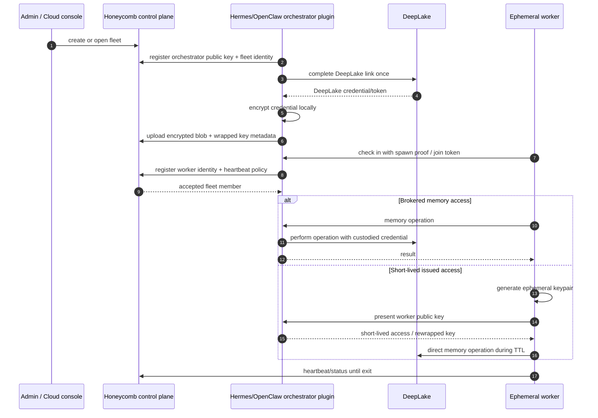

# ADR-0002, Orchestrator-custodian for fleet memory-plane enrollment

> **Status:** Proposed (exploratory) | **Date:** 2026-06-29
> **Supersedes:** none | **Superseded by:** none
> **Owners:** fleet, security, integrations | **Related:** PRD-054, PRD-055, PRD-062

## Context

Honeycomb needs a cheaper control plane so idle daemon coordination does not poll DeepLake for
heartbeat, lease, registration, and other non-memory work. PRD-062 documents the cost pressure:
DeepLake compute tracks install count too closely when every daemon polls durable work queues. A
DigitalOcean Postgres-backed Honeycomb control plane is the likely place for cheap liveness,
registration, cursors, and fleet state.

That creates a second identity relationship:

- **Honeycomb control-plane identity** identifies a user, install, daemon, or fleet member to
  Honeycomb.
- **DeepLake identity** authorizes access to the user's memory/vector substrate.

For personal machines, a daemon can link DeepLake locally and keep the credential in the existing
machine-bound credential/vault posture. Fleet systems are different. Hermes and OpenClaw commonly
run under an orchestration machine that spawns and tears down workers or VMs routinely. Treating
each worker as a long-lived custodian would force constant adoption ceremonies or would require
Honeycomb to store backend-readable DeepLake credentials, neither of which fits the security model.

Existing fleet planning already separates the observe/control plane from the DeepLake data plane:
PRD-054 keeps presence off DeepLake, and PRD-055 introduces per-agent identity, enrollment tokens,
and a primary daemon/mint authority. The open question in PRD-055 is where the primary lives. This
ADR specializes that answer for Hermes/OpenClaw-style harnesses: the customer's orchestrator should
be the long-lived custodian.

## Decision drivers

- **Do not make Honeycomb the plaintext DeepLake credential custodian** for fleet users by default.
- **Keep disposable workers disposable.** Ephemeral VMs should not hold long-lived DeepLake
  credentials or private custodian keys.
- **Support one DeepLake link per fleet** where the customer has an orchestrator that can safely
  hold custody.
- **Keep DeepLake polling off the control path.** Presence, leases, enrollment, and status belong in
  Postgres/control-plane storage, not the memory dataset.
- **Make the trust boundary legible.** Users should be able to understand that they trust their
  orchestrator, Honeycomb coordinates, DeepLake stores memory, and workers are temporary.

## Considered options

### Option A, Honeycomb stores a decryptable DeepLake credential

The cloud console completes DeepLake auth, Honeycomb encrypts the resulting credential with an
application/KMS key, stores it in Postgres, and returns it to daemons as needed.

This has the best setup UX, but it changes Honeycomb into a credential custodian for the memory
substrate. If Honeycomb backend policy, KMS access, logs, or application code can unwrap the value,
then Honeycomb can read the DeepLake credential in practice. This is an acceptable optional escrow
mode only if the product explicitly sells that tradeoff; it should not be the default architecture.

### Option B, Each worker links or adopts DeepLake independently

Every VM or worker gets its own DeepLake auth step, or a trusted device approves each one.

This preserves local custody but fails the fleet case. Hermes/OpenClaw workers are frequently
created and destroyed; manual adoption does not scale, and baking credentials into VM images is
forbidden because it turns a golden image into fleet-wide secret material.

### Option C, Cloud stores zero-knowledge encrypted credential blobs for daemon devices

An enrolled custodian device links DeepLake, encrypts the credential client-side, and uploads only
ciphertext to Postgres. New devices generate keypairs and are approved by an existing custodian,
which rewraps the credential data key to the new public key.

This is strong for personal and small-team multi-device use. It still treats every durable device as
a custodian candidate, which is not the right mental model for throwaway worker VMs.

### Option D, Orchestrator-custodian fleet harness (CHOSEN for Hermes/OpenClaw)

The Hermes/OpenClaw orchestration machine becomes the long-lived custodian and fleet authority. It
runs a Honeycomb integration plugin that links DeepLake once, keeps the private custodian key in its
own local secret store, registers the fleet with Honeycomb, and enrolls workers as they check in.
Honeycomb's cloud control plane stores only encrypted blobs and control-plane state.

Two worker modes are permitted:

- **Brokered mode.** Workers never receive DeepLake credentials. They ask the orchestrator for
  memory operations; the orchestrator talks to the local Honeycomb daemon/DeepLake path.
- **Issued-access mode.** Workers generate ephemeral keypairs and receive short-lived, fleet-scoped
  access material or a rewrapped credential from the orchestrator. Workers can talk to memory
  services directly, but only for the TTL and scope the orchestrator grants.

## Decision

Adopt **Option D** as the preferred architecture for Hermes/OpenClaw-style fleet orchestrator
harnesses.

Honeycomb should build an orchestrator-custodian integration rather than taking custody of DeepLake
credentials for the fleet by default. The orchestrator plugin is the durable trust anchor for that
fleet. Honeycomb's hosted control plane coordinates identity, presence, leases, and encrypted blob
storage, but it must not be able to decrypt the fleet's DeepLake credential in the default mode.

The orchestrator plugin owns:

- generating and storing the orchestrator custodian keypair;
- completing the fleet's DeepLake link once;
- encrypting the DeepLake credential or credential data key before upload;
- approving/registering ephemeral workers;
- deciding whether workers use brokered memory access or short-lived issued access;
- rotating and revoking worker grants.

Honeycomb cloud owns:

- fleet records, org/account ownership, billing, and control-plane auth;
- daemon/worker presence and heartbeat state in Postgres;
- encrypted credential blobs and per-recipient wrapped keys that Honeycomb cannot decrypt;
- enrollment-token validation and audit metadata;
- cloud console views for fleet health, linked status, and worker roster.

Ephemeral workers own:

- a per-boot identity/keypair or a short-lived enrollment credential;
- heartbeat and status reporting;
- no persistent DeepLake credential;
- no custodian private key.

## Target flow

## Consequences

**Positive**

- Honeycomb can offer cloud-managed fleet visibility and registration without becoming the default
  plaintext custodian of DeepLake credentials.
- A fleet links DeepLake once at the orchestrator instead of once per disposable worker.
- Worker VM churn becomes operationally cheap: workers register, heartbeat, receive short-lived
  grants if needed, and vanish.
- The architecture aligns with PRD-054/055's split between presence/control-plane state and the
  DeepLake memory data plane.
- The trust story is understandable: the customer trusts their orchestrator; Honeycomb coordinates;
  DeepLake stores memory.

**Negative / accepted**

- A customer without a durable orchestrator still needs the personal-device zero-knowledge flow or
  local DeepLake linking.
- Brokered mode can bottleneck on the orchestrator and adds an extra hop for memory operations.
- Issued-access mode has a larger worker compromise blast radius than brokered mode, even with TTLs.
- Losing the only orchestrator custodian means Honeycomb cannot recover the DeepLake credential; the
  customer must re-link DeepLake or restore the orchestrator key from their own backup.
- The product must explain custody and recovery clearly, because "we cannot decrypt this" is both a
  security promise and a support limitation.

## Required invariants

- Honeycomb cloud never receives a plaintext DeepLake credential in the default orchestrator-custodian
  mode.
- Postgres stores only encrypted credential blobs, wrapped keys, enrollment records, presence,
  leases, and audit metadata.
- Orchestrator private keys never leave the orchestrator host.
- Ephemeral workers never hold a long-lived fleet custodian key.
- Enrollment tokens are short-lived and scoped to "join/register," not broad memory access.
- Issued worker access, when used, is short-lived, revocable, and tied to a worker identity.
- Fleet presence and control state never writes into the DeepLake memory dataset.

## Revisit triggers

Re-open this decision if any of these become true:

1. DeepLake offers a native OAuth/delegation model with short-lived scoped tokens that eliminates the
   need to custody long-lived bearer credentials.
2. Hermes/OpenClaw fleet usage proves that brokered access latency or orchestrator load is the main
   bottleneck.
3. Enterprise customers explicitly require Honeycomb-hosted escrow and accept a backend-readable
   credential custody model.
4. A standard workload identity system becomes available in the target harnesses, making custom
   enrollment unnecessary.

## Links

- PRD-054: `library/requirements/backlog/prd-054-fleet-observation-control-plane/prd-054-fleet-observation-control-plane-index.md`
- PRD-055: `library/requirements/backlog/prd-055-fleet-control-enrollment-and-mint-authority/prd-055-fleet-control-enrollment-and-mint-authority-index.md`
- PRD-062: `library/requirements/completed/prd-062-deeplake-compute-cost-reduction/prd-062-deeplake-compute-cost-reduction-index.md`
- Fleet design: `library/knowledge/private/collaboration/fleet-observation-and-on-demand-skills.md`
- Secrets: `library/knowledge/private/security/secrets.md`
- Credential storage: `library/knowledge/private/security/credential-storage.md`
- Trust boundaries: `library/knowledge/private/security/trust-boundaries.md`
