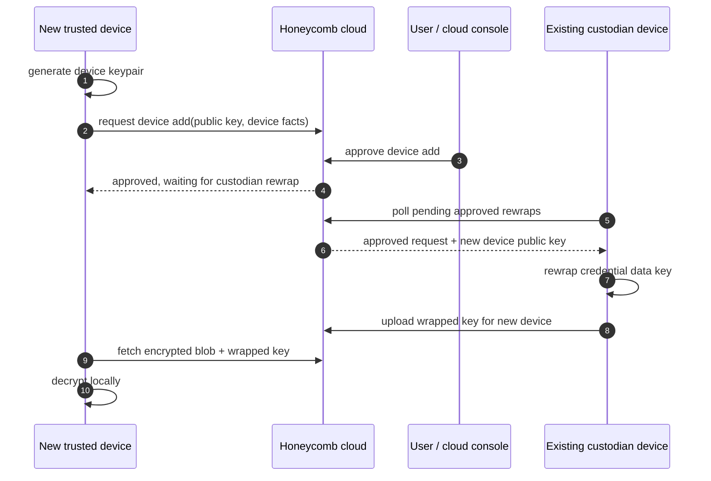
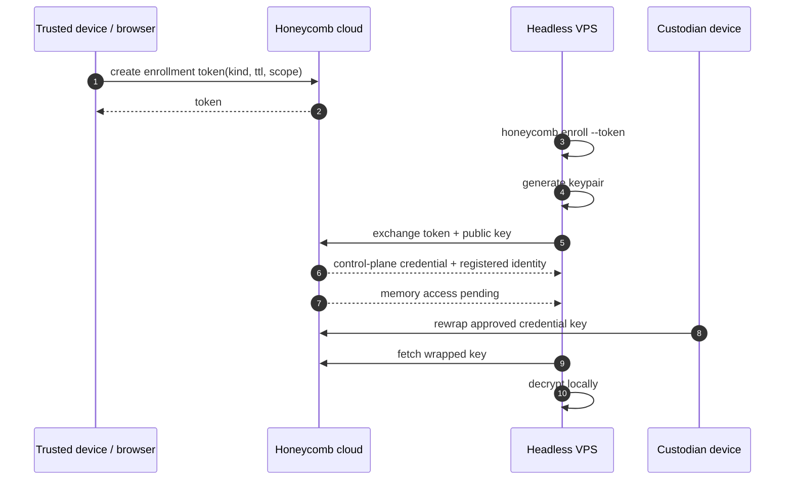

# ADR-0003, Trusted device custody and headless enrollment

> **Status:** Proposed (exploratory) | **Date:** 2026-06-29
> **Supersedes:** none | **Superseded by:** none
> **Owners:** auth, security, fleet, cloud-control-plane | **Related:** ADR-0002, PRD-054, PRD-055

## Context

ADR-0002 settles the fleet-orchestrator case: for Hermes/OpenClaw-style fleets, the customer's
orchestrator should be the long-lived custodian, while Honeycomb cloud stores only encrypted blobs
and control-plane state. That leaves the primary-device case: laptops, desktops, and durable
workstations that a person uses directly.

Primary devices are not disposable workers and should be allowed to become long-lived custodians.
They are also not fleet orchestrators by default. They need a smooth multi-device story: a user
should be able to add a second laptop or desktop without re-linking DeepLake every time, and without
Honeycomb becoming able to decrypt the DeepLake credential.

The hard UX question is approval. In a zero-knowledge custody model, Honeycomb cloud can record user
intent, but it cannot perform the cryptographic unwrap. Some existing custodian must rewrap the
DeepLake credential key to the new device's public key. Requiring both computers to be open at the
same time is poor UX; requiring an existing trusted device to participate eventually is acceptable.

There is also a headless enrollment case. A user may have an OpenClaw server or VPS with no browser.
They should be able to authenticate from a normal computer, generate a short-lived CLI enrollment
token, and run a command on the server. That enrollment token must register the server with
Honeycomb, not carry or decrypt the DeepLake credential by itself.

## Decision drivers

- **Honeycomb cloud must not be the default plaintext DeepLake credential custodian.**
- **Adding a primary device should not require simultaneous physical access to two machines.**
- **Headless machines must enroll without a browser.**
- **Enrollment tokens must grant join/register authority only, not memory access.**
- **A lost-all-devices recovery story must be honest: re-link DeepLake unless recovery material or
  explicit escrow exists.**
- **Terminology must distinguish primary/trusted devices from PRD-055's "primary daemon" mint/sign
  authority.**

## Terminology

Use these terms consistently:

| Term | Meaning |
|---|---|
| **Trusted device** | A durable user machine registered to Honeycomb with a local device keypair. |
| **Custodian device** | A trusted device that can decrypt or rewrap the DeepLake credential data key. |
| **Recovery device** | A custodian device marked as allowed to approve recovery/add-device requests. |
| **Fleet custodian** | A Hermes/OpenClaw orchestrator covered by ADR-0002. |
| **Ephemeral worker** | A disposable VM/agent with no long-lived custodian key. |
| **Primary daemon** | PRD-055 mint/sign authority. Avoid using this term for laptops/desktops. |

## Considered options

### Option A, Re-link DeepLake on every primary device

Every laptop or desktop performs Honeycomb auth and DeepLake auth independently. This is simple and
keeps secrets local, but it makes the two-auth problem recurring and prevents a clean "my devices
share the same memory plane" setup.

### Option B, Honeycomb cloud stores a backend-readable DeepLake credential

Honeycomb completes DeepLake auth in the cloud console, stores the credential encrypted with
application/KMS keys, and provisions devices on demand.

This is the best UX and the weakest default trust story. If Honeycomb backend can unwrap the value,
Honeycomb is a credential custodian. This can exist later as explicit escrow, but it is not the
default.

### Option C, Synchronous device-to-device approval

A new device requests access and an existing custodian device must be online at the same time to
approve and rewrap the credential key.

This preserves zero-knowledge custody, but the user has to have two machines open and responsive at
once. It is cryptographically clean and ergonomically annoying.

### Option D, Async cloud approval plus custodian rewrap (CHOSEN)

Honeycomb cloud records the user's approval intent and queues the cryptographic work. An existing
custodian device completes the rewrap the next time it is online. The new device can be approved in
the cloud UI immediately, but memory access becomes active only after a custodian has rewrapped the
credential key to the new device's public key.

This preserves zero-knowledge custody and removes the simultaneous-open requirement. The cost is
that a new device may sit in "approved, waiting for custodian" until an existing custodian checks in.

## Decision

Adopt **Option D** for primary/trusted devices.

Honeycomb will treat durable computers as trusted devices that generate their own local keypairs.
A trusted device becomes a custodian only after it has local access to the DeepLake credential, either
because it linked DeepLake directly or because an existing custodian rewrapped the credential data
key to that device's public key.

The cloud console is the approval surface. It authenticates the human, displays device details, and
records approval. It does not decrypt the DeepLake credential. The local custodian device is the
cryptographic actor. It receives an approved pending request, verifies the request, and writes a
new wrapped key for the approved device.

## Primary device onboarding

First device:

1. User signs into Honeycomb from the device.
2. The daemon/CLI generates a device keypair locally.
3. The device public key is registered with Honeycomb cloud.
4. The user links DeepLake on that device.
5. The device encrypts the DeepLake credential or credential data key locally.
6. Honeycomb Postgres stores ciphertext, device metadata, and wrapped-key metadata.
7. The device becomes a custodian device.

Additional device:

1. New device signs into Honeycomb.
2. New device generates a local keypair.
3. New device creates a device-add request with its public key and local device facts.
4. User approves the request in Honeycomb cloud.
5. Existing custodian device sees the approved request when it next checks in.
6. Existing custodian rewraps the credential data key to the new device public key.
7. New device downloads the encrypted blob plus its wrapped key and decrypts locally.
8. New device becomes a custodian device if policy allows it.



## Headless enrollment

Headless enrollment is the standard path for a VPS, server, or OpenClaw/Hermes machine without a
browser. It is a join/register flow, not a credential-recovery flow.

Example shape:

```bash
# On an already-authenticated trusted device.
honeycomb devices enroll-token create \
  --kind openclaw-orchestrator \
  --name openclaw-prod-01 \
  --ttl 10m

# On the headless VPS.
honeycomb enroll --token hc_enroll_...
```

The token permits the server to join the Honeycomb account/fleet and register a public key. It must
not contain the DeepLake credential, must not decrypt the encrypted credential blob, and must not
grant memory access by itself.

Headless flow:

1. User authenticates on an existing trusted device or in the cloud console.
2. User creates a short-lived, single-use or max-use bounded enrollment token.
3. User runs `honeycomb enroll --token ...` on the VPS.
4. The VPS generates a local keypair.
5. The VPS sends the token and public key to Honeycomb cloud.
6. Honeycomb validates token scope, expiry, usage count, and target kind.
7. Honeycomb registers the VPS as a trusted device, fleet custodian, or non-custodian server
   depending on the token kind.
8. DeepLake access remains pending until a custodian rewraps the credential key or the VPS links
   DeepLake directly.



## Enrollment token rules

Enrollment tokens must be constrained:

- short-lived by default, for example 10 minutes for manual copy/paste;
- single-use by default, or explicitly `max_uses` bounded for automation;
- scoped to org, fleet, device kind, and optional expected device name;
- unable to read memories, issue commands, decrypt DeepLake, or act as a bearer token for normal
  API use;
- revocable before use;
- audited when created, consumed, expired, rejected, or revoked;
- handled as sensitive material even with a short TTL. Headless flows should accept tokens through
  stdin, a mode-restricted temporary file, or an environment-variable handoff that does not write the
  token into shell history.

Longer-lived deploy tokens may exist for Terraform, DigitalOcean user data, or CI bootstrap, but
they should be called deploy tokens, carry a narrower scope, have explicit `max_uses`, and still not
grant DeepLake access by themselves.

## Recovery policy

Default recovery is explicit:

- If at least one custodian device remains, approve the new device in cloud and wait for a custodian
  to come online.
- If no custodian device remains, the user must re-link DeepLake on a new device.
- A saved recovery key or passphrase-backed recovery mode may be added later.
- Cloud escrow may be offered later only as an explicit opt-in mode where the user accepts that
  Honeycomb can recover/provision credentials.

The product should display this clearly. "Honeycomb cannot decrypt this by default" is a security
promise and a support constraint.

## Required invariants

- Honeycomb cloud records approval intent; it does not perform credential unwrap in the default
  mode.
- A new trusted device cannot receive DeepLake access until either a custodian rewraps the key, the
  user re-links DeepLake, or the user supplies recovery material.
- Headless enrollment tokens register devices; they do not decrypt or carry DeepLake credentials.
- A device keypair is generated on the device and the private key never leaves that device.
- Device-add requests include enough human-readable detail for safe approval, but no secrets.
- All device enrollment and rewrap events are auditable.

## Consequences

**Positive**

- Users can approve a new device in the cloud without having both computers open at the same time.
- Honeycomb keeps a zero-knowledge default for DeepLake credential sync.
- Browserless servers and VPSes can join through CLI enrollment.
- The same enrollment substrate can support personal devices, orchestrators, and automation tokens
  with different scopes.

**Negative / accepted**

- A new device may be approved but not fully usable until an existing custodian comes online.
- Losing every custodian forces DeepLake re-link unless recovery material exists.
- Support and UI must explain "approved" versus "credential available" as two different states.
- Automation users must protect enrollment/deploy tokens even though those tokens cannot decrypt
  DeepLake.

## Revisit triggers

Re-open this decision if any of these become true:

1. DeepLake provides native OAuth-style delegated tokens that can be minted per device without
   sharing a long-lived credential.
2. Device-add friction materially hurts onboarding enough to justify default cloud escrow.
3. Users routinely lose all custodians, making recovery key/passphrase work a P0.
4. Server enrollment needs fully unattended provisioning at large scale, requiring a separate deploy
   token ADR.

## Links

- ADR-0002: `library/knowledge/private/architecture/adr/0002-orchestrator-custodian-for-fleet-memory-plane.md`
- PRD-054: `library/requirements/backlog/prd-054-fleet-observation-control-plane/prd-054-fleet-observation-control-plane-index.md`
- PRD-055: `library/requirements/backlog/prd-055-fleet-control-enrollment-and-mint-authority/prd-055-fleet-control-enrollment-and-mint-authority-index.md`
- Secrets: `library/knowledge/private/security/secrets.md`
- Credential storage: `library/knowledge/private/security/credential-storage.md`
- Trust boundaries: `library/knowledge/private/security/trust-boundaries.md`
