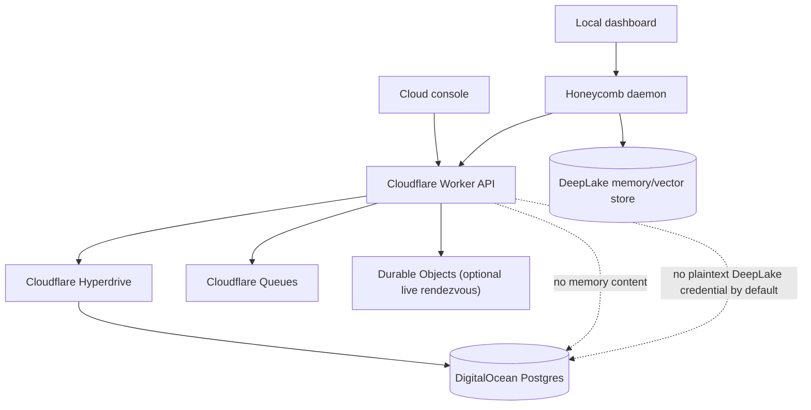

# ADR-0004, Honeycomb control plane and Postgres boundary

> **Status:** Proposed (exploratory) | **Date:** 2026-06-29
> **Supersedes:** none | **Superseded by:** none
> **Owners:** cloud-control-plane, security, operations | **Related:** ADR-0002, ADR-0003, PRD-054, PRD-055, PRD-062

## Context

PRD-062 documents the cost incident: idle Honeycomb installs were polling DeepLake-backed job queues
often enough that compute cost tracked install count instead of real usage. The immediate fix backs
off DeepLake polling. The longer-term architecture should remove non-memory coordination from
DeepLake entirely.

Honeycomb now has three distinct data classes:

- **Memory data plane:** memory, sessions, embeddings, RRF/vector recall, skill mining, and the
  durable data that DeepLake is meant to store.
- **Control plane:** account identity, devices, fleets, presence, leases, enrollment, approvals,
  feature flags, billing state, and health rollups.
- **Local machine plane:** loopback dashboard, local daemon diagnostics, local secrets, raw logs, and
  other sensitive machine-local details.

The proposed hosted control plane should use DigitalOcean-managed Postgres as the source-of-truth
database and Cloudflare as the edge/API layer. It should be cheap to query, boring to operate, and
deliberately narrow. It must not become a shadow memory store or a place where sensitive session
content accumulates.

## Decision drivers

- **Idle daemons must not poll DeepLake for control-plane work.**
- **DeepLake remains the memory/vector substrate.** Do not replace it with Postgres for recall.
- **Postgres stores coordination state, not captured content.**
- **Honeycomb cloud should not receive plaintext DeepLake credentials in the default mode.**
- **Tenancy must be simple to operate.** Start with one shared database and shared tables scoped by
  org/user identifiers, not database-per-user.
- **Cloud and local dashboard responsibilities must stay distinct.**
- **Avoid always-on compute unless proven necessary.** The default control plane should not require
  a Droplet just to serve API requests or enqueue small coordination work.
- **Avoid Redis/Valkey until the product has a workload that Postgres, Cloudflare Queues, or Durable
  Objects cannot handle.**

## Considered options

### Option A, Keep all coordination in DeepLake

This preserves the fewest moving pieces, but it repeats the cost problem PRD-062 exposed. Presence,
leases, enrollment, and heartbeat data are mutable, high-frequency, and ephemeral. They are the
wrong profile for the memory dataset.

### Option B, DigitalOcean Droplet API plus DigitalOcean Postgres

Honeycomb runs a long-lived Node/API service on a DigitalOcean Droplet and connects it to
DigitalOcean-managed Postgres.

This is familiar and easy to debug, but it introduces always-on compute, patching, process
supervision, scaling, and deployment work before Honeycomb has proven it needs long-running server
processes. It remains the fallback if edge/serverless constraints block the control plane.

### Option C, Cloudflare Workers plus DigitalOcean Postgres (CHOSEN)

Honeycomb serves the cloud API and dashboard from Cloudflare Workers. Workers connect to the existing
DigitalOcean-managed Postgres database through Cloudflare Hyperdrive, which provides connection
pooling/caching for Postgres access from Workers. Cloudflare Queues handles asynchronous control
jobs, retries, delayed work, and optional HTTP pull consumers. Durable Objects are reserved for
stateful per-device/per-fleet rendezvous such as live WebSocket sessions or custodian-online
coordination.

This keeps the default control plane mostly serverless while retaining normal Postgres as the system
of record. It also avoids a Droplet until Honeycomb has a concrete long-running workload.

### Option D, Use Cloudflare D1 as the control plane

D1 is attractive for low-cost serverless control-plane data, but it is SQLite-shaped and less
natural for team/account/backend operations that may need relational joins, migrations, billing
integration, and admin reporting. It remains a possible future edge cache or lightweight regional
presence layer.

### Option E, Database per user or cluster per user

This is strong isolation but poor operations for the default product. It complicates migrations,
pooling, backups, and cost. It may become an enterprise isolation tier later, but the default should
be a shared database with strict tenant columns and access checks.

### Option F, Add Redis/Valkey for coordination

Redis/Valkey would be useful for high-frequency ephemeral state, pub/sub, locks, or rate-limit
counters. It is not required for the MVP if Postgres owns durable state, Cloudflare Queues owns
asynchronous work, and Durable Objects own short-lived live coordination.

## Decision

Adopt **Option C**: build the Honeycomb-hosted control plane on **Cloudflare Workers + Cloudflare
Hyperdrive + DigitalOcean-managed Postgres**.

Do **not** start with a DigitalOcean Droplet for the API. Do **not** start with Redis/Valkey. Use a
Droplet or Valkey only after a documented workload requires it.

The control plane is a coordination substrate. It stores identity, device, fleet, enrollment,
approval, presence, lease, feature, billing, and encrypted-blob metadata. It does not store memory
content, session text, prompts, recall queries, raw logs, repo paths, local file paths, or plaintext
secrets.

The default tenant model is one shared Postgres database with shared tables and explicit tenant
columns (`org_id`, `user_id`, `fleet_id`, `device_id`) plus application-enforced authorization. If a
future hosted admin/reporting surface reads Postgres directly, row-level security should be added
before that access path exists.

## Boundary map

## Runtime Topology

The recommended MVP stack is:

| Layer | Choice | Reason |
|---|---|---|
| API and cloud dashboard | Cloudflare Workers | No always-on host for normal request/response work. |
| Database | DigitalOcean-managed Postgres | Normal relational source of truth for accounts, devices, fleets, billing, and encrypted metadata. |
| Postgres connection path | Cloudflare Hyperdrive | Lets Workers connect to existing Postgres with managed connection pooling/caching. |
| Async jobs | Cloudflare Queues | Retries, delays, dead-letter handling, and Worker or HTTP pull consumers. |
| Live per-device coordination | Durable Objects, only when needed | WebSocket/rendezvous/stateful coordination for online custodians or fleet rooms. |
| Periodic maintenance | Cloudflare Cron Triggers or queue-delayed jobs | TTL reaping, stale request cleanup, and audit compaction. |
| Always-on server | None in MVP | Add a Droplet only for a proven long-running workload. |
| Redis/Valkey | None in MVP | Add only if durable Postgres + Queues + Durable Objects are insufficient. |

This means the first production shape can be "entirely Cloudflare except the database," with
DigitalOcean providing only managed Postgres. DigitalOcean Droplets remain a fallback, not the
starting point.

## Queue, Presence, And Wakeup Policy

Not every coordination event needs a queue. The default split is:

- **Postgres tables** are the source of truth for devices, approvals, wrapped keys, enrollments,
  leases, and presence snapshots.
- **Cloudflare Queues** carry asynchronous side effects: send email, record audit fanout, process
  delayed cleanup, retry webhook delivery, notify an online custodian that a rewrap is pending, or
  bridge to future outside consumers.
- **Durable Objects** handle live fan-in/fan-out when the product needs a stateful room: for example
  a custodian device holding a WebSocket while the cloud console waits for "rewrap completed."
- **Daemon polling** remains acceptable at a cheap, low cadence against the control plane. It should
  never fall back to idle polling DeepLake for coordination.

Control-plane queues are not the memory pipeline. Memory extraction, RRF/recall, embeddings, and
DeepLake writes remain daemon/data-plane work unless a later ADR deliberately moves them.

## Redis/Valkey Policy

Do not add Redis/Valkey to the MVP.

Postgres already covers durable coordination. Cloudflare Queues covers async work. Durable Objects
cover stateful live sessions. Adding Valkey now creates another network, auth, backup, monitoring,
and failure mode without a proven need.

Add Redis/Valkey only if one of these becomes true:

1. Presence write/read volume is high enough that Postgres becomes the bottleneck even after
   reasonable TTL compaction and indexing.
2. The product needs low-latency pub/sub that Durable Objects cannot provide cleanly.
3. Distributed rate limiting or locks become central enough that Postgres row locks are the wrong
   tool.
4. Queue latency/semantics from Cloudflare Queues do not fit a measured workload.

Until then, keep the system boring: Postgres for durable rows, Queues for async work, Durable
Objects for live coordination.

## When To Add A Droplet

Add a DigitalOcean Droplet only after Workers/Queues/Durable Objects cannot meet a concrete
requirement. Good reasons include:

- long-running jobs that exceed Worker/Queue execution constraints;
- libraries or runtimes unavailable in Workers;
- private-network-only access to infrastructure that Cloudflare cannot reach safely;
- pull consumers or batch processors that need a conventional process supervisor;
- operational preference after production traffic proves the edge stack is harder than a small
  service.

If a Droplet is added, it should be a worker/processor tier first, not a replacement for the
Cloudflare API unless there is a specific reason.

## What belongs in Postgres

The control plane may store:

- users, orgs, memberships, roles, and billing/customer identifiers;
- device records, device public keys, device trust state, and last-seen metadata;
- fleet and orchestrator records;
- enrollment tokens, deploy tokens, and their audit metadata;
- pending device-add requests and rewrap jobs;
- encrypted DeepLake credential blobs and per-device/per-fleet wrapped keys that Honeycomb cannot
  decrypt in the default mode;
- heartbeat/presence rows and derived health state;
- cheap leases, wakeup flags, sync cursors, and "work available" signals that prevent DeepLake
  polling;
- feature flags, product configuration, and coarse operational health rollups;
- billing/subscription status and entitlement flags.

## What must not belong in Postgres

The control plane must not store:

- memory text, session traces, prompts, tool-call payloads, model responses, or summaries;
- recall query strings or per-memory/per-query item telemetry;
- local cwd, repo names, branch names, file paths, or raw log lines;
- plaintext DeepLake credentials in the default mode;
- local machine secret values;
- detailed error messages or stack traces that can carry paths, prompts, or secrets.

The cloud may store coarse, user-visible operational facts such as `deeplake_linked`, `last_seen`,
`daemon_version`, `health_state`, and `credential_status`. If a value would make a user lean in and
inspect it for private content, it belongs locally or in DeepLake, not in Postgres.

## Cloud dashboard versus local dashboard

The cloud dashboard owns:

- account login, org/team settings, billing, and entitlements;
- connected devices, fleets, orchestrators, and pending approvals;
- fleet health, last seen, version, and coarse status;
- DeepLake linked/unlinked state and credential sync state;
- enrollment/deploy token management;
- revocation, recovery, and escrow choices.

The local dashboard owns:

- raw local daemon health and diagnostics;
- harness wiring and setup/migration state for the current machine;
- local logs and troubleshooting;
- local secrets/vault state;
- memory debug views that may expose paths, prompts, or captured content;
- exact DeepLake credential details and local storage details.

Cloud can link to the local dashboard when reachable. It should not proxy raw local diagnostics
through the hosted control plane by default.

## Consequences

**Positive**

- Idle coordination becomes cheap and no longer bills through DeepLake compute.
- The product gains a natural home for account, device, fleet, and billing UX.
- The cloud dashboard can be useful without becoming a memory-content surface.
- Device and fleet custody decisions from ADR-0002 and ADR-0003 have a concrete storage boundary.
- The MVP avoids always-on API compute and avoids adding Valkey before the need is measured.

**Negative / accepted**

- Honeycomb now operates a real backend and must own migrations, backups, incident response, and
  tenant authorization.
- Users now have two identity relationships: Honeycomb control-plane auth and DeepLake memory auth.
- The cloud/local dashboard split must be designed intentionally or users will be confused about
  which surface controls what.
- Any future pressure to "just show the memory in cloud" must revisit this ADR.
- Cloudflare Workers, Hyperdrive, Queues, and Durable Objects become core operational dependencies.
- Some long-running work may later require a Droplet or pull-consumer tier.

## Required invariants

- DeepLake is only used for memory/vector/recall workloads, not heartbeat or idle lease polling.
- Postgres never stores memory content or raw local diagnostics.
- Default credential blobs in Postgres are not decryptable by Honeycomb cloud.
- A daemon failure to reach the control plane must fail soft for local memory operations where
  possible; loss of control-plane access should degrade coordination, not corrupt memory.
- Every Postgres row that is tenant-scoped carries explicit tenant identity.

## Revisit triggers

Re-open this decision if any of these become true:

1. DeepLake offers a cheap native control-plane/queue primitive that does not incur compute for idle
   polling.
2. DigitalOcean Postgres operations become a material reliability or cost issue.
3. Enterprise customers require database-per-org isolation as a default, not a premium mode.
4. The cloud dashboard is required to show raw memory/session content, changing the privacy boundary.
5. Workers/Queues/Durable Objects cannot support a measured long-running workload without a Droplet.
6. Postgres/Queues/Durable Objects cannot support measured coordination throughput without Valkey.

## Links

- ADR-0002: `library/knowledge/private/architecture/adr/0002-orchestrator-custodian-for-fleet-memory-plane.md`
- ADR-0003: `library/knowledge/private/architecture/adr/0003-trusted-device-custody-and-headless-enrollment.md`
- PRD-054: `library/requirements/backlog/prd-054-fleet-observation-control-plane/prd-054-fleet-observation-control-plane-index.md`
- PRD-055: `library/requirements/backlog/prd-055-fleet-control-enrollment-and-mint-authority/prd-055-fleet-control-enrollment-and-mint-authority-index.md`
- PRD-062: `library/requirements/completed/prd-062-deeplake-compute-cost-reduction/prd-062-deeplake-compute-cost-reduction-index.md`
- Trust boundaries: `library/knowledge/private/security/trust-boundaries.md`
- Cloudflare Hyperdrive: `https://developers.cloudflare.com/hyperdrive/`
- Cloudflare Queues: `https://developers.cloudflare.com/queues/`
- Cloudflare Durable Objects: `https://developers.cloudflare.com/durable-objects/`
- DigitalOcean managed databases: `https://docs.digitalocean.com/products/databases/`
