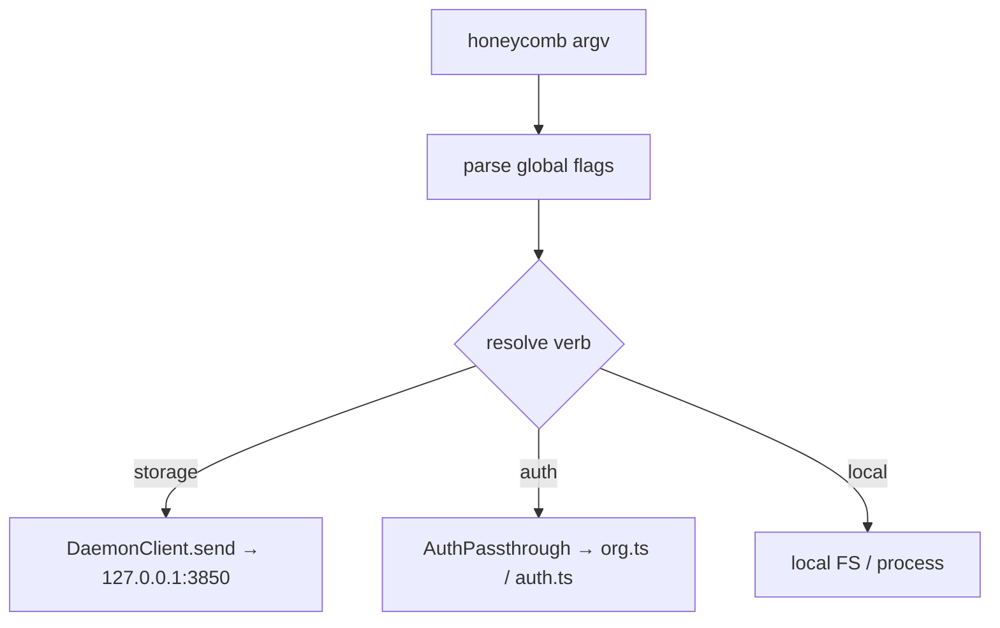

# CLI Dispatcher and Branded Help

> Category: Architecture | Version: 1.0 | Date: June 2026 | Status: Active

How the `honeycomb` CLI parses and routes a command, the merged verb table and its two independent axes (routing class and help group), the thin-client invariant that keeps a handler off DeepLake, and the branded grouped `--help` whose structure makes it impossible for a command to silently vanish from help.

**Related:**
- [`daemon-surface.md`](daemon-surface.md)
- [`system-overview.md`](system-overview.md)
- [`../auth/auth-architecture.md`](../auth/auth-architecture.md)
- [`../frontend/dashboard-actions-surface.md`](../frontend/dashboard-actions-surface.md)

---

## The thin-client model

The CLI is a thin client (PRD-020a). `src/cli/index.ts` parses global flags, then routes to a handler under `src/commands/`. A handler that touches storage reaches the daemon (`127.0.0.1:3850`) through the injected `DaemonClient` seam, the only path to a storage verb. No handler opens DeepLake, holds a storage handle, or builds storage SQL; `src/commands` is a non-daemon root, so a stray `daemon/storage` import fails the build. The CLI dispatches *intent* (route + body), never SQL; the daemon builds and guards the SQL and applies the tenancy scope from the shared credential.



## The merged verb table

`VERB_TABLE` (`src/commands/contracts.ts`) is the single source of truth for the command surface. Each `VerbSpec` carries a `verb` word and **two independent axes**:

- **`cls` (routing class)**, how the verb reaches its effect: `storage` routes through the daemon seam, `auth` passes through verbatim to the auth dispatcher, `local` touches only the local FS / process (still never DeepLake). `isStorageVerb()` proves the storage-never-DeepLake property from this one field.
- **`group` (help section)**, the presentation axis, which `--help` section the verb is listed under. This is independent of `cls`: `secret` routes through storage but reads naturally under "Agents, routing & config".

```ts
export interface VerbSpec {
  readonly verb: string;     // the top-level command word
  readonly cls: VerbClass;   // "storage" | "auth" | "local"  (routing)
  readonly group: VerbGroup; // derived from VERB_GROUPS       (presentation)
  readonly summary: string;  // the one-line --help summary
}
```

Auth passthrough is membership-based: `AUTH_SUBCOMMANDS` (`org`, `workspace`, `workspaces`, `project`, `whoami`, `login`, `logout`) forwards the verb plus its full argv tail verbatim to `src/cli/org.ts` / `src/cli/auth.ts`; the dispatcher does not re-parse their subcommands.

## Branded, grouped help, and the structural guard

`honeycomb` with no args and `honeycomb --help` print a branded usage built by `usageText()` (`src/commands/dispatch.ts`): a plain-ASCII honeycomb banner, the version line, the usage line, then every command grouped under its section. The banner is deliberately ASCII (no ANSI color or Unicode glyphs) so it renders identically across all six harnesses, when piped, and in non-TTY logs.

The section order and labels live in `VERB_GROUPS`, the single source of truth for the help groups:

| key | label |
|---|---|
| `memory` | Memory & recall |
| `knowledge` | Knowledge & skills |
| `agents` | Agents, routing & config |
| `account` | Account & workspaces |
| `system` | Setup & system |

The grouping is what makes help **provably exhaustive**. `VerbGroup` is a literal union *derived* from the `VERB_GROUPS` keys, so every `VerbSpec` must carry a valid group or the build fails; and `usageText()` walks `VERB_GROUPS` and filters `VERB_TABLE` by each key, so it only ever renders groups that exist and every table row lands in exactly one printed section. A command therefore cannot silently disappear from `--help`.

That guard exists for a concrete regression: `login`/`logout` were routable but were never in the old flat `VERB_TABLE`, so they were silently omitted from help. They are now first-class rows under `account`, and the required `group` field means a new verb cannot fall out of help the same way.

```
   __    __    __
  /  \__/  \__/  \     H O N E Y C O M B
  \__/  \__/  \__/
  /  \__/  \__/  \     shared agent memory for your coding tools
  \__/  \__/  \__/

honeycomb v<version>

usage: honeycomb <command> [options]

Memory & recall:
  remember   write a memory through the daemon ...
  recall     recall memories through the daemon
  ...
global flags: --help  --version  --json  --dry-run
```

## Verification

`tests/commands/dispatch.test.ts` covers the help cases, asserting the banner renders and that every `VERB_TABLE` verb (including `login`/`logout`) appears under exactly one printed `VERB_GROUPS` section, the executable form of the "no command hides from help" guarantee.
