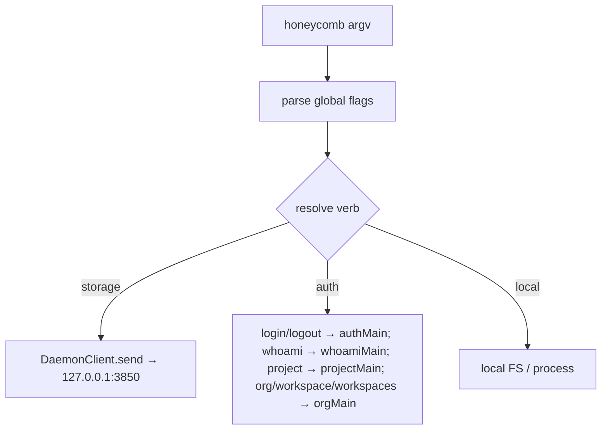

# CLI Dispatcher and Branded Help

> Category: Architecture | Version: 1.0 | Date: June 2026 | Status: Active

How the `honeycomb` CLI parses and routes a command, the merged verb table and its two independent axes (routing class and help group), the thin-client invariant that keeps a handler off DeepLake, and the branded `--help` that `usageText` builds through `@legioncodeinc/cli-kit`.

**Related:**
- [`daemon-surface.md`](daemon-surface.md)
- [`system-overview.md`](system-overview.md)
- [`../auth/auth-architecture.md`](../auth/auth-architecture.md)
- [`../frontend/dashboard-actions-surface.md`](../frontend/dashboard-actions-surface.md)

---

## The thin-client model

The CLI entry is `src/cli/index.ts`. Handlers live under `src/commands/`. Storage verbs reach the daemon at `127.0.0.1:3850`. Handlers do not open the DeepLake transport. Several handlers do import `src/daemon/runtime` (install, telemetry, settings, assets, status). `src/daemon-client` also imports `src/daemon/storage/sql.ts`. A `daemon/storage` import from `src/commands`, other than `src/daemon/storage/sql.ts`, fails `tests/daemon/storage/invariant.test.ts`, and `npm run ci` runs that test. The transport client is still constructed in the daemon.


```mermaid
flowchart TD
    I[honeycomb argv] --> P[parse global flags]
    P --> V{resolve verb}
    V -->|storage| D[DaemonClient.send → 127.0.0.1:3850]
    V -->|auth| A[login/logout → authMain; whoami → whoamiMain; project → projectMain; org/workspace/workspaces → orgMain]
    V -->|local| L[local FS / process]
```

## The merged verb table

`VERB_TABLE` (`src/commands/contracts.ts`) is the single source of truth for the command surface. Each `VerbSpec` carries a `verb` word and **two independent axes**:

- **`cls` (routing class)**, how the verb reaches its effect: `storage` routes through the daemon seam, `auth` passes through verbatim to the auth dispatcher, `local` touches only the local FS / process (still never DeepLake). `isStorageVerb()` returns `lookupVerb(verb)?.cls === "storage"` (`src/commands/contracts.ts`). The DeepLake import ban is `tests/daemon/storage/invariant.test.ts`, which `npm run ci` runs.
- **`group` (help section)**, the presentation axis stored on each spec. This is independent of `cls`: `secret` routes through storage and carries the `agents` group ("Agents, routing & config"). The printed banner sections come from cli-kit, described below.

```ts
export interface VerbSpec {
  readonly verb: string;     // the top-level command word
  readonly cls: VerbClass;   // "storage" | "auth" | "local"  (routing)
  readonly group: VerbGroup; // derived from VERB_GROUPS       (presentation)
  readonly summary: string;  // the one-line --help summary
}
```

Auth passthrough is membership-based: `AUTH_SUBCOMMANDS` (`org`, `workspace`, `workspaces`, `project`, `whoami`, `login`, `logout`) matches that set (`src/commands/contracts.ts`). `src/cli/runtime.ts` splits the dispatch: `login` and `logout` go to `authMain`, `whoami` to `whoamiMain` (`src/cli/whoami.ts`), `project` to `projectMain` (`src/cli/project.ts`), and `org`, `workspace`, and `workspaces` to `orgMain`. The dispatcher does not re-parse their subcommands.

## Branded help

`honeycomb` with no args and `honeycomb --help` print a branded usage built by `usageText()` (`src/commands/dispatch.ts`): a plain-ASCII honeycomb banner, the version line, and the usage line. The banner is deliberately ASCII (no ANSI color or Unicode glyphs) so it renders identically across all six harnesses, when piped, and in non-TTY logs.

`VERB_GROUPS` is still the type-level source for `VerbGroup` keys and labels:

| key | label |
|---|---|
| `memory` | Memory & recall |
| `knowledge` | Knowledge & skills |
| `agents` | Agents, routing & config |
| `account` | Account & workspaces |
| `system` | Setup & system |

`VerbGroup` is a literal union derived from those keys, so every `VerbSpec` must carry a valid group or the build fails. `usageText()` (`src/commands/dispatch.ts`) does the print through `renderProductBanner` from `@legioncodeinc/cli-kit`. It drops a baseline set (`start`, `stop`, `restart`, `status`, `logs`, `install`, `uninstall`, `service-install`, `service-uninstall`, `update`, `register`, `telemetry`) and passes the remaining rows as product commands. The comment above `VERB_GROUPS` in `src/commands/contracts.ts` still describes a walk of that list. Printed section labels are cli-kit's `COMMAND_GROUPS` plus `Global flags`, and the usage line is `Usage: honeycomb` (`tests/commands/dispatch.test.ts`). Global flags parsed before routing include `--help`, `--version`, `--json`, `--dry-run`, and `--no-color`.

`login`/`logout` were routable but were missing from the old flat `VERB_TABLE`, so they were omitted from help. They are now first-class `account` rows.

```
   __    __    __
  /  \__/  \__/  \     H O N E Y C O M B
  \__/  \__/  \__/
  /  \__/  \__/  \     shared agent memory for your coding tools
  \__/  \__/  \__/
```

`usageText` passes that ASCII art to `renderProductBanner`. The rendered usage line is `Usage: honeycomb`.

## Verification

`tests/commands/dispatch.test.ts` covers the help cases: the banner renders, every `VERB_TABLE` verb (including `login`/`logout`) appears in the text, and the section labels are `COMMAND_GROUPS` from `@legioncodeinc/cli-kit` plus `Global flags`.
