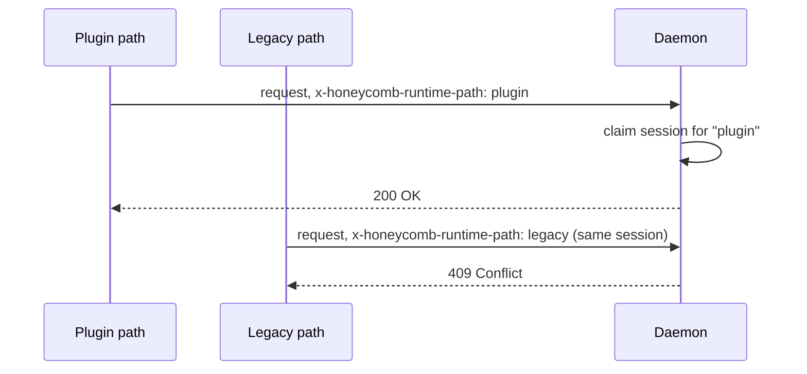

# Daemon Surface

> Category: Architecture | Version: 1.1 | Date: June 2026 | Status: Active

The daemon's externally visible surface: the HTTP server, its route groups, the file watcher, and the runtime-path contract that keeps integrations from colliding.

**Related:**
- [`system-overview.md`](system-overview.md)
- [`request-lifecycle.md`](request-lifecycle.md)
- [`../data/deeplake-storage.md`](../data/deeplake-storage.md)
- [`../integrations/harness-integration.md`](../integrations/harness-integration.md)
- [`../auth/auth-architecture.md`](../auth/auth-architecture.md)
- [`../standards/api-design-conventions.md`](../standards/api-design-conventions.md)

---

## The server

The honeycomb daemon runs an HTTP server, by default on `127.0.0.1:3850`. Port, host, and bind address are overridable through `HONEYCOMB_PORT`, `HONEYCOMB_HOST`, and `HONEYCOMB_BIND`, which is how a team deployment widens the bind beyond localhost. The root `/` serves the dashboard, `/health` is the liveness check, `/api/*` is the working API, `/memory/*` keeps search and similarity aliases, and `/mcp` is the Model Context Protocol endpoint. The daemon is the only process that opens DeepLake; every other surface reaches storage through it.

## Route groups

The API is organized into coherent groups. Permission semantics are defined in [`../auth/auth-architecture.md`](../auth/auth-architecture.md); in `local` mode every route is open, and in `team` and `hybrid` modes each protected route checks a role permission and, where the data model supports it, org/workspace and agent scope.

| Path group | Purpose | Permission |
|---|---|---|
| `/health`, `/api/status` | Liveness, version, resolved config and providers | none |
| `/api/auth/*` | Device-flow login, token issuance, whoami, org switch | varies |
| `/setup/*` | Pre-auth guided setup: credential-presence state, on-page device-flow login, Hivemind migration (loopback, local-mode only) | none |
| `/api/memories`, `/memory/*` | List, search, similarity, remember, recall, forget, modify, recover, and the session-start `prime` digest | scoped |
| `/api/assets/*` | Asset-sync substrate: publish, pull, tombstone synced assets across the team | scoped |
| `/api/hooks/*` | session-start, user-prompt-submit, pre-compaction, compaction-complete, session-end, synthesis | remember/recall |
| `/api/embeddings/*` | Vector export, health, 2D/3D projection | recall |
| `/api/documents/*`, `/api/sources/*` | Document ingest, source connect/index/health/purge | documents/source |
| `/api/connectors/*`, `/api/harnesses` | Connector registry and sync, harness config regenerate | connectors/local |
| `/api/skills`, `/api/rules`, `/api/goals`, `/api/kpis` | Skillify output, rules, goals and KPIs | scoped |
| `/api/graph/*` | Codebase graph query (find, impact, neighborhood, tour) | scoped |
| `/api/ontology/*` | Entities, aspects, proposals, assertions, apply | mutation |
| `/api/secrets/*` | List names, store, delete, exec with secrets | admin/secret |
| `/api/org/*`, `/api/workspace/*` | Tenancy admin and switching | admin |
| `/api/diagnostics`, `/api/pipeline/*`, `/api/repair/*` | Health report, pipeline stats, operator repair | diagnostics/operator |
| `/api/inference/*`, `/v1/*` | Native inference routing and OpenAI-compatible gateway (gateway implemented; external HTTP mount deferred, the router is reached internally via the `ModelClient` seam) | deferred |
| `/api/tasks/*`, `/api/logs`, `/api/update/*`, `/api/git/*` | Scheduled tasks, logs, updates, git sync | local |
| `/api/actions/*` | Dashboard lifecycle actions (logout, embeddings on/off, restart, uninstall) | local + CSRF |
| `/` | Dashboard static assets | none |

The `/api/actions/*` group gives the dashboard CLI-parity for the sharp lifecycle actions; it runs behind a stricter guard than a settings write (local-mode only plus origin/CSRF plus the dashboard session header). The surface and its guard are documented in [`../frontend/dashboard-actions-surface.md`](../frontend/dashboard-actions-surface.md).

## The file watcher

The watcher is the daemon's non-HTTP input. It watches the workspace identity files (`agent.yaml`, `AGENTS.md`, `SOUL.md`, `MEMORY.md`, `IDENTITY.md`, `USER.md`) and known harness project-memory paths. On change it runs two debounced jobs: harness sync regenerates the per-harness copies (for example `~/.claude/CLAUDE.md`) from the canonical workspace files, each stamped with a do-not-edit header; git auto-commit stages and commits the workspace with a timestamped message when git sync is enabled. The workspace identity files stay on local disk even though durable memory lives in DeepLake; the layout is documented in [`../data/workspace-layout.md`](../data/workspace-layout.md).

## Runtime path negotiation

A harness session can be reachable through more than one integration surface: an install-time connector path and a runtime plugin path. To stop both from writing into one session, the daemon claims a session for the first path that touches it.



Connectors send `x-honeycomb-runtime-path` set to `plugin` or `legacy`. Once a session is claimed, the other path gets `409` on that session. Stale claims expire after a few hours and are swept, so a crashed harness does not lock a session forever. For triage of duplicated memory or high-token reports, confirm only the intended path is active.

## Health and diagnostics

`/health` is the cheap check (liveness, uptime, version, coarse pipeline status). `/api/status` is the full picture including resolved providers and tenancy. `/api/diagnostics` runs a live report across the daemon's subsystems (queue, storage, index, provider, mutation, connector), and `/api/repair/*` exposes the operator actions that act on what diagnostics finds. The environment-side health checks that the CLI and harness shims run (daemon reachability, login state, hooks wired) are documented in [`../operations/notifications-and-health.md`](../operations/notifications-and-health.md).

## Daemon lifecycle: OS-native service, spawn fallback

The daemon is brought up by a detached `spawn()` that dies with the machine and is not restarted on crash. PRD-064h makes the OS service manager the **liveness floor** without removing that path: `src/cli/daemon-service.ts` registers the daemon as a userland service (launchd LaunchAgent on macOS, `systemd --user` on Linux, a per-user Scheduled Task on Windows), and `src/cli/runtime.ts` **prefers service mode** when a manager is available, falling back to the detached spawn where registration is impossible (CI, locked-down machines, tests) or when `HONEYCOMB_DAEMON_SERVICE=spawn` forces it. The generated unit pins the working directory and `HONEYCOMB_WORKSPACE` to the caller-resolved writable workspace, so a service-started daemon never boots from an unwritable cwd (the "secrets 502" class). The intelligent healing layer above this floor (probe, restart with backoff, remediation ladder, escalation, gated auto-update) is Doctor, documented in [`../operations/doctor-watchdog.md`](../operations/doctor-watchdog.md).

## Boot readiness contract

The v0.1.12 hotfix (PR #190, recorded as [ADR-0007](adr/0007-daemon-readiness-over-boot-time-deeplake-and-graph-work.md)) pins down what "ready" means so Doctor and the CLI can tell a booting daemon from a dead one. The contract is deliberately local and cheap:

```text
Daemon ready = listener bound + /health reachable.
```

The motivating failure was a Honeycomb v0.1.11 crash-loop on macOS arm64 (Node 22.22.3): a WASM `Aborted()` in the bundled tree-sitter graph path could terminate the process before it ever bound `127.0.0.1:3850`, and because a WASM abort is not a catchable JavaScript exception, wrapping the build in `try/catch` did not save the boot. The fix moves optional and remote work off the readiness gate rather than trying to make it safe in place.

Three things that used to sit in the boot-critical path are now **outside** the readiness gate, observable through health state but never owning listener availability:

- **Codebase graph auto-build.** No longer default boot work. It is opt-in with `HONEYCOMB_CODEBASE_GRAPH_AUTO_BUILD=true`; manual graph APIs and explicitly requested builds (the post-commit hook, `honeycomb graph build`, the SessionEnd path documented in [`../data/codebase-graph.md`](../data/codebase-graph.md)) stay wired regardless.
- **The first DeepLake/storage health probe.** In production local boot it runs in the background, so a slow or unreachable backend cannot delay binding. Test and injected-storage harnesses may still await it for deterministic assertions.
- **Shared local queue warmup.** The scheduler starts promptly; table creation and the first reaper sweep run in the background. Enqueue, lease, and reaper operations must heal or fail soft if warmup has not finished, so the first queue op after process start can race warmup safely.

Keeping remote storage round trips off local readiness also reinforces the idle-cost posture of [ADR-0006](adr/0006-local-queue-as-interim-idle-cost-control.md): local availability should not keep Activeloop or DeepLake compute warm.

### macOS stop semantics

The `ai.honeycomb.daemon` launchd agent runs with `KeepAlive=true`, which is correct for crash recovery and login startup but means a stop that only signals the child process lets launchd immediately respawn it, silently keeping backend compute warm after the user believed the daemon was stopped. On macOS, `honeycomb daemon stop` therefore unloads the agent with `launchctl bootout` rather than only signaling the process, so explicit stop matches user intent while `KeepAlive` still covers crashes and logins.

One companion nuance: Doctor treats roughly the first 60 seconds as booting/settling time per the health PRD work, but that grace window is a diagnostic period, not a license for the daemon to delay binding. The daemon still binds as fast as the readiness contract allows.
