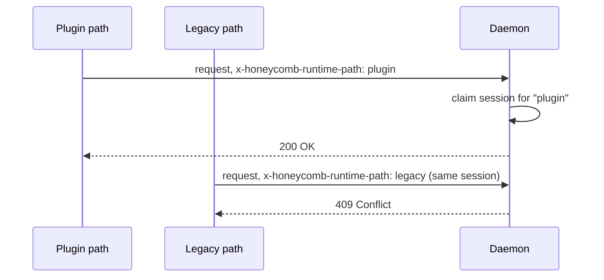

# Daemon Surface

> Category: Architecture | Version: 1.0 | Date: June 2026 | Status: Active

The daemon's externally visible surface: the HTTP server, its route groups, the file watcher, and the runtime-path contract that keeps integrations from colliding.

**Related:**
- [`system-overview.md`](system-overview.md)
- [`request-lifecycle.md`](request-lifecycle.md)
- [`../data/deeplake-storage.md`](../data/deeplake-storage.md)
- [`../integrations/harness-integration.md`](../integrations/harness-integration.md)
- [`../auth/auth-architecture.md`](../auth/auth-architecture.md)
- [`../standards/api-design-conventions.md`](../standards/api-design-conventions.md)

---

## The server

The honeycomb daemon runs an HTTP server, by default on `127.0.0.1:3850`. Port, host, and bind address are overridable through `HONEYCOMB_PORT`, `HONEYCOMB_HOST`, and `HONEYCOMB_BIND`, which is how a team deployment widens the bind beyond localhost. The root `/` serves the dashboard, `/health` is the liveness check, `/api/*` is the working API, `/memory/*` keeps search and similarity aliases, and `/mcp` is the Model Context Protocol endpoint. The daemon is the only process that opens DeepLake; every other surface reaches storage through it.

## Route groups

The API is organized into coherent groups. Permission semantics are defined in [`../auth/auth-architecture.md`](../auth/auth-architecture.md); in `local` mode every route is open, and in `team` and `hybrid` modes each protected route checks a role permission and, where the data model supports it, org/workspace and agent scope.

| Path group | Purpose | Permission |
|---|---|---|
| `/health`, `/api/status` | Liveness, version, resolved config and providers | none |
| `/api/auth/*` | Device-flow login, token issuance, whoami, org switch | varies |
| `/setup/*` | Pre-auth guided setup: credential-presence state, on-page device-flow login, Hivemind migration (loopback, local-mode only) | none |
| `/api/memories`, `/memory/*` | List, search, similarity, remember, recall, forget, modify, recover, and the session-start `prime` digest | scoped |
| `/api/assets/*` | Asset-sync substrate: publish, pull, tombstone synced assets across the team | scoped |
| `/api/hooks/*` | session-start, user-prompt-submit, pre-compaction, compaction-complete, session-end, synthesis | remember/recall |
| `/api/embeddings/*` | Vector export, health, 2D/3D projection | recall |
| `/api/documents/*`, `/api/sources/*` | Document ingest, source connect/index/health/purge | documents/source |
| `/api/connectors/*`, `/api/harnesses` | Connector registry and sync, harness config regenerate | connectors/local |
| `/api/skills`, `/api/rules`, `/api/goals`, `/api/kpis` | Skillify output, rules, goals and KPIs | scoped |
| `/api/graph/*` | Codebase graph query (find, impact, neighborhood, tour) | scoped |
| `/api/ontology/*` | Entities, aspects, proposals, assertions, apply | mutation |
| `/api/secrets/*` | List names, store, delete, exec with secrets | admin/secret |
| `/api/org/*`, `/api/workspace/*` | Tenancy admin and switching | admin |
| `/api/diagnostics`, `/api/pipeline/*`, `/api/repair/*` | Health report, pipeline stats, operator repair | diagnostics/operator |
| `/api/inference/*`, `/v1/*` | Native inference routing and OpenAI-compatible gateway | varies |
| `/api/tasks/*`, `/api/logs`, `/api/update/*`, `/api/git/*` | Scheduled tasks, logs, updates, git sync | local |
| `/` | Dashboard static assets | none |

## The file watcher

The watcher is the daemon's non-HTTP input. It watches the workspace identity files (`agent.yaml`, `AGENTS.md`, `SOUL.md`, `MEMORY.md`, `IDENTITY.md`, `USER.md`) and known harness project-memory paths. On change it runs two debounced jobs: harness sync regenerates the per-harness copies (for example `~/.claude/CLAUDE.md`) from the canonical workspace files, each stamped with a do-not-edit header; git auto-commit stages and commits the workspace with a timestamped message when git sync is enabled. The workspace identity files stay on local disk even though durable memory lives in DeepLake; the layout is documented in [`../data/workspace-layout.md`](../data/workspace-layout.md).

## Runtime path negotiation

A harness session can be reachable through more than one integration surface: an install-time connector path and a runtime plugin path. To stop both from writing into one session, the daemon claims a session for the first path that touches it.

Connectors send `x-honeycomb-runtime-path` set to `plugin` or `legacy`. Once a session is claimed, the other path gets `409` on that session. Stale claims expire after a few hours and are swept, so a crashed harness does not lock a session forever. For triage of duplicated memory or high-token reports, confirm only the intended path is active.

## Health and diagnostics

`/health` is the cheap check (liveness, uptime, version, coarse pipeline status). `/api/status` is the full picture including resolved providers and tenancy. `/api/diagnostics` runs a live report across the daemon's subsystems (queue, storage, index, provider, mutation, connector), and `/api/repair/*` exposes the operator actions that act on what diagnostics finds. The environment-side health checks that the CLI and harness shims run (daemon reachability, login state, hooks wired) are documented in [`../operations/notifications-and-health.md`](../operations/notifications-and-health.md).
