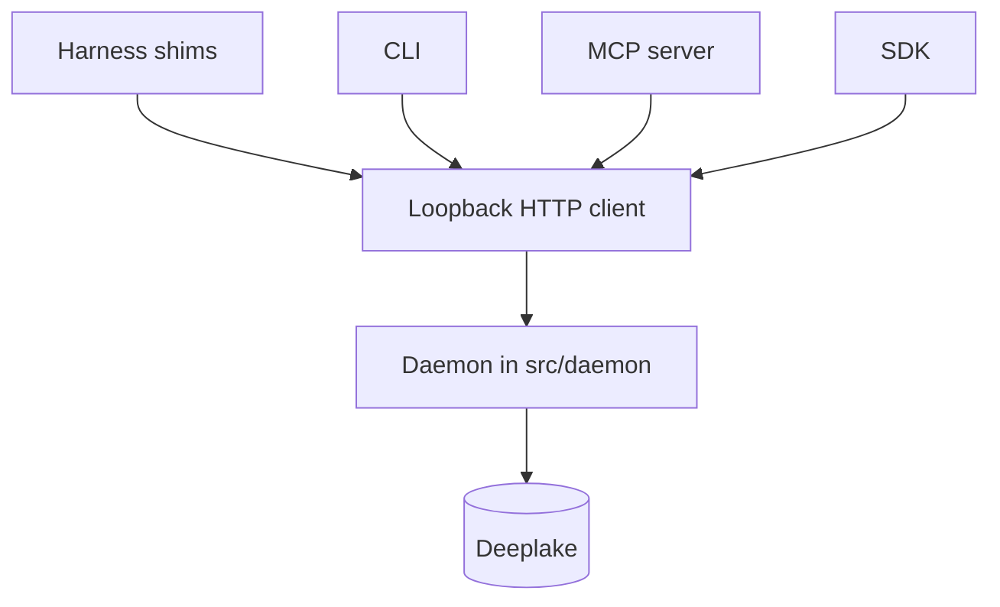

# Load-Bearing Boundaries

> Category: Architecture | Version: 1.0 | Date: October 2026 | Status: Active

The rules that keep Honeycomb one daemon plus thin clients: import direction, Deeplake confinement, service injection, shared constants, and SQL escaping.

**Related:**
- [System Overview](system-overview.md)
- [Daemon Surface](daemon-surface.md)
- [Developer Workflow](../operations/developer-workflow.md)
- [Deeplake Storage](../data/deeplake-storage.md)
- [Harness Integration](../integrations/harness-integration.md)
- [Coding Standards (TypeScript)](../standards/coding-standards-typescript.md)

---

## Why these boundaries exist

Honeycomb is one npm package, `@legioncodeinc/honeycomb`, licensed AGPL-3.0-or-later, described in `package.json` as a long-lived daemon plus thin clients for six coding harnesses, the unified CLI, the MCP server, and the embed daemon (`package.json:2-11`). The license header every new source file carries is `docs/license-header.txt:1-5`. The product name in docs and in the CLI is Honeycomb; the slug is `honeycomb` (`src/shared/constants.ts:34-35`).

The shape that makes that package safe to extend is a single storage client. Harness shims, the CLI, the MCP server, and the SDK reach a loopback daemon. Only the daemon opens Deeplake. The rest of this document is the set of rules that keep that split true in the source tree.

## Fixed build direction

There are no npm workspaces. `@honeycomb/*` names are TypeScript path aliases (`tsconfig.json:20-27`, `BUILD.md:3-6`). One `tsc` pass type-checks the whole graph. The order is an import direction, recorded in `package.json:12` and spelled out in `BUILD.md:15-32`:

| Tier | Roots | May import |
|---|---|---|
| 1, core | `src/shared`, `src/daemon-client` | tier 1 only |
| 2, daemon | `src/daemon` | tier 1 |
| 3, embeddings | `embeddings/src` | tier 1 |
| 4, clients | `harnesses/*/src`, `mcp/src`, `src/cli`, `src/sdk`, `src/hooks`, `src/dashboard`, `src/connectors`, `src/commands` | tier 1 (`daemon-client` and `shared`) |
| 5, bundles | esbuild outputs | the compiled graph |

`package.json` exports the SDK as `.`, `/react`, `/vercel`, and `/openai`, and `esbuild.config.mjs` bundles those four entries from `src/sdk`. A file imports only from its own tier or a lower-numbered tier in the intended build order (`BUILD.md`). That rule is not absolute in this tree. `src/commands` and `src/cli` import daemon runtime modules (auth, telemetry, onboarding, harness detection). `src/daemon-client` imports SQL helpers from `src/daemon/storage/sql.ts`. The DeepLake transport client stays under `src/daemon`. `src/eval/deeplake-stress.ts` imports the `DeepLakeTransport` type and the `TransportError` value from `src/daemon/storage/transport.ts`. Harness adapters stay on the thin client. The esbuild entry roots for the six harnesses, the daemon, the CLI, the MCP server, and the embed daemon are listed in `BUILD.md`.

## Deeplake stays inside the daemon

`BUILD.md:29-32` states the confinement rule: the Deeplake access path lives only in `src/daemon`. The daemon server module repeats it: the daemon is the only Deeplake client, and handlers reach storage through the injected client (`src/daemon/runtime/server.ts:13-16`). The composition root `assembleDaemon()` is the production caller that constructs the live storage client, and it is allowed to because the file lives under `src/daemon/` (`src/daemon/runtime/assemble.ts:1-6`).

The CLI entry imports the dispatcher and `./runtime`, and its header forbids importing the daemon core or any Deeplake path (`src/cli/index.ts:1-7`). The live HTTP client the CLI and the session-start seam actually call is `createLoopbackDaemonClient`, a `fetch` to `http://127.0.0.1:3850` (`src/commands/contracts.ts:356-362`, `src/commands/contracts.ts:471-480`, `src/cli/runtime.ts:751`). That interface has `send` and `ping`. It has no `query(sql)` method, so a CLI verb dispatches a route and a body, and the daemon builds the SQL (`src/commands/contracts.ts:364-374`).

`src/daemon-client/index.ts:1-12` is a separate ping-shaped module whose header still calls itself a stub awaiting a later transport. The production loopback `fetch` used by the CLI is the function in `src/commands/contracts.ts`, not that stub's `ping`.

## Services plug in through createDaemon

`createDaemon(options)` builds the Hono app and does not listen by itself (`src/daemon/runtime/server.ts:18-21`, `src/daemon/runtime/server.ts:230`). Route groups are scaffolded in `ROUTE_GROUPS` so a later module attaches handlers with `daemon.group(path)` and inherits the middleware already mounted (`src/daemon/runtime/server.ts:68-106`, `src/daemon/runtime/server.ts:206-213`).

`DaemonServices` carries `queue`, `watcher`, `runtimePath`, `embed`, and `telemetry`. `createDaemon` fills any omitted field with `noopJobQueueService`, `noopFileWatcherService`, `noopRuntimePathService`, `noopEmbedSupervisor`, or `noopTelemetryService` (`src/daemon/runtime/server.ts:233-238`). The options-field comment at `src/daemon/runtime/server.ts:169-170` is the `services?: Partial<DaemonServices>` note. `src/daemon/runtime/CONVENTIONS.md:10-14` tells a later service author to pass the real implementation into `createDaemon({ services })` and to leave `server.ts`, `index.ts`, `config.ts`, `logger.ts`, and the permission middleware alone. The 004b section of that note also says to leave `services/types.ts` alone (`src/daemon/runtime/CONVENTIONS.md:100`). The same note says a service receives a `StorageQuery` and does not open Deeplake itself (`src/daemon/runtime/CONVENTIONS.md:60-74`).

## Shared constants live in one file

`DAEMON_PORT` is `3850` and `DAEMON_HOST` is `"127.0.0.1"` (`src/shared/constants.ts:13-17`). `HIVE_PORT` is `3853` and `HIVE_HOST` is `"127.0.0.1"` (`src/shared/constants.ts:19-23`). `HONEYCOMB_VERSION` reads the esbuild `__HONEYCOMB_VERSION__` token, with a `0.0.0-dev` fallback before bundling (`src/shared/constants.ts:31-32`). The file header says no other target may re-declare these values, and that `npm run dup` flags a copy (`src/shared/constants.ts:1-6`).

## SQL values go through the helpers

The Deeplake HTTP query endpoint binds no parameters. `sqlStr`, `sqlLike`, `sqlIdent`, and `eLiteral` are the binding (`src/daemon/storage/sql.ts:1-16`). `sqlStr` doubles backslashes and single quotes (`src/daemon/storage/sql.ts:42-50`). `sqlLike` escapes `%`, `_`, and the backslash before the literal-quote passes (`src/daemon/storage/sql.ts:77-80`). `sqlIdent` accepts only a bare identifier and throws otherwise (`src/daemon/storage/sql.ts:100-105`). `npm run audit:sql` runs `scripts/audit-sql-safety.mjs`, and `npm run ci` includes that audit (`package.json:73-84`).

## Loopback is the default bind

The runtime config resolver defaults the listen address to `127.0.0.1:3850`. `HONEYCOMB_PORT`, `HONEYCOMB_HOST`, and `HONEYCOMB_BIND` override port, host, and bind address, and the resolver's own comment gives `0.0.0.0` as the example of an explicit widen (`src/daemon/runtime/config.ts:10-15`). `widened` records whether the bind left loopback (`src/daemon/runtime/config.ts:60-73`). The constant file's comment on `DAEMON_HOST` says the default host is loopback (`src/shared/constants.ts:16-17`). Those two comments are both in the tree: the constant is the default, and the resolver is the explicit override.

The browser the install verb opens is not that daemon port. `loopbackDashboardUrl()` returns `http://127.0.0.1:3853/` (`src/commands/install.ts:64-74`). `openDashboard` returns the Hive portal base URL on `HIVE_PORT` plus `/` (`src/dashboard/launch.ts:149-178`). When that portal does not answer, the install path prints a command whose `--products` list is `honeycomb,doctor,hive` (`src/commands/install.ts:88-93`). The daemon route table scaffolds a `/` group with `protect: false` (`src/daemon/runtime/server.ts:105`). Setup routes mount on that group: `SETUP_LOGIN_GROUP`, `SETUP_STATE_GROUP`, `SETUP_TENANCY_GROUP`, and `SETUP_MIGRATE_GROUP` are `"/"` (`src/daemon/runtime/dashboard/setup-login.ts`, `setup-state.ts`, `setup-tenancy.ts`, `setup-migrate.ts`), and each module calls `daemon.group` on that constant, including `POST /setup/login`. `src/daemon/runtime/dashboard/host.ts` is absent, so the group carries those setup routes and no dashboard page.

## Where the other narratives already live

Memory zoom levels (key, summary, raw) are the three-tier strategy: `memory.key` and `memories.key` are `TEXT NOT NULL DEFAULT ''` (`src/daemon/storage/catalog/sessions-summaries.ts:112-115`, `src/daemon/storage/catalog/memories.ts:53-58`), `memory.summary` is the summary body (`src/daemon/storage/catalog/sessions-summaries.ts:94-107`), and `sessions.message` is JSONB (`src/daemon/storage/catalog/sessions-summaries.ts:31-40`). The narrative is [Three-Tier Memory Strategy](../ai/three-tier-memory-strategy.md). Embedding width is `EMBEDDING_DIMS = 768` (`src/daemon/storage/vector.ts:34-35`). The vector module's header describes the `<#>` cosine path as GPU-backed search (`src/daemon/storage/vector.ts:1-13`).

Production harness support is the set `claude-code`, `codex`, and `cursor`. Hermes, pi, and OpenClaw are marked `in-progress` (`src/daemon/runtime/dashboard/harness-registry.ts:137-147`, `src/daemon/runtime/dashboard/harness-registry.ts:155-156`). The detector's header says those three have no Honeycomb connector yet (`src/daemon/runtime/dashboard/harness-detect.ts:23-27`). The narrative is [Harness Integration](../integrations/harness-integration.md).

When embeddings do not produce a 768-dim query vector, `recallMemories` runs the lexical arms only and sets `degraded` (`src/daemon/runtime/memories/recall.ts:37-48`). Those arms call `buildLexicalMatchSql`, which emits `ILIKE` predicates. That function's comment states that Deeplake's `deeplake_index` is not wired on this path (`src/daemon/runtime/memories/recall.ts:519-530`, `src/daemon/runtime/memories/recall.ts:584-666`). The recall narrative is [Retrieval](../ai/retrieval.md).
