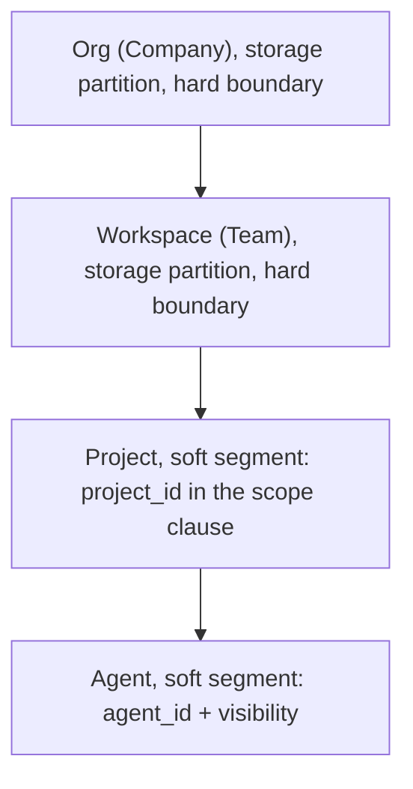
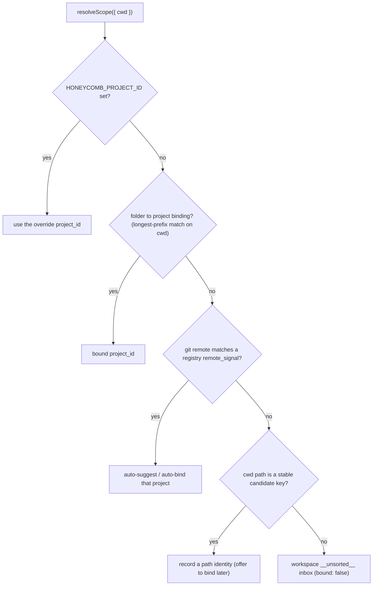
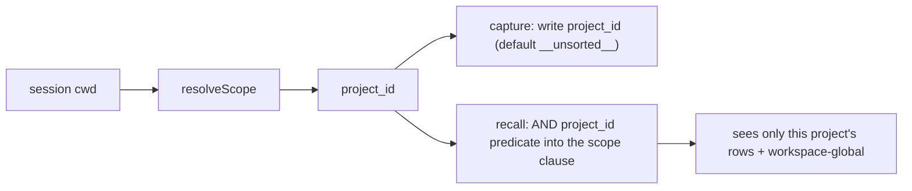

# Multi-Project Isolation and Context Switching

> Category: Architecture | Version: 1.0 | Date: June 2026 | Status: Active

How Honeycomb scopes memory and skills per project inside a workspace, derives a project identity per session from the working directory, and lets a developer move between repos, workspaces, and orgs without cross-project bleed.

**Related:**
- [`../multi-tenant/org-workspace-model.md`](../multi-tenant/org-workspace-model.md)
- [`../security/scoping-and-visibility.md`](../security/scoping-and-visibility.md)
- [`../security/credential-storage.md`](../security/credential-storage.md)
- [`../data/schema.md`](../data/schema.md)
- [`../collaboration/team-skills-sharing.md`](../collaboration/team-skills-sharing.md)

---

## The problem with one global workspace

A developer rarely works in one project at a time. Several repos are open at once across Claude Code, Cursor, and Codex, and harnesses like Hermes and OpenClaw may run in a scratch directory with no git repository at all. Each of those is a different body of work, often a different team, sometimes a different company.

Honeycomb used to resolve tenancy from a single machine-global field: `workspaceId` in `~/.deeplake/credentials.json`, switched by hand with `honeycomb workspace use`. That breaks the instant two projects are open at once. Every concurrent harness session reads the same `workspaceId`, so a memory captured while working in project A lands in, and is recalled into, whichever workspace the user last switched to, regardless of which directory the session is actually running in. Skills propagate the same way, and the dashboard's project-specific views can only ever show the one globally selected scope.

The fix introduces **Project** as a first-class, automatically resolved segmentation dimension *inside* a workspace, and makes scope **per-session, not per-machine**. The tenancy now reads as three levels:

> **Org = Company → Workspace = Team → Project = a folder-bound segment of a team's work.**

## Why project lives inside the workspace

The third level deliberately lives **inside** the workspace, not above it. A Team (workspace) owns many projects, so binding a project to its own workspace would shatter the team grouping. This placement also fixes the trust level: two companies are a hard security boundary, but two projects within one team are not. So Org and Workspace stay the **outer ring**, hard isolation enforced at the DeepLake storage partition, and Project joins the **inner ring**, the soft column-and-clause segmentation that already carries `agent_id` and `visibility`. The two rings are described in [`../security/scoping-and-visibility.md`](../security/scoping-and-visibility.md).

## A project is a folder-bound identity, not a repo id

A **Project** is a registry-backed identity that **folders are assigned to**. It is explicitly *not* a GitHub repository id, for two reasons. First, repos do not exist in OpenClaw, Hermes, or scratch directories, so a repo id cannot be the universal key. Second, the codebase already keys "Repository-style" scope off the working directory (`projectDir ?? process.cwd()`), never a GitHub id. A git remote, when present, acts only as an optional auto-bind *signal* that proposes a binding, it is never the identity itself.

Three pieces make this work: a `projects` **registry** table (one per workspace), a **folder→project binding** store, and a pure **resolution function** that always yields a usable `project_id`.

### The registry table

The `projects` table is a cross-cutting tenant-scoped registry. It carries explicit `org_id` and `workspace_id` columns (like `agents` and `synced_assets`), because a project belongs to exactly one `(org_id, workspace_id)`. It is UPDATE-or-INSERT keyed by `project_id`, project CRUD is low-frequency and human-driven (create a project, rename it, edit its match rules), never a hot concurrent write. The full DDL is in [`../data/schema.md`](../data/schema.md); the columns that matter for resolution are:

- `project_id`, the stable registry key a folder binds to and a memory, session, or skill row references. Not a GitHub repo id.
- `remote_signal`, the canonicalized git remote (`host/owner/repo`, e.g. `github.com/acme/api`), stored as a discrete column so the git-signal branch is a single indexed `WHERE remote_signal = …` equality lookup. Canonicalization (folding `git@github.com:acme/api.git` and `https://github.com/acme/api` to one form) is the resolver's job; the registry stores and matches the canonical string verbatim.
- `bound_paths`, a JSON array of normalized absolute path prefixes, read whole by the longest-prefix matcher and never filtered field-by-field in SQL.
- `is_reserved`, set only on the per-workspace `__unsorted__` inbox row.

### The reserved inbox

Every workspace has a reserved `__unsorted__` project, the capture inbox. A session that resolves no binding, no git signal, and no path candidate falls to this project so capture is **never dropped**. This mirrors how `agent_id` defaults to `'default'`: the inner ring defaults to a known bucket on the unknown rather than failing the write. The id `__unsorted__` is reserved, a user-created project may not adopt it (by id or by the reserved display name "Unsorted"); a create path routes through a collision guard that raises a structured `ReservedProjectIdError` before writing.

## Per-session resolution from the working directory

The resolution function answers "what project is *this* session in?" from the cwd, replacing the single machine-global `workspaceId` read. It lives in `src/hooks/shared/project-resolver.ts` as a pure, deterministic `resolveScope({ cwd })`.

### Why it lives in the thin client

`resolveScope` is on the capture and recall hot path, and `src/hooks` is a non-daemon root that may import nothing from `daemon/storage`. So the resolver reads the local `~/.deeplake/projects.json` cache directly with `node:fs`, no DeepLake query, no daemon round-trip, no network, exactly as the credential reader reads the shared credentials file. The server-side `projects` registry table is the durable, cross-device source of truth; the local file is the fast, fail-soft thin-client resolution surface. A separate daemon-side concern syncs the registry into the cache file; resolution only ever *reads* it.

The cache file is untrusted external input, zod-validated at the boundary. A missing or malformed file falls soft to an empty cache and therefore the inbox fallback, never a throw. The file carries no secret, it holds folder→project bindings plus a cached copy of the workspace's registry projects.

### The precedence

The precedence is, in order: an explicit `HONEYCOMB_PROJECT_ID` env override (for scripted or CI use, mirroring the `HONEYCOMB_ORG_ID`/`HONEYCOMB_WORKSPACE_ID` precedence); the explicit folder→project binding with a longest-prefix path match so a child binding wins over a parent; the canonical git-remote signal matched against the cached registry projects; a path-fallback candidate key; and finally the workspace `__unsorted__` inbox. Resolution returns a usable scope in every case.

`credentials.json.workspaceId` is demoted from "the active workspace" to a **fallback default**, consulted only when no binding resolves a workspace, and never as the project authority. A structural test asserts that no capture or recall path treats it as the authoritative active scope when a binding resolves one.

### Concurrency safety

Resolution is a pure function of `(cwd, cache snapshot, fallback workspace)`. There is no module-level `currentProject` or `currentWorkspace` singleton. Two sessions in two folders resolving simultaneously each get their own correct `project_id`; a third session switching scope perturbs neither. The failure mode this design kills, shared mutable global state, is asserted against in the test suite.

## How capture and recall stay scoped

With per-session resolution in place, the resolved `project_id` threads through the two paths that touch user memory. The split between them is deliberate and **asymmetric**.

**Capture must never drop a memory**, a lost memory is unrecoverable, so an unresolved project defaults to the `__unsorted__` inbox. Every capture resolves from the session cwd and writes its `project_id`. The existing free-text `project` column (a raw cwd path, kept for display and back-compat with no bulk migration) stays; `project_id` is the new resolved registry key the scope clause segments on.

**Recall must stay narrow**, a leak surfaces the wrong project, so an unbound session sees only its inbox plus workspace-global rows. Every recall resolves the same way and adds a `project_id` predicate to the scope clause, so candidate channels (lexical FTS, vector search, graph traversal) cannot surface another project's rows even on a strong vector or high-degree-entity hit. A strong hit can surface an id, but content cannot leak past the project filter.

The `project_id` predicate is built by `buildProjectScopeClause` and joins the existing inner-ring clause. Ordering is preserved: channels → ids → org/workspace partition (outer ring) → `project_id` and `agent_id` clause (inner ring) → content. The `agent_id` read policy (`isolated` / `shared` / `group`) continues to apply unchanged *within* the resolved project, project is the new middle segment, agent the innermost.

> Per project memory: cross-scope isolation is exactly the class of bug that isolated unit mounts structurally miss. The dogfood that proves this runs two real concurrent sessions in two projects, verifies no bleed, and polls read-backs to convergence because DeepLake is eventually consistent (see [`../data/deeplake-storage.md`](../data/deeplake-storage.md)).

## Skills follow the same boundary

Skills are mined from sessions (skillify) and shared across a team via publish and auto-pull. Both inherit the same project boundary. A skill mined by skillify is tagged with the resolved `project_id` at write time, superseding the loose path-derived `project_key`. Skill surfacing in a session offers only skills scoped to that session's `project_id`, plus any explicitly marked cross-project. Team auto-pull lands a shared skill into the matching project's scope, not globally.

Promoting a skill to cross-project is an explicit, auditable action, never an implicit default, it mirrors how memory `visibility` widens from own to global. The `skills` table carries the promotion provenance directly: `cross_project_scope` (`none` is the project-scoped mine/pull default; widened values are the opt-in), `promoted_by`, `promoted_at`, and `promoted_from_project` (the origin `project_id` the skill was promoted from). A skill mined in an identity-less session is tagged to the `__unsorted__` project, consistent with memory capture.

## Switching context between repos, workspaces, and orgs

Because scope is resolved per session from the cwd, moving between repos requires **no manual switch** at all, opening a second repo in a second harness session simply resolves to that repo's project. What remains a deliberate user action is moving between the orgs and workspaces a user has privileges in.

A user can list and switch the organizations and workspaces they belong to, from both the CLI (`honeycomb org list`, `honeycomb workspace list`, alongside the existing `org switch` / `workspace use`) and the dashboard. The lists are backed by the DeepLake managed API the daemon consumes, `GET /organizations` and `GET /workspaces`, so a user sees exactly what they have privileges in. Project binding and inspection get their own verbs: `honeycomb project bind | status | use | list`.

The cost of each switch differs by level, because the org boundary is the token boundary:

| Switch | Cost |
|---|---|
| Project | Scope-only. Resolved per session; no token change. |
| Workspace | Scope-only. The partition changes but the org-bound token is unchanged. |
| Org | Re-mints the org-bound token (the tenancy mechanic), because the token is scoped to one org. |

Every switch is session-safe: a `switch`, `use`, or `bind` does not corrupt another concurrent session's resolved scope, because resolution carries no shared mutable singleton.

## The dashboard scope switcher

The dashboard's project-specific surfaces, codebase graph, memory graph, memories, and sync, all follow a single Org → Workspace → Project switcher in the nav shell. Picking a scope re-scopes every one of those pages, and the switcher lists only the scopes the user has privileges in. This makes the same three-level model visible and navigable in the UI that the daemon enforces underneath.

## What stays out

Project isolation deliberately does not touch the hard boundary or invent new storage shapes:

- **Storage isolation is unchanged.** Org and workspace partition isolation stays the hard boundary; project is added to the soft inner ring, not as a new partition.
- **No per-project tables.** Segmentation is a `project_id` dimension threaded into existing tables, never a new table set per project.
- **No cross-project recall federation.** "Search across all my projects" is explicitly out of scope; isolation is the goal here.
