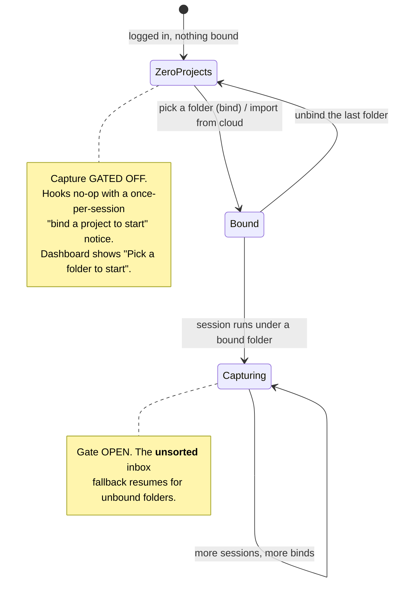
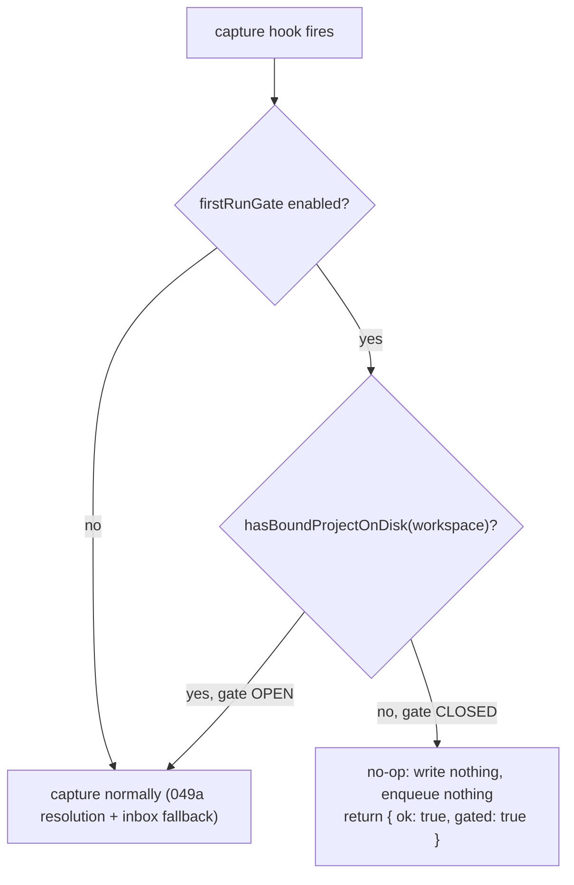
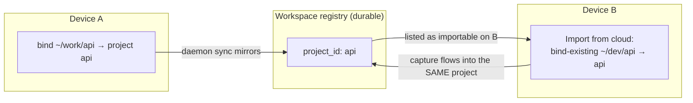

# Projects Onboarding and Lifecycle

> Category: Architecture | Version: 1.0 | Date: June 2026 | Status: Active

How a brand-new user goes from "I just logged in" to "Honeycomb is sourcing the right folders": the first-run capture gate, the daemon-served folder picker, the Projects management page, cross-device import, and the switcher-persistence fix that made all of it honest.

**Related:**
- [`multi-project-and-context-switching.md`](multi-project-and-context-switching.md)
- [`../multi-tenant/org-workspace-model.md`](../multi-tenant/org-workspace-model.md)
- [`../security/scoping-and-visibility.md`](../security/scoping-and-visibility.md)
- [`../frontend/dashboard-architecture.md`](../frontend/dashboard-architecture.md)
- [`../operations/install-and-onboarding.md`](../operations/install-and-onboarding.md)

---

## Why this exists

[`multi-project-and-context-switching.md`](multi-project-and-context-switching.md) made **Project** a first-class, cwd-resolved segmentation dimension: a registry table, a resolution precedence (binding > git signal > path > `__unsorted__` inbox), the CLI verbs, and a dashboard switcher. What it did not ship was an *onboarding story* for that dimension. The data model existed; the path a new user walks to populate it did not. Run live, that gap produced three concrete failures, all observed during real onboarding.

1. **Nothing to select.** A new user lands on the dashboard with zero bound projects. The registry and the local `projects.json` cache are empty until the first `honeycomb project bind`, so the project switcher is empty and there is no obvious next action.
2. **Silent collection before consent.** Capture still ran and accrued to the per-workspace `__unsorted__` inbox (the predecessor's "never drop" policy), so the product hoarded unscoped sessions and memories behind an empty UI before the user had chosen anything to track. This is the defect tracked as IRD-123.
3. **A switcher that lied.** The Org to Workspace to Project switcher was viewer-side only: selecting a value persisted nothing and changed no capture scope. A user who "switched a project" in the UI had done nothing. This is the defect tracked as IRD-122.

PRD-059 turns Project from an implicit, CLI-only concept into an explicit, dashboard-first onboarding gate and management surface. The third level of tenancy now reads end-to-end as a product flow, not just a data model:

> **Org = Company → Workspace = Team → Project = a folder you explicitly put Honeycomb to work on.**

This module is a UX and lifecycle layer on top of the existing registry. It does not re-architect isolation: the Org/Workspace storage partition and the project soft-segment clause are unchanged (see [`../security/scoping-and-visibility.md`](../security/scoping-and-visibility.md)). It adds no new partition and no per-project tables.

## The onboarding state machine

The whole feature is one small lifecycle. A logged-in workspace is in exactly one of three states, and the transition between them is a single deliberate user action: binding a folder.



The gate is keyed on **local** bindings, not the synced registry. A workspace can have registry projects created on another device while this device has bound nothing yet; that device is still in the zero-projects state and onboards via import (see [Cross-device import](#cross-device-import-bind-this-device-to-an-existing-project)).

## The capture gate (PRD-059a / IRD-123)

The predecessor chose "capture is never dropped, an identity-less folder falls to the per-workspace `__unsorted__` inbox." That is the right default for a set-up user. For a brand-new user with zero bound projects it means hoarding unscoped data before the user has opted into anything. PRD-059a is a deliberate, scoped reversal of that policy, limited to the zero-projects pre-onboarding state.

### What the gate suppresses, and where it reads

While the active workspace has no locally-bound project, the capture handler no-ops: it writes no row to `sessions`/`memory`/`memory_jobs`, enqueues no pipeline job, and kicks no embed. The gate lives in the daemon capture handler (`src/daemon/runtime/capture/capture-handler.ts`), checked before any write:



The predicate is `hasBoundProjectOnDisk` in `src/hooks/shared/project-resolver.ts`, the same module the per-session resolver lives in. "Bound enough to start" is an **explicit local binding**: a folder to project binding in `~/.deeplake/projects.json` whose `projectId` is not the reserved `__unsorted__` inbox. The count is over `bindings[]`, never the synced `projects[]` copy, precisely so a registry copy synced from another device does not spuriously open the gate on a device that has imported nothing.

Three properties matter:

- **No network on the hot path (a-AC-3).** The check is `hasBoundProjectOnDisk`, a pure read of the local `projects.json` cache. No DeepLake call. It applies the same tenancy guard the resolver uses: a cache synced for a different workspace than the active one reads as empty.
- **The gate returns success, not failure.** A gated capture returns `{ ok: true, gated: true }` so the harness shim treats the suppression as a clean outcome, not an error to retry.
- **Fail-soft, asymmetric.** The gate is opt-in: the daemon assembly wires `firstRunGate: true` for production, but a direct-construction unit test that does not exercise onboarding keeps the pre-059a behavior. On an unexpected throw the handler fails *open* (capture proceeds), so a set-up user is never hard-blocked because a cache read hiccuped. Only the unambiguous empty/absent store, which the loader returns without throwing, keeps the gate closed.

### The once-per-session notice

When the gate is closed, the user is told once, not on every turn. The notice is rendered at session-start (`src/hooks/shared/session-start.ts`, the `BIND_PROJECT_NOTICE` constant), prepended to the session's `additionalContext` block so it is the first thing the agent surfaces:

> Honeycomb is paused: no project is bound to this workspace yet, so nothing is being captured. Bind a folder to start, open the Honeycomb dashboard and pick a folder, or run "honeycomb project bind" in the folder you want Honeycomb to remember.

The notice gate is itself fail-soft and login-aware: when no credential or token is resolved (not logged in) it reports "bound" so no notice appears, because login, not bind, is the next step for a logged-out user. A read error also reads as "bound" so the notice never appears spuriously and never breaks session-start.

### What the gate does not do

It does not remove the `__unsorted__` inbox; the inbox stays as the post-onboarding fallback for unbound folders, and resumes the moment the first project is bound. It does not delete or re-file data already in `__unsorted__` from before the gate shipped (an inbox-hygiene concern owned elsewhere). And per the design lean, once the gate opens it stays open for that workspace: the gate is strictly the first-run zero-state.

## The first-run empty state and the folder picker (PRD-059b)

The dashboard's answer to a zero-projects workspace is no longer an empty switcher. On the Dashboard route, once the projects enumeration has resolved with zero locally-bound projects, the primary content is a "Pick a folder to start" call-to-action. It keys off the switcher's `projectsHydrated` flag so it never flashes before the read resolves, and it is gated to the Dashboard route so the Projects and Settings pages stay reachable.

### Why the daemon serves the folder tree

The mechanism behind "pick a folder" is the load-bearing design decision, and it follows from a hard browser constraint: **a web page cannot read an absolute filesystem path.** The File System Access API (`showDirectoryPicker`) returns an opaque handle, not a path, by design. So the picker cannot live purely in the browser, because the binding the cwd resolver needs is an absolute path.

The local daemon already has filesystem access, so it serves the browse tree and the dashboard posts the chosen absolute path back to bind. This is the only component that can return a real, bindable absolute path.

```mermaid
sequenceDiagram
    participant U as User
    participant D as Dashboard (browser)
    participant Daemon as Daemon (loopback, local-mode)
    participant Cache as ~/.deeplake/projects.json

    U->>D: open "Pick a folder to start"
    D->>Daemon: GET /api/diagnostics/fs/browse?path=<dir>
    Daemon-->>D: { path, root, parent, children[] } (dirs only, git-marked)
    U->>D: descend / "use this folder"
    D->>Daemon: POST /api/diagnostics/projects/bind { path, name? }
    Daemon->>Cache: bindFolderToProject(...) writes the binding
    Daemon-->>D: { bound: true, path, projectId }
    D->>U: advance to the Projects page; the gate opens
```

The shipped routes (in `src/daemon/runtime/projects/onboarding-api.ts`) attach onto the already-mounted, protected `/api/diagnostics` group and self-gate to `local` mode, so a non-local request 404s, the same posture as the rest of the dashboard control surface:

- `GET /api/diagnostics/fs/browse?path=<dir>` returns the immediate child directories of `<dir>` (directories only, dotfolders hidden, each marked if it carries a `.git`), refusing to traverse outside an allowed root (home by default).
- `POST /api/diagnostics/projects/bind { path, name? }` binds a chosen absolute folder to a new or named project.

The browse route is the one with real teeth: it canonicalizes both the allowed root and the requested path through `realpathSync` before comparing them, so a symlink or junction planted lexically inside the root cannot smuggle an outside target past a string-prefix clamp (CWE-22 symlink traversal). The daemon never enumerates outside the real allowed root.

### One store, written one way

The dashboard bind and the CLI `honeycomb project bind` write the **same** `~/.deeplake/projects.json` cache through the **same** `bindFolderToProject` writer, so the dashboard and CLI never diverge on the store format. The suggested project name is derived the same way the CLI suggests it (`suggestProjectId`): the canonicalized git remote's repo segment if the folder carries a remote, else the folder's basename, editable before confirm. A bind that names the reserved `__unsorted__` id, or yields a degenerate empty name, or receives a non-absolute path, is rejected with a redacted reason rather than silently writing.

When the daemon is unreachable or local-mode is off, the picker shows a plain message and the `honeycomb project bind` CLI hint, never a hang or a silent failure.

## The Projects page (PRD-059c)

Once a user has bound at least one project they need a home for managing them. The Projects page is a left-nav entry (slotted right after Dashboard, at the hash route `#/projects`) and the page behind it: a list of every project Honeycomb is actively sourcing in the current workspace, plus a top-right "+ Add" menu.

The page splits the workspace's projects on `boundLocally`. The **active** list is the locally-bound, non-inbox projects, each rendered with the per-project state the daemon aggregates onto the registry row: the bound path(s) on this device, the git remote, the last-capture time, and memory/session counts. A field the daemon serves empty or absent renders as an honest dash placeholder; a missing last-capture renders "never"; a count that flapped on a backend read degrades to `0`, never a fabricated value. The reserved `__unsorted__` inbox is shown distinctly (a dashed row) with its size surfaced so it does not rot.

Per-project actions:

- **"+ Add"** is one menu with two options (the design lean): "New folder" runs the 059b folder-pick to bind flow inline; "Import existing" opens the 059d cross-device import modal. On a successful add the list re-hydrates from the daemon, never optimistically.
- **Unbind** removes the local folder binding only, via `POST /api/diagnostics/projects/unbind { path }`. Capture stops for that folder; the registry project and its existing memories are untouched. Because the daemon keys unbind on the absolute folder path (not the project id, and the registry read does not serve the path), Unbind opens a small folder picker to select the folder to release rather than inventing a path the daemon never gave it.
- **Open** re-scopes the other dashboard surfaces (memories, graph, sync) to that project through the scope context, the same view scope the project dropdown drives.

## Cross-device import: bind this device to an existing project (PRD-059d)

A project is a durable, workspace-scoped registry identity, but a *binding* (folder to project) is local to one device's `projects.json`. So when a user sets up Honeycomb on a second machine, the project they created on machine A exists in the cloud registry but has no local binding on machine B. The git-remote auto-bind signal only fires if that exact repo is checked out with the same remote, which is a coincidence, not a guarantee.

"Import project from cloud" makes it deliberate. The import modal lists the workspace's registry projects that have no local binding on this device (`scopeProjects({ unbound: true })`, privilege-scoped to what the token can see, so the list is exactly what the user is entitled to). The user selects one, picks a local folder, and the dashboard binds that folder to the existing `project_id` via `POST /api/diagnostics/projects/bind-existing { path, projectId }`.



The distinction from a fresh bind is that import is **bind-to-existing**: it does not record a new git remote on the project (the existing registry row keeps its `remote_signal`), where a new bind records the folder's canonical remote so the daemon sync can mirror it. After import, a recall on either device sees the shared project's memories, subject to the same isolation and scope rules as any project. Import complements, and does not replace, the git-remote auto-bind signal: when the chosen folder's remote matches an existing registry project, that project is surfaced as the suggested match, a hint, never a silent auto-bind.

## The switcher-persistence fix (IRD-122)

The Org to Workspace to Project switcher used to be viewer-only: every selection persisted to `localStorage` and nothing else, so selecting a different org in the UI left `honeycomb whoami` and `~/.deeplake/credentials.json` reporting the old org and the daemon capturing into the old scope. The control silently lied. PRD-059 makes it honest by treating the three axes differently, because they genuinely are different.

| Axis | What a selection does now | Mechanism |
|---|---|---|
| Org | Persists a real switch: re-mints the org-bound token and saves it to `credentials.json`; `whoami` reflects it immediately. | `POST /api/diagnostics/scope/org-switch` reuses the CLI `org switch` re-mint + `saveDiskCredentials`. |
| Workspace | Persists a real switch: writes the workspace id to the shared credential (no re-mint). | `POST /api/diagnostics/scope/workspace-switch` reuses the CLI `workspace switch` write. |
| Project | A **view filter** only: re-scopes which rows the pages show, never where capture is written. | Viewer-side; no registry write. Capture scope is cwd-resolved per session, set by binding a folder. |

The org axis re-mints rather than edits because the org is baked into the token claim, the same mechanic `honeycomb org switch` uses, so the dashboard and CLI never diverge on the credential file. The project dropdown carries an explicit label ("project · view filter") and a caption pointing the user at binding a folder in Projects for "make Honeycomb source this." And no switch is ever a silent no-op: every selection surfaces feedback (pending then persisted, a view-filter note, or an error), and a failed persist keeps the prior scope rather than pretending the change took.

This is why this doc and [`multi-project-and-context-switching.md`](multi-project-and-context-switching.md) are paired: that doc owns the per-session resolution model the switcher sits on (cwd resolves the project, `credentials.json` is the fallback workspace default); this doc owns the onboarding flow and the honest-switcher contract the resolution model now surfaces in the UI.

## What stays out

- **Auto-scanning the filesystem for repos.** Honeycomb does not crawl `~/GitHub/**` or enumerate harness installs to discover projects. Binding stays explicit (folder-picker or CLI); the git remote is only an auto-*suggest* signal once a folder is in play. Auto-discovery is an explicit non-goal, a privacy and surprise hazard.
- **Replacing the CLI verbs.** `honeycomb project bind|use|list|status` remain the source of truth; the dashboard drives the same store through the same writer, never a parallel one.
- **Workspace and org creation.** Provisioning a new workspace is out of scope; import-from-cloud attaches to existing registry projects within the already-active workspace.
- **Backfilling existing `__unsorted__` data** into projects, and re-architecting isolation. The partition boundary and the project soft-segment clause are unchanged.
