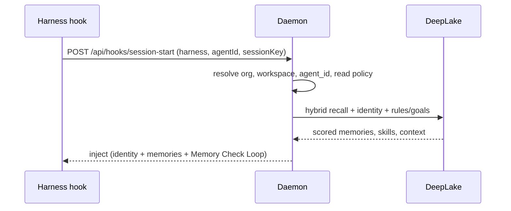
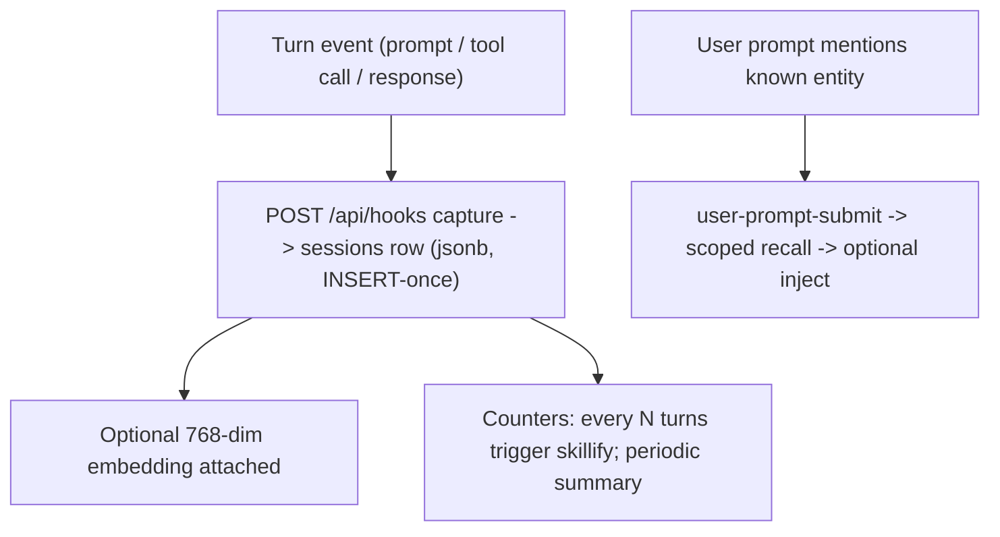
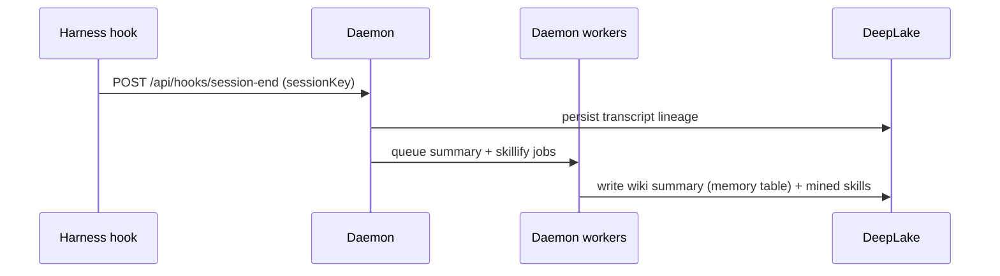

# Request Lifecycle

> Category: Architecture | Version: 1.0 | Date: June 2026 | Status: Active

End to end through Honeycomb: from a harness hook firing at session start, through per-turn capture and the distillation pipeline, to recall on the next turn and a summary at session end.

**Related:**
- [`system-overview.md`](system-overview.md)
- [`daemon-surface.md`](daemon-surface.md)
- [`../ai/session-capture.md`](../ai/session-capture.md)
- [`../ai/memory-pipeline.md`](../ai/memory-pipeline.md)
- [`../ai/retrieval.md`](../ai/retrieval.md)
- [`../ai/session-priming-architecture.md`](../ai/session-priming-architecture.md)
- [`multi-project-and-context-switching.md`](multi-project-and-context-switching.md)
- [`../integrations/hook-lifecycle.md`](../integrations/hook-lifecycle.md)

---

## The shape of a session

A session has three phases: it starts, it runs turns, and it ends. Honeycomb hooks into each. At start, recall injects relevant context. During each turn, capture records what happened and recall answers explicit lookups. At end, the daemon writes a summary and queues distillation. The hooks themselves are thin; every hook is a client call to the honeycomb daemon, and the daemon does the work and is the only thing that touches DeepLake.

The one invariant that carries over from the engine: raw events are durable the instant they are captured, and the expensive work (extraction, graph building, summaries, skill mining) happens afterward in daemon workers. A slow or failing model never costs a captured event.

## Session start: recall injects



The daemon resolves the tenancy and scope (org and workspace from the credentials and token, the `project_id` from the session's working directory, `agent_id` from the request or session key), runs a scoped recall, and returns an injection block: identity, scored memories, active rules and goals, and the Memory Check Loop that tells the agent when prior context matters. Scoring and the confidence gate are documented in [`../ai/retrieval.md`](../ai/retrieval.md); the per-session project resolution that scopes this recall is in [`multi-project-and-context-switching.md`](multi-project-and-context-switching.md).

Alongside that injection, session-start also pushes a small, bounded **prime**: a compact index of the most relevant Tier-1 memory keys (one keyword-dense line each) served by `GET /api/memories/prime`. The prime is the cheap "here is what I already know about this project" header the agent skims once; it then pulls deeper detail on demand instead of paying for a full recall every turn. The push-once-pull-on-demand design, and why it avoids the lost-in-the-middle failure of injecting everything, are in [`../ai/session-priming-architecture.md`](../ai/session-priming-architecture.md) and [`../ai/three-tier-memory-strategy.md`](../ai/three-tier-memory-strategy.md).

## Per turn: capture and recall

Every turn produces events. Each prompt, tool call, and response becomes one row in the `sessions` table through a single INSERT, never a concatenation, which is the deliberate fix for the write race the summary worker once hit. Capture is covered in [`../ai/session-capture.md`](../ai/session-capture.md).



Recall during a turn comes in two flavors. The automatic kind fires on `user-prompt-submit` and only injects when an entity match clears the confidence gate. The explicit kind is when the agent runs `recall`, browses the virtual filesystem, or calls an MCP tool; that bypasses the inject-on-confidence rule because the agent asked.

## The distillation pipeline

Captured events are raw. The pipeline turns them into structured, source-backed memory in the daemon, off the turn path.

```mermaid
flowchart TD
    raw["Raw sessions rows"] --> extract["Extraction: facts + entity triples"]
    extract --> decide["Decision: add / update / delete / none"]
    decide --> writes["Controlled writes (memories + provenance)"]
    writes --> graph["Graph persistence: entities, aspects, claims, dependencies"]
    graph --> retain["Retention: decay + purge"]
```

Extraction decomposes events into facts and entities; decision compares each fact against existing memory and proposes an action; controlled writes apply the safe ones with content-hash dedup; graph persistence updates the ontology; retention ages out what is stale. The full stage behavior, the modes (`shadowMode`, `mutationsFrozen`, `graphEnabled`, `autonomousEnabled`), and the durable job queue are in [`../ai/memory-pipeline.md`](../ai/memory-pipeline.md). Because writes land in DeepLake, the pipeline uses the storage patterns in [`../data/deeplake-storage.md`](../data/deeplake-storage.md): append-only version bumps for concurrent-edit tables, hand-escaped SQL, and lazy schema healing.

## Session end: summarize and mine



At session end the daemon persists the transcript and queues two daemon workers. The summary worker shells out to the host harness CLI to write a structured wiki summary into the `memory` table; see [`../ai/wiki-summary-workers.md`](../ai/wiki-summary-workers.md). The skillify miner reads recent in-scope sessions and writes reusable skills that propagate to teammates; see [`../ai/skillify-pipeline.md`](../ai/skillify-pipeline.md). Both are owned by the daemon, not spawned loosely from a hook.

## Recall on the next turn

When recall runs, several channels collect candidate IDs (full-text, vector, knowledge-graph traversal, prospective hints), the candidates are authorized against the agent's scope before any content loads, and the authorized set is shaped, reranked, dampened, and checked for currentness. The authorization-before-content ordering is what keeps one agent's memory out of another's recall. The whole flow lives in [`../ai/retrieval.md`](../ai/retrieval.md), and the scope enforcement in [`../security/scoping-and-visibility.md`](../security/scoping-and-visibility.md).

## Why durable-first matters

Capture commits the raw event before any model runs, so the worst a slow extractor can do is delay enrichment, never lose a memory. Distillation jobs live in a durable queue, so a daemon restart resumes them. This is the same principle on both sides of the merge: Hivemind captured raw events first and summarized later; our memory engine committed raw memory first and distilled later. Honeycomb keeps both, with the daemon owning everything downstream of capture.
