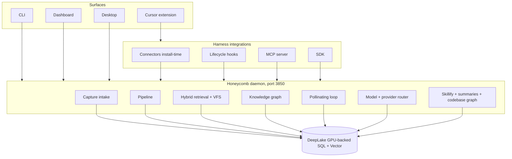

# System Overview

> Category: Architecture | Version: 1.0 | Date: June 2026 | Status: Active

The master view of Honeycomb: the planes, the daemon at the center, the DeepLake substrate underneath, and how the memory engine and the product subsystems fit together.

**Related:**
- [`request-lifecycle.md`](request-lifecycle.md)
- [`daemon-surface.md`](daemon-surface.md)
- [`../data/deeplake-storage.md`](../data/deeplake-storage.md)
- [`../data/schema.md`](../data/schema.md)
- [`../ai/memory-pipeline.md`](../ai/memory-pipeline.md)
- [`../integrations/harness-integration.md`](../integrations/harness-integration.md)

---

## Why the architecture looks like this

Honeycomb has two jobs that pull in different directions. It has to live inside many coding harnesses that share almost nothing at the integration layer, and it has to run a real memory engine: a background pipeline, a knowledge graph, a pollinating maintenance loop. Hivemind solved the first job with thin per-harness shims over a shared core. Our memory engine solved the second with a local daemon. Honeycomb keeps both answers and joins them: write the memory logic once inside a daemon, then wrap it per harness with shims that are thin clients of that daemon.

That decision settles the old contradiction between the two systems. Hivemind's hooks used to talk straight to storage, which is fine for capture but cannot host a pollinating loop or a pipeline. Our memory engine's daemon hosts exactly that. So in Honeycomb the daemon is the only process that talks to DeepLake, and every harness surface, hook, CLI, SDK, and MCP call goes through it. Adding a harness means writing a new shim, not a new engine. Fixing the engine means editing the daemon, and every harness inherits the fix.

## The planes

Four planes. Surfaces are how a human drives Honeycomb. Integrations are how external harnesses reach it. The daemon is the runtime where all logic lives. DeepLake is the storage substrate. The arrows that matter: everything points at the daemon, and only the daemon points at DeepLake.

## Component summary

| Component | Location / name | Responsibility |
|---|---|---|
| Daemon | honeycomb daemon, port 3850 | Capture intake, pipeline, retrieval, ontology, pollinating, router, workers. Only DeepLake client. |
| DeepLake substrate | storage layer | GPU-backed SQL + vector tables; org/workspace partition isolation. See [`../data/deeplake-storage.md`](../data/deeplake-storage.md). |
| Capture shims | per-harness hooks | Map native lifecycle events to capture/recall calls on the daemon. |
| Skillify miner | daemon worker | Mine recurring traces into reusable skills. See [`../ai/skillify-pipeline.md`](../ai/skillify-pipeline.md). |
| Codebase graph | daemon worker | Live graph of files, symbols, imports. See [`../data/codebase-graph.md`](../data/codebase-graph.md). |
| CLI | `honeycomb` | Setup, status, recall, agents, ontology, sources, skills, org/workspace. |
| MCP + SDK | MCP server, `@honeycomb/sdk` | Tool-based and typed access. See [`../integrations/mcp-and-sdk.md`](../integrations/mcp-and-sdk.md). |
| Cursor extension | `frontend/` | Hooks bundle and dashboard surface for Cursor. |

## The two halves: engine and product

Honeycomb's value splits into the memory engine and the product subsystems built around it.

The engine, our memory engine, is the path from a raw event to recalled context. Capture writes raw events; the pipeline runs extraction, decision, graph persistence, and retention; retrieval runs hybrid search with an authorization boundary; the knowledge-graph ontology holds entities, aspects, claims, and dependencies; the pollinating loop consolidates over time; the model and provider router decides which model runs each workload. These are documented under `ai/`.

The product subsystems, inherited from Hivemind, are what make the engine a team tool. Skillify mines traces into shareable skills; team skill sharing propagates them; the codebase graph indexes the code agents actually touch; the virtual filesystem lets agents browse memory with ordinary shell commands; goals and KPIs track objectives; the Cursor extension and other frontends surface it all. These live under `ai/`, `data/`, `collaboration/`, and `frontend/`.

## State and storage

All durable state lives in DeepLake tables. The capture and recall substrate (`sessions`, `memory`) sits alongside the engine's model (memories and facts, the entity ontology, sources and artifacts, the job queue, the agent roster, api keys) and the product tables (`skills`, `rules`, `goals`, `kpis`, `codebase`). Every row carries org and workspace identity for tenant isolation, and engine rows additionally carry `agent_id` for within-workspace scoping. The full catalog is [`../data/schema.md`](../data/schema.md), and the write patterns that keep it consistent under concurrent workers are in [`../data/deeplake-storage.md`](../data/deeplake-storage.md).

## Contracts that keep the planes apart

The daemon is the only DeepLake client. No hook, shim, or SDK call touches storage directly; they all go through the daemon, which centralizes scoping, escaping, and schema healing.

A session uses one active runtime path. Connectors send `x-honeycomb-runtime-path: plugin|legacy`, and once a session is claimed by one path a request from the other path returns `409`. This stops two integration surfaces from double-writing one session.

Org and workspace isolation is enforced at the storage layer, not just the API. Two workspaces never share a row, partition, or index. Within a workspace, `agent_id` and visibility separate agents.

For the end-to-end flow these components produce, continue to [`request-lifecycle.md`](request-lifecycle.md).
