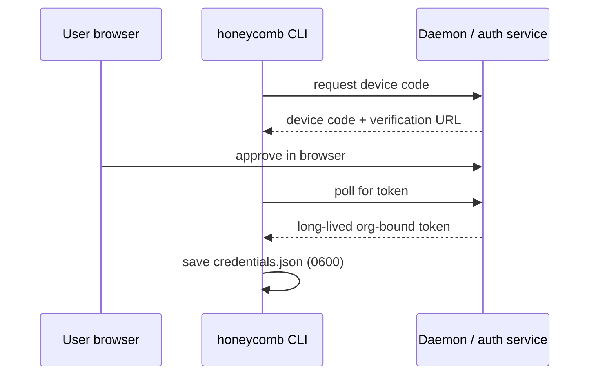
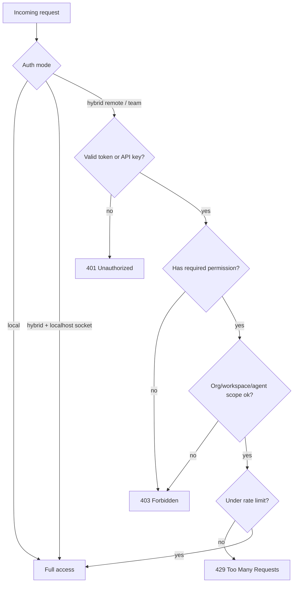

# Auth Architecture

> Category: Auth | Version: 1.1 | Date: June 2026 | Status: Active

How Honeycomb authenticates and authorizes: device-flow login bound to an org, the three daemon modes, role-based permissions, API keys for connectors, and rate limiting.

**Related:**
- [`../multi-tenant/org-workspace-model.md`](../multi-tenant/org-workspace-model.md)
- [`../security/credential-storage.md`](../security/credential-storage.md)
- [`../security/scoping-and-visibility.md`](../security/scoping-and-visibility.md)
- [`../security/request-identity-validation.md`](../security/request-identity-validation.md)
- [`../security/secrets.md`](../security/secrets.md)
- [`../architecture/daemon-surface.md`](../architecture/daemon-surface.md)
- [`../operations/install-and-onboarding.md`](../operations/install-and-onboarding.md)

---

## Two layers: who you are, and what you can do

Honeycomb merges two auth stories. Hivemind logged a user into an org with an OAuth device flow and bound durable storage to that org. Our memory engine enforced what an authenticated caller could do with daemon modes, role-based permissions, API keys, and rate limits. Honeycomb keeps both: device flow establishes identity and tenancy, and the daemon's RBAC decides what each request is allowed to touch.

## Identity: device-flow login

Login uses the OAuth 2.0 Device Authorization Flow. The CLI requests a device code, the user approves in a browser, the CLI polls for a token, and the daemon mints a long-lived, org-bound token. No password is ever sent, and the short-lived access token is discarded rather than persisted. Org selection follows a priority order (environment override, then the token's org claim, then the first org), and workspace resolves from a `default` sentinel server-side. The resulting credentials live in a local file at mode `0600`, documented in [`../security/credential-storage.md`](../security/credential-storage.md).

Tokens can drift when an org changes. The daemon heals a drifted org token on session start: it decodes the token's org claim, compares it to the active org, and re-mints if they disagree, realigning the org name and workspace afterward. The tenancy mechanics are documented in [`../multi-tenant/org-workspace-model.md`](../multi-tenant/org-workspace-model.md).

### Driving the flow from the dashboard

The same device flow can now be driven from the **dashboard UI**, not just the terminal. The pre-auth dashboard's "First time setup" button POSTs to a loopback, local-mode-only `POST /setup/login`, which begins the flow and returns *only* the `user_code` + verification URIs for the dashboard to render on the page, so a new user reads the code on a familiar surface instead of copying it out of a shell. The browser opens the (https-only validated) verification page; the flow polls in the background; on approval it mints and persists the **same** shared credential through the identical `persistFromToken` path. The response never carries the device/bearer token, and the reporter sink is swallowed so no token-adjacent line is logged. The end state is byte-identical to a terminal login, only the prompt surface changed. The full pre-auth/authenticated phase model lives in [`../operations/install-and-onboarding.md`](../operations/install-and-onboarding.md).

### Referral attribution on the device-code request

The device-code request (`POST /auth/device/code`) carries referral-attribution headers so signups from this repo / the `@legioncodeinc/honeycomb` package are attributed to the operator. Honeycomb sends **both** `X-Hivemind-Referrer` (recognized by the Activeloop backend today) and `X-Honeycomb-Referrer` (the forward-looking namespaced header), each set to the trimmed referral code, and both omitted when the ref is empty (trim-and-omit). The headers ride **only** on the device-code request (attribution-on-registration), never on `/me`, mint, or any data-plane call, and the ref is never placed in a URL or a log line. The effective ref resolves `--ref` override → `onboarding.ref` → the build-injected default (shipped `mario`).

## The three daemon modes

Because Honeycomb is team-shared by default but still supports a single-user local setup, the daemon has three auth modes.

`local`: no authentication. Every request has full access and the daemon binds to localhost. Used for a single developer on one machine.

`team`: every request needs a valid Bearer token or API key. Unauthenticated requests get `401`. All operations are rate-limited and scoped. This is the default for a shared deployment.

`hybrid`: localhost requests are trusted based on the TCP peer address from the socket (not the spoofable `Host` header), and remote clients must present a token. If the socket info is unavailable, hybrid fails closed and requires a token.

### Stub tokens are development-only

The daemon mints a lightweight unsigned bearer token, the **stub token**, for single-user development. It carries the `hcmt.v1.` prefix (`STUB_TOKEN_PREFIX`) and encodes its claims (org, role, workspace, agent) with no cryptographic signature. A stub token is convenient for a developer on `local` mode loopback, but because anyone can fabricate one and stamp it with `role: admin`, it must never be trusted on a shared deployment.

The token authenticator is therefore mode-aware. The deployment mode is threaded from `authForMode` through `composeAuthenticator` into `createTokenAuthenticator`, and the authenticate path is fail-closed:

- In `team` and `hybrid` modes, any bearer that starts with the `hcmt.v1.` prefix is **rejected** before its claims are read, returning `null` so the middleware maps it to `401`. The rejection happens at the authenticator layer, ahead of the RBAC policy, so a forged `admin` stub identity is never constructed and never reaches a permission check.
- Only `local` mode (single-user loopback) accepts stub tokens. When no mode is supplied (tests, development harnesses), stub tokens are accepted for backward compatibility.

The prefix match is exact and case-sensitive, so `HCMT.v1.`, `Hcmt.v1.`, and `hcmt.V1.` do not bypass the gate. Non-stub bearers (real signed tokens) are unaffected and flow to the normal verifier. This closes a pentest finding where a forged unsigned `hcmt.v1` admin token could bypass RBAC on protected daemon routes in `team`/`hybrid` modes. Real production credentials are signed tokens and scrypt-verified API keys; the stub path is strictly a development affordance.

## Roles and permissions

Four roles map to permission sets, checked on every protected route in `team` and `hybrid` modes.

| Role | Permissions |
|---|---|
| `admin` | everything, including token creation, org/workspace admin, and secret operations |
| `operator` | remember, recall, modify, forget, recover, documents, connectors, diagnostics, analytics |
| `agent` | remember, recall, modify, forget, recover, documents |
| `readonly` | recall only |

`agent` is the default for harness connectors, since an agent integration should read and write memory but not run admin operations. The endpoint groups that always require an explicit permission check are admin and token operations, diagnostics, sources, connectors, secrets, ontology mutations, and org/workspace admin.

## API keys for connectors

Remote connectors authenticate with named API keys rather than user tokens. Keys are revocable, stored hashed (scrypt with a salt), prefixed `hc_sk_...`, and printed once at creation. A key carries a role and can be narrowed with an explicit permission list; connector keys default to the narrow set of recall, remember, and documents, and can be bound to a connector, harness, agent, and allowed projects. The backing `api_keys` table is documented in [`../data/schema.md`](../data/schema.md).

## Scope

A token or key carries the org and workspace it is bound to, and optionally a tighter `scope` of `project`, `agent`, or `user`. A request touching a different value for a set field gets `403`. The `admin` role bypasses scope, and scope is ignored in `local` mode. This request-level scope is the outer ring; the inner ring is the storage-level org/workspace isolation plus the within-workspace `agent_id` read policy described in [`../security/scoping-and-visibility.md`](../security/scoping-and-visibility.md).

This check validates the *explicit* hint a caller sets on a request. A separate defense-in-depth layer validates the scope a query will *actually resolve to*, including org/workspace headers and the cwd-derived project, against the authenticated identity, so a forged header or a manipulated cwd cannot steer a handler past the token's own binding. That guard is documented in [`../security/request-identity-validation.md`](../security/request-identity-validation.md).

## Rate limiting

Rate limiting is enforced only in `team` and `hybrid` modes. It is a sliding window keyed by the caller (the token subject or API key; unauthenticated requests share an `anonymous` bucket) and resets on daemon restart. Expensive and abuse-prone operations (forget, batch operations, admin, inference execution and gateway, LLM-backed recall) carry tighter limits. Exceeding a limit returns `429` with a `Retry-After` header.

## Fail-closed posture

The auth layer refuses rather than over-shares. Hybrid without socket info demands a token, a malformed scope or role does not widen access, and expensive routes are limited the moment the daemon is shared. This is the same instinct that governs storage scoping in [`../security/scoping-and-visibility.md`](../security/scoping-and-visibility.md) and secret handling in [`../security/secrets.md`](../security/secrets.md): when in doubt, deny.
