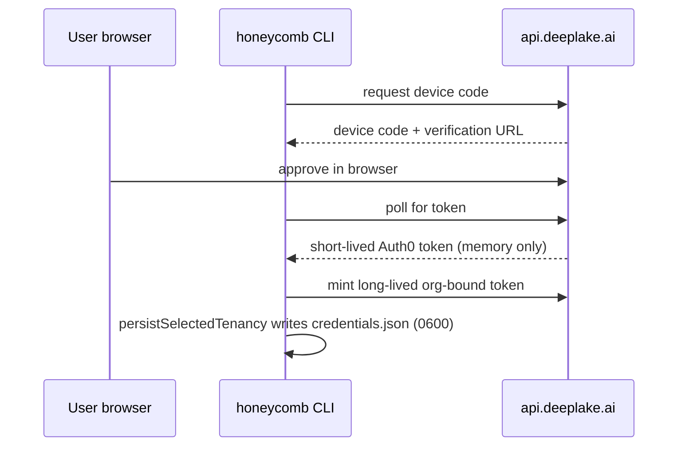
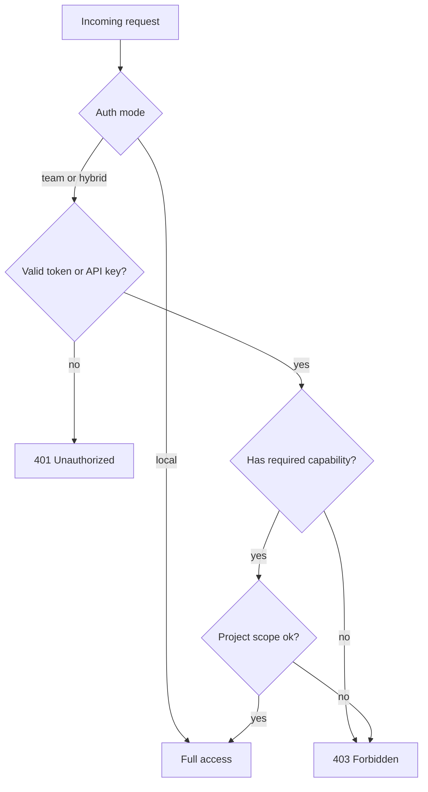

# Auth Architecture

> Category: Auth | Version: 1.2 | Date: October 2026 | Status: Active

How Honeycomb authenticates and authorizes: device-flow login bound to an org, the three daemon modes, role-based permissions, API keys for connectors, and rate limiting.

**Related:**
- [`../multi-tenant/org-workspace-model.md`](../multi-tenant/org-workspace-model.md)
- [`../security/credential-storage.md`](../security/credential-storage.md)
- [`../security/scoping-and-visibility.md`](../security/scoping-and-visibility.md)
- [`../security/request-identity-validation.md`](../security/request-identity-validation.md)
- [`../security/secrets.md`](../security/secrets.md)
- [`../architecture/daemon-surface.md`](../architecture/daemon-surface.md)
- [`../operations/install-and-onboarding.md`](../operations/install-and-onboarding.md)

---

## Two layers: who you are, and what you can do

Honeycomb merges two auth stories. Hivemind logged a user into an org with an OAuth device flow and bound durable storage to that org. Our memory engine enforced what an authenticated caller could do with daemon modes, role-based permissions, API keys, and rate limits. Honeycomb keeps both: device flow establishes identity and tenancy, and the daemon's RBAC decides what each request is allowed to touch.

## Identity: device-flow login

Login uses the OAuth 2.0 Device Authorization Flow against `api.deeplake.ai`. The CLI requests a device code, the user approves in a browser, and the CLI polls until a short-lived Auth0 token arrives. That short-lived token stays in memory. The CLI process then mints a long-lived, org-bound token and persists it. The CLI path does not enter the daemon. No password is ever sent. `resolveTenancyChoice` picks the org in this order: full environment pins, an org pin with the workspace resolved, single-org auto-select, then a selector. If none of those resolve, login throws `TenancySelectionRequiredError`. This path does not persist a silent `orgs[0]`. A missing workspace uses the `default` sentinel, which resolves server-side. The resulting credentials live in a local file at mode `0600`, documented in [`../security/credential-storage.md`](../security/credential-storage.md).

```mermaid
sequenceDiagram
    participant U as User browser
    participant C as honeycomb CLI
    participant A as api.deeplake.ai

    C->>A: request device code
    A-->>C: device code + verification URL
    U->>A: approve in browser
    C->>A: poll for token
    A-->>C: short-lived Auth0 token (memory only)
    C->>A: mint long-lived org-bound token
    C->>C: persistSelectedTenancy writes credentials.json (0600)
```

A token org can disagree with the active org. `buildOrgDriftHealer` has two branches. When the disk credential `apiUrl` is the real backend, a mismatched token org returns `{ kind: "drift-surfaced" }` and does not mint. `healOrgDrift` still re-mints, and the healer calls it only on the local or stub branch. A failed local heal logs a warning and continues with the stale token. The dispatched `honeycomb status` verb does not invoke this healer. `honeycomb org switch` still re-mints on the real client. The tenancy mechanics are documented in [`../multi-tenant/org-workspace-model.md`](../multi-tenant/org-workspace-model.md).

### Driving the flow from the dashboard

The same device flow can be started from the **dashboard UI**. The pre-auth dashboard's "First time setup" button POSTs to a loopback, local-mode-only `POST /setup/login` on the daemon. The route begins the flow and returns *only* the `user_code` plus verification URIs for the dashboard to render on the page, so a new user reads the code on a familiar surface instead of copying it out of a shell. The browser opens the https-only validated verification page, and the flow polls in the background. The response never carries the device or bearer token, and the reporter sink is swallowed so no token-adjacent line is logged.

There is no `persistFromToken` function. A comment on `POST /setup/login` still names it. A multi-org dashboard login writes an unconfirmed base credential through `persistUnconfirmedTenancy` (`tenancyPending: true`, no `tenancyConfirmedAt`) before `POST /setup/tenancy/select`. The CLI does not persist until `resolveTenancyChoice` succeeds, then writes through `persistSelectedTenancy`. A confirmed dashboard selection uses that same confirmed persist. The full pre-auth and authenticated phase model lives in [`../operations/install-and-onboarding.md`](../operations/install-and-onboarding.md).

### Referral attribution on the device-code request

The device-code request (`POST /auth/device/code`) carries referral-attribution headers so signups from this repo / the `@legioncodeinc/honeycomb` package are attributed to the operator. Honeycomb sends **both** `X-Hivemind-Referrer` (recognized by the Activeloop backend today) and `X-Honeycomb-Referrer` (the forward-looking namespaced header), each set to the trimmed referral code, and both omitted when the ref is empty (trim-and-omit). The headers ride **only** on the device-code request (attribution-on-registration), never on `/me`, mint, or any data-plane call, and the ref is never placed in a URL or a log line. The effective ref resolves `--ref` override → `onboarding.ref` → the build-injected default (shipped `mario`).

## The three daemon modes

The runtime config names three auth modes, `local`, `team`, and `hybrid`, and the schema default for `mode` is `local`.

`local`: no authentication. Every request has full access and the daemon binds to localhost. Used for a single developer on one machine. `local` never consults the token authenticator.

`team`: every request needs a valid Bearer token or API key. Unauthenticated requests get `401`. This is the posture for a shared deployment. It is not the schema default.

`hybrid`: the middleware can skip the authenticator when `socketPeer.isTrustedLocalPeer` is true. The production probe is `noSocketPeer`, which never reports a trusted peer, and assembly does not pass `socketPeer`. Live hybrid therefore requires a token, the same as `team`. Trust is not taken from the TCP peer address or the `Host` header.

### Stub tokens are development-only

The daemon mints a lightweight unsigned bearer token, the **stub token**, for single-user development. It carries the `hcmt.v1.` prefix (`STUB_TOKEN_PREFIX`) and encodes its claims (org, role, workspace, agent) with no cryptographic signature. A stub token is convenient for a developer on `local` mode loopback, but because anyone can fabricate one and stamp it with `role: admin`, it must never be trusted on a shared deployment.

The token authenticator is mode-aware. Assembly builds it with `createTokenAuthenticator(undefined, mode)`, so the verifier is the default `verifyTokenClaims`.

- In `team` and `hybrid`, when that default verifier is in use, every bearer is rejected before a prefix test and before its claims are read. The authenticator returns `null`, and the middleware maps that to `401`. The `hcmt.v1.` prefix is a decode shape for the stub format. The authenticator does not apply a case-sensitive prefix gate.
- `local` mode never consults the authenticator.
- When no mode is supplied (tests and development harnesses), the default decoder still runs, including stubs.

The API-key half is separate and can still authenticate a presented key. Real connector credentials are scrypt-verified API keys. The unsigned stub remains a development affordance, and the mounted token half does not check a signature.

## Roles and permissions

Four roles map to permission sets, checked on every protected route in `team` and `hybrid` modes.

| Role | Permissions |
|---|---|
| `admin` | `read`, `write`, `connectorsAdmin`, and `admin` (token creation, org and workspace admin, and `/api/secrets`) |
| `member` | `read`, `write`, and `connectorsAdmin` (data writes, connectors, sources, diagnostics, and analytics). No token, org, workspace, or secrets admin |
| `agent` | `read` and `write` on data routes |
| `readonly` | `read` only |

The frozen roles are `admin`, `member`, `readonly`, and `agent`. There is no `operator` role and no `recover` capability. `agent` is the default for harness connectors, since an agent integration should read and write memory but not run admin operations. The endpoint groups that always require an explicit permission check are admin and token operations, diagnostics, sources, connectors, secrets, ontology mutations, and org/workspace admin.

## API keys for connectors

Remote connectors authenticate with named API keys rather than user tokens. Keys are revocable, stored hashed (scrypt with a salt), prefixed `hc_sk_...`, and printed once at creation. Create accepts a name, a role, and one project. The role defaults to `agent`. The `permissions` column is stored as `"[]"`, and the authenticator uses the role. The project is stored in `connector` as `project:<id>`. The backing `api_keys` table is documented in [`../data/schema.md`](../data/schema.md).

```mermaid
flowchart TD
    req["Incoming request"] --> mode{"Auth mode"}
    mode -->|local| allow["Full access"]
    mode -->|team or hybrid| cred{"Valid token or API key?"}
    cred -->|no| u401["401 Unauthorized"]
    cred -->|yes| perm{"Has required capability?"}
    perm -->|no| f403["403 Forbidden"]
    perm -->|yes| scopechk{"Project scope ok?"}
    scopechk -->|no| f403
    scopechk -->|yes| allow
```

## Scope

A token or key carries the org and workspace it is bound to, and optionally a project binding. The RBAC policy checks capability first, then project scope. A request that names a different project than the identity's binding gets `403`. The `admin` role bypasses project scope. An identity with no project binding is unscoped. `Identity` has no user-scope field, and the policy does not compare org, workspace, or agent on this gate. `local` mode does not run the policy. This request-level project check is the outer ring; the inner ring is the storage-level org/workspace isolation plus the within-workspace `agent_id` read policy described in [`../security/scoping-and-visibility.md`](../security/scoping-and-visibility.md).

This check validates the *explicit* hint a caller sets on a request. A separate defense-in-depth layer validates the scope a query will *actually resolve to*, including org/workspace headers and the cwd-derived project, against the authenticated identity, so a forged header or a manipulated cwd cannot steer a handler past the token's own binding. That guard is documented in [`../security/request-identity-validation.md`](../security/request-identity-validation.md).

## Rate limiting

The sliding-window limiter is implemented and not mounted. `createRateLimitMiddleware` skips `local`, keys the window by the caller (unauthenticated requests share an `anonymous` bucket), and returns `429` with a `Retry-After` header when the window is exceeded. Nothing under `src/` mounts it, so `team` and `hybrid` do not enforce it. The window would reset on daemon restart if it were mounted.

## Fail-closed posture

The auth layer refuses rather than over-shares. Live hybrid requires a token because no socket probe is wired. A malformed scope or role does not widen access. The rate limiter exists and is not on the request path. This is the same instinct that governs storage scoping in [`../security/scoping-and-visibility.md`](../security/scoping-and-visibility.md) and secret handling in [`../security/secrets.md`](../security/secrets.md): when in doubt, deny.
