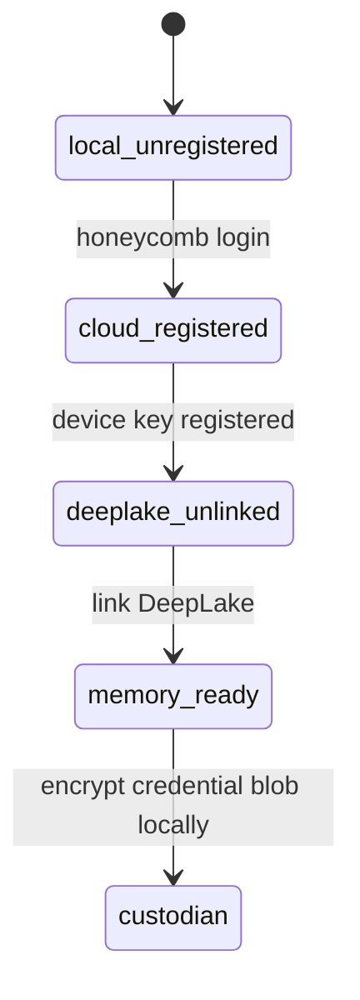
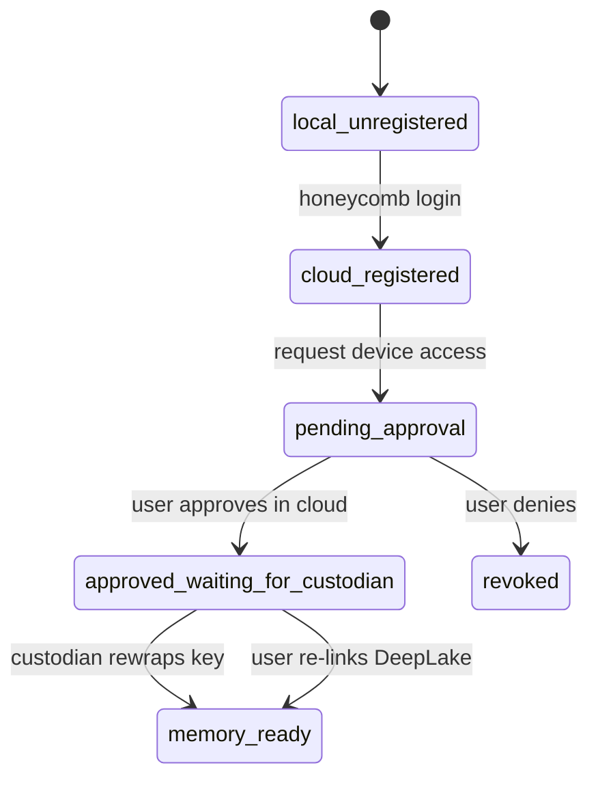
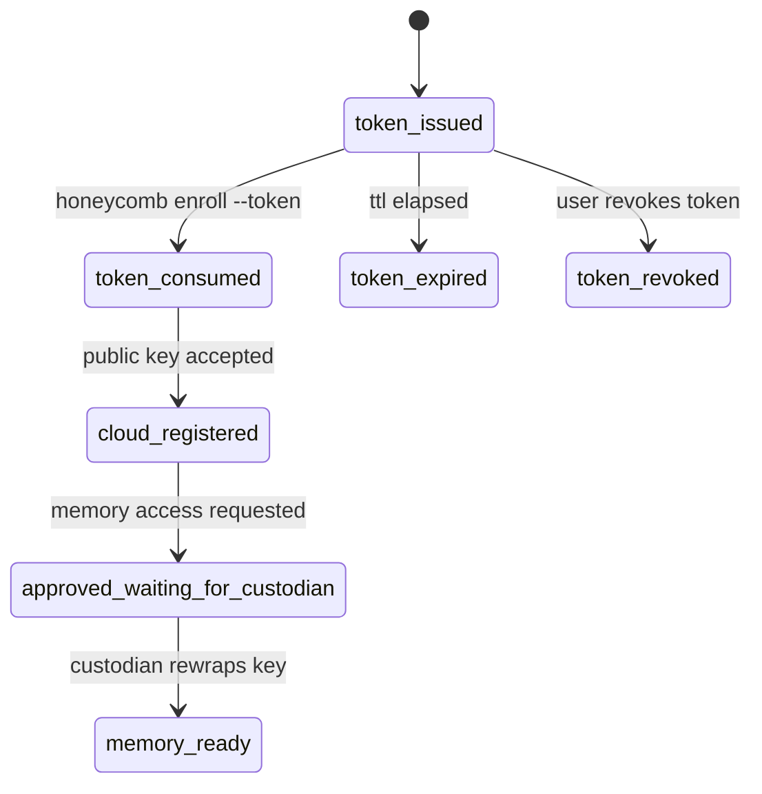
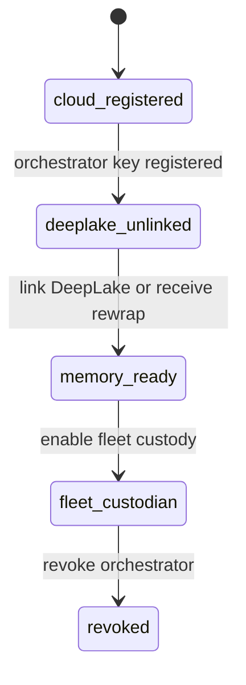
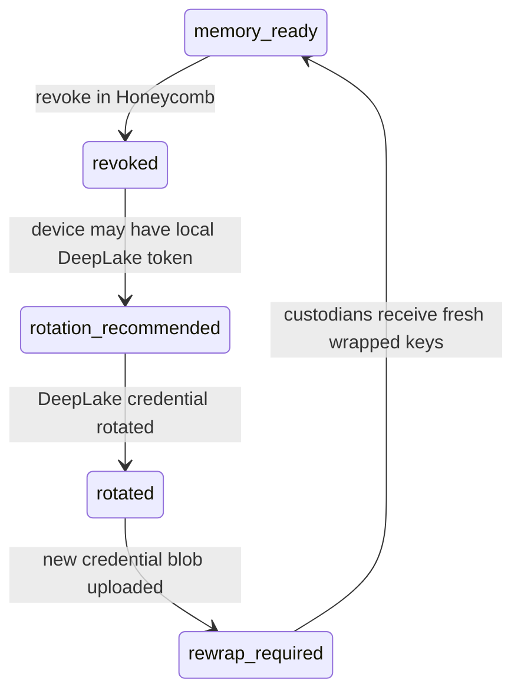

# Device And Fleet Enrollment State Machine

> **SUPERSEDED (2026-07-03):** Relocated to Queen, the fleet orchestrator. Canonical copy: `queen/library/knowledge/private/auth/device-and-fleet-enrollment-state-machine.md`. Retained here for history only; do not update.

> Category: Auth | Version: 1.0 | Date: June 2026 | Status: Proposed

How Honeycomb devices, headless servers, and fleet orchestrators move from first sign-in to memory-ready, including the states users see when approval, rewrap, recovery, or revocation is incomplete.

**Related:**
- [`auth-architecture.md`](auth-architecture.md)
- [`../architecture/adr/0002-orchestrator-custodian-for-fleet-memory-plane.md`](../architecture/adr/0002-orchestrator-custodian-for-fleet-memory-plane.md)
- [`../architecture/adr/0003-trusted-device-custody-and-headless-enrollment.md`](../architecture/adr/0003-trusted-device-custody-and-headless-enrollment.md)
- [`../architecture/adr/0004-honeycomb-control-plane-and-postgres-boundary.md`](../architecture/adr/0004-honeycomb-control-plane-and-postgres-boundary.md)
- [`../architecture/adr/0005-recovery-revocation-and-escrow-policy.md`](../architecture/adr/0005-recovery-revocation-and-escrow-policy.md)
- [`../security/credential-storage.md`](../security/credential-storage.md)
- [`../security/trust-boundaries.md`](../security/trust-boundaries.md)

---

## Why This Exists

Device and fleet enrollment has several legitimate half-finished states. A new laptop can be
approved in Honeycomb cloud but still wait for an existing custodian to come online. A VPS can be
registered through a headless token but still lack DeepLake access. A stolen laptop can be revoked
from Honeycomb while still requiring DeepLake credential rotation for full containment.

Those states are not bugs. They are the direct result of Honeycomb's default promise: the cloud
coordinates, but it cannot decrypt the DeepLake credential. The product must name each state clearly
so users know whether they need to wait, approve, re-link, rotate, or generate a new token.

## Device Classes

| Class | Examples | Long-lived custodian? | Browser required? |
|---|---|---:|---:|
| Trusted device | Laptop, desktop, workstation | Yes, if policy allows | Usually yes |
| Fleet custodian | Hermes/OpenClaw orchestrator | Yes | No |
| Ephemeral worker | CI runner, disposable VM, spawned agent | No | No |
| Non-custodian server | Read-only host, utility server | No by default | No |

The same control-plane records can represent all four classes, but the states and recovery
expectations differ.

## Core States

These states should be reflected in API responses and user-facing surfaces.

| State | Meaning | User action |
|---|---|---|
| `local_unregistered` | Honeycomb is installed locally, but the device has no cloud identity. | Sign in or enroll. |
| `cloud_registered` | Device is known to Honeycomb and has a public key. | Link DeepLake or wait for approval. |
| `deeplake_unlinked` | Device can use control plane but cannot access memory data plane. | Link DeepLake or request access. |
| `pending_approval` | New device/server asked to join; no user approval yet. | Approve or deny in cloud console. |
| `approved_waiting_for_custodian` | User approved, but no custodian has rewrapped the credential key. | Bring a custodian online or re-link DeepLake. |
| `memory_ready` | Device has local decrypt capability for the current credential blob. | None. |
| `custodian` | Trusted device can decrypt or rewrap the DeepLake credential data key for other devices. | Protect this device. |
| `fleet_custodian` | Fleet orchestrator can decrypt or rewrap the DeepLake credential data key for its managed fleet. | Protect and monitor this orchestrator. |
| `revoked` | Device is no longer trusted by Honeycomb. | Rotate DeepLake if compromised. |
| `lost_all_custodians` | No remaining device can rewrap credential keys. | Re-link DeepLake or use recovery material. |
| `recovery_available` | User-controlled recovery material exists and can unwrap the credential data key. | Use recovery key/passphrase flow. |
| `escrow_enabled` | Honeycomb-managed recovery is explicitly enabled. | Understand changed trust posture. |
| `token_issued` | Headless enrollment token exists but has not been consumed. | Use, revoke, or let it expire. |
| `token_consumed` | Headless enrollment token was exchanged for a device public key. | Continue device approval/access flow. |
| `token_expired` | Headless enrollment token exceeded its TTL before use. | Generate a new token if needed. |
| `token_revoked` | Headless enrollment token was explicitly revoked before use. | Generate a new token if needed. |
| `rotation_recommended` | Device was revoked and may still have local DeepLake material. | Rotate DeepLake credentials. |
| `rotated` | DeepLake credential has been rotated. | Upload/rewrap the fresh credential blob. |
| `rewrap_required` | New credential blob exists and eligible custodians need fresh wrapped keys. | Bring custodians online or re-link. |

## First Trusted Device

The first trusted device establishes both control-plane identity and memory-plane custody.



Important details:

- The device keypair is generated locally.
- Honeycomb cloud stores the public key, not the private key.
- DeepLake auth happens once on this first device.
- The device encrypts the credential blob or credential data key before upload.
- Postgres stores ciphertext and wrapped-key metadata, not plaintext DeepLake credentials.

## Additional Trusted Device

An additional laptop or desktop should not require both machines to be open at the same time. The
cloud console records approval; a custodian performs the rewrap later.



The critical UX distinction is between **approved** and **memory ready**. Approved means the human
authorized the device. Memory ready means the cryptographic rewrap has completed or the device has
linked DeepLake directly.

Recommended user-facing copy:

```text
Approved. Waiting for one of your trusted devices to come online and finish encrypted credential
sync. You can also link DeepLake on this device now.
```

## Headless Server Enrollment

Headless enrollment lets a VPS or server join without a browser. The enrollment token registers the
machine; it does not grant memory access.



Headless server copy should avoid implying that a pasted token contains secret memory access:

```text
This token registers the server with Honeycomb. It cannot read memory and cannot decrypt your
DeepLake credential. Memory access becomes available after a custodian device approves and syncs it.
```

## Fleet Custodian Enrollment

A Hermes/OpenClaw orchestrator follows the headless path but becomes a fleet custodian once it has
DeepLake access and a local custodian key.



A fleet custodian may broker memory access for workers or issue short-lived worker access, depending
on fleet policy. Ephemeral workers do not become custodians.

## Revocation And Rotation States

Revocation is a Honeycomb control-plane action. Rotation is a DeepLake/memory-plane containment
action. The UI should not collapse them.



Recommended user-facing copy after a stolen device:

```text
This device can no longer use Honeycomb. If it may have had local DeepLake access, rotate DeepLake
credentials to fully invalidate memory access from that machine.
```

## Recovery States

The recovery state depends on whether any custodian remains.

| Condition | State | Resolution |
|---|---|---|
| At least one custodian online eventually | `approved_waiting_for_custodian` | Wait for rewrap. |
| No custodian remains | `lost_all_custodians` | Re-link DeepLake. |
| Recovery key exists | `recovery_available` | Use recovery key to unwrap. |
| Escrow enabled | `escrow_enabled` | Honeycomb-managed recovery can provision. |

Default copy:

```text
No trusted device can currently unlock this memory credential. Link DeepLake again from this device
to continue.
```

## Minimal Control-Plane Record Shape

This is not a migration spec, but future PRDs should cover these logical records.

```sql
-- logical shape only
device (
  org_id,
  user_id,
  device_id,
  device_kind,
  public_key,
  trust_state,
  custodian_state,
  last_seen_at,
  revoked_at
);

credential_blob (
  org_id,
  blob_id,
  provider,
  ciphertext,
  active_from,
  superseded_at
);

wrapped_credential_key (
  org_id,
  blob_id,
  recipient_id,
  recipient_kind,
  wrapped_key,
  created_at,
  revoked_at
);

device_add_request (
  org_id,
  request_id,
  requester_device_id,
  candidate_public_key,
  approval_state,
  rewrap_state,
  expires_at
);

enrollment_token (
  org_id,
  token_id,
  token_kind,
  scope,
  expires_at,
  max_uses,
  consumed_count,
  revoked_at
);
```

Every row is scoped. No row contains plaintext DeepLake credentials or memory content.

## UX Checklist

Before implementation, every surface should answer:

- Is this device signed into Honeycomb?
- Is DeepLake linked for this account/fleet?
- Is this device approved?
- Is this device memory-ready?
- Is it waiting for a custodian?
- Is a token expired, consumed, or revoked?
- Does the user need to re-link DeepLake?
- Does the user need to rotate DeepLake after compromise?
- Is escrow disabled, enabled, or unavailable?

The most important product distinction is simple: **approval is not unwrap**. Approval happens in
cloud. Unwrap or rewrap happens on a custodian device, through recovery material, or through explicit
escrow.
