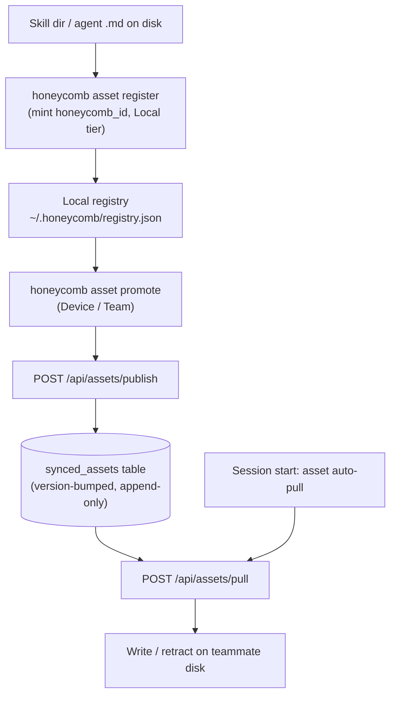
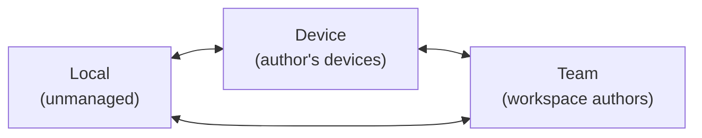
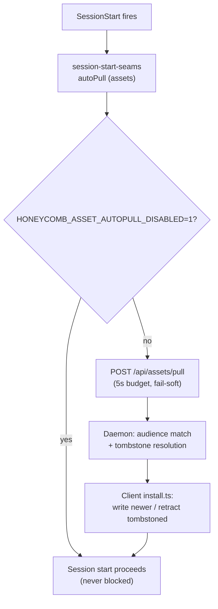

# Asset Sync Substrate

> Category: Collaboration | Version: 1.0 | Date: June 2026 | Status: Active

How Honeycomb tracks portable agent assets (skills and agents), promotes them across a tiered audience lattice, syncs them through the org's shared DeepLake table, and auto-pulls them into every harness at session start, the same seam that distributes team skills, generalized to any asset kind.

**Related:**
- [`team-skills-sharing.md`](team-skills-sharing.md)
- [`../ai/skillify-pipeline.md`](../ai/skillify-pipeline.md)
- [`../architecture/daemon-surface.md`](../architecture/daemon-surface.md)
- [`../multi-tenant/org-workspace-model.md`](../multi-tenant/org-workspace-model.md)
- [`../data/deeplake-storage.md`](../data/deeplake-storage.md)
- [`../integrations/hook-lifecycle.md`](../integrations/hook-lifecycle.md)

---

## What the substrate is for

Team skill sharing answered one question: how does a mined `SKILL.md` reach a teammate? The asset sync substrate answers the general version: how does *any* portable agent artifact, a skill directory today, an agent definition tomorrow, move between a developer's machine, their other devices, and their team, with stable identity, version discipline, and a clean retraction path?

The substrate is the layer underneath skill sharing. It treats a skill not as a special case but as one *asset kind* among several, gives each artifact a rename-proof identity, lets the user choose how widely it travels, and pushes the result through the same daemon-backed sync engine and the same session-start auto-pull seam that team skills already use. Skills remain the flagship asset; the substrate is what makes the flagship reusable.

Everything that touches storage goes through the Honeycomb daemon on port 3850. The CLI and the hook seam are thin clients: they read and write a small local registry, then POST to the daemon, which is the only process that opens DeepLake.

---

## Asset identity

Every asset carries a **`honeycomb_id`**, a stable, rename-proof identity of the form `hc_<32hex>` (a UUID v4 with its dashes stripped and an `hc_` prefix). The id is what the substrate keys on, never the file path or directory name, so renaming a skill or moving its folder never forks its history. Identity resolution lives in `src/daemon/runtime/assets/identity.ts`:

1. **Frontmatter first.** The id is stamped into the artifact's YAML frontmatter (`honeycomb_id: hc_…`). For a skill that is the `SKILL.md`; for an agent it is the single `.md` file. `parseHoneycombId` reads it back verbatim.
2. **Registry fallback.** If the frontmatter is absent, the local registry's record for that path supplies the id.
3. **Mint fresh.** With neither present, `mintHoneycombId` generates a new id and stamps it.

Two **asset kinds** ship today (`SYNCED_ASSET_TYPES`):

- **`skill`**, a directory containing a `SKILL.md` plus any supporting files. Its content hash is a merkle-style root over the sorted `(relative-path, content-hash)` pairs of every file in the directory, so any change anywhere in the skill bumps the hash.
- **`agent`**, a single `.md` agent definition. Its content hash is the hash of that one file.

The hashing rules live in `src/daemon/runtime/assets/hashing.ts`. The substrate records three hashes per asset, `lastSyncedHash` (content at last publish), `localHash` (current local content), and `remoteHash` (last remote version observed), which give the sync engine the inputs for change detection and conflict reasoning.

---

## The local registry

`~/.honeycomb/registry.json` is the source of truth for what the local machine knows about each asset. It is plain local state, never DeepLake. Each entry (`RegistryEntry`, in `src/daemon/runtime/assets/registry.ts`) carries:

| Field | Meaning |
|---|---|
| `honeycombId` | The stable `hc_<32hex>` identity |
| `assetType` | `"skill"` or `"agent"` |
| `harness` | The native target the artifact was registered for (e.g. `claude_code`, `cursor`) |
| `tier` | `"Local"`, `"Device"`, or `"Team"`, how widely the asset travels |
| `style` | `"Repository"` or `"User"`, project-scoped vs machine-global |
| `version` | Monotonic integer; `0` is the unpublished baseline |
| `lastSyncedHash` / `localHash` / `remoteHash` | The three change-detection hashes |
| `author`, `org`, `workspace` | Provenance + tenancy |
| `deviceSet` | The device ids an asset is scoped to at Device tier |
| `sourcePath` | The on-disk path the artifact was registered from |

Registering an asset writes a registry entry at the `Local` tier and mints (or reuses) the id. It writes **nothing** to DeepLake, `Local` is unmanaged by design.

---

## The tier and style lattice

An asset's reach is described by two orthogonal axes.

**Tier** is the audience radius:

- **`Local`**, unmanaged. Lives only on this machine, never synced.
- **`Device`**, synced to the same author's *other* devices, scoped by the asset's `deviceSet`.
- **`Team`**, synced to every author in the workspace, scoped by `org` + `workspace`.

**Style** is the install footprint, orthogonal to tier:

- **`Repository`**, keyed to the project (a SHA over `git config remote.origin.url`); the asset installs project-locally.
- **`User`**, global per machine; the asset installs under the user's home root.

Promotion and demotion move an asset along the tier axis. The lattice permits direct jumps (`Local → Team` is legal, not just `Local → Device → Team`). The transition orchestration lives in `src/daemon/runtime/assets/lifecycle.ts` (`registerAsset` + `transitionAsset`), and the audience model is in `src/daemon/runtime/assets/lattice.ts`.

---

## The `honeycomb asset` CLI

The CLI (`src/commands/asset.ts`) is a thin client: it reads and writes the local registry, and for any tier change it POSTs to the daemon's `/api/assets` group. It never opens DeepLake.

| Subcommand | Usage | Effect |
|---|---|---|
| `register` | `honeycomb asset register <path> --type <skill\|agent> --harness <h> [--style <Repository\|User>]` | Records the artifact at `Local` tier, mints `honeycomb_id`, writes nothing to DeepLake. |
| `promote` | `honeycomb asset promote <honeycomb_id> <Local\|Device\|Team>` | Raises the tier; publishes a new version at the wider radius when the target is Device or Team. |
| `demote` | `honeycomb asset demote <honeycomb_id> <Local\|Device\|Team>` | Lowers the tier; tombstones every wider tier the asset is leaving. |
| `style` | `honeycomb asset style <honeycomb_id> <Repository\|User>` | Flips the style axis; no publish or tombstone (style is orthogonal to reach). |
| `list` | `honeycomb asset list` | Prints every registered artifact with id, kind, tier, style, and version. |
| `device list` | `honeycomb asset device list` | Shows this machine's device id and label. |
| `device revoke` | `honeycomb asset device revoke <device_id>` | Tombstones Device-tier assets scoped to the revoked device. |

Device identity (the machine's stable `device_id`) is managed in `src/daemon/runtime/assets/device.ts`.

---

## The `/api/assets` HTTP surface

The daemon mounts an asset route group at `/api/assets` (`src/daemon/runtime/assets/api.ts`). Three endpoints carry the whole lifecycle, each a `POST`:

### `POST /api/assets/publish`

Appends a version-bumped row for a promoted artifact. The request carries the `honeycombId`, `assetType`, `harness`, the verbatim artifact blob (`native`), the `contentHash`, the target `cell` (`{ tier, style }`, never `Local`), the `scope` (`{ org, workspace, author, deviceId }`), and the `deviceSet` for Device-tier publishes. The daemon assigns the new `version` and returns `{ honeycombId, version, published }`.

### `POST /api/assets/pull`

Selects the newest audience-matched rows. The request carries the `scope` and an optional `style` filter. The daemon reads the highest-version row per `honeycomb_id`, keeps those whose audience matches the caller's context (`audienceMatches`), and returns `{ assets, tableAbsent }`. The returned set *includes* tombstones so the client can retract locally. Pull is fail-soft: an error yields an empty set, and a fresh workspace with no `synced_assets` table yet sets `tableAbsent: true` and skips the SELECT entirely.

### `POST /api/assets/tombstone`

Writes a `tombstone='true'` row for a demotion or revocation. Same shape as publish (id, kind, harness, the `cell` being left, scope, deviceSet); returns `{ honeycombId, version, tombstoned }`. The next pull selects the tombstone and retracts the asset from the teammate's disk.

The sync engine that backs all three (`src/daemon/runtime/assets/sync.ts`) is append-only and version-bumped, it never UPDATEs or DELETEs. Current state for any asset is `ORDER BY version DESC LIMIT 1`, the same read-back discipline the rest of the DeepLake schema uses.

---

## The `synced_assets` table

The substrate persists into a dedicated DeepLake table, `synced_assets` (schema in `src/daemon/storage/catalog/synced-assets.ts`). It is tenant-scoped through explicit columns rather than partition keys. The columns:

| Column | Type | Role |
|---|---|---|
| `honeycomb_id` | TEXT | The stable asset identity |
| `version` | BIGINT | Monotonic version (the append-only key) |
| `asset_type` | TEXT | `skill` / `agent` |
| `harness` | TEXT | Native target |
| `native` | TEXT | The verbatim artifact blob |
| `canonical` | TEXT | Reserved for a future cross-harness canonical form |
| `content_hash` | TEXT | The merkle/file content hash |
| `tombstone` | TEXT | `"true"` / `"false"` |
| `tier` | TEXT | `Local` / `Device` / `Team` |
| `style` | TEXT | `Repository` / `User` |
| `org`, `workspace`, `author` | TEXT | Tenancy + provenance |
| `device_set` | TEXT | JSON array of device ids (Device-tier scope) |
| `created_at` | TEXT | Row timestamp |

The write pattern mirrors `skills` and `memory`: every change is a new row at `version = N+1`, and readers always take the highest version per id. Because the backend is eventually consistent, the pull path is poll-convergent (it reads the max version it can see rather than asserting a single immediate read), consistent with the read-consistency discipline documented in [`../data/deeplake-storage.md`](../data/deeplake-storage.md).

---

## Session-start asset auto-pull

Assets ride the same session-start seam that distributes team skills. The session-start lifecycle (`src/hooks/shared/session-start.ts`) sequences its side-effecting steps around the daemon through an injectable `SessionStartSeams` object; the production seam factory (`src/hooks/shared/session-start-seams.ts`) wires the real auto-pull. The asset step mirrors the skills step exactly:

- **Thin client.** The hook POSTs over loopback to the daemon's asset pull route; the daemon runs the real audience match + install/retract daemon-side. The hook states "pull now"; the daemon does the work and never opens DeepLake from the hook.
- **Idempotent.** A re-pull of a version already on disk writes nothing. Running the pull on every session start is safe.
- **Fail-soft.** Any error, daemon down, non-200, refused socket, timeout, is swallowed. The pull always resolves and session start is never blocked or broken.
- **Time-budgeted.** The pull is bounded by a 5-second timeout (`ASSET_AUTOPULL_TIMEOUT_MS = 5_000`), raced against an abort timer so a hung daemon never delays the first turn.
- **Kill switch.** `HONEYCOMB_ASSET_AUTOPULL_DISABLED=1` skips asset auto-pull entirely, exactly parallel to `HONEYCOMB_AUTOPULL_DISABLED` for skills.
- **Tenancy from the credential.** The pull stamps `x-honeycomb-org` / `x-honeycomb-workspace` / `x-honeycomb-actor` from the loaded credential. A signed-out session POSTs unscoped and the daemon fail-closes it to a no-op; session start still proceeds.

The client-side install/retract engine lives in `src/daemon-client/assets/install.ts`: it applies the daemon's pulled set to disk, writing newer assets, backing up replaced ones, and retracting tombstoned ones. Because both skills and assets share one `SessionStartSeams` object, the asset auto-pull adds an `assets` step alongside the `skills` step without re-plumbing the runtime, the seam was designed for exactly this generalization.

---

## Skill discovery and KPI correctness

PRD-036 makes the substrate honest about what is actually present. A local scanner walks the harness skill roots and registers what it finds, a union view merges locally-mined skills with pulled teammate skills (so the dashboard and CLI report one coherent list rather than two disjoint ones), and the KPI counts reflect the deduplicated union rather than double-counting a skill that exists both locally and as a pulled copy. The union view is what the dashboard Sync page and the `honeycomb asset list` surface read, so the count a user sees matches the assets actually on disk and in the table.

---

## Relationship to team skill sharing

Team skill sharing (see [`team-skills-sharing.md`](team-skills-sharing.md)) is the skill-shaped specialization of this substrate. The skillify worker mines a `SKILL.md`, the skill pull engine distributes it with `--<author>` directory naming and cross-harness symlink fan-out, and the skills auto-pull seam delivers it at session start. The asset substrate factors out the parts that are not skill-specific, stable identity, the tier/style lattice, the version-bumped table, the publish/pull/tombstone API, and the session-start auto-pull seam, so an agent definition (or a future asset kind) gets the same distribution guarantees without a second pipeline. Skills stay the flagship; the substrate is the shared road they travel on.
