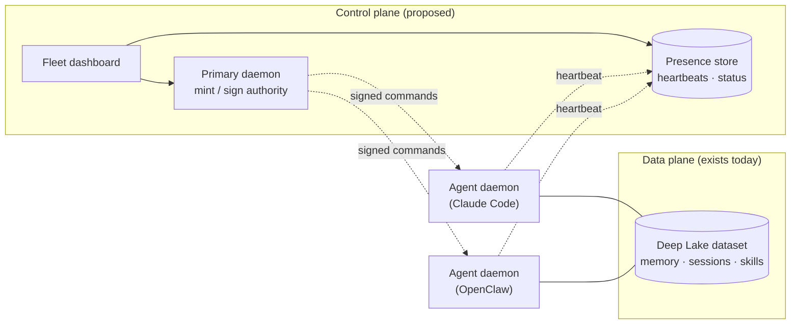
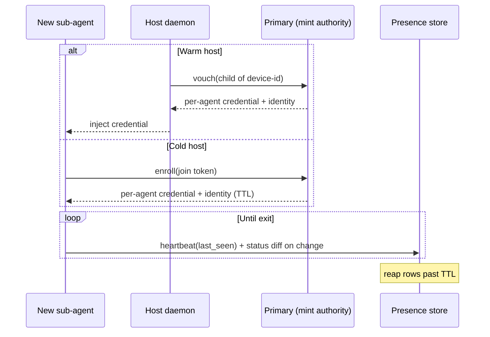
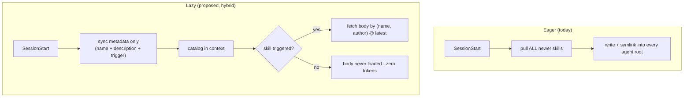

# Harness Fleet Observation and On-Demand Skill Sharing

> **SUPERSEDED (2026-07-03):** Relocated to Queen, the fleet orchestrator. Canonical copy: `queen/library/knowledge/private/collaboration/fleet-observation-and-on-demand-skills.md`. Retained here for history only; do not update.

> Category: Collaboration | Version: 0.1 | Date: June 2026 | Status: Proposed (Design)

A forward-looking design for observing and steering a fleet of Honeycomb-equipped agents (across Claude Code, Codex, Cursor, OpenClaw, Hermes, and pi), and for serving the team skill library on demand instead of eagerly syncing all of it to every agent. This doc is a design proposal, not shipped behavior: it grounds the proposal in the code that exists today and in external prior art, and calls out the decisions still open.

**Related:**
- [`team-skills-sharing.md`](team-skills-sharing.md)
- [`asset-sync-substrate.md`](asset-sync-substrate.md)
- [`../frontend/dashboard-architecture.md`](../frontend/dashboard-architecture.md)
- [`../operations/observability-and-degradation.md`](../operations/observability-and-degradation.md)
- [`../auth/auth-architecture.md`](../auth/auth-architecture.md)
- [`../security/trust-boundaries.md`](../security/trust-boundaries.md)
- [`../security/scoping-and-visibility.md`](../security/scoping-and-visibility.md)
- [`../multi-tenant/org-workspace-model.md`](../multi-tenant/org-workspace-model.md)
- [`../architecture/daemon-surface.md`](../architecture/daemon-surface.md)
- [`../integrations/harness-integration.md`](../integrations/harness-integration.md)

---

## Why this exists

Honeycomb already shares *memory* across agents. Every harness reads and writes the same Deep Lake dataset over HTTPS, so two agents on two VMs in two clouds converge on the same memory today without any networking work on our part. What Honeycomb does *not* have is a way to **see** that fleet (which agents are alive, what they are doing, whether their daemon is wedged) or to **steer** it (pause an agent, push a command, force a skill pull). Each daemon is a loopback island: it binds `127.0.0.1:3850`, answers `/health` to nobody outside the box, and is otherwise invisible.

This doc proposes a **control plane** that sits beside the existing data plane, plus a refinement to skill distribution: today every newer team skill is eagerly pulled and symlinked into every agent root (see [`team-skills-sharing.md`](team-skills-sharing.md)); a fleet of many ephemeral sub-agents wants the option to query a skill *catalog* and fetch only the bodies it needs.

The single most important framing in this design is the split between two planes. Do not collapse them.

| Plane | Carries | Substrate | Status |
|---|---|---|---|
| Data | Memory, sessions, the skill library | Deep Lake dataset (BYOC) | Shipped |
| Control | Liveness, status, commands, identity | A presence store + a primary daemon | Proposed |

Memory and skills stay on the data plane where they already work. Only liveness, status, and commands are new, and they belong on the control plane.

---

## Presence: heartbeat versus status diff

The naive instinct is "each daemon writes its status to the database; if nothing changed, write nothing." That is correct for status *content* and wrong for *liveness*. If a healthy idle agent writes nothing and a crashed agent also writes nothing, the dashboard cannot tell them apart, they are byte-identical from the outside. Two distinct signals are therefore required:

- **Heartbeat.** A cheap `last_seen` timestamp the daemon bumps on a fixed interval regardless of whether anything changed. Liveness is derived as `now - last_seen > threshold`. Prior art clusters around 30s heartbeats with a multi-minute offline cutoff (Quint heartbeats every 30s; doop marks an agent offline after 5 minutes of silence).
- **Status diff.** The richer record (current task, version, error state, embeddings health) written only on change, exactly the "if nothing changes, nothing writes" idea, applied to content rather than liveness.

Spawnly's dashboard classifies the heartbeat as a System event and hides it by default so it does not clog the per-agent timeline. The same discipline applies here: heartbeats prove liveness, they are not interesting to read.

### Why presence does not belong in the Deep Lake dataset

The memory dataset is append-only, version-bumping, and eventually consistent (see [`../data/deeplake-storage.md`](../data/deeplake-storage.md)). Presence is mutable, high-frequency, and ephemeral, the opposite profile. A fleet of daemons heartbeating on an interval forever is exactly the write-amplification pattern that has wedged the daemon before (boot stalling on an accumulated `memory_jobs` backlog). Presence should live in a fit-for-purpose store (a small Redis or Postgres table with TTL-based liveness), not the memory dataset. If a single backend is mandatory, presence gets its own table with low-frequency heartbeats and a compaction job so it never accumulates.

Keeping presence off the dataset introduces one cost: the daemon's existing Deep Lake credential does not cover the new store. That is resolved by the primary daemon acting as a credential broker (below), or by a separate scoped credential.

### Ephemeral agents must be reaped

Sub-agents (worker-bees, OpenClaw/Hermes workers) spawn and die constantly. Per-agent presence rows must be cheap to write and TTL'd, and the store must reap rows whose `last_seen` has aged past their TTL. Otherwise the fleet view fills with thousands of dead-agent rows, the same accumulation failure in a new guise. Spawnly models this explicitly as short-lived (do one job and exit) versus long-lived agents.

---

## Identity and enrollment

Two logins exist here and must not be conflated: **machine login** (a headless daemon or sub-agent proving who it is) and **human login** (a person opening the dashboard). They meet at tenancy: the dashboard must only ever show a user their own fleet.

### Machine identity reuses what exists

A daemon already authenticates to its Deep Lake dataset and already has a UUID device-id (per the PRD-033 ruling). That pair is its identity: device-id answers "who am I," the dataset/org credentials answer "what may I touch." Tenancy then falls out for free, the fleet is "every daemon authed to the same org," and a presence row keyed by `(org, device-id)` is automatically attributable and scoped. The org partition is the same `x-honeycomb-org` boundary the skill propagation API already enforces fail-closed in [`propagation-api.ts`](../../../src/daemon/runtime/skillify/propagation-api.ts).

### Per-agent enrollment, not just the orchestrator

If the dashboard is to show and steer *individual* sub-agents, every sub-agent needs its own attributable identity, not just the orchestrator. And nobody opens a dashboard each time a worker-bee spawns. The standard solution is a **join token** that bootstraps a per-agent identity, the same shape as Kubernetes `kubeadm` join tokens, Tailscale auth keys, Quint's `fleet:enroll` deploy tokens, and agentfab's `node token create`.

The anti-pattern to avoid is one shared API key pasted into every agent forever: it cannot attribute or revoke a single agent, and a leak from any one agent is fleet-wide. Instead the token is short-lived and low-privilege (its only power is "let me join"), and the agent exchanges it on first contact for its own per-agent credential:

1. A sub-agent boots with a short-lived enrollment token (an env var or a CLI flag the harness adapter injects).
2. On first contact it presents the token to the primary and receives its own per-agent credential plus `(org, host device-id, agent-instance-id)`.
3. From then on it heartbeats and reports under its own identity; the enrollment token's job is done.

Two enrollment paths cover the real cases:

- **Warm host (a daemon is already enrolled).** No per-agent token needed: the daemon vouches for its children, minting a child identity locally and reporting it. Trust chain is primary to host daemon to sub-agent. This is likely how Claude Code worker-bees look (sub-agents inside one host process).
- **Cold host (a fresh VM with nothing enrolled).** The join token earns its keep: it is the non-interactive credential for first contact, after which the agent holds its own per-agent credential. This is likely the OpenClaw/Hermes-across-VMs case.

Spawnly issues a SPIFFE JWT-SVID per pod via a sidecar that registers the agent and obtains scoped tokens; agentfab has nodes present an enrollment token plus measured claims and explicitly notes "the node does not self-authorize." Both are the heavier, attestation-grade version of the same join-then-scope flow.

### The enrollment protocol is harness-agnostic

The protocol (present token, receive per-agent credential, heartbeat) is identical for every harness. What differs is only *how the token is injected at spawn*, and Honeycomb already has the six per-harness adapters that do exactly this kind of plumbing (see [`../integrations/harness-integration.md`](../integrations/harness-integration.md)). Each adapter's only new job is to inject the enrollment token in its native way and notice when a sub-agent starts. The hard part is written once; the adapters carry the token. doop-os validates this model directly: it registers agents by platform (it lists OpenClaw and "MCP for Claude/Cursor" among them), and each agent gets a unique API key plus a config snippet to paste.

---

## The primary daemon as mint and sign authority

A single **primary daemon** (the main service) is the control plane's trust anchor. Adopting it collapses two otherwise separate components into one: it is both the command authority and the credential broker (the token-exchange endpoint above). One thing to build, one thing to trust, one thing to protect.

**Minting means signing.** When the primary issues a command it signs it with a private key, and every worker verifies against the primary's public key before executing. This is the property that makes the design safe over a flaky transport: a command may travel through an eventually-consistent presence/command table that flaps stale segments, so "it appeared in the table" must not mean "execute it." With signing, the table is a dumb pipe, a worker runs a command only if it carries a valid signature, is idempotent, and has not been applied yet. A flapped, duplicated, or tampered row simply fails verification. agentfab encodes the same idea as signed, version-matched fabrics enforced at admission.

This also fixes the authority shape. The dashboard never writes commands; it *asks the primary to mint* one. Command-signing authority lives in exactly one place, so a stolen dashboard session can request but never forge. The permission split is then clean:

| Capability | Holder | Notes |
|---|---|---|
| See the fleet | Dashboard (read scope) | Low-risk, granted on normal login |
| Request / mint a command | Dashboard requests, primary mints + signs | Stronger scope; commanding an autonomous agent is dangerous |
| Verify + execute + ack | Worker | Pins the primary's public key; refuses unknown command types |

Three rules constrain the primary:

1. **Required to issue, never to run.** The primary gates *new* commands only. If it is down, workers keep doing local work and keep heartbeating; they just cannot receive new commands. Degrade to autonomous, not to dead. agentfab makes the inverse guarantee with leases: when a node dies, stale heartbeats release its task leases and the scheduler redispatches without duplicate execution.
2. **The key is the crown jewels.** Concentrating authority concentrates risk: owning the primary owns the fleet. The signing key goes in a keychain/HSM where possible, `creds_key`-encrypted at rest at minimum, never on a worker. Every mint is audit-logged with requester and payload (doop and Spawnly both keep an append-only activity/event log for exactly this).
3. **Commands flow by idempotent poll, not push.** Until there is proven need for sub-second control, workers poll a command table and apply signed, acked, idempotent commands. Quint already demonstrates the benign version: its heartbeat response carries policy updates back to the daemon, a pull-based control channel riding the heartbeat.

### The one decision still open: where the primary lives

This determines the entire key-custody story and is a BYOC-philosophy call:

- **Hosted primary** (our infra, under theapiary.sh). Clean and easy to operate, but every user's fleet then depends on our box and our key, cutting against bring-your-own-everything.
- **Designated user daemon** (one of the user's own installs is elected primary). Pure BYOC, key stays in the user's trust domain, at the cost of leader designation and a signing key on a machine we do not control.

The lean is the designated user daemon, with a hosted convenience tier later, but this is the open question to rule on before building.

---

## On-demand skill fetch versus eager sync

Today's distribution is **eager**: on every `SessionStart` the auto-pull selects all newer team skills and writes plus symlinks them into every agent root (see [`team-skills-sharing.md`](team-skills-sharing.md) and `autoPull` in [`daemon-client/skillify/index.ts`](../../../src/daemon-client/skillify/index.ts)). For a single developer with a few dozen skills this is correct and cheap. For a fleet of many ephemeral sub-agents it is worth offering the **lazy** alternative the broader ecosystem has converged on: keep a lightweight catalog in context and fetch a skill's body only when it is actually needed.

This is not a new idea to invent; it is Anthropic's **progressive disclosure** applied to the team catalog, and it maps onto our schema with no migration:

| Disclosure level | Agent Skills | Honeycomb `skills` table |
|---|---|---|
| 1: always loaded (~100 tokens/skill) | `name` + `description` frontmatter | `name`, `author`, `description`, `triggerText` columns |
| 2: loaded on trigger | full `SKILL.md` body | `body` column |
| 3: loaded as needed | bundled resources | (future) bundled assets via the asset substrate |

The `skills` table already stores the metadata columns separately from `body` (confirmed in the publish schema in [`propagation-api.ts`](../../../src/daemon/runtime/skillify/propagation-api.ts)). So a lazy mode is a query shape, not a rewrite: sync only the metadata rows to build the catalog, then fetch `body` on demand when a skill triggers. The same pattern underpins the Tool Search Tool (`defer_loading`, search the catalog, load the 3-5 relevant definitions, ~85% context savings) and the MCP client progressive-discovery guidance. This very harness session runs it: deferred tools plus a search step.

Two findings set the switch-over threshold. First, tool-selection accuracy degrades past roughly 30-50 simultaneously-loaded items, so a large eagerly-synced library actively hurts the agent's ability to pick the right skill. Second, the MCP guidance recommends switching from eager load to progressive discovery once definitions exceed ~1-5% of the context window.

The recommendation is therefore a **hybrid**, not a replacement:

- **Eager** stays the default for small, stable libraries and for skills an agent should always know it has. It is simple and already shipped.
- **Lazy** (sync metadata, fetch body on trigger) is offered once a workspace's catalog grows past the accuracy/threshold band, or for short-lived sub-agents that should not pay to symlink the whole library for a one-shot job.

A lazy fetch needs a read endpoint that returns bodies by `(name, author)` at the highest version. The daemon already has the read half of this (`selectNewerForOrgUsers` powering `GET /api/skills`); the on-demand path is a narrower "give me exactly this skill's body" query against the same scoped, versioned table, with the same eventual-consistency poll-until-converged discipline every live read-back uses.

---

## Prior art

External systems this design is grounded in (researched June 2026), separating the validated patterns from our specifics:

| Source | Pattern it validates |
|---|---|
| Anthropic, *Equipping agents with Agent Skills* | Three-level progressive disclosure: metadata always loaded, body on trigger, resources on demand |
| Anthropic, *Advanced tool use* / Tool Search Tool | `defer_loading` + catalog search; 30-50 tool accuracy cliff; ~85% context savings |
| MCP client best practices | Progressive discovery; switch from eager load past a 1-5% context threshold; multiple detail levels (name-only, name+description, full) |
| doop-os | Single control plane; per-platform registration (lists OpenClaw, MCP for Claude/Cursor); unique per-agent API key; `POST /heartbeat` with `last_seen_at`; 5-minute auto-offline; append-only activity log; Owner/Admin/Member roles |
| Quint fleet | One-line install with `--token`; `fleet:enroll`-scoped deploy token; machine fingerprint on first registration; 30s heartbeat; heartbeat response carries policy updates back; token revocation |
| agentfab | Conductor + control-plane + node-host split across machines; enrollment token plus measured claims, "node does not self-authorize"; signed version-matched fabrics; leases + stale-heartbeat recovery without duplicate execution; mTLS via workload certs |
| Spawnly | Per-pod SPIFFE JWT-SVID via sidecar; scoped OAuth on top of identity; append-only per-agent event timeline; short-lived vs long-lived agents; heartbeat hidden by default in the timeline |
| cordum | Heartbeat carries `auth_token` (argon2id-hashed) plus capabilities and load; attestation enforced at the gateway |
| Kagenti operator | SPIFFE workload identity binding; AgentCard discovery and JWS signature verification for agent-to-agent trust |

---

## Ecosystem and reusable building blocks (MIT-first)

The build phase should start from a vetted shortlist, not a fresh search. The selection rule here is deliberate: **fold code only from MIT-licensed projects** (the lightest-touch permissive license, whose sole obligation is retaining a one-line notice in a `THIRD-PARTY-NOTICES` file). Apache-2.0 (NOTICE propagation plus a patent clause) and AGPL (network copyleft) are **study-only**: we may learn from their design, since ideas carry no attribution burden, but we do not vendor their code. License and star counts below were verified June 2026.

### Fold or fork (MIT, ships in our package)

| Project | License · stars · lang | Where it plugs in | Mode |
|---|---|---|---|
| [@noble/ed25519](https://github.com/paulmillr/noble-ed25519) | MIT · 510 · TS | Primary daemon sign, worker verify, key pinning. The mint/sign primitive, pure ESM, no native binding. | Fold (npm) |
| [builderz-labs/mission-control](https://github.com/builderz-labs/mission-control) | MIT · 5.4k · TS | The read-only fleet view (v1). Next.js + SQLite, zero external deps, OpenClaw + Claude SDK adapters, discovers `~/.claude/agents`. Its SQLite choice answers "presence store, not Deep Lake." | Fork base |
| [runkids/skillshare](https://github.com/runkids/skillshare) | MIT · 2.3k · **Go** | Skill distribution. Mirrors our propagation-api (symlink fan-out, project vs org, team sharing) and adds three things we lack. Go, so repurpose the design, not the code. | Pattern |

The single highest-value steal from skillshare, given Honeycomb runs heavily on Windows: it links skills with **NTFS junctions (no admin required)** on Windows where our fan-out assumes POSIX symlinks. It also does a **security audit on install** (scans a skill for prompt-injection / data-exfiltration before use), **bidirectional collect** (edits made in a target flow back to the source), and it targets the same `~/.agents/skills` universal dir as the `npx skills` CLI, coexisting with it. Note it is a Go binary with a local web UI (`skillshare ui`), not a packaged desktop app.

### Tokens: build, do not fold

The enrollment/command tokens are the one place where the obvious off-the-shelf pick fails our rule. [Biscuit](https://github.com/eclipse-biscuit/biscuit) is the ideal *model* (offline attenuation, public-key verify, Ed25519 signature chain), but it is Apache-2.0 **and** has no first-class TS implementation. So the move is to **build minimal attenuable signed tokens on @noble/ed25519 ourselves**, borrowing Biscuit's attenuation concept (a design idea, no attribution owed). This keeps the whole token path MIT and full-TS.

### Study only (license forbids a code fold)

| Project | License · lang | What to learn (ideas only) |
|---|---|---|
| [plastic-labs/honcho](https://github.com/plastic-labs/honcho) | AGPL-3.0 · Python | The **peer paradigm** (users and agents are both "peers"), reasoning-first memory (background reasoning over messages into queryable representations, batched ~1000 tokens), and most relevant to us: it already does **cross-harness unified memory** across `claude_code`/`cursor`/`opencode`/`hermes` via a single shared peer ID. That shared-stable-ID-across-hosts is precisely our per-agent identity and tenancy model. Study the model; AGPL means never vendor the code. |
| [eclipse-biscuit/biscuit](https://github.com/eclipse-biscuit/biscuit) | Apache-2.0 · Rust | The capability-token attenuation model (see Tokens above). Concept only. |
| SPIFFE/SPIRE | Apache-2.0 · Go | One idea worth stealing: join tokens that **expire immediately after use**. The full server-plus-per-node-agent attestation stack is too heavy for BYOC. |

The low-star fleet dashboards surfaced in research (clawmatrix, AxmeAI, agentic-fleet-hub) are pattern references, not dependencies. AxmeAI's heartbeat state machine (`registering → healthy → degraded → dead → killed`, 30s interval, 3 missed = dead) is worth copying as a spec even though the repo itself is too small to depend on.

## Open questions

1. **Primary location:** hosted under theapiary.sh, or a designated user daemon? Determines key custody. (Lean: designated, hosted tier later.)
2. **Presence substrate:** dedicated store (Redis/Postgres) versus a separate compacted Deep Lake table. Trades a second credential against write-amplification risk.
3. **Heartbeat cadence and offline cutoff:** 30s / multi-minute is the prior-art default; confirm against daemon load and the embeddings runtime budget.
4. **Lazy-skill trigger surface:** does the agent decide to fetch a body from the catalog description (progressive disclosure), or does the daemon push a fetch when it detects a trigger match? The former matches Agent Skills; the latter keeps logic daemon-side.
5. **Command channel timing:** is an idempotent polled command table sufficient indefinitely, or is there a real need for a low-latency push (which would reintroduce a Tailscale-style reach-in channel)?
6. **Scope of v1:** the read-only fleet view (presence + dashboard, no commands) is the right first cut. Commands, signing, and the mint authority are a deliberate second phase once the pain of not having them is real.
