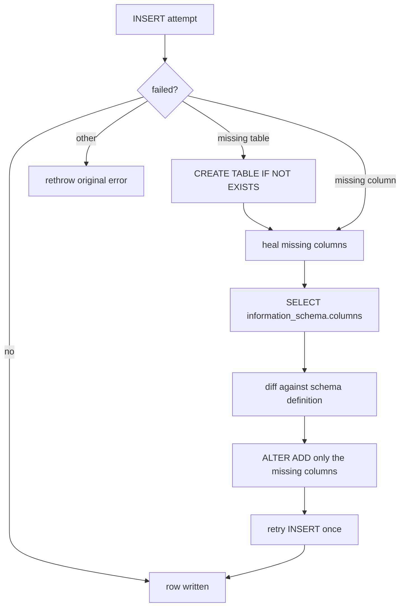

# DeepLake Storage

> Category: Data | Version: 1.0 | Date: June 2026 | Status: Active

The storage substrate: DeepLake as a GPU-backed SQL and vector store, the write patterns that sidestep its UPDATE quirk, the lazy schema-healing primitive, and the SQL-escaping rules that stand in for parameterized queries.

**Related:**
- [`schema.md`](schema.md)
- [`memory-virtual-filesystem.md`](memory-virtual-filesystem.md)
- [`../architecture/system-overview.md`](../architecture/system-overview.md)
- [`../multi-tenant/org-workspace-model.md`](../multi-tenant/org-workspace-model.md)
- [`../security/trust-boundaries.md`](../security/trust-boundaries.md)

---

## Why DeepLake

Honeycomb stores every durable byte in DeepLake, a tensor-native, GPU-backed store that speaks SQL and holds vectors as first-class columns. That choice does two things at once. It gives recall GPU-accelerated vector search over the same tables that hold the structured memory, so semantic and lexical retrieval run against one store instead of a database plus a bolted-on vector index. And it gives a team a shared substrate where org and workspace boundaries are enforced at the storage layer, so two workspaces never share a row, partition, or index.

The daemon is the only DeepLake client. Centralizing access in the daemon is what lets the patterns below be applied uniformly: every write goes through the same escaping, the same schema healing, and the same scoping, no matter which harness or hook triggered it.

## Two facts that shape every table

Two properties of the DeepLake query endpoint shape the entire data layer.

First, the query endpoint does not bind parameters. Every value is escaped and interpolated by hand before it is sent. The daemon provides three helpers that every query builder must use: `sqlStr` escapes a value for a single-quoted literal (doubling backslashes and quotes, dropping NUL and control characters), `sqlLike` layers `%` and `_` escaping for `LIKE`/`ILIKE`, and `sqlIdent` validates a table or column name against `^[a-zA-Z_][a-zA-Z0-9_]*$` and throws on anything else. Text bodies that may contain escape sequences are written with the `E'...'` literal form so the doubled-backslash escaping round-trips.

```typescript
export function sqlIdent(name: string): string {
  if (!/^[a-zA-Z_][a-zA-Z0-9_]*$/.test(name)) {
    throw new Error(`Invalid SQL identifier: ${JSON.stringify(name)}`);
  }
  return name;
}
```

Second, DeepLake has an UPDATE-coalescing quirk: two rapid UPDATEs to the same row within microseconds can silently drop one. Tables that expect concurrent edits therefore avoid in-place UPDATE and use append-only, version-bumped writes instead.

## The write patterns

Every table uses one of a few patterns, chosen by how it expects to be written.

| Pattern | Used by | How it works |
|---|---|---|
| Append-only INSERT | `sessions`, raw events | One row per event, never concatenated. Readers order by `creation_date`. |
| Append-only, version-bumped | `skills`, `rules`, and the engine's claim history | Every edit INSERTs version N+1; readers take `ORDER BY version DESC LIMIT 1`. |
| UPDATE-or-INSERT by key | `memory`, `goals`, `kpis` | One row per logical key; small-team v1 trade-off accepting the UPDATE quirk for two writes within microseconds. |
| SELECT-before-INSERT | `codebase` snapshots | Check for the identity key, insert if absent, re-verify after to make races observable. |

The version-bumped pattern is the important one for the memory engine. Because DeepLake cannot safely update a row in place under concurrency, the knowledge-graph ontology supersedes a claim by appending a new version and marking the old one superseded, rather than mutating the existing row. The currentness logic in retrieval reads the highest active version. This is documented where it is used in [`../ai/knowledge-graph-ontology.md`](../ai/knowledge-graph-ontology.md).

## Vectors

Embeddings are 768-dimension `nomic-embed-text-v1.5` vectors stored as DeepLake tensor columns (for example `sessions.message_embedding` and `memory.summary_embedding`), nullable so that recall degrades to lexical search when embedding is disabled or fails. Vector search runs on the GPU-backed engine against those columns, so semantic recall and the structured filters that scope it happen in one query. The retrieval flow that consumes this is [`../ai/retrieval.md`](../ai/retrieval.md).

## Lazy schema healing

DeepLake tables are created lazily, on first write, by whichever daemon worker runs first. The schema is defined once as an array of `{ name, sql }` column definitions, and both the create path and the heal path iterate the same array, so there is no second mirror that can drift.



When a write fails because a table or column is missing, the writer runs a targeted heal: one `SELECT` against `information_schema.columns` reads the current columns, the result is diffed against the schema definition, and only the genuinely missing columns are added with `ALTER TABLE ADD COLUMN`. A load-time guard rejects any `NOT NULL` column that lacks a `DEFAULT`, because adding such a column to a populated table fails. Error classification distinguishes missing-table from missing-column from permission errors, so a credentials problem is never misread as a schema gap.

## Tenant isolation at the storage layer

Org and workspace boundaries are not just an API filter; they are enforced where the data lives. Every row carries org and workspace identity, the daemon sends the resolved org on each request, and DeepLake resolves tenancy so a query in one workspace cannot reach another's rows, partitions, or indexes. Within a workspace, the engine's `agent_id` and visibility columns separate agents. The tenancy model is documented in [`../multi-tenant/org-workspace-model.md`](../multi-tenant/org-workspace-model.md) and the scoping enforcement in [`../security/scoping-and-visibility.md`](../security/scoping-and-visibility.md).

## Reading the current state

The read patterns follow the write patterns: read a `memory` row by `path`; read `sessions` rows for a `path` ordered by `creation_date` and concatenate; take the highest `version` for `skills`, `rules`, and claim history; read the single row per key for `goals` and `kpis`; SELECT by identity key for `codebase`. These conventions keep every table internally consistent under concurrent daemon workers without relying on database transactions, which DeepLake does not expose at this layer. The full table catalog is [`schema.md`](schema.md).
