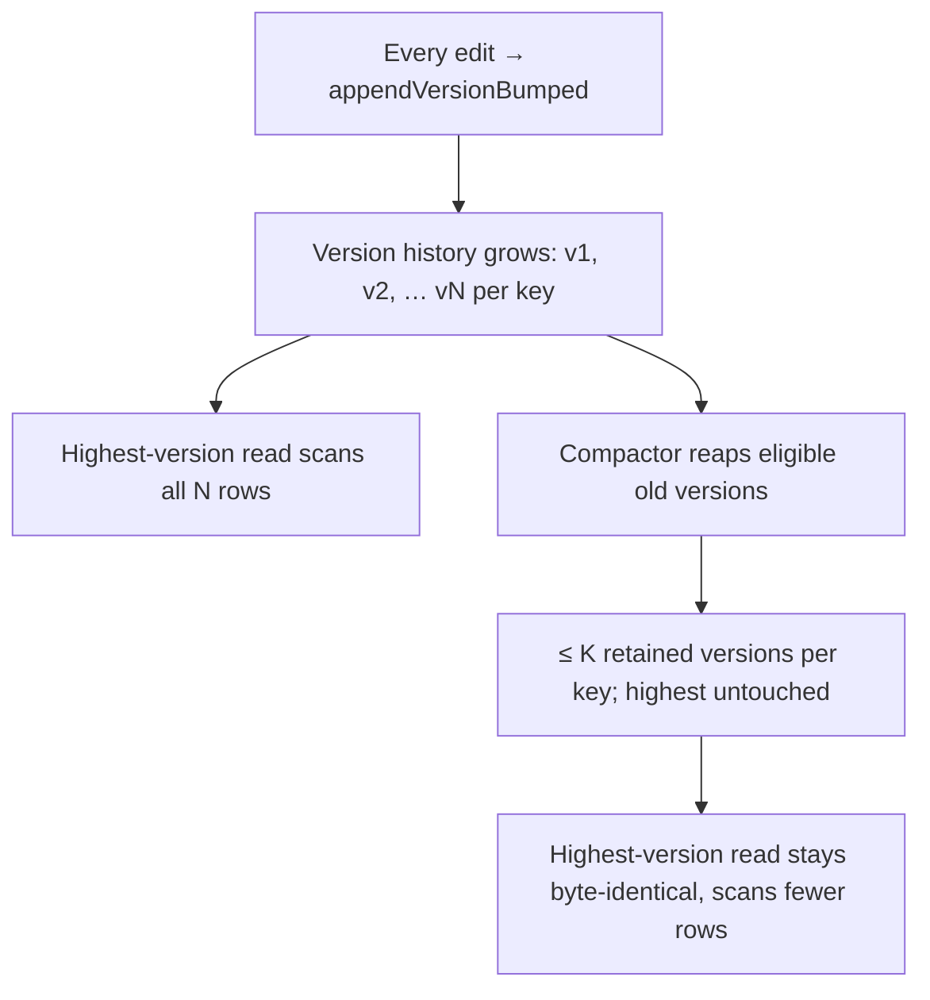

# Memory Compaction (bounding append-only growth)

> Category: Data | Version: 1.0 | Date: June 2026 | Status: Active

How Honeycomb keeps its append-only, version-bumped tables from growing without bound: a version-history compactor that reaps superseded old versions while keeping current state byte-identical and recent lineage auditable. Read this if you touch storage growth, retention, or the maintenance loop, and to understand why this is distinct from graph consolidation (the pollinating loop).

**Related:**
- [`deeplake-storage.md`](deeplake-storage.md), the append-only write patterns this compacts
- [`schema.md`](schema.md), the version-bumped tables and their key columns
- [`workspace-layout.md`](workspace-layout.md)
- [`../ai/pollinating-loop.md`](../ai/pollinating-loop.md), graph consolidation (a different "compaction")
- [`../ai/knowledge-graph-ontology.md`](../ai/knowledge-graph-ontology.md), supersession + lineage

---

## Why compaction exists

Honeycomb's write model is append-only by design. DeepLake has an UPDATE-coalescing quirk, two rapid in-place UPDATEs to the same row can silently drop one, so any table that expects concurrent edits avoids UPDATE entirely. Instead, `appendVersionBumped` (`src/daemon/storage/writes.ts`) INSERTs a *new* row at `version = N+1` on every edit, and a read takes `ORDER BY version DESC LIMIT 1`. That is the correctness-without-transactions strategy the backend needs (see [`deeplake-storage.md`](deeplake-storage.md)).

The cost is unbounded growth. A claim edited 1,000 times is 1,000 rows, and every highest-version read scans all of them. Nothing in the base write path ever reaps that history. At scale this inflates both storage and read cost on the hottest tables, skills, rules, and the claim history that the pipeline and pollinating loop rewrite constantly. Memory compaction is the missing routine: it bounds the row count per key while keeping the current state invariant and recent lineage auditable.

> **Not the same as the pollinating loop.** "Compaction" is an overloaded word in this codebase. The pollinating loop's `runtime/pollinating/compaction.ts` assembles a full-graph *prompt* for a model to reason over (merge entities, prune junk), that is a semantic, model-driven graph-consolidation pass. The compactor described here (`src/daemon/storage/compaction.ts`) is mechanical *row reaping* at the storage layer: no model, no semantics, just deleting superseded version rows that are pure churn. The two are complementary and unrelated. See [`../ai/pollinating-loop.md`](../ai/pollinating-loop.md) for the other one.



## What is safe to reap

A version is reap-eligible only when **all three** conditions hold:

1. It is **strictly below** the highest live version for its key. The highest version is current state and is *never* touched, that is the invariant of the whole feature.
2. It is **beyond the keep-latest-N** most-recent versions.
3. Its timestamp is **outside the retention time window** (older than `now − windowDays`).

Keep-latest-N and the time window are a **union of survivors**: a version survives if it is recent *by count* OR recent *by time*. Only a version outside both, and strictly below the highest, is reaped. The reap-set decision is a pure function, `computeReapSet` (`src/daemon/storage/compaction.ts`), exhaustively unit-testable without touching storage.

The retention policy is conservative by default so routine compaction never reaps recently-auditable lineage:

```yaml
compaction:
  keepLatestN: 5        # HONEYCOMB_COMPACTION_KEEP_LATEST_N, clamped >= 1
  windowDays: 30        # keep anything edited in the last 30 days
```

`resolveCompactionConfig` validates these at the env→typed boundary (zod), clamping a fat-fingered value up to its minimum rather than failing. The highest version is always retained regardless of N or window.

## Which tables compact (and which never do)

Compaction is **fail-closed**: it runs only on a curated allow-list of version-bumped *history* tables whose superseded versions are pure churn, intersected with the catalog's `pattern === "version-bumped"` check as defense-in-depth. The allow-list (`COMPACTABLE_VERSION_BUMPED_TABLES`) is:

| Table | Logical key column | Why it churns |
|---|---|---|
| `skills` | `id` | Skills are re-mined and re-written as sessions accumulate |
| `rules` | `key` | Identity/rule edits version-bump on every refinement |
| `entity_attributes` | `claim_key` | Claim history, every supersession appends a new version |
| `epistemic_assertions` | `id` | Assertion history |
| `pollinating_state` | `id` | The token-budget counter increments constantly |

Anything failing *either* arm is rejected by `assertVersionBumpedTable`:

- An **unknown table** → not in the allow-list → refused.
- An **`appendOnlyInsert` event table** (`sessions`, raw events) → these have no version-supersession concept; their retention is a separate concern, not this compactor's.
- A **version-bumped-but-not-allow-listed table** (`memory_jobs`, `api_keys`, the source-document tables) → catalog-version-bumped but never reapable, so it fails the allow-list arm.

The two-arm guard exists precisely to prevent over-reach: a table that gets renamed away from the version-bump model is also rejected, so the allow-list can never silently drift into deleting something it should not.

## Eventual-consistency-safe reap order

DeepLake's hard `DELETE` is unreliable and flappy, and the backend flaps stale segments, a single point read can transiently under-report (see the project memory note on eventual-consistency poll reads). So the compactor never deletes-then-trusts-an-immediate-read. Per key, before issuing any DELETE it:

1. **Resolves the highest version poll-convergently.** Append-only versions are monotone, so a single read can only *under*-report on a stale segment; the MAX across a bounded poll union converges *up* to the truth.
2. **Confirms that survivor is durably readable.**
3. **Only then** issues one guarded DELETE of the strictly-lower eligible versions.

Because it never deletes the highest version, and only ever deletes strictly-lower versions *after* confirming the highest is durable, a concurrent reader's `ORDER BY version DESC LIMIT 1` can never transiently return empty and never return a non-current version. Current state is always resolvable, mid-compaction.

## Idempotent and crash-safe by construction

Each run recomputes the reap set from the *current* highest-version-and-retention view:

- **Idempotent.** A re-run on an already-compacted key finds nothing eligible, a clean no-op, zero deletes, current read still byte-identical.
- **Crash-safe.** The survivor set is, at every moment, a superset of `{highest} ∪ {keep-N} ∪ {windowed}`. The compactor only ever deletes from the strictly-below-highest-and-outside-both set, so a crash mid-reap (or a flappy DELETE that only partially applied) leaves a strictly smaller-but-correct table. A subsequent run completes to the bound. There is no ordering in which a survivor is at risk.

Every value routes through `sLiteral`/`val.*` and every identifier through `sqlIdent`; no hand-quoted value, no raw fetch (the `audit:sql` gate scans `src/daemon`). Reaped counts are logged per table/key, counts, table/key, and version numbers only, never a row value or a secret.

## How it runs

Compaction is exposed as a **standalone maintenance trigger**, deliberately *not* gated behind the premium pollinating loop, storage hygiene is a chore every install needs, even one that never enables consolidation. The route is `POST /api/diagnostics/compact`, attached onto the already-mounted, protected diagnostics group at the composition root (`src/daemon/runtime/maintenance/compact-api.ts`, mounted from `assemble.ts`). The `honeycomb maintenance compact` CLI verb POSTs to it.

The route is the wiring; `compactVersionHistory` is the work. It returns a `CompactionSummary` per table that existed and was compacted:

```typescript
interface CompactionSummary {
  table: string;
  keysScanned: number;    // distinct keys discovered + scanned
  keysCompacted: number;  // keys that had at least one version reaped
  rowsReaped: number;     // total version rows reaped
  keysSkipped: number;    // survivor not confirmable durable → left alone (D-3)
}
```

The maintenance posture is fail-soft: a per-table error (a flappy DELETE, a transient read) is caught and folded into the summary rather than 500-ing the whole pass, and a missing table is simply skipped after a heal `tableExists` probe. A key whose survivor cannot be confirmed durable is *skipped*, not reaped, the safe default is always "leave the history alone."

## What compaction does not do

- It does **not** change the append-only write model, correctness depends on it.
- It does **not** do graph consolidation (merge/supersede/prune of entities), that is the pollinating loop ([`../ai/pollinating-loop.md`](../ai/pollinating-loop.md)).
- It does **not** touch `appendOnlyInsert` event tables (`sessions`, raw events), they have no version concept.
- It never reaps a source-backed *current* claim, the current claim is always the highest version, which is invariant.

The net effect is the measurable bar: a table with N versions per key compacts to ≤ K retained versions per key, the highest-version read is byte-identical before and after, and the total row count strictly drops. Storage and highest-version read cost stay bounded as the memory grows, without losing current state or auditable recent lineage.
