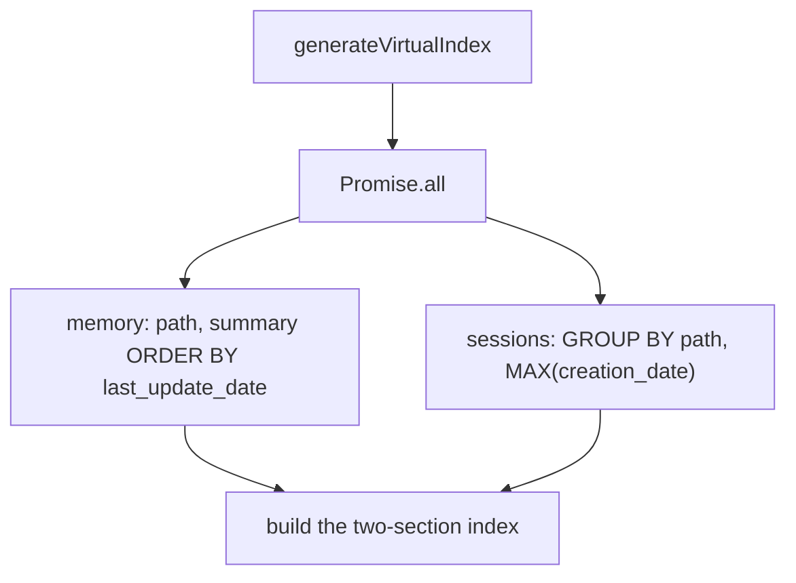
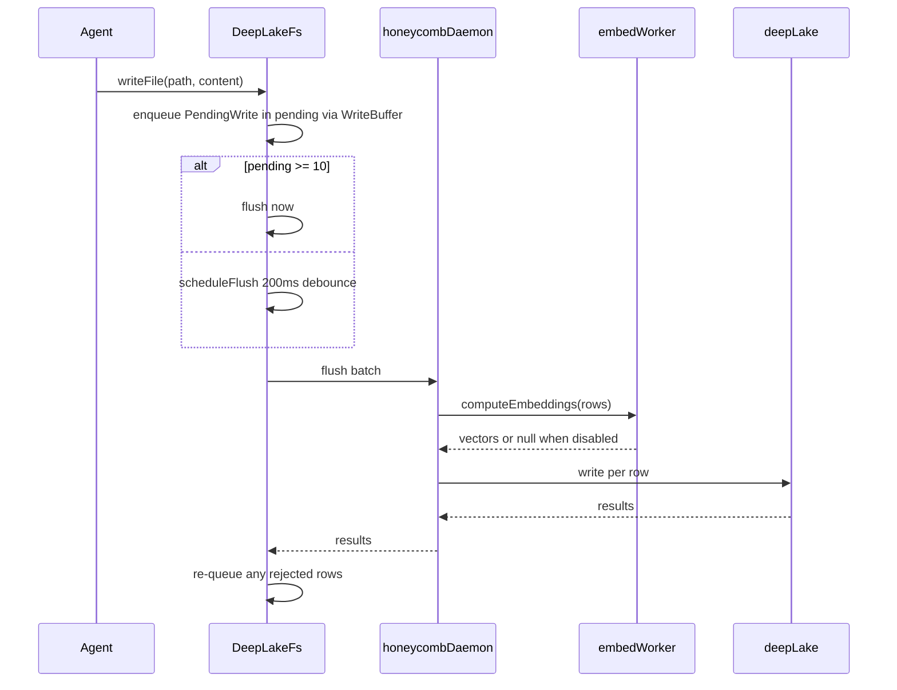
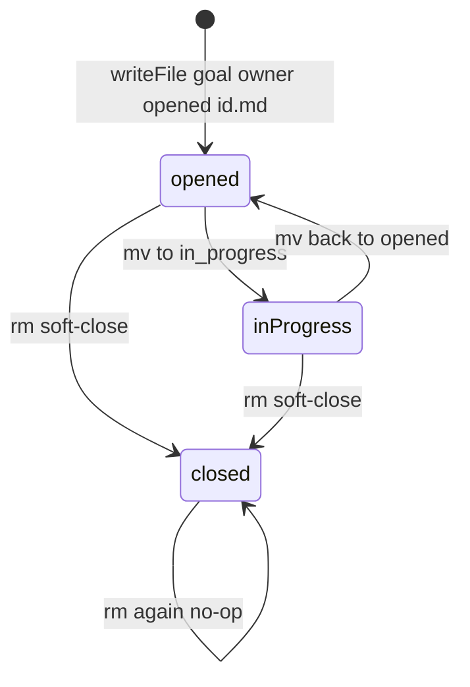

# Memory Virtual Filesystem

> Category: Data | Version: 1.0 | Date: June 2026 | Status: Active

How Honeycomb makes a team-shared DeepLake database look like an ordinary directory at `~/.apiary/honeycomb/memory/`: the `DeepLakeFs` intercept, path-routed dispatch to the goals and KPIs tables, batched writes with debounced flush, the synthesized `index.md`, and the read-only sessions and graph bridges.

**Related:**
- [`deeplake-storage.md`](deeplake-storage.md)
- [`schema.md`](schema.md)
- [`codebase-graph.md`](codebase-graph.md)
- [`../architecture/request-lifecycle.md`](../architecture/request-lifecycle.md)
- [`../architecture/daemon-surface.md`](../architecture/daemon-surface.md)
- [`../ai/retrieval.md`](../ai/retrieval.md)
- [`../overview.md`](../overview.md)

---

## Why a filesystem over a database

Coding agents already know how to `cat`, `ls`, `grep`, and `find`. Honeycomb leans on that fluency: instead of teaching every assistant a new recall API, it presents memory as files under `~/.apiary/honeycomb/memory/` (`MEMORY_MOUNT_DISPLAY_PATH` in `src/daemon-client/vfs/index-gen.ts`) and intercepts the shell commands that touch that mount. The pre-tool-use classifier still recognizes the legacy `~/.honeycomb/memory/` shape. From the agent's point of view it is browsing files; underneath, each operation is a SQL query against the `sessions`, `memory`, `goals`, and `kpis` tables described in [`schema.md`](schema.md).

There are two consumers of this intercept. The PreToolUse hook rewrites Claude Code Bash, Read, Grep, and Glob commands one-shot and stateless. The standalone deeplake-shell exposes the same mount through a long-lived `DeepLakeFs` object that implements the `IFileSystem` interface from `just-bash`. Both produce the same view; this document focuses on the `DeepLakeFs` implementation in `src/daemon-client/vfs/fs.ts`, which is the richer of the two. Both route their actual SQL through the honeycomb daemon (port 3850), which owns the only connection to DeepLake.

The mount is not a literal directory. No real files exist at these paths. Every read either hits an in-memory cache, a pending-write buffer, or a SQL query, and every write is buffered and flushed to DeepLake on a timer.

---

## Anatomy of DeepLakeFs

`DeepLakeFs` (`src/daemon-client/vfs/fs.ts`) holds `dispatch`, `scope`, `cache`, `pending`, `snapshots`, and a `WriteBuffer`. `cache` is a `Map` from path to body (`ContentCache`). `pending` is a `Map` from path to a buffered write (`PendingBuffer`). `snapshots` loads the local graph snapshot. The write buffer shares that dispatch, scope, and pending map.

The synthesized index is `generateVirtualIndex` in `src/daemon-client/vfs/index-gen.ts`. It runs two selects in parallel:



`buildRecentMemoriesSql` selects `path` and `summary`. `buildRecentSessionsSql` groups by `path` and takes `MAX(creation_date)`.

---

## Path classification

Every read and write is first classified by `classifyPath` in `src/daemon-client/vfs/classify.ts`:

| Kind | Path shape | Backing |
|---|---|---|
| `index` | mount-root `index.md` | synthesized index |
| `session` | `sessions/...` | `sessions` |
| `graph` | `graph` or `graph/...` | local snapshot |
| `goal` | `goal/<owner>/<status>/<goal_id>.md` | `goals` |
| `kpi` | `kpi/<goal_id>/<kpi_id>.md` | `kpis` |
| `memory` | anything else, including a malformed goal or kpi shape | `memory` |

`index`, `session`, and `graph` are decided before the goal and kpi shape checks. The classifier strips any leading mount prefix by finding the last `/memory/` occurrence in the path, which lets it accept a mount-relative `goal/...`, a test mount, a shell redirect, or a host-absolute path. Goal status must be `opened`, `in_progress`, or `closed`, and the filename must be a non-empty stem ending in `.md`.

```typescript
export function classifyPath(path: string): PathClass {
  const rel = toMountRelative(path);
  const segs = segmentsOf(rel);
  if (segs.length === 1 && segs[0] === "index.md") return "index";
  const head = segs[0];
  if (head === "sessions") return "session";
  if (head === "graph") return "graph";
  if (isGoalShape(segs)) return "goal";
  if (isKpiShape(segs)) return "kpi";
  return "memory";
}
```

The path encoding is the source of truth. `decomposeGoalPath` and `decomposeKpiPath` (`src/daemon-client/vfs/write-buffer.ts`) extract `owner`, `status`, and the goal id from a goal path, and the goal id plus kpi id from a kpi path. `GOALS_COLUMNS` and `KPIS_COLUMNS` are `key`, `value`, `target`, `status`, `unit`, `agent_id`, `visibility`, `created_at`, and `updated_at`. `buildGoalInsertSql` inserts `key`, `value`, `status`, and `agent_id`. The markdown body is `value`. The goal id is `key`. Owner is written into `agent_id`.

---

## Writes: batch, debounce, flush

Writes do not hit SQL immediately. `writeFile` updates the in-memory cache and tree, then enqueues a `PendingRow` and either flushes right away (when `pending.size` reaches the batch size of 10) or schedules a debounced flush 200 ms out. This coalesces the bursty write pattern of an agent editing several files in quick succession into a handful of round-trips. The flush is dispatched to the daemon, which is the only process that talks to DeepLake.



The flush is serialized through a promise chain (`flushChain`) so two flushes never interleave. `_doFlush` drains the pending map, computes 768-dim `nomic-embed-text-v1.5` embeddings for the batch (skipping the embed hop entirely when embeddings are globally disabled, writing NULL for the vector columns), and writes every row in parallel via `Promise.allSettled`. Any row that fails is re-queued for the next flush unless a newer version was written in the meantime, and the flush throws so callers know some writes were deferred.

`upsertRow` dispatches by path kind. Goal and KPI writes route to `upsertGoalRow` / `upsertKpiRow`, which SELECT-before-INSERT on the `key` column (a goal id, or `<goal_id>/<kpi_id>` for a KPI) to work around DeepLake's UPDATE-coalescing quirk. `buildGoalInsertSql` writes `key`, `value`, `status`, and `agent_id`. The generic memory path writes `path`, `summary`, and `summary_embedding` (`buildMemoryInsertSql` / `buildMemoryUpdateSql`). Text bodies are escaped with `sqlStr` and written with the `E'...'` literal form, because DeepLake offers no parameterized queries (see [`deeplake-storage.md`](deeplake-storage.md)).

`appendFile` takes a fast path that avoids a read-back: when the file already exists it issues a SQL-level concatenation (`summary = summary || E'...'`) and invalidates the content cache so the next read fetches fresh data. This makes append O(1) per call rather than read-modify-write.

---

## Reads: cache, pending, sessions, SQL

`readFile` resolves content through a fixed precedence. It first checks the graph VFS bridge (covered below), then the synthesized `index.md`, then the content cache, then the pending-write buffer, then the sessions concatenation, and finally a direct SQL read of the `summary` column.

Session files are special. A session path lives in the `sessions` table as many rows (one per turn), so a read concatenates them: `SELECT message FROM "<sessions>" WHERE path = '...' ORDER BY creation_date ASC`, normalized and joined with newlines. Session files are read-only at the VFS layer; `writeFile`, `appendFile`, `rm`, `cp`, and `mv` all reject session paths with `EPERM`, because they are an append-only event log owned by the capture pipeline.

The `index.md` at the mount root is virtual. If no real row exists for `/index.md`, `generateVirtualIndex` builds one on the fly. It fetches the 50 most-recent summary rows (one extra beyond the cap to detect "more available") and the 50 most-recent session rows grouped by path, then hands both to the pure renderer `buildVirtualIndexContent` in `src/hooks/virtual-table-query.ts`. That renderer is the single source of truth shared by the deeplake-shell and the stateless PreToolUse hook path; it emits a two-section markdown table (memory summaries and raw sessions) with a per-section truncation notice pointing the agent at Grep for older rows.

`prefetch` warms the cache for many paths with one query each for the memory and sessions tables, batched at 50 paths per `IN (...)` clause, so a directory walk does not fan out into one query per file.

---

## Goal lifecycle through filesystem verbs

The goals table is mutated entirely through filesystem operations, with `rm` and `mv` carrying special meaning rather than their literal POSIX semantics.

`rm` on a goal path is a soft-close, not a delete. It writes the goal's content to the canonical `closed/<goal_id>.md` path (status flipped to `closed`) via `upsertGoalRow`, moves the cache entry from the source folder to the closed folder, and removes the old tree entry so a subsequent `ls` of `opened/` or `in_progress/` reflects the absence. The audit trail is preserved: the row still exists, just with `status = 'closed'`. `rm` on an already-closed goal is a no-op for the same reason, so an agent cannot accidentally wipe history.

`mv` between two goal paths is a status transition. It enforces the invariant that only the status component may change: the `goal_id` and `owner` must match, or the operation fails with `EPERM`. This avoids the cp-then-rm dance that would otherwise double-write to the goals table.



Both operations preserve `created_at` and record the edit time in `updated_at`, keeping goals in stable creation order in listings.

---

## The graph VFS bridge

A subtree at `<mount>/graph/` is not backed by any table at all. It is a synthesized read-only view over the local codebase-graph snapshot. `resolveGraph` in `src/daemon-client/vfs/read.ts` loads that snapshot through the injected loader. When the snapshot is null it returns a `no-graph:` string body. Otherwise it calls `handleGraphVfs` in `src/daemon/runtime/codebase/query.ts`, which returns a string. The renderer reads only the local snapshot and makes zero network calls.

```typescript
function resolveGraph(rel: string, snapshots: SnapshotLoader): string {
  const snapshot = snapshots.load();
  if (snapshot === null) {
    return [
      "no-graph: no local codebase graph snapshot for this worktree.",
      "Build one first (the PRD-014 graph build), then `cat graph/index.md` for the overview.",
    ].join("\n");
  }
  const graphPath = rel.startsWith("graph/") ? rel.slice("graph/".length) : rel;
  return handleGraphVfs(graphPath, snapshot);
}
```

The bridge keeps the FS contract honest. A missing snapshot is rendered as the file body rather than thrown as `ENOENT`, because the path conceptually exists and is reporting its own emptiness, mirroring how `/index.md` behaves when no rows exist. The query surface those paths expose (`index.md`, `find`, `query`, `show`, `impact`, `neighborhood`, `layers`, `tour`, `path`) is documented in [`codebase-graph.md`](codebase-graph.md).

---

## What the agent never sees

The intercept hides three things the agent would otherwise trip over. It hides write batching: a `cat` immediately after a `Write` reads from the pending buffer, so the agent sees its own write even before it reaches DeepLake. It hides the multi-row session layout: a session "file" is dozens of rows concatenated transparently. And it hides the goals and KPIs structured tables behind plain markdown files, so the agent manages objectives with `Write` and `mv` while the CLI reads the same state from typed columns. The result is that recall feels like browsing a directory while every operation is really a query, dispatched through the daemon, against a team-shared, multi-tenant DeepLake database scoped by org, workspace, and agent_id.
