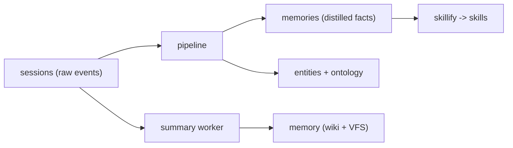

# Schema

> Category: Data | Version: 1.0 | Date: June 2026 | Status: Active

The canonical table catalog for Honeycomb on DeepLake: the capture and summary tables, the distilled-memory engine model, the knowledge graph, sources, the product tables (skills, rules, goals, KPIs, codebase), and the tenancy and auth tables.

**Related:**
- [`deeplake-storage.md`](deeplake-storage.md)
- [`memory-virtual-filesystem.md`](memory-virtual-filesystem.md)
- [`codebase-graph.md`](codebase-graph.md)
- [`../ai/session-capture.md`](../ai/session-capture.md)
- [`../ai/knowledge-graph-ontology.md`](../ai/knowledge-graph-ontology.md)
- [`../multi-tenant/org-workspace-model.md`](../multi-tenant/org-workspace-model.md)
- [`../architecture/multi-project-and-context-switching.md`](../architecture/multi-project-and-context-switching.md)

---

## How to read this catalog

Every table here lives in DeepLake and is written through the daemon using the patterns in [`deeplake-storage.md`](deeplake-storage.md). Org and workspace isolation is enforced at the storage partition layer, so most tables do not need explicit tenancy columns; the engine tables additionally carry `agent_id` (default `'default'`), a `visibility` for within-workspace scoping, and a resolved `project_id` for per-project segmentation; and a few cross-cutting tenant-scoped tables (notably `codebase`, `projects`, and `synced_assets`) carry explicit `org_id` and `workspace_id`. DDL shown below is the logical shape; the runtime source of truth is the daemon's schema definition module, and the lazy heal pass converges every table toward it.

Three tables are easy to confuse because they all hold "memory," so fix them first. `sessions` is the raw capture stream (one row per event). `memories` is the distilled engine output (facts the pipeline decided to keep). `memory` is the wiki-summary and virtual-filesystem table. Capture writes `sessions`; the pipeline reads `sessions` and writes `memories`; the summary worker writes `memory`.



## Capture and summaries

`sessions` holds the raw event stream from capture: one row per prompt, tool call, or response. Its `message` is `JSONB` because each row is a structured payload, and `message_embedding` is the optional 768-dim vector. Its `prose` is the clean-text projection of that event (PRD-074), so lexical recall reads readable prose instead of casting the JSONB envelope to text (see below). Rows are append-only INSERTs; readers concatenate by `path` ordered by `creation_date`.

```sql
CREATE TABLE IF NOT EXISTS "sessions" (
  id                TEXT NOT NULL DEFAULT '',
  path              TEXT NOT NULL DEFAULT '',
  filename          TEXT NOT NULL DEFAULT '',
  message           JSONB,
  prose             TEXT NOT NULL DEFAULT '',
  message_embedding FLOAT4[],
  author            TEXT NOT NULL DEFAULT '',
  agent             TEXT NOT NULL DEFAULT '',
  project           TEXT NOT NULL DEFAULT '',
  project_id        TEXT NOT NULL DEFAULT '',
  plugin_version    TEXT NOT NULL DEFAULT '',
  agent_id          TEXT NOT NULL DEFAULT 'default',
  visibility        TEXT NOT NULL DEFAULT 'global',
  creation_date     TEXT NOT NULL DEFAULT '',
  last_update_date  TEXT NOT NULL DEFAULT ''
) USING deeplake;
```

The `project` column is the existing free-text raw cwd path, kept for display and back-compat. `project_id` is the **resolved registry key** the scope clause segments on (per-project isolation), defaulting to `''` which resolves to the workspace `__unsorted__` inbox at read time. The same `project` / `project_id` pair, and the `agent_id` / `visibility` scope columns, are added to `memory` and `memories` below. The resolution and isolation model is documented in [`../architecture/multi-project-and-context-switching.md`](../architecture/multi-project-and-context-switching.md).

The `prose` column (PRD-074) is the readable-text projection of the row's event, added additively as `NOT NULL DEFAULT ''` and heal-safe (mirroring the additive PRD-060a pattern), so a legacy `sessions` table converges to it on the next heal pass and a row written before the column existed still reads as `''`. It is populated at capture time by `buildRow` via `proseForEvent`: a `user_message` / `assistant_message` row stores `event.text` verbatim; a `tool_call` row stores a file-path-aware line 1 plus a bounded response slice. Its purpose is recall quality: the lexical (`ILIKE`) `sessions` arm now matches and returns `prose` (with a `COALESCE` fallback for legacy rows) instead of casting the JSONB `message` envelope to `::text`, so a `Read` tool call that had surfaced as ~400 chars of escaped JSON now surfaces as ~80 chars of clean prose. The recall side is documented in [`../ai/retrieval.md`](../ai/retrieval.md).

`memory` holds wiki summaries and the virtual-filesystem file rows. Its `summary` is the file body and `summary_embedding` powers semantic recall over summaries. It is UPDATE-or-INSERT keyed by `path`. The VFS dispatch over this table is documented in [`memory-virtual-filesystem.md`](memory-virtual-filesystem.md).

```sql
CREATE TABLE IF NOT EXISTS "memory" (
  id                TEXT NOT NULL DEFAULT '',
  path              TEXT NOT NULL DEFAULT '',
  filename          TEXT NOT NULL DEFAULT '',
  summary           TEXT NOT NULL DEFAULT '',
  summary_embedding FLOAT4[],
  description       TEXT NOT NULL DEFAULT '',
  key               TEXT NOT NULL DEFAULT '',
  version           BIGINT NOT NULL DEFAULT 0,
  author            TEXT NOT NULL DEFAULT '',
  mime_type         TEXT NOT NULL DEFAULT 'text/plain',
  project           TEXT NOT NULL DEFAULT '',
  project_id        TEXT NOT NULL DEFAULT '',
  agent             TEXT NOT NULL DEFAULT '',
  agent_id          TEXT NOT NULL DEFAULT 'default',
  visibility        TEXT NOT NULL DEFAULT 'global',
  creation_date     TEXT NOT NULL DEFAULT '',
  last_update_date  TEXT NOT NULL DEFAULT ''
) USING deeplake;
```

## Distilled memory: the engine model

`memories` is the engine's output, the facts the pipeline decided to keep, with confidence, importance, provenance, dedup hash, and scope. It is the table recall ranks over.

```sql
CREATE TABLE IF NOT EXISTS "memories" (
  id                 TEXT NOT NULL DEFAULT '',
  type               TEXT NOT NULL DEFAULT 'fact',
  content            TEXT NOT NULL DEFAULT '',
  key                TEXT NOT NULL DEFAULT '',
  normalized_content TEXT NOT NULL DEFAULT '',
  content_hash       TEXT NOT NULL DEFAULT '',
  confidence         FLOAT4 NOT NULL DEFAULT 1.0,
  importance         FLOAT4 NOT NULL DEFAULT 0.5,
  tags               TEXT NOT NULL DEFAULT '[]',
  who                TEXT NOT NULL DEFAULT '',
  project            TEXT NOT NULL DEFAULT '',
  project_id         TEXT NOT NULL DEFAULT '',
  source_id          TEXT NOT NULL DEFAULT '',
  source_type        TEXT NOT NULL DEFAULT '',
  pinned             BIGINT NOT NULL DEFAULT 0,
  is_deleted         BIGINT NOT NULL DEFAULT 0,
  extraction_status  TEXT NOT NULL DEFAULT 'none',
  agent_id           TEXT NOT NULL DEFAULT 'default',
  visibility         TEXT NOT NULL DEFAULT 'global',
  content_embedding  FLOAT4[],
  created_at         TEXT NOT NULL DEFAULT '',
  updated_at         TEXT NOT NULL DEFAULT ''
) USING deeplake;
```

The `key` column is the durable **Tier-1 key**: a one-sentence, keyword-dense headline of the distilled fact, written at distillation time so the session-priming digest can skim durable keys with a pure SQL select and no generation at read time. It is additive and heal-compatible (`NOT NULL DEFAULT ''`); a fact with no derived key falls back to its `content` at read time, so a legacy un-keyed row is still primeable. The same durable `key` appears on `memory` and on the wiki-summary rows. The priming flow is documented in [`../ai/session-priming-architecture.md`](../ai/session-priming-architecture.md).

Supporting the engine: `memory_history` is the audit trail (every proposal, applied or shadowed, with `changed_by` distinguishing the harness from `pipeline` and `pipeline-shadow`); `memory_jobs` is the durable distillation queue (lease, complete, fail, dead, with bounded retries) that lets work survive a daemon restart; embeddings are stored on the `content_embedding` column and mirrored for GPU vector search. The pipeline that writes these is [`../ai/memory-pipeline.md`](../ai/memory-pipeline.md).

## Knowledge graph

The ontology is a set of related tables: `entities` (canonical name, type, agent scope, optional source provenance), `entity_aspects` (weighted dimensions), `entity_attributes` (claim values with `kind`, `status`, `claim_key`, `group_key`, and version lineage), `entity_dependencies` (audited edges with type, strength, confidence, and a required reason for loose links), `memory_entity_mentions` (the memory-to-entity join), `epistemic_assertions` (who claimed, believed, observed, decided, preferred, denied, questioned), and `ontology_proposals` (the audited control plane). Because DeepLake cannot safely update in place, supersession appends a new attribute version and marks the prior one superseded rather than mutating it. The model is documented in [`../ai/knowledge-graph-ontology.md`](../ai/knowledge-graph-ontology.md).

```sql
CREATE TABLE IF NOT EXISTS "entity_attributes" (
  id                 TEXT NOT NULL DEFAULT '',
  aspect_id          TEXT NOT NULL DEFAULT '',
  agent_id           TEXT NOT NULL DEFAULT 'default',
  memory_id          TEXT NOT NULL DEFAULT '',
  kind               TEXT NOT NULL DEFAULT 'attribute',
  content            TEXT NOT NULL DEFAULT '',
  confidence         FLOAT4 NOT NULL DEFAULT 0.0,
  importance         FLOAT4 NOT NULL DEFAULT 0.5,
  status             TEXT NOT NULL DEFAULT 'active',
  superseded_by      TEXT NOT NULL DEFAULT '',
  claim_key          TEXT NOT NULL DEFAULT '',
  group_key          TEXT NOT NULL DEFAULT '',
  version            BIGINT NOT NULL DEFAULT 1,
  created_at         TEXT NOT NULL DEFAULT '',
  updated_at         TEXT NOT NULL DEFAULT ''
) USING deeplake;
```

## Sources and documents

External knowledge bases and ad-hoc documents land in their own tables. `memory_artifacts` holds source-backed rows keyed by `source_id` so a source can be purged cleanly; `documents` tracks ingested URLs and files through the `queued -> extracting -> chunking -> embedding -> indexing -> done` lifecycle; `document_memories` joins a document to its chunk memories; `connectors` tracks external connectors and their sync cursors. Soft-delete advances a status rather than updating in place, in keeping with the DeepLake write patterns. The lifecycle is documented in [`../sources/source-lifecycle.md`](../sources/source-lifecycle.md).

## Skills, rules, goals, KPIs

These are the product tables carried from Hivemind. `skills` holds mined `SKILL.md` versions (append-only, version-bumped, with `scope`, `author`, `contributors`, `source_sessions`); `rules` holds org-wide principles (append-only, version-bumped); `goals` and `kpis` are UPDATE-or-INSERT by logical key, backed by the virtual-filesystem path conventions.

```sql
CREATE TABLE IF NOT EXISTS "skills" (
  id                    TEXT NOT NULL DEFAULT '',
  name                  TEXT NOT NULL DEFAULT '',
  project_key           TEXT NOT NULL DEFAULT '',
  project_id            TEXT NOT NULL DEFAULT '',
  scope                 TEXT NOT NULL DEFAULT 'me',
  install               TEXT NOT NULL DEFAULT 'project',
  author                TEXT NOT NULL DEFAULT '',
  contributors          TEXT NOT NULL DEFAULT '[]',
  source_sessions       TEXT NOT NULL DEFAULT '[]',
  description           TEXT NOT NULL DEFAULT '',
  trigger_text          TEXT NOT NULL DEFAULT '',
  body                  TEXT NOT NULL DEFAULT '',
  version               BIGINT NOT NULL DEFAULT 1,
  cross_project_scope   TEXT NOT NULL DEFAULT 'none',
  promoted_by           TEXT NOT NULL DEFAULT '',
  promoted_at           TEXT NOT NULL DEFAULT '',
  promoted_from_project TEXT NOT NULL DEFAULT '',
  agent_id              TEXT NOT NULL DEFAULT 'default',
  visibility            TEXT NOT NULL DEFAULT 'global',
  created_at            TEXT NOT NULL DEFAULT '',
  updated_at            TEXT NOT NULL DEFAULT ''
) USING deeplake;
```

The current state for a `(project_key, name)` pair is the highest version. The legacy path-derived `project_key` stays for back-compat, while `project_id` is the **resolved registry key** the surfacing predicate segments on, so a skill mined in one project is not surfaced in another. Cross-project sharing is an explicit, auditable opt-in recorded directly on the row: `cross_project_scope` (`none` is the project-scoped default; widened values are the promotion), with `promoted_by` / `promoted_at` / `promoted_from_project` carrying the provenance. The isolation and promotion model is in [`../architecture/multi-project-and-context-switching.md`](../architecture/multi-project-and-context-switching.md); skillify and team sharing that read and write this table are documented in [`../ai/skillify-pipeline.md`](../ai/skillify-pipeline.md) and [`../collaboration/team-skills-sharing.md`](../collaboration/team-skills-sharing.md).

## Codebase graph

`codebase` stores one snapshot row per `(org, workspace, repo, user, worktree, commit)` identity. `snapshot_jsonb` holds the canonical node-link JSON and `snapshot_sha256` dedups identical content and detects extractor drift. The push path uses SELECT-before-INSERT and re-verifies to make concurrent-writer races observable. The build and pull lifecycle is in [`codebase-graph.md`](codebase-graph.md).

```sql
CREATE TABLE IF NOT EXISTS "codebase" (
  org_id            TEXT NOT NULL DEFAULT '',
  workspace_id      TEXT NOT NULL DEFAULT '',
  repo_slug         TEXT NOT NULL DEFAULT '',
  user_id           TEXT NOT NULL DEFAULT '',
  worktree_id       TEXT NOT NULL DEFAULT '',
  commit_sha        TEXT NOT NULL DEFAULT '',
  branch            TEXT NOT NULL DEFAULT '',
  snapshot_sha256   TEXT NOT NULL DEFAULT '',
  snapshot_jsonb    TEXT NOT NULL DEFAULT '',
  node_count        BIGINT NOT NULL DEFAULT 0,
  edge_count        BIGINT NOT NULL DEFAULT 0,
  generator_version TEXT NOT NULL DEFAULT '',
  schema_version    BIGINT NOT NULL DEFAULT 1
) USING deeplake;
```

## Tenancy, agents, and auth

`agents` is the within-workspace roster that drives read-policy enforcement (`isolated`, `shared`, `group` with a `policy_group`). `api_keys` holds named, revocable, hashed credentials for remote connectors, with a role, scope, optional explicit permission list, and connector/harness/agent binding. Org and workspace identity is carried on every request and resolved by DeepLake; the model is documented in [`../multi-tenant/org-workspace-model.md`](../multi-tenant/org-workspace-model.md), and the auth that consumes `api_keys` and `agents` is in [`../auth/auth-architecture.md`](../auth/auth-architecture.md) and [`../security/scoping-and-visibility.md`](../security/scoping-and-visibility.md).

```sql
CREATE TABLE IF NOT EXISTS "agents" (
  id           TEXT NOT NULL DEFAULT '',
  name         TEXT NOT NULL DEFAULT '',
  read_policy  TEXT NOT NULL DEFAULT 'isolated',
  policy_group TEXT NOT NULL DEFAULT '',
  created_at   TEXT NOT NULL DEFAULT '',
  updated_at   TEXT NOT NULL DEFAULT ''
) USING deeplake;
```

## Projects registry

`projects` is the per-workspace registry of projects a folder can be bound to, the third tenancy level (Org → Workspace → Project) that segments memory and skills inside a workspace. It is a cross-cutting tenant-scoped table carrying explicit `org_id` and `workspace_id` (like `agents` and `synced_assets`), UPDATE-or-INSERT keyed by `project_id` because project CRUD is low-frequency and human-driven. A project is a registry-backed identity, **not** a GitHub repo id; a canonical git remote is only an optional auto-bind signal.

```sql
CREATE TABLE IF NOT EXISTS "projects" (
  project_id    TEXT NOT NULL DEFAULT '',
  name          TEXT NOT NULL DEFAULT '',
  remote_signal TEXT NOT NULL DEFAULT '',
  bound_paths   TEXT NOT NULL DEFAULT '[]',
  is_reserved   BIGINT NOT NULL DEFAULT 0,
  org_id        TEXT NOT NULL DEFAULT '',
  workspace_id  TEXT NOT NULL DEFAULT '',
  created_at    TEXT NOT NULL DEFAULT '',
  updated_at    TEXT NOT NULL DEFAULT ''
) USING deeplake;
```

`remote_signal` is the canonicalized git remote (`host/owner/repo`) stored as a discrete column so the git-signal resolution branch is a single indexed equality lookup; `bound_paths` is a JSON array of normalized path prefixes, read whole by the longest-prefix matcher. `is_reserved` is `1` only on the reserved per-workspace `__unsorted__` inbox project, the bucket a session falls to when no binding, git signal, or path candidate resolves, so capture is never dropped. A user-created project may not collide with the reserved id or name. The resolution precedence and the local `~/.deeplake/projects.json` cache the thin client reads are documented in [`../architecture/multi-project-and-context-switching.md`](../architecture/multi-project-and-context-switching.md).

## Synced assets

`synced_assets` is the team asset-sync substrate: the rows that propagate skills (and other asset types) across a team's devices and harnesses. It is tenant-scoped (explicit `org` / `workspace`) and append-only, version-bumped, the current state for a `honeycomb_id` is the highest `version`, and a removal is a `tombstone` row, never a DELETE.

```sql
CREATE TABLE IF NOT EXISTS "synced_assets" (
  honeycomb_id  TEXT NOT NULL DEFAULT '',
  version       BIGINT NOT NULL DEFAULT 1,
  asset_type    TEXT NOT NULL DEFAULT 'skill',
  harness       TEXT NOT NULL DEFAULT '',
  native        TEXT NOT NULL DEFAULT '',
  canonical     TEXT NOT NULL DEFAULT '',
  content_hash  TEXT NOT NULL DEFAULT '',
  tombstone     TEXT NOT NULL DEFAULT 'false',
  tier          TEXT NOT NULL DEFAULT 'Local',
  style         TEXT NOT NULL DEFAULT 'Repository',
  org           TEXT NOT NULL DEFAULT '',
  workspace     TEXT NOT NULL DEFAULT '',
  author        TEXT NOT NULL DEFAULT '',
  device_set    TEXT NOT NULL DEFAULT '[]',
  created_at    TEXT NOT NULL DEFAULT ''
) USING deeplake;
```

The `native` and `canonical` blobs are the per-harness and canonical asset payloads; `tier` × `style` is the placement lattice cell a version was published at; `device_set` is the JSON array of device ids for Device-tier audience. The sync lifecycle that reads and writes this table is described in [`../collaboration/asset-sync-substrate.md`](../collaboration/asset-sync-substrate.md).

## Telemetry

Telemetry is opt-in and local to the deployment: usage counters and an optional recall QA ledger, used for diagnostics and never carrying secrets or request bodies. The router's redacted routing history (see [`../ai/model-provider-router.md`](../ai/model-provider-router.md)) lands here too.

## Spend ledger and teams (ROI)

`roi_metrics` is the **shared, cross-device spend ledger** that backs the ROI Tracker (see [`../operations/roi-tracker.md`](../operations/roi-tracker.md)). It is tenant-scoped (explicit `org_id`/`workspace_id`) and **append-only**, one immutable row per session via `appendOnlyInsert`; a re-price APPENDs a new row with a fresh `price_ref` and the canonical row per `session_id` is `MAX(created_at)`, there is **no UPDATE path**. Every money column is **BIGINT integer cents, never FLOAT** (a ledger reconciles to the penny), and measured / modeled / allocated are kept as separate, self-describing columns so a modeled estimate can never read as a measured fact. `user_id` is **gated**, it stays `''` until a verified `backend-token` claim populates it (no git-email / `$USER` / OS-login fallback, no backfill). Indexes are lookup-only on the rollup columns; there is **no embedding column, no JSONB, no BM25, no vector**.

```sql
CREATE TABLE IF NOT EXISTS "roi_metrics" (
  id                            TEXT NOT NULL DEFAULT '',
  session_id                    TEXT NOT NULL DEFAULT '',
  org_id                        TEXT NOT NULL DEFAULT '',
  workspace_id                  TEXT NOT NULL DEFAULT '',
  agent_id                      TEXT NOT NULL DEFAULT 'default',
  project_id                    TEXT NOT NULL DEFAULT '',
  team_id                       TEXT NOT NULL DEFAULT '',
  user_id                       TEXT NOT NULL DEFAULT '',   -- GATED: '' until a verified backend-token claim
  input_tokens                  BIGINT NOT NULL DEFAULT 0,
  output_tokens                 BIGINT NOT NULL DEFAULT 0,
  cache_read_tokens             BIGINT NOT NULL DEFAULT 0,
  cache_creation_tokens         BIGINT NOT NULL DEFAULT 0,
  measured_cache_savings_cents  BIGINT NOT NULL DEFAULT 0,  -- MEASURED, billed fact
  modeled_savings_cents         BIGINT NOT NULL DEFAULT 0,  -- MODELED, labeled estimate
  modeled_assumption_ref        TEXT NOT NULL DEFAULT '',
  gross_cost_cents              BIGINT NOT NULL DEFAULT 0,
  infra_cost_cents              BIGINT NOT NULL DEFAULT 0,
  cost_basis                    TEXT NOT NULL DEFAULT 'none', -- measured | allocated | none
  allocation_method             TEXT NOT NULL DEFAULT '',
  price_ref                     TEXT NOT NULL DEFAULT '',
  period_start                  TEXT NOT NULL DEFAULT '',
  period_end                    TEXT NOT NULL DEFAULT '',
  created_at                    TEXT NOT NULL DEFAULT ''
) USING deeplake;
```

`teams` is the roster `roi_metrics.team_id` resolves against at ROI-write time. It is tenant-scoped and **version-bumped** (one row per (team, member); an edit APPENDs version N+1, read `ORDER BY version DESC`, the same primitive `api_keys` uses for the same backend-non-convergence reason). `member_type` is an `'agent'｜'user'` union, `agent` rows work today and `user` rows are inert until `user_id` is verified.

```sql
CREATE TABLE IF NOT EXISTS "teams" (
  id           TEXT NOT NULL DEFAULT '',
  team_id      TEXT NOT NULL DEFAULT '',
  team_name    TEXT NOT NULL DEFAULT '',
  member_type  TEXT NOT NULL DEFAULT 'agent',  -- agent (live) | user (inert until user_id verified)
  member_id    TEXT NOT NULL DEFAULT '',
  role         TEXT NOT NULL DEFAULT 'member',
  active       BIGINT NOT NULL DEFAULT 1,
  org_id       TEXT NOT NULL DEFAULT '',
  workspace_id TEXT NOT NULL DEFAULT '',
  version      BIGINT NOT NULL DEFAULT 0,
  created_at   TEXT NOT NULL DEFAULT '',
  updated_at   TEXT NOT NULL DEFAULT ''
) USING deeplake;
```

The `sessions` capture table additionally gained five additive token/cache columns (`input_tokens`, `output_tokens`, `cache_read_input_tokens`, `cache_creation_input_tokens`) plus a `source_tool` discriminant, added via additive schema healing so the measured-savings half has per-turn token data; a missing/legacy column degrades the read to "token data absent" rather than throwing.

## Retention summary

| Data | Default behavior |
|---|---|
| `sessions` raw events | Pruned by the `sessions prune` operation; summaries retained in `memory` |
| `memories` | Soft-delete window before purge; history retained longer |
| `memory_jobs` | Completed purged after a window; dead jobs later |
| `memory_artifacts` | Soft-delete on source file removal, hard purge on source disconnect by `source_id` |
| `skills` / `rules` | Append-only version history retained |
| `roi_metrics` | Append-only ledger retained (re-price appends a new row; canonical = `MAX(created_at)` per session) |
| embeddings / vectors | Purged with their owning row during retention sweeps |

Because DeepLake exposes no transactions at this layer, retention runs as batched, idempotent sweeps in a daemon worker rather than cascading deletes, consistent with the patterns in [`deeplake-storage.md`](deeplake-storage.md).
