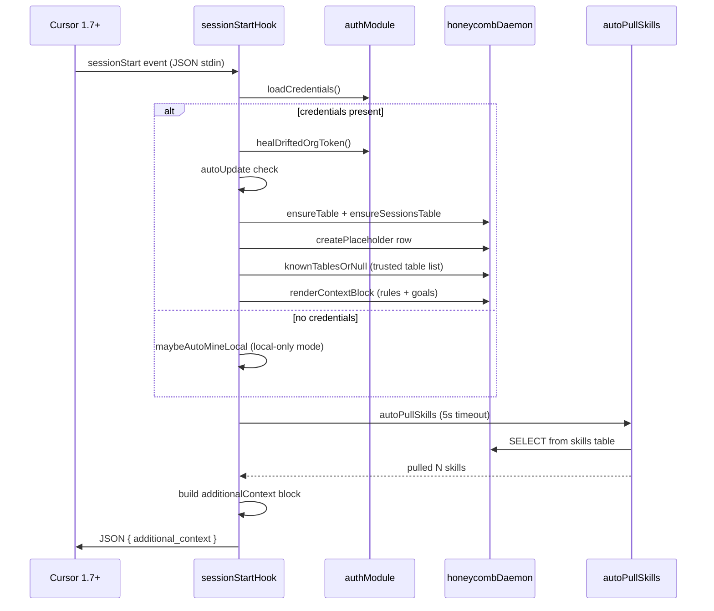

# Cursor Extension Architecture

> Category: Frontend | Version: 1.0 | Date: June 2026 | Status: Active

How Honeycomb wires into Cursor 1.7+ via hooks.json, what each hook does, and how the session-start context block presents auth state and org identity to the agent.

**Related:**
- [`../integrations/mcp-and-sdk.md`](../integrations/mcp-and-sdk.md)
- [`../integrations/hook-lifecycle.md`](../integrations/hook-lifecycle.md)
- [`../architecture/system-overview.md`](../architecture/system-overview.md)
- [`../architecture/request-lifecycle.md`](../architecture/request-lifecycle.md)
- [`../architecture/daemon-surface.md`](../architecture/daemon-surface.md)
- [`../multi-tenant/org-workspace-model.md`](../multi-tenant/org-workspace-model.md)
- [`../collaboration/team-skills-sharing.md`](../collaboration/team-skills-sharing.md)
- [`dashboard-architecture.md`](dashboard-architecture.md)

---

## Why the Cursor integration exists

Cursor 1.7 introduced a `hooks.json` mechanism that fires TypeScript/Node scripts at named lifecycle events. Honeycomb uses this surface as its Cursor integration shim: the same capture, recall, wiki-summary, and skillify mechanics that power the Claude Code plugin are re-expressed here, normalising Cursor's event payload shapes into the shared `HookInput` format consumed by `src/` core.

The Cursor hooks are thin clients of the Honeycomb daemon (port 3850). They never open DeepLake themselves; every read and write is a request to the daemon, which is the only process that talks to the DeepLake backend. This keeps the Cursor integration symmetric with the other agents and means storage concerns never leak into the hook scripts.

The Cursor integration is the fourth integration in the fleet (after Claude Code, Codex, and OpenClaw). Its hooks live at `src/hooks/cursor/` and are built by `npm run build` into `harnesses/cursor/bundle/`.

---

## Hook inventory

Cursor fires five hooks relevant to Honeycomb. Each maps to one compiled Node script:

| Cursor event | Script | What it does |
|---|---|---|
| `sessionStart` | `session-start.ts` | Recalls context, injects auth state, auto-pulls skills, spawns graph worker |
| `beforeSubmitPrompt` | `capture.ts` | Sends the user's prompt to the daemon as a `user_message` row in the `sessions` table |
| `postToolUse` | `capture.ts` | Sends each tool call and its output as a `tool_call` row |
| `afterAgentResponse` | `capture.ts` | Sends the assistant's reply as an `assistant_message` row; triggers periodic summary check |
| `stop` | `capture.ts` | Sends a `stop` row with final status and loop count |
| `sessionEnd` | `session-end.ts` | Spawns final wiki-worker summary and forces skillify session-end trigger |

The `preToolUse` hook is also wired for the `Shell` tool only. It intercepts any shell command aimed at `~/.honeycomb/memory/` and rewrites it into a daemon query, returning the result as an `echo` command. This promotes Cursor from the "Tier 3 VFS file-stream" accuracy tier to "Tier 1 SQL fast-path" accuracy, the same level as Claude Code.

---

## Session-start context block

The most user-visible part of the Cursor integration is the `additional_context` string injected into every new session. Cursor passes this string directly into the agent's working context before the first user turn, so the agent sees Honeycomb's memory layout and available CLI commands without any user prompt.

The block is composed in layers inside `session-start.ts`:

```
base context (memory layout + CLI commands)
  + auth state line ("Logged in as org: Acme (workspace: default)" OR "Not logged in. Run: honeycomb login")
  + goals instructions (when logged in)
  + rules block (org-wide rules from honeycomb_rules table, when logged in)
  + graph context line (when a codebase graph exists for this workspace root)
```

### Auth state line

The auth state line is the only place in the Cursor UI where org and workspace identity is surfaced to the agent. It reads directly from the credentials loaded at hook startup:

```
Logged in to Honeycomb as org: Acme (workspace: default)
```

or, when credentials are absent:

```
Not logged in to Honeycomb. Run: honeycomb login
```

When credentials exist but carry a drifted org token (the `jwt.org_id` claim does not match `creds.orgId`), the session-start hook calls `healDriftedOrgToken` before building the context block. The heal re-mints the token against the correct org, then realigns `orgName` and validates `workspaceId` against the same org. This means the auth state line always reflects the org the user last switched to, not the org baked into a stale token.

### Rules block

When the user is logged in, `renderContextBlock` asks the daemon to query the `honeycomb_rules` table and appends any active rules to the context. Rules are org-wide by default (scope `team`) and are inserted unconditionally into every agent session across the workspace.

---

## Capture mechanics

All four capture events (`beforeSubmitPrompt`, `postToolUse`, `afterAgentResponse`, `stop`) are handled by the same compiled script, `capture.ts`. Each event hands one row to the daemon for the `sessions` table with an `agent` field of `"cursor"` and a `plugin_version` field stamped from the bundle's `.claude-plugin` version marker.

The capture script respects two environment gates:

- `HONEYCOMB_CAPTURE=false`: skips all writes, making the integration fully read-only for the session.
- `isHoneycombPluginEnabled()`: a marketplace-managed flag that lets users pause capture without uninstalling the plugin.

Cursor delivers `tool_output` already JSON-encoded as a string, unlike Claude Code which delivers a structured object. The capture script handles this difference: it passes `tool_output` through without further `JSON.stringify` wrapping.

Embeddings are computed per row by the daemon's embed path when the nomic embed daemon is available. If embeddings are absent or `HONEYCOMB_EMBEDDINGS=false` is set, the `message_embedding` column lands as NULL and the row is still written. The self-heal path (`ensurePluginNodeModulesLink`) runs once per process to restore any broken symlink that a marketplace auto-upgrade may have dropped.

---

## Periodic summary trigger

Every `afterAgentResponse` event bumps a per-session counter stored in `~/.honeycomb/state/` (via `bumpTotalCount`). When the count crosses a configurable threshold (`everyNMessages`) or a time threshold (`everyHours`) is exceeded, the hook spawns a detached wiki-worker process to summarise the current session's activity. The worker uses `cursor-agent --print` (the Cursor agent CLI) to write the summary into the `memory` table through the daemon.

A file-system lock prevents two wiki workers from running concurrently for the same session: the periodic trigger checks `tryAcquireLock` before spawning, and the session-end hook does the same before spawning the final summary worker. If a periodic worker is already running when the session ends, the session-end hook skips the final spawn.

---

## Session-end summary

When Cursor fires `sessionEnd`, the hook:

1. Reads `conversation_id` (or `session_id`) from the payload.
2. Calls `forceSessionEndTrigger` to fire the skillify miner for this session.
3. Checks the wiki-worker lock. If a periodic worker is mid-flight, skips the final spawn; otherwise acquires the lock and spawns the wiki worker.
4. The wiki worker runs `cursor-agent --print` against the captured session rows, writes a summary into `memory` through the daemon, and releases the lock.

---

## Pre-tool-use recall intercept

The `preToolUse` hook fires only when Cursor calls the `Shell` tool. The hook checks whether the command targets `~/.honeycomb/memory/` (or its aliases). If it does, the hook:

1. Parses the bash command using the shared `parseBashGrep` parser.
2. Asks the daemon to run `searchDeeplakeTables` as a single query against the `memory` and `sessions` tables.
3. Returns an `updated_input` that replaces the original shell command with `echo <result>`.

Cursor never executes the original grep against the real filesystem. From the agent's view, it ran `grep` and got back structured memory results. This is the same semantic contract that Claude Code's `PreToolUse` hook provides, making Cursor recall quality identical across both agents.

---

## Auto-update

The session-start hook calls `autoUpdate` before any database operations. This checks the installed plugin version against the published latest version and emits an upgrade notice when the two diverge. The check has no dependency on table state, so it fires promptly even when the daemon or DeepLake backend is slow or unreachable.

---

## Mermaid: session-start flow



---

## File locations

| File | Role |
|---|---|
| `src/hooks/cursor/session-start.ts` | SessionStart hook source |
| `src/hooks/cursor/capture.ts` | Multi-event capture script |
| `src/hooks/cursor/session-end.ts` | SessionEnd summary trigger |
| `src/hooks/cursor/pre-tool-use.ts` | Recall intercept for Shell tool |
| `src/hooks/cursor/spawn-wiki-worker.ts` | Wiki worker spawner for Cursor |
| `src/hooks/cursor/wiki-worker.ts` | Cursor wiki worker (calls `cursor-agent --print`) |
| `harnesses/cursor/bundle/` | Compiled hook scripts (npm to `~/.cursor/honeycomb/bundle/`) |
| `harnesses/cursor/extension/` | VS Code / Cursor extension source (status bar, dashboard, hook wiring UI) |

---

## Editor extension (`harnesses/cursor/extension/`)

The hooks integration above is sufficient for capture, recall, skillify, and graph builds. The **Honeycomb for Cursor** extension ships operator UX on top, a status bar, a no-terminal login, a dashboard webview, and hook/skill wiring, built on the same shared engines so nothing is duplicated.

### VS Code / Cursor manifest

The extension's `package.json` is a standard VS Code manifest:

- `engines.vscode` targets Cursor 1.7+ (the version that introduced the `hooks.json` lifecycle).
- `main` points at the bundled adapter entry, and the `activate(host, deps)` function in `harnesses/cursor/extension/extension.ts` is the entry that wires everything.
- `activationEvents` fire on load so the four commands register and the status bar paints immediately.
- `extensionKind` is `ui` (it owns a status bar and a webview), and the design-system assets are bundled in.

The `contributes` block declares four commands:

| Command id | Title | Effect |
|---|---|---|
| `honeycomb.wireHooks` | Wire / Refresh Hooks | Copies `harnesses/cursor/bundle/` into `~/.cursor/honeycomb/bundle/` and idempotently merges `~/.cursor/hooks.json` (delegates to the 019a connector). |
| `honeycomb.login` | Login | Browser device flow or API-key entry; writes the shared `~/.honeycomb/credentials.json` at mode `0o600`; opens the verification URL via the host. |
| `honeycomb.openDashboard` | Open Dashboard | Renders the canonical dashboard view tree into a webview panel titled "Honeycomb Dashboard". |
| `honeycomb.syncSkills` | Sync Skills | Symlinks org/team skills into `~/.cursor/skills-cursor/` and `<project>/.cursor/skills/` without clobbering. |

### esbuild entry and activation

The extension's TypeScript shell (`extension.ts`, `contracts.ts`, `bindings.ts`, `render.ts`, `index.ts`) compiles in the repo `tsc` pass and is packaged by the editor's own bundler from the `extension.ts` entry. The separate hook binary is built by the root `esbuild.config.mjs` from `dist/harnesses/cursor/src/index.js` into `harnesses/cursor/bundle/` (aliased as `session-start.js`, `capture.js`, `pre-tool-use.js`, `session-end.js`), the same bundle the **Wire / Refresh Hooks** command copies into `~/.cursor/honeycomb/bundle/`.

`activate(host, deps)` is constructed over injectable seams, `hooks` (wiring), `skills` (sync), `dashboard` (webview render), `health` (status-bar health source), and `login`, so the whole extension is testable without the editor. On activation it self-heals the bundle symlink (in case a marketplace upgrade dropped it), syncs org/team skills, and paints the status bar; then it registers the four commands. It returns an instance exposing `refreshStatusBar()`, `openDashboard()`, and `dispose()`.

### Status bar and dashboard webview

The status bar item paints five health dimensions as a glyph row (e.g. `Honeycomb ✓✓✗✓✓`) with a per-dimension tooltip: CLI install, daemon connectivity, `cursor-agent` availability, `cursor-agent` login, and hook wiring. Any failing dimension flips a `hasFailure` flag the host colors red. The dashboard command renders the *same* canonical dashboard view tree the daemon serves at `127.0.0.1:3850/dashboard` (KPIs, sessions, settings, graph canvas, rules, skill-sync state) into a webview, carrying a `data-connectivity="reachable" | "unreachable"` attribute so a daemon-down state shows a connectivity banner rather than a blank panel. The shared view tree is documented in [dashboard-architecture.md](dashboard-architecture.md).

Product requirements: `library/requirements/in-work/prd-020-surfaces/prd-020c-surfaces-cursor-extension.md`.
