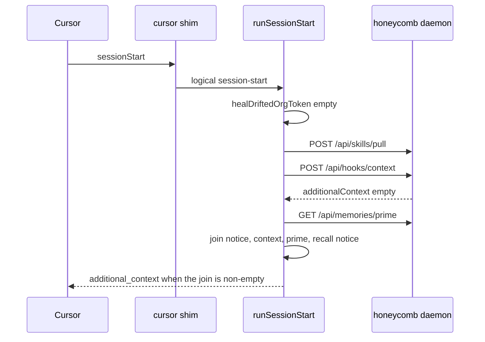

# Cursor Extension Architecture

> Category: Frontend | Version: 1.2 | Date: October 2026 | Status: Active

How Honeycomb wires into Cursor: one hook shim, four filename aliases of one binary, and the editor extension that paints status, login, the dashboard webview, and skill links. Per-file Cursor hook scripts under `src/hooks/cursor/` are absent. The live shim is `src/hooks/cursor/shim.ts`.

**Related:**
- [`../integrations/mcp-and-sdk.md`](../integrations/mcp-and-sdk.md)
- [`../integrations/hook-lifecycle.md`](../integrations/hook-lifecycle.md)
- [`../architecture/system-overview.md`](../architecture/system-overview.md)
- [`../architecture/request-lifecycle.md`](../architecture/request-lifecycle.md)
- [`../architecture/daemon-surface.md`](../architecture/daemon-surface.md)
- [`../multi-tenant/org-workspace-model.md`](../multi-tenant/org-workspace-model.md)
- [`../collaboration/team-skills-sharing.md`](../collaboration/team-skills-sharing.md)
- [`dashboard-architecture.md`](dashboard-architecture.md)

---

## Why the Cursor integration exists

The Cursor connector writes `~/.cursor/hooks.json` and points each installed event at a file under `~/.cursor/honeycomb/bundle/`. Those filenames are aliases of one binary. The binary's entry is `harnesses/cursor/src/index.ts`, built by `esbuild.config.mjs` into `harnesses/cursor/bundle/` as `session-start.js`, `capture.js`, `pre-tool-use.js`, and `session-end.js`. The source shim is `src/hooks/cursor/shim.ts`. `src/hooks/cursor/session-start.ts`, `capture.ts`, `session-end.ts`, and `pre-tool-use.ts` are absent.

The shim is a thin client of the daemon on port `3850`. It does not open DeepLake. Storage stays in the daemon.

---

## Hook inventory

`CURSOR_EVENT_MAP` in `src/hooks/cursor/shim.ts:36-43` maps native names to logical events:

| Native name | Logical event | Installed by the connector |
|---|---|---|
| `sessionStart` | `session-start` | Yes, `session-start.js` |
| `beforeSubmitPrompt` | `user_message` | Yes, `capture.js` |
| `postToolUse` | `tool_call` | Yes, `capture.js` |
| `afterAgentResponse` | `assistant_message` | No. The name is on the shim map only |
| `stop` | `assistant_message` | Yes, `capture.js` |
| `sessionEnd` | `session-end` | Yes, `session-end.js` |

There is no logical `stop` event. `stop` is captured as `assistant_message`. The connector's `CURSOR_HANDLERS` (`src/connectors/cursor.ts:73-79`) installs six events: `sessionStart`, `beforeSubmitPrompt`, `beforeShellExecution`, `postToolUse`, `stop`, and `sessionEnd`. `assistant_message` is registered on native `stop` only. `afterAgentResponse` is not in `CURSOR_HANDLERS`.

`beforeShellExecution` is the sixth installed event. The shim map has no `beforeShellExecution` key, so `createShim` drops that native name (`src/hooks/normalize.ts`). The alias registered for it is still `pre-tool-use.js`, with matcher `Shell` (`src/connectors/cursor.ts`).

Capture events (`user_message`, `tool_call`, `assistant_message`) dispatch to `runCapture`. A `Shell` tool on `postToolUse` keeps the logical event `tool_call` and lowers the payload through `preToolData` (`src/hooks/cursor/shim.ts:88-95`). Dispatch therefore runs `runCapture`, not `runPreToolUse`.

---

## Session start

Session start is the shared core `runSessionStart` (`src/hooks/shared/session-start.ts`), reached through the cursor shim. There is no cursor `session-start.ts` composing a login line, a rules query, or a graph pull.

Production seams from `createSessionStartSeams` (`src/hooks/shared/session-start-seams.ts`) leave these functions empty: `healDriftedOrgToken`, `autoUpdate`, `ensureTables`, `writePlaceholderSummary`, and `spawnGraphPull`. `healDriftedOrgToken` keeps that name and does no heal on this path. Org-token heal for CLI status is a different function, `healOrgDrift`.

`autoPullSkills` is the seam that performs work: a fail-soft loopback `POST /api/skills/pull`.

`createContextRenderer` forwards the daemon `/api/hooks/context` body and does not query `honeycomb_rules` itself. The mounted handler returns `{ additionalContext: "" }` (`src/daemon/runtime/capture/attach.ts`). The shared core still joins that empty rules block with the onboarding notice, the prime digest from `createPrimeRenderer` (`GET /api/memories/prime`), and the constant `RECALL_AWARENESS_NOTICE`. The strings "Logged in to Honeycomb as org" and "Not logged in" are not produced by `src/hooks/`.

```mermaid
sequenceDiagram
    participant cursor as Cursor
    participant shim as cursor shim
    participant core as runSessionStart
    participant daemon as honeycomb daemon

    cursor->>shim: sessionStart
    shim->>core: logical session-start
    core->>core: healDriftedOrgToken empty
    core->>daemon: POST /api/skills/pull
    core->>daemon: POST /api/hooks/context
    daemon-->>core: additionalContext empty
    core->>daemon: GET /api/memories/prime
    core->>core: join notice, context, prime, recall notice
    core-->>cursor: additional_context when the join is non-empty
```

---

## Capture

The four capture filenames are one binary. Rows are written by the daemon capture handler, with `agent` from the shim. The hook runtime passes `captureFlag` only (`src/hooks/runtime.ts`). `pluginVersion` on the capture contract defaults to `""` (`src/daemon/runtime/capture/event-contract.ts`). The sessions catalog still has a `plugin_version` column (`src/daemon/storage/catalog/sessions-summaries.ts`); the hook path does not stamp it from a `.claude-plugin` marker. `isHoneycombPluginEnabled` is not a function in this tree. `createHookRuntime` does not supply a plugin-enabled flag. The capture gate can skip when `pluginEnabled === false`, and production runtime construction does not pass that flag.

`HONEYCOMB_CAPTURE=false` skips writes through the capture gate the runtime passes (`src/shared/capture-gate.ts`, `src/hooks/runtime.ts`).

The daemon insert leaves `message_embedding` off the row so the column default is NULL (`src/daemon/runtime/capture/capture-handler.ts`). A later `kickEmbed` attaches a vector when the embed client returns one. Opt-out is `HONEYCOMB_EMBEDDINGS=false` on the daemon embed client (`src/daemon/runtime/services/embed-client.ts`), which resolves to a null vector and leaves the column NULL. The row is still written.

Extension self-heal calls `connector.install()` (`harnesses/cursor/extension/bindings.ts`). The comment there calls that the `ensurePluginNodeModulesLink` equivalent. The function of that name is not the live seam.

---

## Summaries

Periodic summary cues are an in-memory map on the daemon, `TurnCounters`, default every 20 messages (`DEFAULT_SUMMARY_EVERY_MESSAGES` in `src/daemon/runtime/capture/turn-counters.ts`). A restart resets the map. The hook runtime's summary spawn is `noopSummarySpawn` (`src/hooks/runtime.ts`). `bumpTotalCount`, `tryAcquireLock`, `spawn-wiki-worker.ts`, and `wiki-worker.ts` are absent under `src/`. There is no per-session counter file under `~/.honeycomb/state/` for this path, and there is no hours threshold on `recordMessage`.

Session-end on the daemon enqueues a `summary` job with `triggerKind: "final"` (`src/daemon/runtime/capture/attach.ts`). The worker CLI for cursor is `cursor-agent` with args `["-p"]` (`src/daemon/runtime/summaries/job.ts:157-159`).

---

## Shell events

The connector registers `pre-tool-use.js` on `beforeShellExecution` with matcher `Shell`. The cursor shim cannot map that native name, so the runtime drops it before `runPreToolUse`. `parseBashGrep` and `searchDeeplakeTables` are absent under `src/`. This shim does not return `updated_input`. The Claude Code shim is the one that emits `updatedInput`.

On `postToolUse`, a `Shell` tool becomes `preToolData` while the logical event stays `tool_call`, and dispatch runs `runCapture`.

---

## File locations

In this checkout the Cursor hook source is `src/hooks/cursor/shim.ts`. The files named `session-start.ts`, `capture.ts`, `session-end.ts`, `pre-tool-use.ts`, `spawn-wiki-worker.ts`, and `wiki-worker.ts` under `src/hooks/cursor/` are not present. `harnesses/cursor/extension/` contains `extension.ts`, `index.ts`, `bindings.ts`, `render.ts`, `contracts.ts`, and `CONVENTIONS.md`. It has no `package.json` and no `hooks.json`.

| File | Role |
|---|---|
| `src/hooks/cursor/shim.ts` | Cursor hook shim. `CURSOR_EVENT_MAP` is the native-to-logical map |
| `harnesses/cursor/src/index.ts` | Bundle entry. esbuild aliases it to the four hook filenames |
| `src/connectors/cursor.ts` | Writes `~/.cursor/hooks.json` and links skills into `~/.cursor/skills/` |
| `harnesses/cursor/extension/extension.ts` | Extension host adapter |
| `harnesses/cursor/extension/` | Extension seam (no VS Code manifest in this checkout) |

---

## Editor extension (`harnesses/cursor/extension/`)

The hooks integration above is the capture path. The **Honeycomb for Cursor** extension ships operator UX on top: a status bar, a no-terminal login, a dashboard webview, and hook/skill wiring, built on the same shared engines.

### Extension files in this checkout

`harnesses/cursor/extension/extension.ts` is present. A VS Code `package.json` manifest is not in this tree, so the `engines.vscode`, `activationEvents`, and `contributes` list below is not something this checkout can confirm. Read it as the intended command surface, not as files on disk.

- `engines.vscode` targets Cursor 1.7+ (the version that introduced the `hooks.json` lifecycle).
- `main` points at the bundled adapter entry, and the `activate(host, deps)` function in `harnesses/cursor/extension/extension.ts` is the entry that wires everything.
- `activationEvents` fire on load so the four commands register and the status bar paints immediately.
- `extensionKind` is `ui` (it owns a status bar and a webview), and the design-system assets are bundled in.

The `contributes` block declares four commands:

| Command id | Title | Effect |
|---|---|---|
| `honeycomb.wireHooks` | Wire / Refresh Hooks | Copies `harnesses/cursor/bundle/` into `~/.cursor/honeycomb/bundle/` and idempotently merges `~/.cursor/hooks.json` (delegates to the connector). |
| `honeycomb.login` | Login | Browser device flow or API-key entry; writes the shared `~/.deeplake/credentials.json` at mode `0o600`; opens the verification URL via the host. |
| `honeycomb.openDashboard` | Open Dashboard | Renders the canonical dashboard view tree into a webview panel titled "Honeycomb Dashboard". |
| `honeycomb.syncSkills` | Sync Skills | Symlinks org/team skills into `~/.cursor/skills/` (`src/connectors/cursor.ts`). `sync()` returns the links from `connector.install()`. |

### esbuild entry and activation

The extension's TypeScript shell (`extension.ts`, `contracts.ts`, `bindings.ts`, `render.ts`, `index.ts`) compiles in the repo `tsc` pass and is packaged by the editor's own bundler from the `extension.ts` entry. The separate hook binary is built by the root `esbuild.config.mjs` from `dist/harnesses/cursor/src/index.js` into `harnesses/cursor/bundle/` (aliased as `session-start.js`, `capture.js`, `pre-tool-use.js`, `session-end.js`), the same bundle the **Wire / Refresh Hooks** command copies into `~/.cursor/honeycomb/bundle/`.

`activate(host, deps)` is constructed over injectable seams, `hooks` (wiring), `skills` (sync), `dashboard` (webview render), `health` (status-bar health source), and `login`, so the whole extension is testable without the editor. On activation it self-heals by re-running `connector.install()` (idempotent when the bundle is already healthy), syncs org/team skills, and paints the status bar; then it registers the four commands. It returns an instance exposing `refreshStatusBar()`, `openDashboard()`, and `dispose()`.

### Status bar and dashboard webview

The status bar item paints five health dimensions as a glyph row (e.g. `Honeycomb ✓✓✗✓✓`) with a per-dimension tooltip: CLI install, daemon connectivity, `cursor-agent` availability, `cursor-agent` login, and hook wiring. Any failing dimension flips a `hasFailure` flag the host colors red. The dashboard command writes the rendered view tree into an editor webview (`harnesses/cursor/extension/extension.ts:108-113`). That view reads the daemon on `127.0.0.1:3850` (`src/dashboard/launch.ts:51-56`). The shared view tree is the `ViewBlock` list documented in [dashboard-architecture.md](dashboard-architecture.md).

Product requirements: `library/requirements/in-work/prd-020-surfaces/prd-020c-surfaces-cursor-extension.md`.
