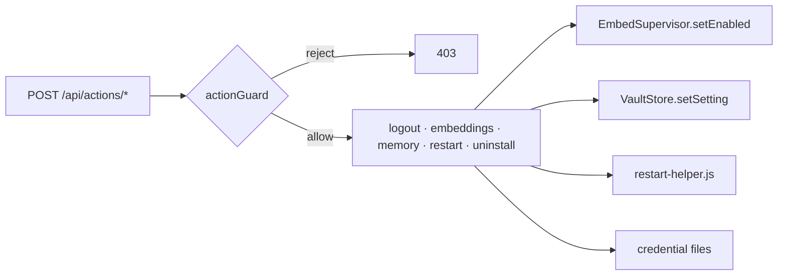

# Dashboard Actions Surface

> Category: Frontend | Version: 1.2 | Date: October 2026 | Status: Active

How the daemon exposes lifecycle actions — logout, embeddings on/off, memory on/off, daemon restart, and uninstall — through the guarded `/api/actions` group. Five `POST`s are mounted. The settings `ViewBlock` in this checkout does not call them.

**Related:**
- [`dashboard-architecture.md`](dashboard-architecture.md)
- [`../dashboard/adding-a-page.md`](../dashboard/adding-a-page.md)
- [`../architecture/daemon-surface.md`](../architecture/daemon-surface.md)
- [`../architecture/cli-dispatcher.md`](../architecture/cli-dispatcher.md)
- [`../security/trust-boundaries.md`](../security/trust-boundaries.md)

---

## Why this surface exists

Dashboard reads and ordinary settings writes live on other groups. Verbs that touch the credential file, the running process, embeddings, memory formation, or the install footprint are `POST`s on `/api/actions`, each behind `actionGuard`. `mountActionsGroup` registers five routes (`src/daemon/runtime/dashboard/actions-api.ts:232-323`): `/logout`, `/embeddings`, `/memory`, `/restart`, and `/uninstall`. There is no `prd-145` folder under `library/requirements/`. The fifth route is visible on the mount itself.

`buildSettingsView` (`src/dashboard/views.ts:111-121`) renders org, workspace, and the settings string map. It does not call `/api/actions`. `src/dashboard/web/wire.ts` and `src/dashboard/web/pages/settings.tsx` are absent.



## The five actions

All five are `POST` under `/api/actions` (`ACTIONS_GROUP` in `src/daemon/runtime/dashboard/actions-api.ts`). Responses do not carry a secret or a token.

| Action | Endpoint | Effect | Response |
|---|---|---|---|
| Logout | `POST /api/actions/logout` | Remove the shared and legacy credential files (idempotent, fail-soft) | `{ ok: true }` |
| Embeddings | `POST /api/actions/embeddings` | Persist `embeddings.enabled`, then actuate the supervisor | `{ ok, enabled }` |
| Memory | `POST /api/actions/memory` | Persist `memory.enabled`. When that write sticks and a pipeline reload seam is mounted, request a live reload | `{ ok, enabled, persisted, appliedLive, appliesOnRestart }` |
| Restart | `POST /api/actions/restart` | Spawn the detached respawn helper, then gracefully stop this daemon | `{ ok, restarting: true }` |
| Uninstall | `POST /api/actions/uninstall` | v1 guided: detect wired harnesses and return the reversal command | `UninstallOutcome` |

Re-login uses the existing `/setup/login` device flow. It is not one of these five handlers.

## The guard

Every handler calls `actionGuard(c, mode)` first. It returns a `Response` to short-circuit or `null` to proceed (`src/daemon/runtime/dashboard/actions-api.ts:117-138`). Three barriers sit on top of the loopback bind:

1. **Local mode only.** A `team` or `hybrid` daemon returns `403`. A credential or self-destruct surface stays off remote modes.
2. **Origin / CSRF.** The guard rejects `Sec-Fetch-Site: cross-site` or `same-site`, and any present `Origin` must be a loopback host (`127.0.0.1`, `localhost`, `::1`).
3. **Dashboard session header.** The request must carry `x-honeycomb-session`. A cross-origin `fetch` cannot set that header without a CORS preflight, and Honeycomb ships zero CORS middleware (`src/daemon/runtime/server.ts`; see [`dashboard-architecture.md`](dashboard-architecture.md)).

A non-browser client (the CLI, a unit test) sends no `Sec-Fetch-Site`, so it passes barrier 2 while still needing local mode and the session header.

## Embeddings: persist then actuate

The embeddings handler persists first, best-effort, then actuates the running supervisor:

```ts
if (store !== undefined) {
  const sc = settingsScope.resolve(c);
  if (sc !== null) {
    try { await store.setSetting(EMBEDDINGS_ENABLED_KEY, enabled, sc); }
    catch { /* a vault write failure must not block the live toggle */ }
  }
}
await embed.setEnabled(enabled);
```

`EMBEDDINGS_ENABLED_KEY` is `embeddings.enabled`. The scope resolver is the same `localDefaultScopeResolver` the `/api/settings` write uses. A missing store or an unresolvable scope skips persistence. The live toggle still applies for the session.

## Memory: persist, then reload when both succeed

`POST /api/actions/memory` reads the same `{ enabled }` body. It writes `memory.enabled` (`MEMORY_ENABLED_KEY`) when a store and a scope resolve. `appliedLive` is true only when that persist succeeded and `options.reload` is mounted; the handler then calls `requestReload("action:memory")`. `appliesOnRestart` is true when the value was persisted and the live seam is absent. A vault failure does not 500 the route.

## Restart: a separate respawn process

The restart handler spawns `restart-helper.js` (`src/daemon/restart-helper.ts`) detached, then defers shutdown one tick so the `200` can flush:

```ts
spawnRestart();
setTimeout(() => shutdown(), RESTART_SHUTDOWN_DELAY_MS);
```

The handler stamps `HONEYCOMB_RESTART_ENTRY` (the daemon entry path) and `HONEYCOMB_RESTART_PORT` (`src/daemon/runtime/dashboard/actions-api.ts:185-192`). The helper documents the same variables (`src/daemon/restart-helper.ts`). `main()` returns without spawning when the entry is empty. When the entry is non-empty it polls `/health` until the daemon stops responding or the deadline expires, sleeps a fixed grace period, and then attempts the spawn. It does not check whether the lock file cleared.

> **Known follow-up:** the self-respawn is unit-tested with injected seams (`tests/daemon/runtime/dashboard/actions-api.test.ts`) and is not yet live-dogfooded. The graceful-stop path is the documented fallback. Verify a live restart before relying on the one-click flow.

## Uninstall: honest v1

`defaultUninstall()` detects wired harnesses and returns an `UninstallOutcome` with those ids, `command: "honeycomb uninstall"`, and `removed: false` (`src/daemon/runtime/dashboard/actions-api.ts:204-209`). The destructive removal stays in the CLI connector engine. The seam is injectable so a later composition root can wire an in-process remover.

## Hermetic by injection

Effects on `MountActionsOptions` default to the real behaviour and can be replaced in tests: `removeCredentials`, `shutdown`, `spawnRestart`, `uninstall`, the `embed` supervisor, the optional `store`, and the optional `reload` seam. `tests/daemon/runtime/dashboard/actions-api.test.ts` drives the handlers and the guard against recorders.

## Mounting

`mountActionsApi(daemon, options)` resolves `daemon.group("/api/actions")` and delegates to `mountActionsGroup`, which attaches the five handlers. It returns without throwing when the group is not mounted. The in-repo settings view does not wrap these routes. A caller that wants them sends the five `POST`s with the guard headers above.
