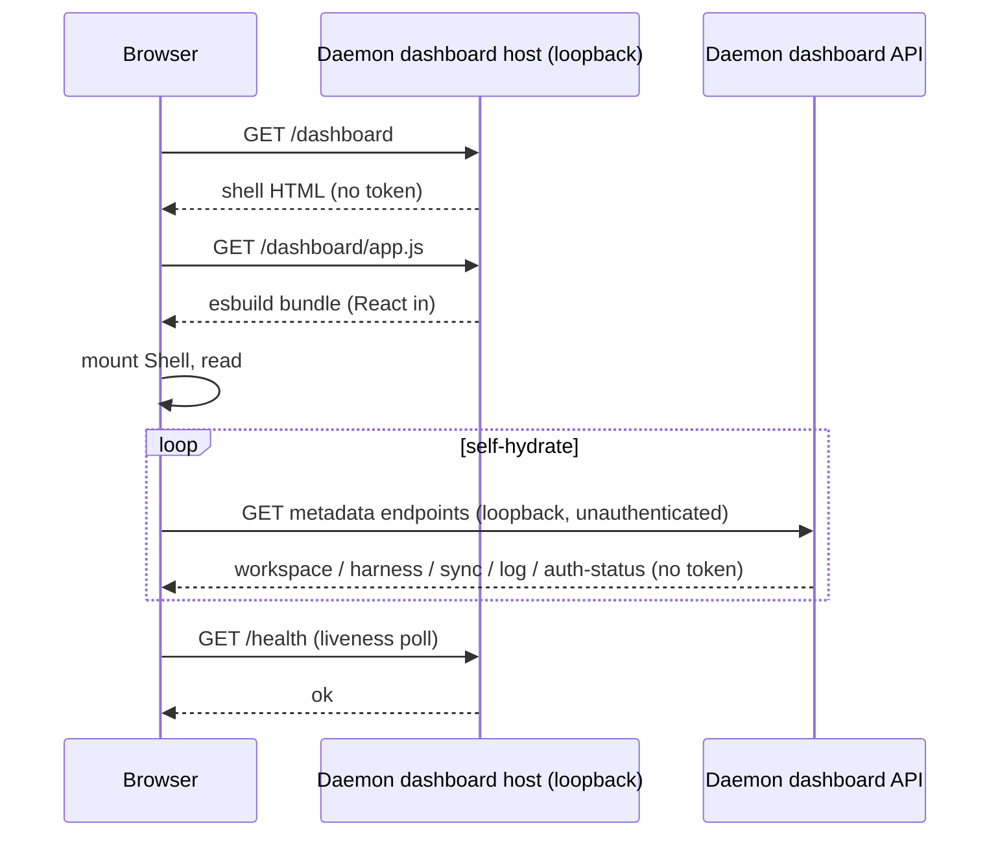

# Dashboard Architecture

> Category: Frontend | Version: 1.0 | Date: June 2026 | Status: Active

How Honeycomb's daemon-served web dashboard is built and shipped: the loopback-only HTTP host, the token-free self-hydrating React shell at `127.0.0.1:3850/dashboard`, the hash-routed page registry, and the eight surfaces (nav shell plus seven pages) that present memory, harnesses, graph, sync, logs, and settings.

**Related:**
- [`dashboard-actions-surface.md`](dashboard-actions-surface.md)
- [`dashboard-performance.md`](dashboard-performance.md)
- [`../dashboard/adding-a-page.md`](../dashboard/adding-a-page.md)
- [`../architecture/multi-project-and-context-switching.md`](../architecture/multi-project-and-context-switching.md)
- [`cursor-extension-architecture.md`](cursor-extension-architecture.md)
- [`../architecture/daemon-surface.md`](../architecture/daemon-surface.md)
- [`../architecture/system-overview.md`](../architecture/system-overview.md)
- [`../collaboration/asset-sync-substrate.md`](../collaboration/asset-sync-substrate.md)
- [`../integrations/harness-integration.md`](../integrations/harness-integration.md)

---

## What the dashboard is

The dashboard is a local operator console for Honeycomb. It is a single-page React app the daemon serves over loopback, giving a developer a visual view of their memory, harness wiring, codebase graph, sync state, and logs without leaving their machine. It is not a hosted product surface and carries no multi-tenant UI: it shows the one daemon running on this box, talking to the one workspace that daemon is scoped to.

That scoping is the whole security model. The dashboard is **local-mode only**, the daemon mounts its routes solely when `daemon.config.mode === "local"` (`src/daemon/runtime/dashboard/host.ts`). In team or hybrid daemon modes the dashboard host seam never fires, so there is no exposed web surface to protect. Because the only listener is on the loopback interface, the OS network stack is the access gate; the shell needs no auth token, embeds no secret, and makes plain unauthenticated calls to same-origin daemon endpoints.

---

## The served URL and the shell

The dashboard lives at:

```
http://127.0.0.1:3850/dashboard
```

`127.0.0.1` and `3850` are the daemon's loopback host and port (`src/shared/constants.ts`); `/dashboard` is the host path (`DASHBOARD_HOST_PATH` in `src/dashboard/launch.ts`). `honeycomb dashboard` launches it and opens the browser.

`GET /dashboard` returns a complete HTML document with no inline token, secret, or credential. The body is essentially a mount point and a module script:

```html
<div id="root" data-asset-base="/dashboard"></div>
<script type="module" src="/dashboard/app.js"></script>
```

`data-asset-base` carries only a safe relative path (regex-validated in `src/dashboard/web/main.tsx` before use). Everything else, React, ReactDOM, the router, every page, is in the bundle the script pulls. The shell **self-hydrates**: it boots from the static HTML, then fills itself by polling same-origin loopback endpoints. There is no server-rendered state and no token round-trip, so a refresh re-hydrates from scratch with zero auth ceremony.

The host registers a small fixed set of `GET` routes (`src/daemon/runtime/dashboard/host.ts`):

| Route | Serves |
|---|---|
| `GET /dashboard` | The index shell HTML (`renderShell`) |
| `GET /dashboard/app.js` | The esbuild web bundle |
| `GET /dashboard/styles.css` | The concatenated design-system CSS |
| `GET /dashboard/honeycomb-memory-cluster.svg` | The brand mark |
| `GET /dashboard/fonts/:name` | Brand fonts, served from an allow-list |

The data the pages read comes from the daemon's dashboard API (`src/daemon/runtime/dashboard/api.ts`) plus the harness, sync, and setup endpoints, all loopback, all metadata-only by construction. The auth-status read model, for example, returns org / workspace / agent / source / saved-at / expires-at and **never a token**.

---

## The eight surfaces

The dashboard is one nav shell hosting seven routed pages.

```mermaid
flowchart TD
    shell["App shell (Shell)\nsidebar + health poll + outlet"]
    shell --> home["/ Dashboard (home)"]
    shell --> harnesses["/harnesses"]
    shell --> memories["/memories"]
    shell --> graph["/graph"]
    shell --> sync["/sync"]
    shell --> logs["/logs"]
    shell --> settings["/settings"]
    harnesses --> harnessSub["/harnesses/<harness>\n(dynamic sub-items)"]
```

**The nav shell** (`src/dashboard/web/app.tsx`, exported as `Shell`) is the persistent frame: the sidebar built from the route registry, the daemon-liveness `/health` poll, the daemon-down banner, and the router outlet that mounts the active page. The shell owns connectivity state so individual pages never re-implement the down state; a page only renders against an up daemon.

The seven pages, each a component under `src/dashboard/web/pages/`:

| Route | Page | What it shows |
|---|---|---|
| `/` | Dashboard (home) | The overview: KPIs (Memories / Turns / Est. savings) and at-a-glance health, project-scoped to the active selection (team skills stay workspace-wide). See the scope switcher in [`../architecture/multi-project-and-context-switching.md`](../architecture/multi-project-and-context-switching.md). |
| `/harnesses` | Harnesses | Per-harness wiring state, with dynamic sub-items per detected harness (`/harnesses/<harness>`). |
| `/memories` | Memories | The captured memory corpus for the workspace. |
| `/graph` | Graph | The codebase graph canvas (build-graph affordance + visualization). |
| `/sync` | Sync | Skill and asset sync state, what is mined, published, and pulled. |
| `/logs` | Logs | The daemon log stream. |
| `/settings` | Settings | Daemon and workspace settings, including the redacted auth status. |

---

## Hash routing

The dashboard routes entirely client-side with **hash routing**, the active route lives in the URL fragment (`/dashboard#/graph`), never in the path (`src/dashboard/web/router.tsx`). This is a deliberate choice that keeps the daemon host simple: the host registers exactly the handful of `GET` routes above and no catch-all. History-API routing would put real paths like `/dashboard/graph` in the URL, which the browser *does* send to the server, forcing a daemon catch-all to serve the shell for every unknown sub-path. A fragment is never sent to the server, so deep links and refreshes are correct with zero extra host routes.

The router is a small hook. `routeFromHash` parses `location.hash`, strips the leading `#`, and normalizes the empty case to `/`. `useHashRoute` reads the current fragment, subscribes to the `hashchange` event, and exposes `{ route, navigate }`. `navigate(r)` is the single place that mutates `location.hash`; the sidebar passes through it rather than touching the hash directly.

Deep links work as written:

```
http://127.0.0.1:3850/dashboard#/            → Dashboard
http://127.0.0.1:3850/dashboard#/harnesses   → Harnesses
http://127.0.0.1:3850/dashboard#/harnesses/claude-code → Harnesses ▸ Claude Code
http://127.0.0.1:3850/dashboard#/memories    → Memories
http://127.0.0.1:3850/dashboard#/graph       → Graph
http://127.0.0.1:3850/dashboard#/sync        → Sync
http://127.0.0.1:3850/dashboard#/logs        → Logs
http://127.0.0.1:3850/dashboard#/settings    → Settings
```

An unknown route resolves to the Dashboard entry rather than a blank screen.

---

## The route registry

Routes are declared once, in an ordered `ROUTES` array in `src/dashboard/web/registry.tsx`. Each `RouteEntry` carries its hash key, sidebar label, an inline-SVG icon (drawn with `currentColor`), the page component, and an optional `dynamic` group for live-computed children:

```tsx
export interface RouteEntry {
  readonly route: string;                          // hash key, e.g. "/graph"
  readonly label: string;                          // sidebar text + document title
  readonly icon: React.ReactNode;                  // inline SVG, currentColor
  readonly component: React.ComponentType<PageProps>;
  readonly dynamic?: DynamicGroup;                 // children resolved from live state
}
```

The array, `Dashboard`, `Harnesses`, `Memories`, `Graph`, `Sync`, `Logs`, `Settings`, in that order, has exactly two consumers: the **sidebar** (`src/dashboard/web/sidebar.tsx`), which renders the nav from the list, and the **router outlet** in the shell, which matches the current hash to an entry and mounts its component. Matching is exact-first (the common case of a top-level route), then prefix (so `/harnesses/claude-code` resolves to the Harnesses entry), then the Dashboard default.

Only the Harnesses route uses a `dynamic` group today: `dynamic.resolve(live)` returns the per-harness sub-items computed from the live install state at render time, so the sidebar grows a child per detected harness without a static route per harness.

Pages share a contract. Each takes `PageProps`, wraps its content in `<PageFrame>` (`src/dashboard/web/page-frame.tsx`), reads data through the shared `wire` client rather than constructing its own, and hydrates with the documented `usePoll(fn, ms)` recipe. `usePoll` is also the seam that pauses every poll while the tab is backgrounded and that lets pages read `/health` reasons from `PageProps.healthReasons` instead of polling a second time, the steady-state cost controls are documented in [`dashboard-performance.md`](dashboard-performance.md). Adding a page is a three-step recipe, write the `PageProps` component inside a `PageFrame`, add one `RouteEntry` in registry order, optionally declare a `dynamic` group, fully documented in [`../dashboard/adding-a-page.md`](../dashboard/adding-a-page.md).

---

## Build and serving

The web app is a self-contained browser bundle built by esbuild (`esbuild.config.mjs`):

```js
build({
  entryPoints: { "dashboard-app": "src/dashboard/web/main.tsx" },
  bundle: true,
  platform: "browser",
  format: "esm",
  outdir: "daemon",
  jsx: "automatic",
  minify: true,
});
```

The single entry is `src/dashboard/web/main.tsx`; the output is `daemon/dashboard-app.js`, emitted beside the daemon bundle. React and ReactDOM are bundled *in*, there is no CDN or `unpkg` dependency, and the `.tsx` source is compiled directly by esbuild (no separate TypeScript step in the web path). At runtime, `src/daemon/runtime/dashboard/web-assets.ts` resolves the produced bundle, the design-system CSS (token + base layers concatenated, no `@import` chain), the brand mark, and the allow-listed fonts, and the host serves each over its fixed loopback route. The bundle ships in the daemon, so the dashboard is available wherever the daemon runs, with no separate install step.



---

## Why this shape

Three constraints drive the architecture. First, **loopback is the trust boundary**, local-only mounting plus same-origin unauthenticated calls means no token plumbing and no secret in the page, and the daemon simply does not expose the surface in non-local modes. Second, **hash routing keeps the host trivial**, no catch-all, refresh-safe deep links, zero new server routes per page. Third, **one registry, one contract**, a single ordered `ROUTES` array feeds both the sidebar and the router, and every page obeys the same `PageProps` + `PageFrame` + shared-`wire` contract, so the eight surfaces stay consistent and a ninth is a small, mechanical addition. The same rendered view tree the dashboard produces is also what the Cursor extension embeds in its webview (see [`cursor-extension-architecture.md`](cursor-extension-architecture.md)), so the operator console is authored once and surfaced in two hosts.
