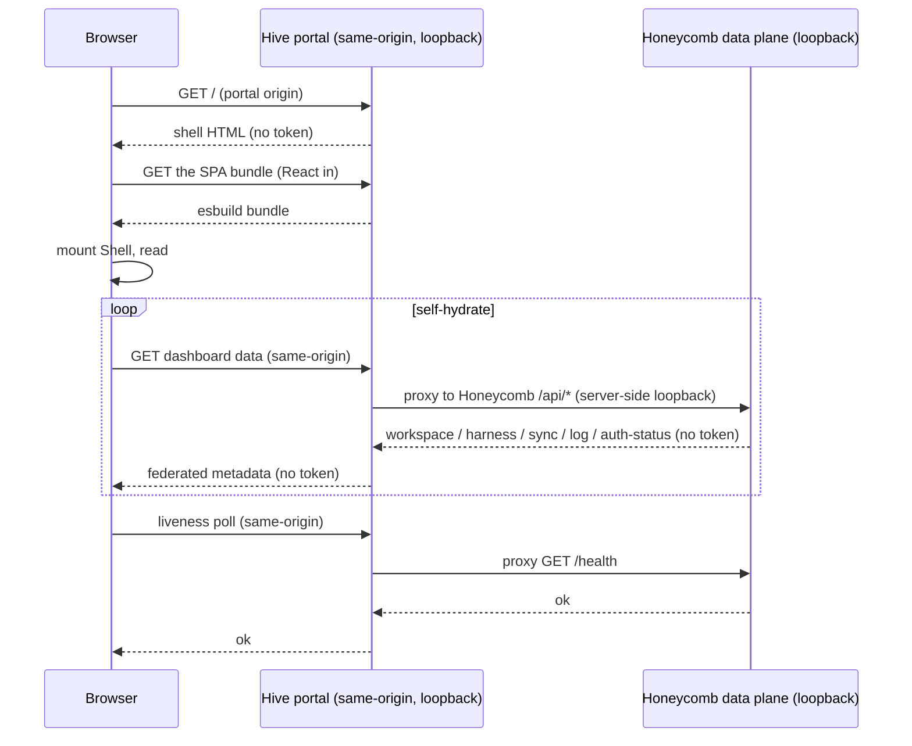

# Dashboard Architecture

> Category: Frontend | Version: 1.1 | Date: July 2026 | Status: Active

How Honeycomb's web dashboard is built and shipped: the token-free self-hydrating React shell, the hash-routed page registry, and the eight surfaces (nav shell plus seven pages) that present memory, harnesses, graph, sync, logs, and settings. In the current fleet arrangement the Hive portal fronts the dashboard SPA on its own loopback origin and federates to Honeycomb server-side; Honeycomb itself is the `/api/*` data plane and serves no cross-origin browser traffic.

**Related:**
- [`dashboard-actions-surface.md`](dashboard-actions-surface.md)
- [`dashboard-performance.md`](dashboard-performance.md)
- [`../dashboard/adding-a-page.md`](../dashboard/adding-a-page.md)
- [`../architecture/multi-project-and-context-switching.md`](../architecture/multi-project-and-context-switching.md)
- [`cursor-extension-architecture.md`](cursor-extension-architecture.md)
- [`../architecture/daemon-surface.md`](../architecture/daemon-surface.md)
- [`../architecture/system-overview.md`](../architecture/system-overview.md)
- [`../collaboration/asset-sync-substrate.md`](../collaboration/asset-sync-substrate.md)
- [`../integrations/harness-integration.md`](../integrations/harness-integration.md)

---

## What the dashboard is

The dashboard is a local operator console for Honeycomb. It is a single-page React app that gives a developer a visual view of their memory, harness wiring, codebase graph, sync state, and logs without leaving their machine. It is not a hosted product surface and carries no multi-tenant UI: it shows the one Honeycomb daemon running on this box, talking to the one workspace that daemon is scoped to.

**Who serves the SPA and who serves the data are two different processes.** In the current fleet arrangement the Hive portal owns the dashboard SPA and serves it on its own loopback origin (`127.0.0.1:3853/`, `HIVE_HOST` / `HIVE_PORT` in `src/shared/constants.ts`); Honeycomb keeps the `/api/*` data plane on its own loopback port (`127.0.0.1:3850`). The browser talks only to the Hive origin same-origin, and Hive federates dashboard data from Honeycomb **server-side** over loopback (the Hive-side BFF proxy, Hive ADR-0002). Honeycomb therefore never receives a cross-origin browser request and ships no CORS allowance at all (`src/daemon/runtime/server.ts`, see [The cross-origin story](#the-cross-origin-story) below). `honeycomb install` and `honeycomb dashboard` open the Hive portal URL, not a Honeycomb path (`src/commands/install.ts`, `src/dashboard/launch.ts`).

That split does not change the trust model. Both listeners bind the loopback interface only, so the OS network stack is the access gate; the shell needs no auth token and embeds no secret. Honeycomb's own authorization boundary is the permission middleware mounted on every protected `/api/*` group (`src/daemon/runtime/server.ts`), unchanged by the hosting arrangement. The dashboard surface is still **local-mode only**: Honeycomb's setup and console-adjacent seams (for example `mountSetupLogin`) fire solely when `daemon.config.mode === "local"`, so team or hybrid daemons expose no operator surface to protect.

---

## The served URL and the shell

The operator opens the dashboard at the Hive portal:

```
http://127.0.0.1:3853/
```

`127.0.0.1` and `3853` are the Hive portal's loopback host and port (`HIVE_HOST` / `HIVE_PORT` in `src/shared/constants.ts`); `/` is the portal path (`DASHBOARD_HOST_PATH` in `src/dashboard/launch.ts`, `DASHBOARD_PATH` in `src/commands/install.ts`). `honeycomb dashboard` resolves this URL (`openDashboard` in `src/dashboard/launch.ts`) and opens the browser; `honeycomb install` opens it too, `honeycomb.local:3853` best-effort with the loopback URL as the always-correct fallback.

The Hive portal serves a complete HTML document with no inline token, secret, or credential: a mount point plus a module script that pulls the bundled SPA (React, ReactDOM, the router, every page). The shell **self-hydrates**: it boots from static HTML, then fills itself by fetching data same-origin from the Hive portal, which federates each read from Honeycomb server-side over loopback (Hive ADR-0002). There is no server-rendered state and no token round-trip, so a refresh re-hydrates from scratch with zero auth ceremony.

Honeycomb serves no shell HTML, bundle, or static asset of its own: the dashboard host that once lived under `src/daemon/runtime/dashboard/` was removed once Hive took over the SPA origin, so Honeycomb has no `GET /dashboard` route. What Honeycomb serves is the data plane, its dashboard API (`src/daemon/runtime/dashboard/api.ts`) plus the harness, sync, diagnostics, and setup endpoints under `/api/*` (and `/setup/*` in local mode), all loopback, all metadata-only by construction. The auth-status read model, for example, returns org / workspace / agent / source / saved-at / expires-at and **never a token**. Those are the endpoints Hive's BFF proxy reads on the browser's behalf.

---

## The eight surfaces

The dashboard is one nav shell hosting seven routed pages.

```mermaid
flowchart TD
    shell["App shell (Shell)\nsidebar + health poll + outlet"]
    shell --> home["/ Dashboard (home)"]
    shell --> harnesses["/harnesses"]
    shell --> memories["/memories"]
    shell --> graph["/graph"]
    shell --> sync["/sync"]
    shell --> logs["/logs"]
    shell --> settings["/settings"]
    harnesses --> harnessSub["/harnesses/<harness>\n(dynamic sub-items)"]
```

**The nav shell** (`src/dashboard/web/app.tsx`, exported as `Shell`) is the persistent frame: the sidebar built from the route registry, the daemon-liveness `/health` poll, the daemon-down banner, and the router outlet that mounts the active page. The shell owns connectivity state so individual pages never re-implement the down state; a page only renders against an up daemon.

The seven pages, each a component under `src/dashboard/web/pages/`:

| Route | Page | What it shows |
|---|---|---|
| `/` | Dashboard (home) | The overview: KPIs (Memories / Turns / Est. savings[^est-savings]) and at-a-glance health, project-scoped to the active selection (team skills stay workspace-wide). See the scope switcher in [`../architecture/multi-project-and-context-switching.md`](../architecture/multi-project-and-context-switching.md). |
| `/harnesses` | Harnesses | Per-harness wiring state, with dynamic sub-items per detected harness (`/harnesses/<harness>`). |
| `/memories` | Memories | The captured memory corpus for the workspace. |
| `/graph` | Graph | The codebase graph canvas (build-graph affordance + visualization). |
| `/sync` | Sync | Skill and asset sync state, what is mined, published, and pulled. |
| `/logs` | Logs | The daemon log stream. |
| `/settings` | Settings | Daemon and workspace settings, including the redacted auth status. |

[^est-savings]: The "Est. savings" KPI today is a corpus-length proxy (`SUM(LENGTH(content)) / 4`), which counts stored inventory rather than tokens actually saved, so it does not move in response to using the harness. [ADR-0010](../architecture/adr/0010-recall-weighted-est-savings.md) (Accepted) pivots it to a recall-weighted metric sourced from the PRD-060 ROI tracker; the re-wiring is tracked by IRD-278 (backlog) and not yet live.

---

## Hash routing

The dashboard routes entirely client-side with **hash routing**, the active route lives in the URL fragment (`#/graph`), never in the path (`src/dashboard/web/router.tsx`). This is a deliberate choice that keeps the portal host simple: it serves the shell and the bundle and needs no catch-all. History-API routing would put real paths like `/graph` in the URL, which the browser *does* send to the server, forcing a host catch-all to serve the shell for every unknown sub-path. A fragment is never sent to the server, so deep links and refreshes are correct with zero extra host routes.

The router is a small hook. `routeFromHash` parses `location.hash`, strips the leading `#`, and normalizes the empty case to `/`. `useHashRoute` reads the current fragment, subscribes to the `hashchange` event, and exposes `{ route, navigate }`. `navigate(r)` is the single place that mutates `location.hash`; the sidebar passes through it rather than touching the hash directly.

Deep links work as written:

```
http://127.0.0.1:3853/#/            → Dashboard
http://127.0.0.1:3853/#/harnesses   → Harnesses
http://127.0.0.1:3853/#/harnesses/claude-code → Harnesses ▸ Claude Code
http://127.0.0.1:3853/#/memories    → Memories
http://127.0.0.1:3853/#/graph       → Graph
http://127.0.0.1:3853/#/sync        → Sync
http://127.0.0.1:3853/#/logs        → Logs
http://127.0.0.1:3853/#/settings    → Settings
```

An unknown route resolves to the Dashboard entry rather than a blank screen.

---

## The route registry

Routes are declared once, in an ordered `ROUTES` array in `src/dashboard/web/registry.tsx`. Each `RouteEntry` carries its hash key, sidebar label, an inline-SVG icon (drawn with `currentColor`), the page component, and an optional `dynamic` group for live-computed children:

```tsx
export interface RouteEntry {
  readonly route: string;                          // hash key, e.g. "/graph"
  readonly label: string;                          // sidebar text + document title
  readonly icon: React.ReactNode;                  // inline SVG, currentColor
  readonly component: React.ComponentType<PageProps>;
  readonly dynamic?: DynamicGroup;                 // children resolved from live state
}
```

The array, `Dashboard`, `Harnesses`, `Memories`, `Graph`, `Sync`, `Logs`, `Settings`, in that order, has exactly two consumers: the **sidebar** (`src/dashboard/web/sidebar.tsx`), which renders the nav from the list, and the **router outlet** in the shell, which matches the current hash to an entry and mounts its component. Matching is exact-first (the common case of a top-level route), then prefix (so `/harnesses/claude-code` resolves to the Harnesses entry), then the Dashboard default.

Only the Harnesses route uses a `dynamic` group today: `dynamic.resolve(live)` returns the per-harness sub-items computed from the live install state at render time, so the sidebar grows a child per detected harness without a static route per harness.

Pages share a contract. Each takes `PageProps`, wraps its content in `<PageFrame>` (`src/dashboard/web/page-frame.tsx`), reads data through the shared `wire` client rather than constructing its own, and hydrates with the documented `usePoll(fn, ms)` recipe. `usePoll` is also the seam that pauses every poll while the tab is backgrounded and that lets pages read `/health` reasons from `PageProps.healthReasons` instead of polling a second time, the steady-state cost controls are documented in [`dashboard-performance.md`](dashboard-performance.md). Adding a page is a three-step recipe, write the `PageProps` component inside a `PageFrame`, add one `RouteEntry` in registry order, optionally declare a `dynamic` group, fully documented in [`../dashboard/adding-a-page.md`](../dashboard/adding-a-page.md).

---

## Build and serving

The web app is a self-contained browser bundle built by esbuild (`esbuild.config.mjs`):

```js
build({
  entryPoints: { "dashboard-app": "src/dashboard/web/main.tsx" },
  bundle: true,
  platform: "browser",
  format: "esm",
  outdir: "daemon",
  jsx: "automatic",
  minify: true,
});
```

The single entry is `src/dashboard/web/main.tsx`; the output is `daemon/dashboard-app.js`. React and ReactDOM are bundled *in*, there is no CDN or `unpkg` dependency, and the `.tsx` source is compiled directly by esbuild (no separate TypeScript step in the web path). This bundle is the single source of truth for the view tree: the Hive portal serves it to the browser as the dashboard SPA, and the Cursor extension embeds the same rendered tree in its webview (see [`cursor-extension-architecture.md`](cursor-extension-architecture.md)). Honeycomb no longer serves this bundle or any shell asset itself.

The flow is a three-participant one: the browser talks same-origin to the Hive portal, and the Hive portal reaches Honeycomb's data plane server-side over loopback.



---

## The cross-origin story

The dashboard SPA and Honeycomb's data plane run on two different loopback origins: the Hive portal on `127.0.0.1:3853` and Honeycomb on `127.0.0.1:3850`. The question that shape raises is how the browser reaches Honeycomb's data across that origin gap. The answer, in the current arrangement, is that it does not: **the browser never touches Honeycomb directly.** It talks same-origin to the Hive portal, and the Hive portal proxies each dashboard read to Honeycomb server-side over loopback (the Hive-side BFF proxy, Hive ADR-0002). Because the request that reaches Honeycomb originates from Hive's server rather than the browser, it is not a cross-origin browser request, there is no CORS preflight, and Honeycomb needs no `Access-Control-*` allowance.

So Honeycomb ships **zero CORS middleware**, by design. `src/daemon/runtime/server.ts` carries an explicit note where a CORS mount would otherwise sit, recording that the server-side federation makes any allowance unnecessary. This was briefly not the case: an earlier cutover had the SPA fetch Honeycomb's origin directly from the browser and a CORS middleware was added to permit it, but that middleware was removed once Hive moved federation server-side, leaving the net state at no CORS at all.

CORS was never Honeycomb's authorization boundary in either arrangement. Authorization lives in the permission middleware mounted on every protected `/api/*` route group (`src/daemon/runtime/server.ts`), which is unchanged throughout. CORS is purely browser plumbing that decides whether a browser is *allowed to read a response*; the permission layer decides whether a *caller is allowed to act*. Removing the CORS allowance narrows the browser-reachable surface without touching the authorization gate: a request that arrives at Honeycomb still passes the same permission check it always did.

Honeycomb, for its part, is a Hive-agnostic loopback data plane. It only requires that a same-host client (here, the Hive portal's server) can reach its `/api/*`, `/health`, and `/setup/*` endpoints over loopback; it does not know or care that Hive is the one calling. Hive's own internals are a separate repo and out of scope for this doc.

---

## Why this shape

Three constraints drive the architecture. First, **loopback is the trust boundary**, both origins bind loopback only and Honeycomb's permission middleware gates every protected `/api/*` group, so there is no token plumbing or secret in the page, and Honeycomb never exposes an operator surface in non-local modes. Second, **hash routing keeps the host trivial**, no catch-all, refresh-safe deep links, zero new server routes per page. Third, **one registry, one contract**, a single ordered `ROUTES` array feeds both the sidebar and the router, and every page obeys the same `PageProps` + `PageFrame` + shared-`wire` contract, so the eight surfaces stay consistent and a ninth is a small, mechanical addition. The same rendered view tree the dashboard produces is also what the Cursor extension embeds in its webview (see [`cursor-extension-architecture.md`](cursor-extension-architecture.md)), so the operator console is authored once and surfaced in two hosts.
