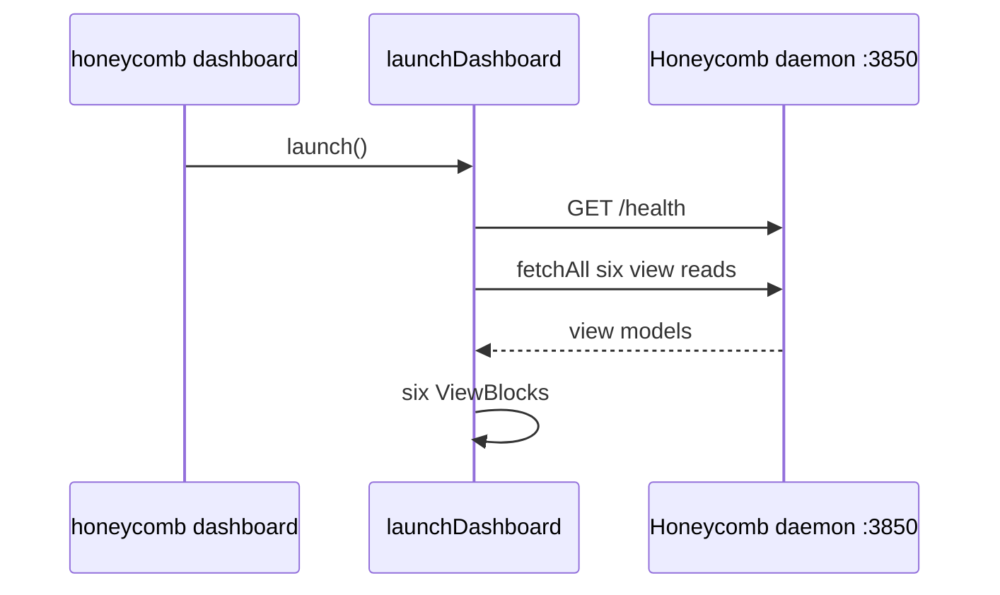

# Dashboard Architecture

> Category: Frontend | Version: 1.3 | Date: October 2026 | Status: Active

How Honeycomb's dashboard is built in this checkout: six `ViewBlock` builders composed by `renderDashboard`, the launch client that reads the daemon once, and the Hive portal URL the install path opens. Port `3853` is the Hive constant. The React hash-route app is absent from this repository.

**Related:**
- [`dashboard-actions-surface.md`](dashboard-actions-surface.md)
- [`dashboard-performance.md`](dashboard-performance.md)
- [`../dashboard/adding-a-page.md`](../dashboard/adding-a-page.md)
- [`../architecture/multi-project-and-context-switching.md`](../architecture/multi-project-and-context-switching.md)
- [`cursor-extension-architecture.md`](cursor-extension-architecture.md)
- [`../architecture/daemon-surface.md`](../architecture/daemon-surface.md)
- [`../architecture/system-overview.md`](../architecture/system-overview.md)
- [`../collaboration/asset-sync-substrate.md`](../collaboration/asset-sync-substrate.md)
- [`../integrations/harness-integration.md`](../integrations/harness-integration.md)

---

## What the dashboard is

The dashboard is a local operator console for the one Honeycomb daemon on this machine and the workspace that daemon is scoped to. In this checkout the render surface is framework-agnostic `ViewBlock` trees. `renderDashboard` in `src/dashboard/dashboard.ts` probes connectivity, and when the daemon answers it builds six blocks in order: KPIs, sessions, settings, graph, rules, skill-sync (`src/dashboard/dashboard.ts:73-80`). Each block comes from a `build*View` in `src/dashboard/views.ts`.

**The browser origin and the data plane are recorded as a split, and only the Honeycomb side is in this tree.** `HIVE_HOST` and `HIVE_PORT` live in `src/shared/constants.ts:19-23` (`127.0.0.1` and `3853`). `openDashboard` returns `http://127.0.0.1:3853/` via `portalBaseUrl` (`src/dashboard/launch.ts:149-178`). Solo `honeycomb install` opens that same URL (`src/commands/install.ts:64-74` and `:351-356`). Comments at `src/dashboard/launch.ts:167-169` and `src/daemon/runtime/server.ts:286-291` say the Hive portal is the browser origin and Honeycomb keeps `/api/*` on `127.0.0.1:3850`. There is no Hive source tree and no Hive ADR in this repository, so this page does not describe a Hive document, a BFF implementation, or a served SPA bundle. What this tree implements is the data plane plus the `ViewBlock` client.

`honeycomb dashboard` does not open that portal URL. `runDashboardCommand` calls `launchDashboard` (`src/cli/runtime.ts:724-730`, `src/commands/local-handlers.ts:232-244`), which probes the daemon and builds the view tree.

Both listeners the comments name bind loopback, so the OS network stack is the access gate. Honeycomb's authorization boundary is the permission middleware on every protected `/api/*` group (`src/daemon/runtime/server.ts`). The setup and console-adjacent seams (for example `mountSetupLogin`) fire solely when `daemon.config.mode === "local"` (`src/daemon/runtime/assemble.ts:1447`), so team or hybrid daemons expose no operator surface from those mounts.

---

## The served URL and this checkout

The operator URL `openDashboard` and solo install open is:

```
http://127.0.0.1:3853/
```

`127.0.0.1` and `3853` are `HIVE_HOST` / `HIVE_PORT`. `/` is `DASHBOARD_HOST_PATH` in `src/dashboard/launch.ts:149-156` and `DASHBOARD_PATH` in `src/commands/install.ts:64-74`.

Honeycomb serves no shell HTML and no dashboard bundle. There is no `GET /dashboard` route. `src/daemon/runtime/dashboard/` has no `host.ts`. `src/dashboard/html.ts` can serialize a `RenderedDashboard` to a standalone HTML document, and its header comment still says the daemon serves `GET /dashboard`; that route is not mounted. The dashboard API is `src/daemon/runtime/dashboard/api.ts`, plus the harness, sync, diagnostics, and setup endpoints under `/api/*` (and `/setup/*` in local mode). The auth-status read model returns org, workspace, agent, source, saved-at, and expires-at, and it does not return a token.

This checkout's `src/dashboard/` is the view-tree and launch client: `dashboard.ts`, `launch.ts`, `views.ts`, `html.ts`, `contracts.ts`, `logs.ts`, and `index.ts`. It does not contain `src/dashboard/web/` (`main.tsx`, `app.tsx`, `router.tsx`, `registry.tsx`, `sidebar.tsx`, `page-frame.tsx`, or `pages/`). `esbuild.config.mjs` has no dashboard bundle entry.

---

## The six views

`renderDashboard` emits these blocks when the daemon is reachable. When the probe fails, the only block is the connectivity banner (`buildConnectivityBanner`).

```mermaid
flowchart TD
    render["renderDashboard"]
    render --> kpis["KPIs"]
    render --> sessions["Sessions"]
    render --> settings["Settings"]
    render --> graph["Graph"]
    render --> rules["Rules"]
    render --> skills["Skill-sync"]
```

| Order | Builder | What the block shows |
|---|---|---|
| 1 | `buildKpisView` | Rows `Memories`, `Sessions`, and `Estimated savings`[^est-savings] (`src/dashboard/views.ts:61-64`), plus any `extra` metrics. |
| 2 | `buildSessionsView` | A table titled `Sessions`, one row per captured session. |
| 3 | `buildSettingsView` | Org, workspace, the settings string map, and a nested lifecycle-flags child. It does not call `/api/actions`. |
| 4 | `buildGraphView` | An empty-state prompt, or a `graph-canvas` block with node and edge counts. |
| 5 | `buildRulesView` | Active org rules. |
| 6 | `buildSkillSyncView` | Skill name, scope, and sync state. |

The home KPI rows are those three labels. There is no Turns tile in `buildKpisView`. The daemon view-model still carries `turnCount` as an alias of `sessionCount` (`src/daemon/runtime/dashboard/api.ts`); the label builder reads `sessionCount`.

[^est-savings]: The "Estimated savings" figure is a corpus-length proxy (`SUM(LENGTH(content)) / 4`, `CHARS_PER_TOKEN = 4` in `src/daemon/runtime/dashboard/api.ts`). [ADR-0010](../architecture/adr/0010-recall-weighted-est-savings.md) (Proposed) pivots it to a recall-weighted metric. The re-wiring is IRD-278 and is not live. `fetchEstimatedSavings` is still the read.

A hash router, a `ROUTES` array, and the paths `/`, `/harnesses`, `/memories`, `/graph`, `/sync`, `/logs`, and `/settings` are not implemented in this repository. `src/dashboard/web/registry.tsx` is absent.

---

## Launch

`launchDashboard` (`src/dashboard/launch.ts:142-146`) builds a daemon data source and calls `renderDashboard` once. The source probes `GET /health`, then `fetchAll` reads the six view endpoints in one `Promise.all` (`/api/diagnostics/kpis`, `/api/diagnostics/sessions`, `/api/diagnostics/settings`, `/api/graph`, `/api/diagnostics/rules`, `/api/diagnostics/skills`). It does not poll.


```mermaid
sequenceDiagram
    participant verb as honeycomb dashboard
    participant launch as launchDashboard
    participant daemon as Honeycomb daemon :3850

    verb->>launch: launch()
    launch->>daemon: GET /health
    launch->>daemon: fetchAll six view reads
    daemon-->>launch: view models
    launch->>launch: six ViewBlocks
```

`openDashboard` is the other entry. It returns the portal URL plus a connectivity probe. It does not render the view tree.

---

## The cross-origin story

`src/daemon/runtime/server.ts:286-291` records why this process mounts no CORS middleware: the comment says the browser talks to Hive on `:3853` and Hive fetches Honeycomb server-side, so no browser preflight hits Honeycomb. That Hive proxy and the Hive ADR the comment names are not in this repository. The fact this tree shows is that Honeycomb ships zero CORS middleware. An earlier cutover fetched Honeycomb from the browser and mounted CORS; that middleware is gone.

CORS was never the authorization boundary. Authorization is the permission middleware on every protected `/api/*` group, unchanged by the hosting comment.

---

## Why this shape

Loopback is the trust boundary. Honeycomb's permission middleware gates every protected `/api/*` group, and the local-mode gate keeps setup mounts off team and hybrid daemons. The render contract is one `ViewBlock` list: `renderDashboard` and the six `build*View` functions are what both the launch client and the Cursor extension webview consume. The same rendered view tree is what the Cursor extension embeds (`src/dashboard/views.ts`, `harnesses/cursor/extension/bindings.ts`). Adding a view is a builder plus a composition site, documented in [`../dashboard/adding-a-page.md`](../dashboard/adding-a-page.md).
